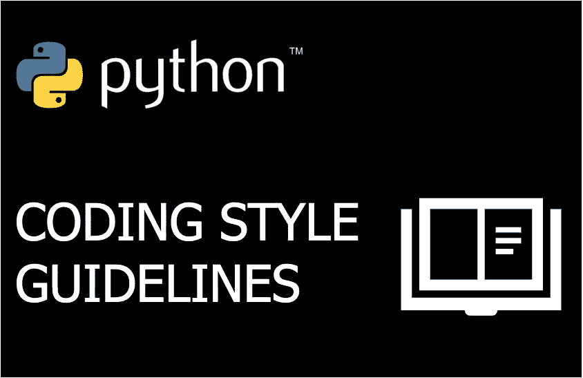

# 每个 Python 开发人员都应该知道的基本编码风格指南

> 原文：<https://betterprogramming.pub/essential-coding-style-guidelines-every-python-developer-should-know-dc838ce63f0d>

## 通过应用行缩进、换行、空行、空白、命名注释和文档字符串的正确格式，编写更好的 Python 代码



图片由作者提供。从[Python.org](https://www.python.org/community/logos/)下载的 Python logo。

所有编程语言都有严格的格式规则。如果您不遵循它们，代码将无法执行。

例如，在 Java 中，`if`语句必须包含括号，`if (x==true)`。在 Python 中，函数必须以单词“def”、“T2”等开头。

然而，有些部分是留给软件开发人员来决定如何编写而不影响执行的。

例如，当赋值时，我喜欢等号两边有一个空格，`x = 1`。但是我可以写没有空格的代码，`x=1`，它会正常运行。

为了避免代码中的不一致并使其更具可读性，建议程序员遵循编码格式指南。根据[官方 Python 文档](https://www.python.org/dev/peps/pep-0008/#naming-conventions)，我们来看看 Python 中的一些约定。

还有更本质的推荐。您应该阅读[风格指南](https://www.python.org/dev/peps/pep-0008/#naming-conventions)了解更多详情。

# 刻痕

准则:每个缩进层次 4 个空格。

像 Java 这样的语言也有缩进的约定。但是在 Python 中，这些准则更重要，因为在某些情况下，如果缩进不正确，程序将无法运行。

使用右缩进级别的代码示例，

```
def day_of_week (day):
    **match day:**
        **case 1:**
            return "Sunday"
        case 2:
            return "Monday"
        case 3:
            return "Tuesday"
        case 4 | 5 | 6:
            return "Another day of the week"
        case _:
            return "Invalid day"
```

在上面的代码中，在边距(`def`开始的地方)和行首`match day:`之间有 4 个空格。行`case 1:`从上一行缩进 4 个空格。

## 当每个缩进级别 4 个空格不适用时

1.  增加额外的 4 个空格来区分函数参数和函数体。函数中的第一行应该缩进 4 个空格。
2.  将其余的函数参数与上面一行中定义的参数对齐—这可能需要 4 个以上的空格。
3.  如果该行以函数左括号结束，下面的行可以缩进到 4 个空格以外的位置。

```
1\. def cool_function(
        param_a, param_b,
        param_c, param_d):
    print(var_one)2\. var = cool_function(param_a, param_b,
                       param_c, param_d)3\. result = cool_function(
     param_a, param_b,
     param_c, param_d)
```

# 自动换行

行数应限制在 79 个字符以内。当它是一个文档字符串或注释时，应该限制在 72 个字符以内。

作为比较，Java 代码的[约定是将行限制在不超过 80 个字符。](https://www.oracle.com/java/technologies/javase/codeconventions-indentation.html)

当您想并排查看多个文件时，编程语言中的这种行长度限制使代码更具可读性。

# 空白行

对于顶级函数和类定义，建议使用两行空行。对于类中的方法定义，建议使用一个空行。

举个例子，

```
import library1
import library2
import library3 def function1():
    pass def function2():
    pass class Class(object):

    def method1():
        pass def method2():
        pass
```

# 空白

你应该在操作员周围留有空间吗？

比如`i = i + 1`或者`i=i+1`？

以下是在 [PEP 8](https://www.python.org/dev/peps/pep-0008/) 中描述的一些指导方针，

*   避免圆括号、方括号或大括号内的空格。正确:`function(arg[1], {arg: 2})`
*   避免结尾逗号后和右括号前的空格。正确:`var =(0,)`
*   避免在逗号、分号或冒号前加空格。正确:`if x > 3: print(x)`
*   除非指定默认值，否则请始终用一个空格将二元运算符括起来。正确说法:`i = i + 1`；`def cool(x=1)`
*   不要试图通过添加多个空格来对齐任务。

# 命名

命名风格指南取决于它是类、模块、函数、变量等等。

## 包装和模块

包和模块名应该简短，并且全部小写。

在某些情况下，可以使用下划线 _ 作为模块名，但是应该避免使用下划线 _ 符号作为包名。

## 班级

一般来说，类应该是 CamelCase 格式。例如，`class CarWash`

## 类型变量

类型变量通常应该使用 CamelCase 格式，最好使用短名称。后缀 _co 和 _contra 应该声明协变或逆变行为。

下面的代码摘自 Python [文档](https://www.python.org/dev/peps/pep-0008/#naming-conventions)，

```
from typing import TypeVar

VT_co = TypeVar('VT_co', covariant=True)
KT_contra = TypeVar('KT_contra', contravariant=True)
```

## 例外

适用与类相同的约定— CamelCase。如果异常是一个错误，应该加上后缀 error。比如说，`Integrity**Error**`。

## 函数和变量

函数和变量应该用小写命名，单词之间用下划线\示例:`def cool_function():`

避免将“l”(小写字母 el)、“O”(大写字母 oh)或“I”(大写字母 eye)作为单字符变量名。

## 函数和方法参数

`self`为实例方法的第一个参数。`cls`为类方法的第一个参数。

如果名称与关键字冲突，请添加下划线或选择同义词，不要缩写或更改拼写。正确:`class_`；不正确:`clss`

## 方法和实例变量

应用函数命名规则—全部小写，用下划线分隔单词。

为所有私有方法和实例变量添加前导下划线。例子:`_private_var`

两个前导下划线可以用来避免与子类冲突。Python 将 MyClass 类中声明的`__cool_name`转换为`_MyClass__cool_name`。

这样，就不能用`MyClass.__cool_name`访问变量。该变量比只使用一个前导下划线的私有变量更加私有。

## 全局变量

像函数一样，全局变量应该全部用小写字母命名，单词之间用下划线\例，`my_global_variable`

## 常数

常量应该全部大写，单词之间用下划线分隔。示例:MY_CONSTANT

# 评论

Python 中的注释行以散列(`#`)符号开始，[应该跟在](https://www.python.org/dev/peps/pep-0008/#comments)后面。

*   如果评论自成一行更好。
*   评论应该是完整的句子。
*   每个句子必须以句号结尾。
*   每个句子的第一个单词必须以大写字母开头。
*   句子之间必须用两个空格。
*   评论必须用英语写，除非你确定只有非英语人士会阅读代码。

这与我们写普通文本的方式没有太大区别，除了句子之间建议的两个空格。

## 阻止评论

与 Java 和其他编程语言不同，Python 要求在每个注释行之前有`#`。**不可能**执行以下操作，

```
/*
comment line 1
comment line 2
*/
```

正确的做法是，

```
# comment line 1
# comment line 2
```

注意`#`后面有一个空格。你应该加上这个空格。

## 内嵌注释

行内注释是指注释与代码语句位于同一行。

```
def cool_function(x, y)    # comment line
```

你应该限制这种注释的使用。会让人分心。

# 文档字符串

“Docstring”是文档字符串的缩写。它们类似于注释，但具有不同的目的和格式。任何用三重双引号括起来的文本都被解释为文档字符串。

这是指导方针，

*   应该为所有公共模块、函数、类和方法添加 Docstrings。
*   单行文档字符串应该在同一行中包含所有三个右双引号。
*   单行文档字符串前后没有空行。
*   对于多行文档字符串，所有三个右双引号应该在单独的一行中。
*   文档字符串应该是命令格式(返回这个)。它不应该描述代码做什么(返回星期几)。

文档串的例子，

```
"""Return first line of multi-line docstring 

All three closing double quotes in a line below.
""""""one-line documentation string"""
```

# 最后的想法

一致性和良好的可读性是编码约定存在的两个关键原因。但是，还有其他方面需要考虑。

有时候，编程语言风格指南不应该被严格遵循。[正如文档](https://www.python.org/dev/peps/pep-0008/)中所建议的，这些是忽略特定指南的一些原因(最后一个是最重要的)。

> 当应用指南时，会使代码可读性更差，即使对于习惯阅读遵循 PEP 的代码的人来说也是如此。
> 
> 与周围也破坏它的代码保持一致(可能是出于历史原因)——尽管这也是一个清理别人的烂摊子的机会(以真正的 XP 风格)。
> 
> 因为所讨论的代码早于指南的引入，并且没有其他原因要修改该代码。
> 
> 当代码需要与不支持样式指南推荐的特性的旧版本 Python 保持兼容时。

一般来说，如果您的应用程序不属于上述类别，最好应用推荐的编码风格。

感谢阅读。