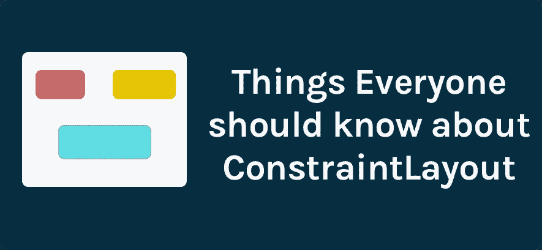
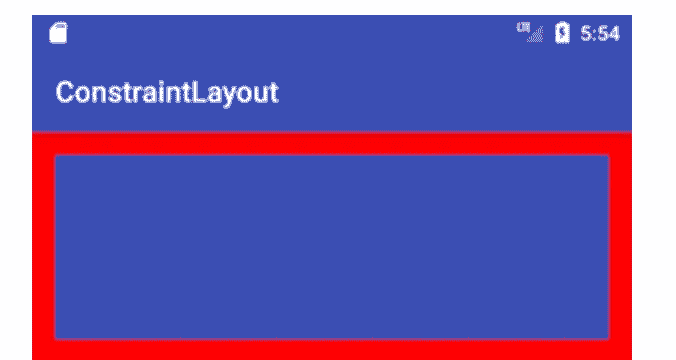
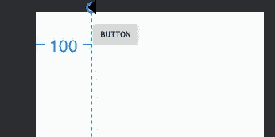
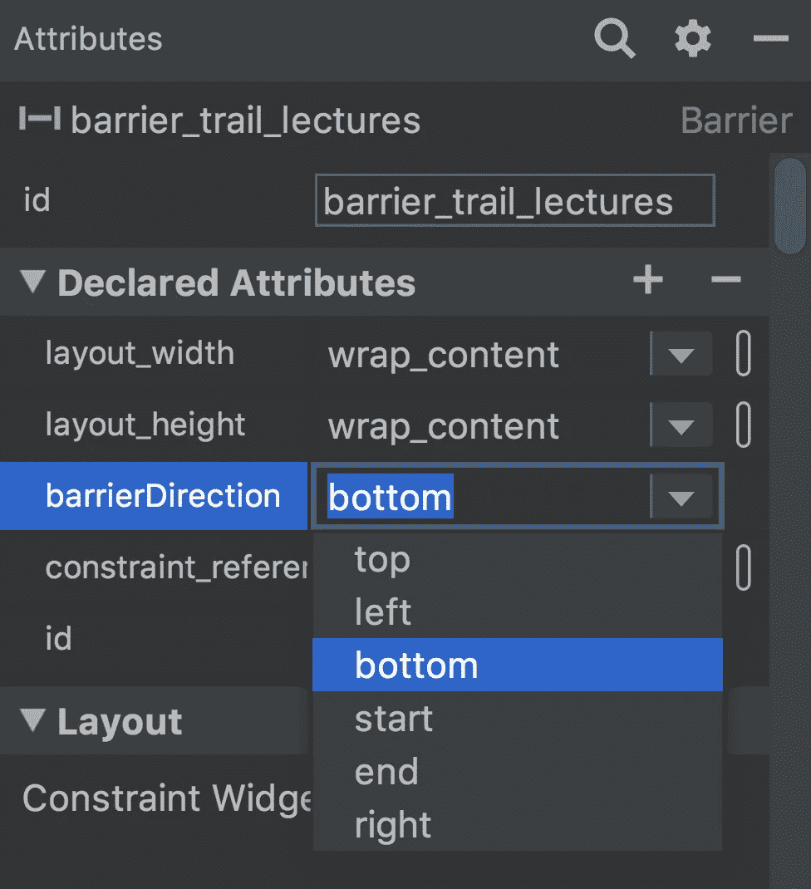
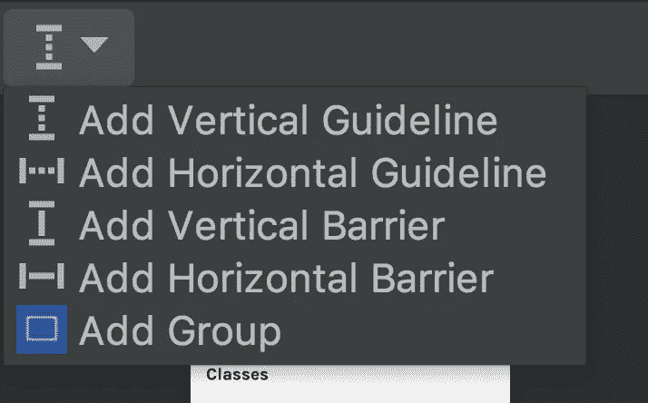
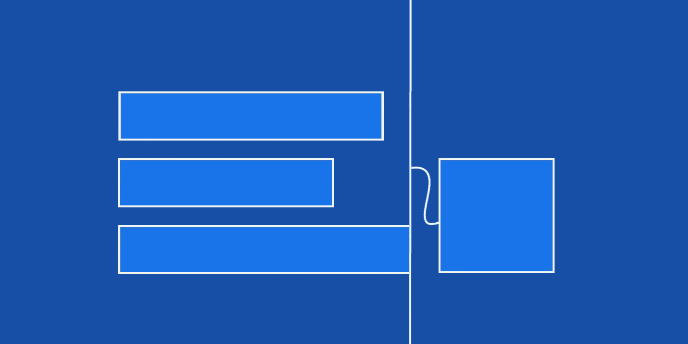
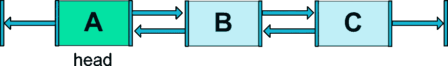
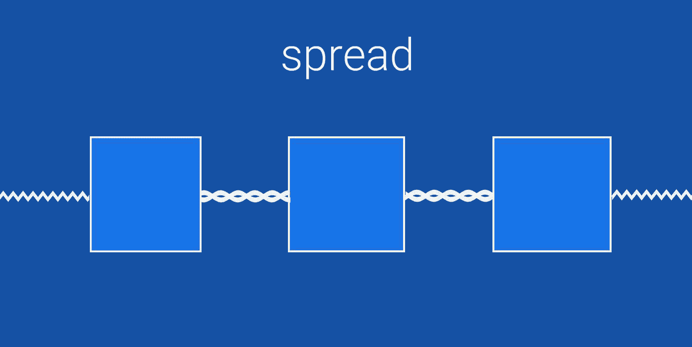
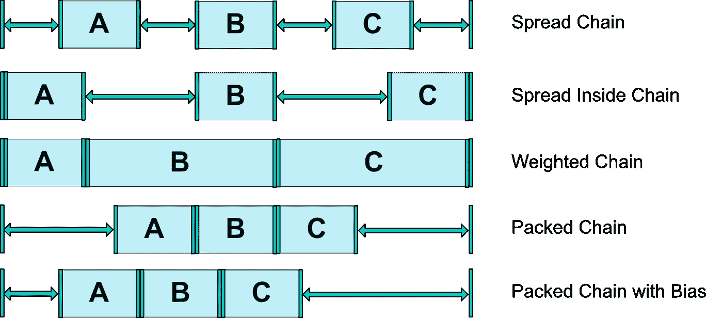

# ConstraintLayout 的基本组件

> 原文：<https://betterprogramming.pub/essential-components-of-constraintlayout-7f4026a1eb87>

## 探索约束布局的好处



`ConstraintLayout`简化大型复杂布局的创建。`ConstraintLayout`的主要优点是它有助于创建一个扁平的视图层次。在性能分析中，平面视图层次结构非常有用。我们可以说`ConstraintLayout`是`Relative`和`Linear`布局的结合，尽管许多人认为它是相对布局的高级版本。

在这篇文章中，我们不打算讨论约束和偏见等基础知识。我喜欢`ConstraintLayout`中的一些组件，它们对我们的日常开发更有帮助。这些是:

`Aspect Ratio`

`GuideLine`

`Barrier`

`Group`

`Chains`

在深入细节之前，让我们先将依赖关系添加到 Gradle 中。我们需要首先这样做，以便在我们的项目中使用`ConstraintLayout`:

```
dependencies {
   implementation 'androidx.constraintlayout:constraintlayout:1.1.3'
}
```

现在让我们开始探索组件。

# **长宽比**

在`ConstraintLayout`之前，我们曾经有一个复杂的代码来创建一个纵横比`ImageView`。相信我——在代码级别处理纵横比简直是地狱！有了 XML 级别的`layout_constraintDimensionRatio` 特性，它真的像是上帝的礼物。XML 中的标签`layout_constraintDimensionRatio` 用于设置视图的比例。在代码级别处理它不再令人头疼。相信我，一旦你开始使用它，你就会意识到它的重要性。让我们试一试:

```
<androidx.constraintlayout.widget.ConstraintLayout
xmlns:android="http://schemas.android.com/apk/res/android"
    xmlns:app="http://schemas.android.com/apk/res-auto"
    android:layout_width="match_parent"
    android:layout_height="match_parent"
    android:background="#FF0000">

    <ImageView
        android:id="@+id/imageView"
        android:layout_width="0dp"
        android:layout_height="0dp"
        android:layout_marginStart="16dp"
        android:layout_marginTop="16dp"
        android:layout_marginEnd="16dp"
        android:background="#0000FF"
        app:layout_constraintTop_toTopOf="parent"
        app:layout_constraintStart_toStartOf="parent"
        app:layout_constraintEnd_toEndOf="parent"
        app:layout_constraintDimensionRatio="H,3:1" />

</androidx.constraintlayout.widget.ConstraintLayout>
```

输出如下所示



设置`app:layout_constraintDimensionRatio="H,3:1"`意味着将首先从其他约束计算宽度，然后根据纵横比调整高度。如果我们给`ImageView`两个约束`app:layout_constraintBottom_toBottomOf="parent"`和`app:layout_constraintTop_toTopOf="parent"` ，可能会有问题。在这种情况下，标签`layout_constraintDimensionRatio` 将被忽略。比率的值可以是任何值，这取决于我们的要求。在大多数情况下，为了获得专业的外观，我们将比例设置为 16:9:

`app:layout_constraintDimensionRatio="H,16:9"`

该比率可以用两种方式表示:

*   **浮点值，**代表宽度和高度的比值。
*   形式为**“宽度:高度”**的比率。

```
<Button 
 android:layout_width=”wrap_content”
 android:layout_height=”0dp”
 app:layout_constraintDimensionRatio=”1:1"/>
```

# **指导方针**

辅助线是看不见的线，可以放在版面中的特定位置。然后，您可以将您的视图约束到这些准则。本质上，它们是不可见的视图，您可以通过定义一些属性将它们放在任何需要的地方。他们只和`ConstraintLayout`合作。

`GuideLine`可以是水平的，也可以是垂直的

*   垂直指引线的宽度为零，其高度为其父级`ConstraintLayout`的高度
*   水平指引线的高度为零，宽度等于其`ConstraintLayout`父指引线的宽度

可以通过三种不同的方式来定位指引线:

*   指定距布局左侧或顶部的固定距离`layout_constraintGuide_begin`
*   指定距布局右侧或底部的固定距离`layout_constraintGuide_end`
*   指定布局宽度或高度的百分比`layout_constraintGuide_percent`

在 XML 中，它看起来像这样:

```
<androidx.constraintlayout.widget.Guideline
    android:id="@+id/guideline"
    android:layout_width="wrap_content"
    android:layout_height="wrap_content"
    android:orientation="vertical"
```

与`ConstraintLayout`对齐的简单`Button`看起来会像这样:

```
<androidx.constraintlayout.widget.ConstraintLayout   xmlns:android="http://schemas.android.com/apk/res/android"
    xmlns:app="http://schemas.android.com/apk/res-auto"
    android:layout_width="match_parent"
    android:layout_height="match_parent">

    <Button
        android:id="@+id/button"
        android:layout_width="wrap_content"
        android:layout_height="wrap_content"
        android:layout_marginTop="16dp"
        android:text="Button"
        app:layout_constraintLeft_toLeftOf="@+id/guideline"
        app:layout_constraintTop_toTopOf="parent" />

    <androidx.constraintlayout.widget.Guideline
        android:id="@+id/guideline"
        android:layout_width="wrap_content"
        android:layout_height="wrap_content"
        android:orientation="vertical"
        app:layout_constraintGuide_begin="100dp" />

</androidx.constraintlayout.widget.ConstraintLayout
```

在 XML 编辑器中，它看起来像这样:



# **屏障**

`barrier`与`guideline`相似。当您有几个在运行时可能改变大小的视图时，我们可以使用一个`barrier`来约束元素。Barrier 有一个属性或标签`app:barrierDirection` ，所以我们可以将方向定义为`left`或`right`或`top`或`bottom`或`start`或`end`。



当你进入设计面板时，我们可以在面板上看到`GuideLine`的图标。当你点击它，它会给出如下所示的选项。从选项列表中选择添加水平护栏，以便生成 XML 格式的护栏。`app:constraint_referenced_ids` 是屏障决定其位置所依赖的 id。



XML 中的`Barrier`将如下所示:

```
<androidx.constraintlayout.widget.Barrier
    android:id="@+id/barrier_trail_lectures"
    android:layout_width="wrap_content"
    android:layout_height="wrap_content"
    app:barrierDirection="bottom"
    app:constraint_referenced_ids="view1,view2,view3...viewN"
    />
```

当我们将一个视图放在任意三个具有不同大小的视图(任意三个动态设置的文本视图)的右边，或者显示我们无法预测大小的用户生成的内容时，栅栏是很有用的。



```
<?xml version="1.0" encoding="utf-8"?>
<androidx.constraintlayout.widget.ConstraintLayout xmlns:android="http://schemas.android.com/apk/res/android"
    xmlns:app="http://schemas.android.com/apk/res-auto"
    android:layout_width="match_parent"
    android:layout_height="match_parent"><androidx.constraintlayout.widget.Barrier
    android:id="@+id/barrier_trail_lectures"
    android:layout_width="wrap_content"
    android:layout_height="wrap_content"
    app:barrierDirection="right"
    app:constraint_referenced_ids="view1,view2,view3"
    />
<androidx.appcompat.widget.AppCompatImageView
    android:layout_width="250dp"
    android:layout_height="250dp"
    app:layout_constraintTop_toTopOf="parent"
    app:layout_constraintBottom_toBottomOf="parent"
    app:layout_constraintLeft_toRightOf="@id/barrier_trail_lectures"
/><View
    android:id="@+id/view1"
    android:layout_width="wrap_content"
    android:layout_height="wrap_content"
 ..../>
<View
    android:id="@+id/view2"
    android:layout_width="wrap_content"
    android:layout_height="wrap_content"
 ..../><View
    android:id="@+id/view3"
    android:layout_width="wrap_content"
    android:layout_height="wrap_content"
 ..../>
</androidx.constraintlayout.widget.ConstraintLayout>
```

## 障碍与指南

与指引线类似，屏障是一条不可见的线，可用于约束视图。只是屏障不定义其自身的位置，而是根据其中包含的视图的位置移动。当您希望将一个视图约束到一组视图而不是一个特定的视图时，这很有用。

`Barrier`和`Guideline`的唯一区别是`Barrier`的位置是灵活的，并且总是基于其中包含的多个 UI 元素的大小，而`Guideline`的位置总是固定的。

# **组**

顾名思义，组意味着您可以逻辑地将一组视图组合在一起。组是多个视图的不可见包装器。使用`ConstraintLayout`中的标签`constraint_referenced_ids` 我们可以给多个视图 id 作为标签值，将它们绑定在一起。当您想要一次更改多个视图的可见性时，它们非常有用。我们可以将该组定义如下:

```
<androidx.constraintlayout.widget.Group
    android:id="@+id/contentGroup"
    android:layout_width="wrap_content"
    android:layout_height="wrap_content"
    android:visibility="visible"
    app:constraint_referenced_ids="container,view1,view2"/>
```

如果有一个屏幕，其中有三个视图部分，第一部分有各种视图— `view1`、`view2` … `view10` —第二部分有一个错误视图，第三部分有一个进度轮。我们需要一次只显示一个部分，而不是全部或组合。这里，当我们显示第 1 部分时，很容易将进度轮和错误视图的可见性设置为消失。但是在任何其他情况下，我们都需要设置`view1`到`view10`的可见性，这是一项既无聊又耗时的任务。

```
view1?.visibility = View.GONE 
view2?.visibility = View.GONE ...
view10?.visibility = View.GONE
```

在这里，约束布局的分组概念就派上了用场，我们将视图 1 到视图 10 分组为一个组，我们可以在这个组上执行操作。简单来说:

```
<androidx.constraintlayout.widget.Group
    android:id="@+id/contentGroup"
    android:layout_width="wrap_content"
    android:layout_height="wrap_content"
    android:visibility="visible"
    app:constraint_referenced_ids="view1,view2..view10"/>
```

并以编程方式设置可见性:

```
contentGroup?.visibility = View.GONE or
contentGroup?.visibility = View.VISIBLE
```

就这样——我们结束了。我们需要做的不是处理多个视图，而是处理一个单独的视图，它在内部处理绑定到它的所有其他视图。

# **链条**

`ConstraintLayout`中的链条概念更类似于`LinearLayout`中的**重量**概念。链是用双向连接链接在一起的一组**视图**。



头部是水平链最左边的部件，垂直链最上面的部件。

## 链中的边距

如果在连接上指定了边距，它们将被考虑。在扩展链的情况下，保证金将从分配的空间中扣除。

## 链式风格

当在链的第一个元素上设置属性`layout_constraintHorizontal_chainStyle`或`layout_constraintVertical_chainStyle`时，链的行为将根据指定的样式(默认为`CHAIN_SPREAD`)而改变。



*   `CHAIN_SPREAD`:均匀分布链中的所有视图(默认样式)
*   `CHAIN_SPREAD_INSIDE`:将第一个和最后一个元素放置在边缘，并平均分布其余元素
*   `CHAIN_PACKED`:链条的元素会打包在一起。子元素的水平或垂直偏移属性将影响打包元素的定位

更多详细信息，请查看下图



就这些了，希望你喜欢这篇文章。如果你觉得有用，请分享给你的朋友。

请让我知道你的建议和意见。

感谢阅读。