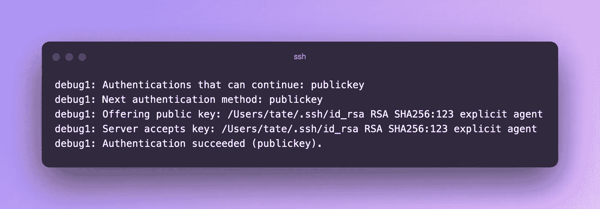

# 管理远程机器的 6 个基本 SSH 命令

> 原文：<https://betterprogramming.pub/essential-ssh-commands-new-developers-should-know-52e2e72703c8>

## 带着你的钥匙


照片由[韦斯·希克斯](https://unsplash.com/es/@sickhews?utm_source=unsplash&utm_medium=referral&utm_content=creditCopyText)在 [Unsplash](https://unsplash.com/s/photos/computers?utm_source=unsplash&utm_medium=referral&utm_content=creditCopyText) 拍摄

在您的本地机器上构建应用程序是非常好的，直到需要研究生产中的实例。把你的头埋在沙子里不是一个选择，摸索随机的 SSH 标志会耗费太多的时间。如果您需要排除故障或者只是检查正在运行的服务，能够有效地连接到远程机器是一项必需的技能。

在本文中，我们将探索您希望在第一天就熟悉的基本 SSH 命令。这些能让你快速进出机器，而不会弄坏东西或拔头发。他们还将帮助您在出现问题时快速连接和排除故障。

# 1.选择多个私钥文件

当您只有一个 SSH 密钥时，事情就相当简单了。很有可能你[使用默认设置](https://docs.github.com/en/authentication/connecting-to-github-with-ssh/generating-a-new-ssh-key-and-adding-it-to-the-ssh-agent)生成了它，并将其保留为`id_rsa`。这是在您执行`ssh-add`时自动导入的，通常会默认出现在您添加的身份中。

当你管理一堆不同的密钥对时会发生什么？你有几个选择。您可以将它添加到现有的 ssh-agent 中，如下所示:

```
ssh-add ~/.ssh/<private_key_file>
```

或者您可以在连接到主机时在 SSH 命令中手动指定它:

```
ssh -i ~/.ssh/<private_key_file> user@host.com
```

这两个选项都可以，但后者更简单，可以避免您必须运行两个单独的命令来将身份加载到代理中。如果你只是想连接到一个你很少访问的主机，使用`-i`传递密钥肯定是更快的方法。

# 2.管理 SSH 代理身份

如果你经常在你的代理中使用许多不同的密钥对，这会变得有点混乱。当事情变得模糊不清，你不记得什么对什么的时候，确切地知道你的经纪人已经有什么，以及如何把它冲洗出来是非常有帮助的。

如果要查看添加到代理中的现有密钥，可以运行以下命令来列出它们:

```
ssh-add -l
```

这将向您显示所有当前加载的身份列表。如果您注意到一个不应该存在的密钥(可能是过期的密钥)，您可以通过传递以下命令来删除它:

```
ssh-add -d ~/.ssh/<private_or_public_key_file>
```

这要求您仍然拥有原始密钥文件来删除它。如果您不再拥有它们，或者您想要清除所有键并重新开始，您可以执行:

```
ssh-add -D
```

这将删除所有已加载的身份，您可以再次开始逐个添加内容。

# 3.跳过已知主机检查

连接到新的外国机器总是会产生一些额外的输出。如果您以前从未连接过，您会收到一个提示，要求您批准连接，因为您以前从未与该主机交谈过，并且它不在您的`known_hosts`文件中。如果您想绕过这一点，避免这种不断的纠缠，您可以通过传递:

```
ssh -o StrictHostKeyChecking=no user@host.com
```

这将阻止提示，并且下次您连接到同一主机时，它将自动在`known_hosts`文件中有一个条目。

# 4.带着你的钥匙

如果您希望使用自己的密钥对从一个主机跳到另一个主机，那么您可能会发现最初效果不太好。如果你连接到第一个主机，然后注意到一旦你试图跳转到另一个你得到一个`Permission denied`错误，这是因为你没有转发你的代理。

为了转发您的 SSH 代理并随身携带您的密钥，您必须向 SSH 传递另一个标志:

```
ssh -A user@host.com
```

这个简单的开关使 SSH 能够将您正在运行的`ssh-agent`副本转发到远程主机，此时您可以使用它跳转到另一台主机。这假设相同的密钥可以在多个主机上使用。

# 5.通过 SSH 执行命令

您可能希望在多台不同的主机上快速运行命令。也许您正在运行一个脚本并调用 SSH，或者只是一个快速的命令行程序来获取一些关键信息。在这种情况下，根据命令的不同，您可能需要分配一个伪终端。

如果您将要执行的特定命令传递给 SSH，默认情况下，它不会提供交互式会话。分配一个伪终端允许您远程对主机运行脚本和其他“交互式”命令。如果您收到一个关于终端未被分配的警告，您可能需要在连接时传递`-t`标志:

```
ssh -t user@host.com top
```

这将启用伪终端分配，并允许您成功执行命令。

# 6.为连接故障排除启用详细输出

当你确信你使用了正确的键时，连接到主机并得到可怕的`Permission denied`可能会令人抓狂。很有可能幕后还有其他事情在进行。如果您正在寻找您的公钥被拒绝的原因，您可能希望在 SSH 中启用调试模式来深入研究。

要启用调试模式，只需在连接到主机时将`-v`参数传递给 SSH，如下所示:

```
ssh -v user@host.com
```

这将增加控制台输出的冗长性，并向您显示 SSH 尝试使用的认证方法的细目。这对于确保您假设正在使用的认证方法实际上正在使用*是非常方便的。*

下面是启用详细模式并使用公钥连接到服务器的示例。在输出中，您可以清楚地看到我们是如何尝试身份认证的，以及使用了哪些凭据:



您可以传递多达三个连续的`-v`标志，以进一步提高日志输出的详细程度。

有更多我错过的 SSH 技巧和窍门吗？让我了解他们！如果你想知道更多宋承宪的精彩，也可以看看我的其他文章:

*   [*针对远程开发者的简单 SSH 调整*](https://medium.com/better-programming/simple-ssh-tweaks-for-remote-developers-4392a1409c33)
*   [*如何在 Python 中抽象 SSH 命令*](https://medium.com/better-programming/how-to-run-ssh-commands-with-python-8111ee8ab405)