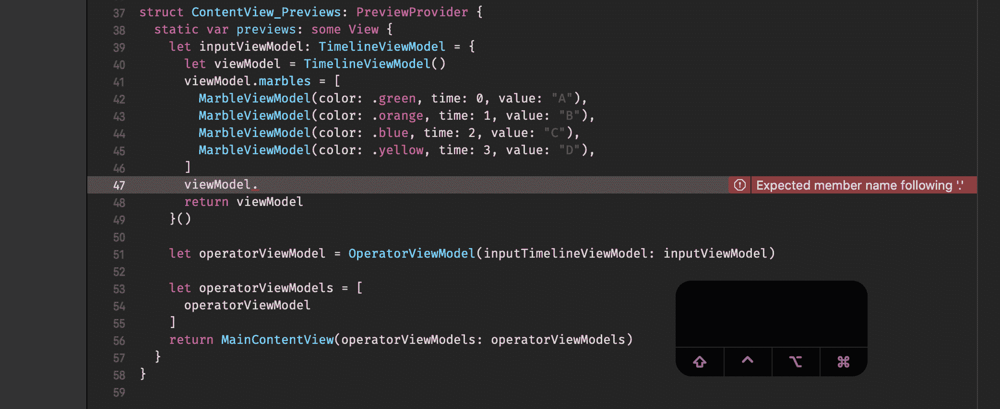
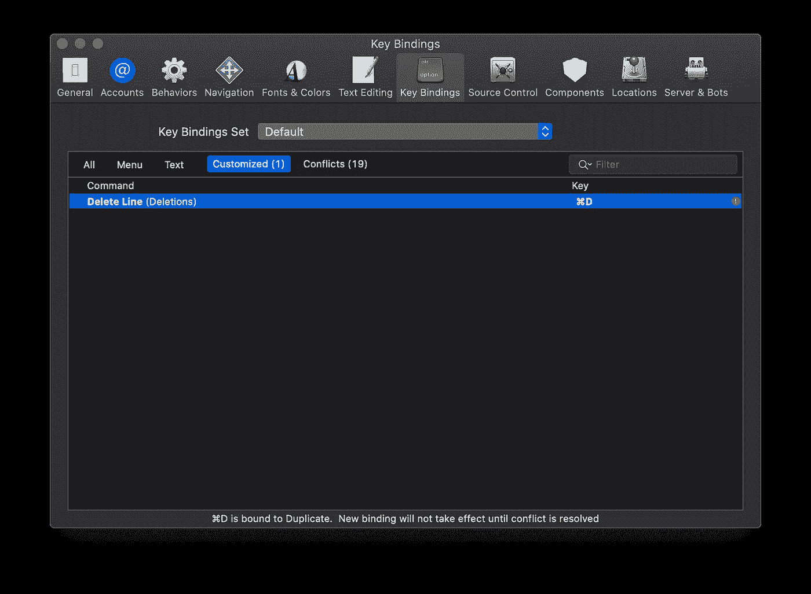
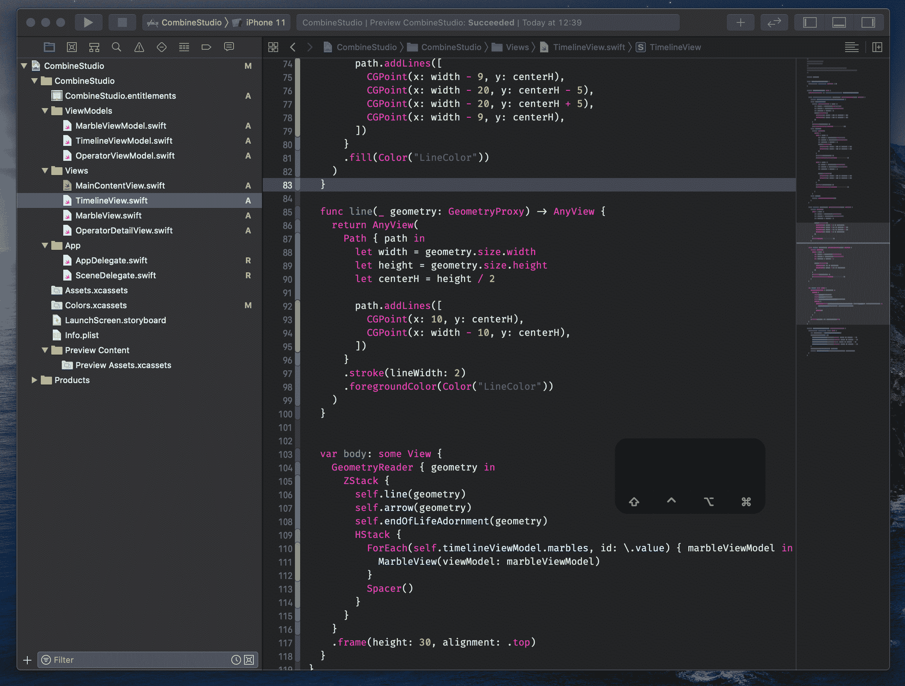
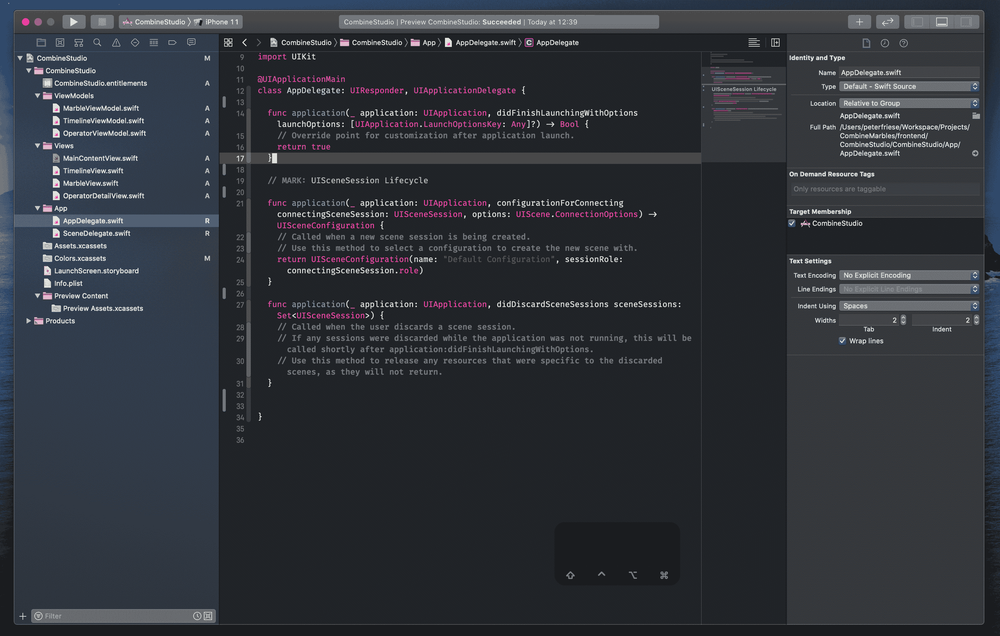
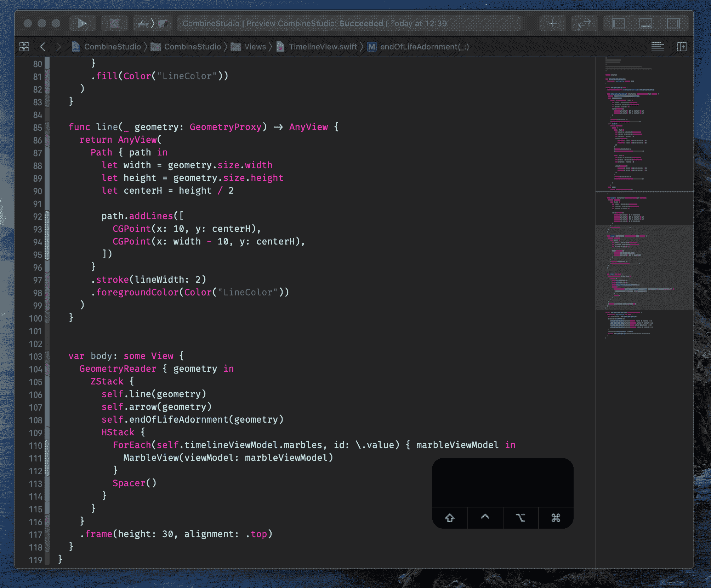

# 更高效编码的基本 Xcode 快捷键

> 原文：<https://betterprogramming.pub/essential-xcode-shortcuts-for-more-efficient-coding-1f8e58b2c907>

## 开发人员生产力

## 加速您的编码工作流程


[张杰](https://unsplash.com/@jay_zhang?utm_source=medium&utm_medium=referral)在 [Unsplash](https://unsplash.com?utm_source=medium&utm_medium=referral) 上的照片

作为开发人员，我们在 IDE 上花了相当多的时间，所以成为使用它的专家是值得的。仅仅会编辑代码是不够的——你需要变得精通。

在[实用程序员](https://en.wikipedia.org/wiki/The_Pragmatic_Programmer)中，作者建议选择一个编辑器，并使用它完成所有编辑任务。他们推荐的理由很简单:一旦你记住了所有的键盘快捷键，你的工作效率将会飙升。

虽然作为 iOS / macOS / watchOS / tvOS 开发人员，您当然可以使用像 VS Code 这样的编辑器来编辑您的源代码，但我们在某种程度上必须使用 Xcode，因为它包含了比源代码编辑器更多的工具。

然而，了解 Xcode 并精通核心编辑和导航命令可以提高您的工作效率。

我收集了一份我最喜欢的按键和鼠标命令的列表——希望你也会觉得它们有用！这里列出的所有键绑定都使用 Xcode 的默认键绑定，只有一个明显的例外。

```
⌘ = Command
⌥ = Option/Alt
⇧ = Shift
⌃ = Control
←→ ↑↓ = Arrow keys
↩ = Enter
```

# 编辑

让我们从编辑开始——这是最基本的活动之一，所以每一点小小的改进都会提高你的工作效率！

## 代码完成(⌃ +空格)

很难想象在没有代码完成的情况下工作——我一直用它来探索 API，并在打字时节省时间。



## 动线(⌥ + ⌘ + [以及⌥ + ⌘ + ])

在代码中移动单行或整个块非常有用，例如在组织属于一起的代码时。Xcode 会自动处理缩进\o/

## 删除整行(⌘ + D)

我经常需要删除一整行——Xcode 为此提供了一个编辑器命令，但不幸的是，在默认的键绑定中，它没有绑定到组合键。经过一番考虑，我决定破例在这个列表中加入一个自定义组合键，因为我认为它非常有用。要定义自定按键绑定，请前往 Xcode 设置(按下⌘ +，)，导航至*按键绑定*标签，并使用过滤器栏搜索“删除行”。双击*键*字段，然后按下您喜欢的组合键。



## 注释当前行/块(⌘ + /)

对于临时停用代码中的一些行非常有用。但是请记住不要检查这个。你的版本控制系统是一个比一大块注释行更好的回溯历史的工具！

## 平衡缩进(⌃ + I)

就像上面的许多其他命令一样，这既适用于单个代码行，也适用于整个代码块。从别处粘贴代码后有用(有人说堆栈溢出吗？).

# 航行

估计说你读的代码比你写的要多得多，我完全同意。你无时无刻不在阅读代码:当你挖掘一个新的代码库的时候，当你调试的时候，甚至当你写新代码的时候！这里有几个命令可以帮助你掌握导航。

## 往返(⌃ + ⌘ + ←和⌃ + ⌘ + →)

当您打开或创建项目时，Xcode 会跟踪您的整个运动历史。您访问的任何文件、查找的任何符号都将被追加到 IDE 的导航堆栈中。使用⌃ + ⌘ + ←和⌃ + ⌘ + →在您访问过的源代码位置之间来回切换。

## 跳转到定义(⌃ + ⌘ + J 或⌃ + ⌘ +点击)

当学习新的 API 或浏览未知的代码库时，这非常方便。不确定`ObservedObject`是做什么的？导航到它的定义，看看它有哪些方法和属性，它实现了哪些接口，它继承了哪个类。对于苹果的大部分 API，你也会看到文档(当然，你总是可以使用⌥ +点击来调用快速帮助)

## 在工作空间中查找选定的符号(⇧ + ⌃ + ⌘ + F)

这本质上与*跳转到定义*相反，当试图理解 API 如何在代码库中使用时，这特别有帮助。它也让你感觉到当你重构一个 API 时，你会给你的队友(或者其他 API 消费者)带来多大的痛苦！

## 查找呼叫层次结构(⇧ + ⌃ + ⌘ + H)

类似于*在工作区*中查找选定的符号，但是关注于方法，该快捷方式将打开*调用层次结构*视图，以显示代码中调用指定方法的任何位置，以及依次调用这些方法的任何方法，等等。



## 快速打开(⇧ + ⌘ + O)

如果从这篇文章中你只能学到一件事，那就让它成为这一件吧。*快速打开*允许您快速跳转到项目/工作区中的任何源位置。只需开始键入项目中任何类、接口、函数、方法、枚举等的名称(以及您导入的任何 SDK ),它就会在弹出窗口中填充一个与搜索词匹配的符号列表。它执行一些模糊搜索，所以你可以输入部分搜索词，如`UIAD` 来搜索`UIApplicationDelegate`。



## 跳转到行(⌘ + L)

当您需要导航到当前文件中的特定行时，这很有用。

## 文档大纲(⌃ + 6 或⌘ +悬停在小地图上)

这实际上是两个不同的 UI，但它们基本上做的是一样的:

使用⌃ + 6 从*跳转栏*(代码编辑器正上方的区域)下拉一个菜单，显示当前源文件中的所有符号。然后，您可以使用箭头键进行导航，或者通过开始键入来过滤符号列表。不仅对大文件有用。

在 Xcode 最近的一个版本中，**小地图**是 Xcode 编辑器的一个受欢迎的新增功能，它提供了代码的高级可视化概览(苹果，如果你正在读这篇文章:我们能找到缩放小地图的方法吗，比如通过拖动分隔线？).当鼠标悬停在小地图上时，它会显示一个带有鼠标光标悬停的符号名称的弹出按钮。悬停时按下⌘可查看所有符号的列表。



# 视图管理

让我们换个话题，看看视图管理。在 Xcode 中，编辑器占据了大部分屏幕空间，它被许多显示上下文信息的视图所包围。

## 切换画布/ SwiftUI 预览(⌥ + ⌘ + ↩)

当编写 SwiftUI 代码时， *Canvas* 提供了您正在构建的 UI 的实时预览。Apple 已经竭尽全力使这成为一种双向体验，即你在预览中所做的任何更改(例如移动 UI 元素，或添加新元素)也将反映在代码编辑器中，反之亦然。这允许快速原型制作和快速周转时间。您不再需要启动您的应用程序来检查按钮是红色还是蓝色更好看。

然而，我们并不总是需要看到预览，所以能够根据需要切换它是很好的。使用⌥ + ⌘ + ↩隐藏或显示画布。

## 切换视图

Xcode 围绕代码编辑器有三个主要区域，可以切换这些区域以腾出更多空间进行编辑(或根据需要显示上下文信息):

*   左:导航器(⌘ + 0)
*   右:检查员(⌘ + ⌥ + 0)
*   底部:调试(⇧ + ⌘ + Y)

# 摘要

这是我在 Xcode 11 中最喜欢的效率快捷方式的快速浏览。下表为您提供了命令和按键绑定的快速概述:

你最喜欢的快捷键有哪些*？请在评论中告诉我或者在 [Twitter](http://www.twitter.com/peterfriese) 上与我分享！*