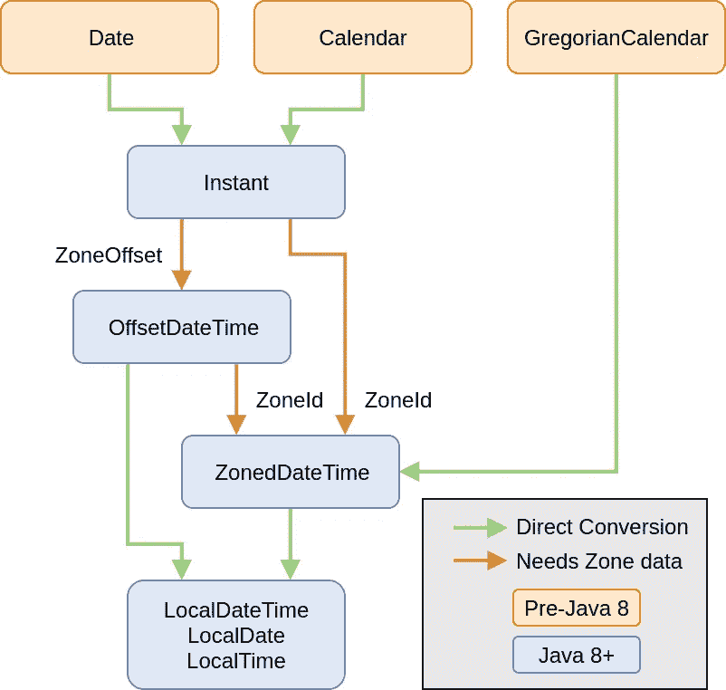

# Java 的时间 API 的要点

> 原文：<https://betterprogramming.pub/essentials-of-javas-time-api-b372d9a2903b>

## JSR310 如何改变我们处理日期和时间的方式


红色透明玻璃——尼罗河( [Pixabay](https://pixabay.com/photos/hourglass-time-hours-clock-620397/) )

在许多编程语言中，处理日期和时间是一项繁琐的任务。但是有了 Java 8，JDK 为我们提供了一个全面的、全新的 API，改变了我们处理时间相关概念的方式。

尽管 JSR310 是在 Java 8 中引入的，但代码示例将使用 Java 10 的一个特性，[局部变量类型推断](https://medium.com/better-programming/local-variable-type-inference-in-java-10-cb4967dd6eb0)，以提高可读性。
不过，代码示例本身都是 Java 8 兼容的。
代码示例的`// =>`部分将显示前一行/变量的`toString()`输出。

```
**Table of Contents**[Pre-JSR310](#7210)
[The Java Time API (JSR310)](#c68f)
[Local Types](#b9c4)
[Time Zones and Offsets](#7fbf)
[Other Date and Time Types](#f824)
[General API Design](#a422)
[Android Support](#a1c5)
[Java Time API for Java 6 and 7](#0b5a)
[Resources](#c931)
```

# JSR310 之前的版本

在新的 API 之前，JDK 只提供了几个处理日期和时间的类。

以下是最常见的几种:

*   `[java.util.Date](https://docs.oracle.com/javase/7/docs/api/java/util/Date.html)`:精确的时间瞬间，毫秒精度，相对于 1970 年 1 月 1 日 00:00:00 GMT
*   `[java.util.Calendar](https://docs.oracle.com/javase/7/docs/api/java/util/Calendar.html)`:瞬间时间和日历字段(如月、年、日等)之间的桥梁。)
*   `[java.util.TimeZone](https://docs.oracle.com/javase/7/docs/api/java/util/TimeZone.html)`:负责时区偏移和处理夏令时(DST)
*   `[java.text.DateFormat](https://docs.oracle.com/javase/7/docs/api/java/text/DateFormat.html)`:格式化和解析

乍一看，这四个似乎涵盖了最常见的场景。

但是，他们真的能够处理日期和时间的所有微妙的专业吗？

## 毫秒

由于`[java.util.Date](https://docs.oracle.com/javase/8/docs/api/java/util/Date.html)`是基于从 Unix 时间戳“0”开始的毫秒，我们倾向于认为日期和时间是毫秒的总和:

使用毫秒可能看起来很直观，但最终会导致错误。

与时间打交道很有挑战性，因为我们对日期和时间的假设实际上并不正确。我们对日期和时间有许多误解。[戴夫·德隆](https://twitter.com/davedelong)正在维护一份[的大型清单](https://yourcalendricalfallacyis.com/)，其中附有快速解释。以下是一些错误的假设:

*   一天有 86400 秒长
*   [每天都有午夜](https://yourcalendricalfallacyis.com/#every-day-has-a-midnight)
*   [时区总是在小时刻度上](https://yourcalendricalfallacyis.com/#timezones-always-are-on-the-hour-mark)

边缘案例的问题在于，在我们触发它们之前，我们往往意识不到它们的存在。如果我们的代码只在闰年出错，它可能会运行四年。

## 并非一切都是完美的时间点

一个`Date`代表毫秒精度的单个时间点。但是更广泛的单位呢？

2021 年 1 月是星期几？1 月 6 日是几点？

除了一个点之外，我们需要能够表示不同的日期和时间概念:

*   不带时间的日期:2020 年 12 月 30 日
*   没有日期的时间:12:24
*   年月:2020 年 12 月
*   年份:2020 年
*   期限:七天
*   不同的日历系统:日本日历
*   更多

这些概念必须由我们自己通过代码契约来实现，比如将一个永恒的日期表示为午夜的`java.util.Date`。这样的合同使得我们的数据不容易交换，也太容易被破坏。这些边缘情况和考虑因素很容易导致许多不会立即变得明显的错误。

## Joda 时间

幸运的是，第三方框架开发了一个更好的日期和时间表示概念，使其成为 Java 8 之前 Java 事实上的标准日期和时间库: [Joda-Time](https://www.joda.org/joda-time/) 。

不过，在 Java 8 中，JDK 接受了他们的工作，并基于他们的概念提供了一个新的时间 API。

# Java 时间 API (JSR310)

为了解决前面提到的缺点，需要一个全新的 API。

它是从零开始构建的，Joda-Time 的作者 Stephen Colebourne 共同领导了这项工作。

其结果是对 JDK 的一个完整和全面的补充。但是是什么让这个 API 比它的前身好这么多呢？

## 设计目标

新 API 的构建遵循了几个核心原则:

如果可能的话，每个类型都应该是不可变的。我以前写过关于不可变性的[重要性和优点](https://medium.com/better-programming/functional-programming-with-java-immutability-8dc748e85f9e):线程安全，由于没有可变状态而导致的错误更少，并且它对垃圾收集器更友好。

**流畅的 API** [流畅的代码](https://medium.com/better-programming/how-fluent-interfaces-can-lead-to-more-meaningful-code-cb6d947d77bb)是更容易理解的代码。

**清晰、明确、预期** 每种方法都应该定义明确，自成一体，并使其意图显而易见。具有一致的方法名前缀的领域驱动的设计应该导致更清晰和可读性。

**可扩展** 即使 [ISO 8601](https://en.wikipedia.org/wiki/ISO_8601) 是最常用的日历系统，是新 API 的主日历系统，也应该对其他人开放。它们应该由应用程序开发人员提供，而不仅仅是 JDK 本身。

# 本地类型

新包`java.time.*`中有很多不同的类型，每一种都有特定的用途。

首先，我们了解不知道时区概念的`Local`类型。

## java.time.LocalDate

顾名思义，这种类型表示没有时间的无时区日期。只是一天，一月，一年:

[文档](https://docs.oracle.com/javase/8/docs/api/java/time/LocalDate.html)

## java.time.LocalTime

这是一个没有日期或时区偏移的时间。

时间的标准定义适用于:一天中的时间，基于 24 小时制，从午夜开始。

`LocalTime`存储小时、分钟、秒和纳秒。尽管该类型支持纳秒精度，但要知道实际精度取决于 JVM/JDK 实现:

[文档](https://docs.oracle.com/javase/8/docs/api/java/time/LocalTime.html)

## java.util.LocalDateTime

这是`LocalDate`和`LocalTime`的组合。

它也可以很容易地降级到它的组成部分:

[文档](https://docs.oracle.com/javase/8/docs/api/java/time/LocalDateTime.html)

# 时区和时差

时区和它们的偏移量是每个与时间打交道的人的 banes。很多事情都可能(而且通常会)出错。

为了减轻处理它们的痛苦，Java Time API 将责任分成多个类:

*   `[ZoneOffset](https://docs.oracle.com/javase/8/docs/api/java/time/ZoneOffset.html)`:相对于 UTC/GMT 时间的偏移量，+14:00 到-12:00
*   `[ZoneRules](https://docs.oracle.com/javase/8/docs/api/java/time/zone/ZoneRules.html)`:单个时区的偏移量如何变化的规则(例如，夏令时、历史变化)
*   `[ZoneId](https://docs.oracle.com/javase/8/docs/api/java/time/ZoneId.html)`:时区标识符，如“欧洲/柏林”

有两种不同的时区类型可供选择:

*   `[ZonedDateTime](https://docs.oracle.com/javase/8/docs/api/java/time/ZonedDateTime.html)`:绑定到特定的`[ZoneId](https://docs.oracle.com/javase/8/docs/api/java/time/ZoneId.html)`
*   `[OffsetDateTime](https://docs.oracle.com/javase/8/docs/api/java/time/OffsetDateTime.html)` / `[OffsetTime](https://docs.oracle.com/javase/8/docs/api/java/time/OffsetTime.html)`:带有偏移量的日期/时间，但不绑定到特定时区

## Java . time . offset datetime/Java . time . offset time

`[OffsetDateTime](https://docs.oracle.com/javase/8/docs/api/java/time/OffsetDateTime.html)`是`[ZonedDateTime](https://docs.oracle.com/javase/8/docs/api/java/time/ZonedDateTime.html)`的一个简单版本，没有与特定时区的关系，只由它的偏移量定义。这样，它更适合交换格式，比如保存在数据库或 JSON/XML 中。

[文档](https://docs.oracle.com/javase/8/docs/api/java/time/OffesetDateTime.html)

## java.time.ZonedDateTime

尽管偏移量通常就足够了，但有时我们需要处理特定于时区的数据。对于这样的用例，我们有`[ZonedDateTime](https://docs.oracle.com/javase/8/docs/api/java/time/ZonedDateTime.html)`:

[文档](https://docs.oracle.com/javase/8/docs/api/java/time/ZonedDateTime.html)

# 其他日期和时间类型

除了日期、时间和日期时间类型之外，新的 API 还为其他与日期和时间相关的概念提供了特定的类。

## java.time.Instant

一个`[Instant](https://docs.oracle.com/javase/8/docs/api/java/time/Instant.html)`是最接近我们所拥有的`[java.util.Date](https://docs.oracle.com/javase/8/docs/api/java/util/Date.html)`的等价物。这是一个与时代相关的经典时间戳。默认纪元从 Unix 时间戳“0”开始(1970-01-01T00:00:00Z，UTC 1970 年 1 月 1 日午夜开始)。

如果提供了缺少的信息，它可以转换为其他类型。例如，要创建一个`[LocalDateTime](https://docs.oracle.com/javase/8/docs/api/java/time/LocalDateTime.html)`，我们需要提供适当的`[ZoneId](https://docs.oracle.com/javase/8/docs/api/java/time/ZoneId.html)`，这样任何规则，比如 DST 和 offset，都可以应用:

[文档](https://docs.oracle.com/javase/8/docs/api/java/time/Instant.html)

## java.time.Duration

A `[Duration](https://docs.oracle.com/javase/8/docs/api/java/time/Duration.html)`表示基于时间的量(小时、分钟、秒、纳秒)。它可以直接创建，也可以作为其他类型之间的差异来创建:

[文档](https://docs.oracle.com/javase/8/docs/api/java/time/Duration.html)

## java.time.Period

`[Period](https://docs.oracle.com/javase/8/docs/api/java/time/Period.html)`是与基于时间的`[Duration](https://docs.oracle.com/javase/8/docs/api/java/time/Duration.html)`相对应的基于日期的(年、月、日):

[文档](https://docs.oracle.com/javase/8/docs/api/java/time/Period.html)

## java.time.Year

ISO 日历中的一年:

请注意，它只匹配现代年份的公历和儒略历。

例如，俄罗斯部分地区直到 1920 年才改用现代公历。此外，多重[日历改革](https://en.wikipedia.org/wiki/Gregorian_calendar#Gregorian_reform)可以使历史日期的计算变得复杂。

[文档](https://docs.oracle.com/javase/8/docs/api/java/time/Year.html)

## java.time.YearMonth

无日日期类型，例如 2021 年 1 月:

[文档](https://docs.oracle.com/javase/8/docs/api/java/time/YearMonth.html)

## java.time.MonthDay

日期的无年份表示，例如 1 月 6 日:

该字符串输出可能看起来很奇怪，但它正是 ISO 8601:2000 定义的，尽管更新后的 ISO 8601:2004 不允许忽略一年中的一个月。([维基百科](https://en.wikipedia.org/wiki/ISO_8601#Calendar_dates))

[文档](https://docs.oracle.com/javase/8/docs/api/java/time/MonthDay.html)

## 月/日周枚举

大量错误的另一个来源是关于月份和工作日的一次性错误。

一月用 1 还是 0 表示？
12 月 12 日还是 11 日？

一周什么时候开始？周日还是周一？它们代表了什么价值？

由于 Java Time API 是基于 ISO 8601 的，所以一周总是从星期一开始。为了保持一致，它从值 1 开始表示星期一和一月。

为了使它更加有用，我们提供了两个枚举，在大多数方法中它们可以与数值互换:

文档:

*   `[java.time.Month](https://docs.oracle.com/javase/8/docs/api/java/time/Month.html)`
*   `[java.time.DayOfWeek](https://docs.oracle.com/javase/8/docs/api/java/time/DayOfWeek.html)`

# 通用 API 设计

通常，一个有许多新类的 API 意味着我们必须理解和记住许多新的方法和概念。为了减轻认知负担，API 被设计成具有一致的方法名前缀，并在类型之间共享概念。

## 方法名称前缀

我们可以很容易地探索一个类型的不同功能，只需在开始一个前缀后触发自动完成。

**获取**

一个经典的getter，用来检索零件的类型:

**同**

返回包含指定更改的副本:

**加/减**

返回计算结果的副本:

**乘/除/求反**

`[Duration](https://docs.oracle.com/javase/8/docs/api/java/time/Duration.html)` / `[Period](https://docs.oracle.com/javase/8/docs/api/java/time/Period.html)`的附加计算:

**至**

类型之间的转换:

**在**

返回具有与时间/时区相关的更改的新对象:

**共**

没有转换的静态工厂方法:

**出自**

带转换的静态工厂方法:

请注意，转换仅适用于降级。例如，我们不能从一个`[LocalDate](https://docs.oracle.com/javase/8/docs/api/java/time/LocalDate.html)`创建一个`[LocalDateTime](https://docs.oracle.com/javase/8/docs/api/java/time/LocalDateTime.html)`:

**解析**

解析文本输入的静态工厂方法:

## 解析和格式化

基于 ISO 8601 及其精度，所有类型都有明确定义的`toString()`方法:

```
 TYPE           | FORMAT
----------------|-------------------------------------
LocalDate       | uuuu-MM-dd
LocalTime       | HH:mm
                | HH:mm:ss
                | HH:mm:ss.SSS
                | HH:mm:ss.SSSSSS
                | HH:mm:ss.SSSSSSSSS
LocalDateTime   | uuuu-MM-dd'T'HH:mm
                | uuuu-MM-dd'T'HH:mm:ss
                | uuuu-MM-dd'T'HH:mm:ss.SSS
                | uuuu-MM-dd'T'HH:mm:ss.SSSSSS
                | uuuu-MM-dd'T'HH:mm:ss.SSSSSSSSS
Year            | value without leading zeroes
YearMonth       | uuuu-MM
MonthDay        | --MM-dd
OffesetDateTime | uuuu-MM-dd'T'HH:mmXXXXX
                | uuuu-MM-dd'T'HH:mm:ssXXXXX
                | uuuu-MM-dd'T'HH:mm:ss.SSSXXXXX
                | uuuu-MM-dd'T'HH:mm:ss.SSSSSSXXXXX
                | uuuu-MM-dd'T'HH:mm:ss.SSSSSSSSSXXXXX
OffestTime      | HH:mm:ssXXXXX
                | HH:mm:ss.SSSXXXXX
                | HH:mm:ss.SSSSSSXXXXX
                | HH:mm:ss.SSSSSSSSSXXXXX
ZonedDateTime   | LocalDateTime + ZoneOffset
ZoneOffset      | Z (for UTC)
                | +h
                | +hh
                | +hh:mm
                | -hh:mm
                | +hhmm
                | -hhmm
                | +hh:mm:ss
                | -hh:mm:ss
                | +hhmmss
                | -hhmmss
Duration        | PT[n]H[n]M[n]S 
Period          | P[n]Y[n]M[n]D
```

由`toString()`产生的格式在各自的`parse(CharSequence text)`方法中也是可用的，这对于交换方法或非本地化显示来说是很棒的。

对于更加人性化和本地化的表示，可以使用类`[java.time.format.DateTimeFormatter](https://docs.oracle.com/javase/8/docs/api/java/time/format/DateTimeFormatter.html)`。它是线程安全的、不可变的，并提供了流畅的 API:

通过为`parse`方法提供格式化程序，它也可以用于解析:

## java.time.TemporalAdjuster

通过功能接口`[TemporalAdjuster](https://docs.oracle.com/javase/8/docs/api/java/time/temporal/TemporalAdjuster.html)`，我们可以定义如何调整实现`[Temporal](https://docs.oracle.com/javase/8/docs/api/java/time/temporal/Temporal.html)`的类型的策略。这样，我们可以对新的 Java Time API 类型进行定义良好的、可重用的调整。

Java Time API 通过其实用程序类`[TemporalAdjusters](https://docs.oracle.com/javase/8/docs/api/java/time/temporal/TemporalAdjusters.html)`提供了多个预定义的调整器。在 API 的一般精神中，方法名(大部分)不言自明:

```
[dayOfWeekInMonth](https://docs.oracle.com/javase/8/docs/api/java/time/temporal/TemporalAdjusters.html#dayOfWeekInMonth-int-java.time.DayOfWeek-)(int ordinal, DayOfWeek dayOfWeek)[firstDayOfMonth](https://docs.oracle.com/javase/8/docs/api/java/time/temporal/TemporalAdjusters.html#firstDayOfMonth--)()
[firstDayOfNextMonth](https://docs.oracle.com/javase/8/docs/api/java/time/temporal/TemporalAdjusters.html#firstDayOfNextMonth--)()
[firstDayOfNextYear](https://docs.oracle.com/javase/8/docs/api/java/time/temporal/TemporalAdjusters.html#firstDayOfNextYear--)()
[firstDayOfYear](https://docs.oracle.com/javase/8/docs/api/java/time/temporal/TemporalAdjusters.html#firstDayOfYear--)()
[firstInMonth](https://docs.oracle.com/javase/8/docs/api/java/time/temporal/TemporalAdjusters.html#firstInMonth-java.time.DayOfWeek-)(DayOfWeek dayOfWeek)[lastDayOfMonth](https://docs.oracle.com/javase/8/docs/api/java/time/temporal/TemporalAdjusters.html#lastDayOfMonth--)()
[lastDayOfYear](https://docs.oracle.com/javase/8/docs/api/java/time/temporal/TemporalAdjusters.html#lastDayOfYear--)()
[lastInMonth](https://docs.oracle.com/javase/8/docs/api/java/time/temporal/TemporalAdjusters.html#lastInMonth-java.time.DayOfWeek-)(DayOfWeek dayOfWeek)[next](https://docs.oracle.com/javase/8/docs/api/java/time/temporal/TemporalAdjusters.html#next-java.time.DayOfWeek-)(DayOfWeek dayOfWeek)
[nextOrSame](https://docs.oracle.com/javase/8/docs/api/java/time/temporal/TemporalAdjusters.html#nextOrSame-java.time.DayOfWeek-)(DayOfWeek dayOfWeek)[ofDateAdjuster](https://docs.oracle.com/javase/8/docs/api/java/time/temporal/TemporalAdjusters.html#ofDateAdjuster-java.util.function.UnaryOperator-)(UnaryOperator<LocalDate> dateBasedAdjuster)[previous](https://docs.oracle.com/javase/8/docs/api/java/time/temporal/TemporalAdjusters.html#previous-java.time.DayOfWeek-)(DayOfWeek dayOfWeek)
[previousOrSame](https://docs.oracle.com/javase/8/docs/api/java/time/temporal/TemporalAdjusters.html#previousOrSame-java.time.DayOfWeek-)(DayOfWeek dayOfWeek)
```

例如，在基于订阅的应用程序中，我们可以创建像`nextBillingDate(Customer customer)`这样的特定于客户的调整器。代码很容易理解，根据客户计算账单日期的逻辑只在一个地方。

## Java . time . temporal . temporal unit 和 java.time.temporal.ChronoUnit

接口`[TemporalUnit](https://docs.oracle.com/javase/8/docs/api/java/time/temporal/TemporalUnit.html)`提供了一种表达日期和时间单位的方法，然后可以在计算中使用。

enum `[ChronoUnit](https://docs.oracle.com/javase/8/docs/api/java/time/temporal/ChronoUnit.html)`已经提供了最常用的单位，为各种不同的单位提供了常量，如`[MILLENNIA](https://docs.oracle.com/javase/8/docs/api/java/time/temporal/ChronoUnit.html#MILLENNIA)`、`[DAYS](https://docs.oracle.com/javase/8/docs/api/java/time/temporal/ChronoUnit.html#DAYS)`、`[HOURS](https://docs.oracle.com/javase/8/docs/api/java/time/temporal/ChronoUnit.html#HOURS)`、`[MILLIS](https://docs.oracle.com/javase/8/docs/api/java/time/temporal/ChronoUnit.html#MILLIS)`等。

**作为参数**

除了具体的计算方法，如`LocalDate [plusDays](https://docs.oracle.com/javase/8/docs/api/java/time/LocalDate.html#plusDays-long-)(long daysToAdd)`，也有非具体的需要`[TemporalUnit](https://docs.oracle.com/javase/8/docs/api/java/time/temporal/TemporalUnit.html)`的方法，如`LocalDate plus(long amountToAdd, TemporalUnit unit)`。

所有的 Java 时间 API 计算都将尽最大努力保持合理，并保持在各自的单元和相关的更大的单元内。我们必须把新类型看作不同单元的组合，而不是一个单一的值。

这意味着如果我们给`[LocalDate](https://docs.oracle.com/javase/8/docs/api/java/time/LocalDate.html)`添加一个月，它将影响它的月份(以及相关的单位，如年份):

使用`[ChronoUnit](https://docs.oracle.com/javase/8/docs/api/java/time/temporal/ChronoUnit.html)`也可以轻松计算差异。以`[LocalDate](https://docs.oracle.com/javase/8/docs/api/java/time/LocalDate.html)`为例:

**静态方法**

枚举值本身也包含两种更易于理解的计算代码的方法:

*   `[<R extends Temporal> R addTo(R temporal, long amount)](https://docs.oracle.com/javase/8/docs/api/java/time/temporal/ChronoUnit.html#addTo-R-long-)`
*   `[long between(Temporal temporal1Inclusive, Temporal temporal2Exclusive)](https://docs.oracle.com/javase/8/docs/api/java/time/temporal/ChronoUnit.html#between-java.time.temporal.Temporal-java.time.temporal.Temporal-)`

前面的例子也可以用这些方法来表达:

有了`static import`，它变得更具可读性:

**持续时间**

枚举常量也可以用 ISO 日历定义表示为`Duration`:

## 在类型之间转换

我们不能只是用一种新类型替换所有的`[java.util.Date](https://docs.oracle.com/javase/7/docs/api/java/util/Date.html)`实例，所以我们需要能够在它们之间进行转换。新方法`[java.util.Date#toInstant()](https://docs.oracle.com/javase/8/docs/api/java/sql/Date.html#toInstant--)`提供了一种介于新旧之间的车辆。

如果提供适当的时区相关数据，可以将`Instant`转换为另一种类型:



不同 Java 时间类型的可转换性

相应的代码非常简单明了:

从那里，我们可以使用另一个`to`方法来转换它。

# Android 支持

在过去，许多激动人心的 Java 8+新特性需要一段时间才能在 Android 中实现。我们需要一个第三方框架或后台来使用它们。

由于 Android Gradle 插件 4.0，许多 Java 8 功能可以通过[去糖](https://developer.android.com/studio/write/java8-support#library-desugaring)使用，而不需要更高的 API 级别。虽然需要对`build.gradle`和一个新的依赖项进行一些更改:

以下是通过去糖化可以获得的所有 API 的列表: [Android 开发者](https://developer.android.com/studio/write/java8-support-table)。

# Java 6 和 7 的 Java 时间 API

即使 Java 8 发布于 6 年前，2018 年 3 月，也不是每个人都有使用它的奢侈。

但是不要绝望。多亏了反向移植，我们仍然可以使用新的 API。

ThreeTen Backport 项目提供了一种兼容 Java 6 和 7 的方式来使用新类型，而不需要额外的依赖。它由 Java Time API 的主要作者 Stephen Colebourne 维护。

```
**You like my ramblings about Java?
Check out my upcoming book!** [https://belief-driven-design.com/book/](https://belief-driven-design.com/book/)
```

# 资源

*   [JCP.org](https://jcp.org/aboutJava/communityprocess/pfd/jsr310/JSR-310-guide.html)JSR-310 日期和时间 API 指南
*   [包 java.time](https://docs.oracle.com/javase/8/docs/api/java/time/package-summary.html) (Oracle)
*   [ISO 8601](https://en.wikipedia.org/wiki/ISO_8601) (维基)
*   [三十端口](https://www.threeten.org/threetenbp/)
*   你的历法谬误是…(戴夫·德隆)

## 提及的文章

[](https://medium.com/better-programming/functional-programming-with-java-immutability-8dc748e85f9e) [## Java 函数式编程:不变性

### 具有不可变状态的更好的数据结构

medium.com](https://medium.com/better-programming/functional-programming-with-java-immutability-8dc748e85f9e) [](https://medium.com/better-programming/how-fluent-interfaces-can-lead-to-more-meaningful-code-cb6d947d77bb) [## 流畅的界面如何能产生更有意义的代码

### 更简单、更安全的对象创建工作流程等等

medium.com](https://medium.com/better-programming/how-fluent-interfaces-can-lead-to-more-meaningful-code-cb6d947d77bb)