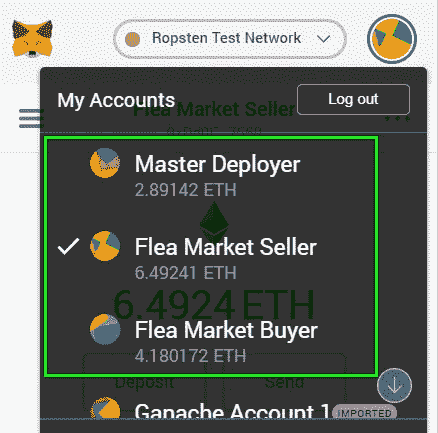
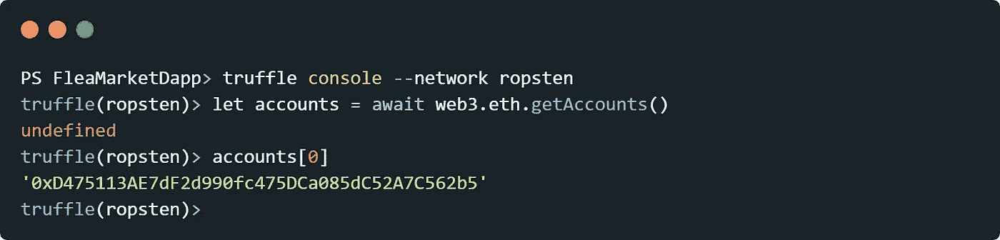
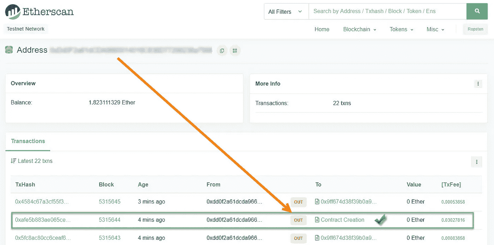
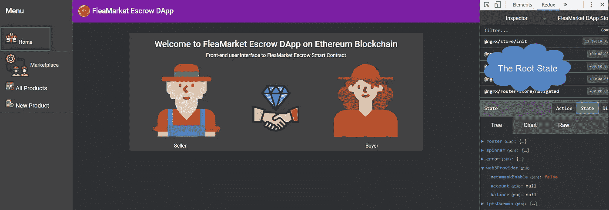
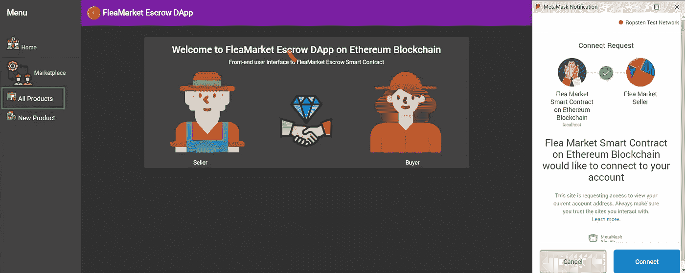

# 以太坊 DApp 用 Ethers.js 和 IPFS 用 Angular，Angular Material 和 NgRx。第一部分

> 原文：<https://betterprogramming.pub/ethereum-dapp-with-ethers-js-and-ipfs-using-angular-angular-material-and-ngrx-part-i-dcf049430cbf>


图片由来自 [Pixabay](https://pixabay.com/?utm_source=link-attribution&utm_medium=referral&utm_campaign=image&utm_content=3342242) 的[斯蒂芬·凯勒](https://pixabay.com/users/KELLEPICS-4893063/?utm_source=link-attribution&utm_medium=referral&utm_campaign=image&utm_content=3342242)拍摄

## 这是我们正在进行的系列工作的第一部分，演示了如何使用 Angular 和 NgRx 构建托管智能合约 DApp。

在[上一篇文章](https://medium.com/coinmonks/https-medium-com-alexanddanik-ethereum-dapp-with-angular-angular-material-and-ngrx-f2c91435871b)中，我们开始探索使用 Angular NgRx 构建以太坊智能合约 DApp 的技术。

在这一部分中，我们将深入研究一个更复杂、更有趣的名为 *FleaMarket* 的 Solidity Escrow 智能合同案例。建造这座 DApp 的灵感来源于[Jackson Ng](https://medium.com/coinmonks/smart-contract-explained-by-demonstration-93b06e938474)发表的[博客](https://medium.com/coinmonks/smart-contract-explained-by-demonstration-93b06e938474)。

# 设计 FleaMarket 托管智能合同

在我们出售的每个新产品上，`FleaMarket` 托管智能合约将产生一个新的*子*产品合约，由`SafeRemotePurchase` 智能合约表示。我们按照以下要求处理 Solidity CRUD 模式的实现:

*   每个产品都有一个唯一的密钥；
*   确保键的唯一性；
*   插入带有密钥标识符的产品；
*   通过产品的关键标识符检索产品；
*   通过产品的关键标识符删除产品；
*   获得现有产品的数量；
*   迭代产品。

幸运的是，[高清钱包提供商](https://medium.com/u/391d8f396987#readme):

```
npm install --save truffle-hdwallet-provider
```

在`truffle-config.js,`中添加 Ropsten 网络定义:

这里，`mnemonic`是一个由我们的 hdwallet 提供者使用的 12 个字的秘密助记短语，`infuraProjectToken` 是由 Infura 授权的`Project ID`。

[注意](https://github.com/trufflesuite/truffle-hdwallet-provider#readme)如果我们跳过`HDWalletProvider`构造函数中的最后一个参数，默认情况下，负责智能合约部署的帐户将是助记符生成的第一个帐户。如果我们传入一个特定的索引，它将使用那个地址(索引是从零开始的)。

# 部署和验证智能合同

出于本应用程序的目的，我们需要在 Ropsten 网络上有三个与我们的助记键相关联的测试帐户:



验证我们在区块链上使用的帐户是否正确的快速方法是打开 Truffle 控制台:



我们可以确认`account[0]`与我们在元掩码中指定的第一个帐户*主部署者*相同。为了将我们的智能合约部署到 Ropsten 网络，我们运行以下命令:

`truffle migrate --compile-all --reset --network ropsten`

为了验证智能合约已经部署在 Ropsten 区块链上，我们可以继续执行[以太扫描](https://ropsten.etherscan.io/)并检查我们在`HDWalletProvider`构造函数中指定的以太坊钱包帐户。



现在是检验我们智能合约的时候了。在我们运行测试之前，我们还需要从 [Chai 库](https://www.chaijs.com/)中安装另外两个依赖项:

```
npm install --save-dev chai
npm install --save-dev chai-as-promised
```

第一个库用于在 Chai 中使用断言。第二个是测试 JavaScript 承诺。

我们将把单元测试分成两个测试用例。在第一个测试用例中，我们希望确认 FleaMarket 智能契约已经成功部署，并且具有有效的地址和名称。

在第二个测试用例中，我们包括了验证智能合约功能的不同方面的方法。

# 设置角度项目

让我们从安装 Angular CLI 的最新主要版本开始。

`npm install -g @angular/cli`

要创建新的 Angular 项目，请在 Truffle 项目的根文件夹中打开一个新的终端，并运行以下 CLI 命令:

`ng new ClientApp --skip-install=true --minimal=true --style=css --routing=true --skipGit=true`

接下来，我们通过运行以下示意图安装[角形材料](https://material.angular.io/)、:

`ng add @angular/material`

让我们通过运行`navigation`示意图向应用程序添加一个导航组件。

`ng generate @angular/material:nav nav`

我们还可以使用材料示意图添加仪表板组件:

```
ng generate @angular/material:dashboard dashboard
```

接下来，我们安装 [Flex-layout](https://github.com/angular/flex-layout) 模块，这是一个优秀的布局引擎，有助于 CSS flex-box 特性:

`npm install @angular/flex-layout --save`

下一件事是连接 [@NgRx](https://ngrx.io/guide/store) 状态管理库，它位于我们应用程序设计的核心。

`npm install @ngrx/store, @ngrx/effects, @ngrx/router-store, @ngrx/entity, @ngrx/store-devtools, ngrx-store-freeze --save`

我们正在使用新的 NgRx 版本 8，它支持许多很酷的附加功能和未来功能，如`createAction`、`createReducer` 和`createEffect` 功能。Alex Okrushko 在他最近的文章中很好的解释了使用它们的好处。

接下来但同样重要的是，为了与以太坊区块链进行交互，我们将使用由 [RicMoo](https://medium.com/u/889387e95e0b?source=post_page-----dcf049430cbf--------------------------------) (毛利小五郎)*开发的 [Ethers.js](https://github.com/ethers-io/ethers.js/) 库。*

`npm install ethers --save`

# 根状态和保护

NgRx 中的应用程序状态是单个不可变的数据树结构。一旦`AppModule` 被加载，状态树将从根状态开始。

根状态在所有组件之间全局共享。随着更多的[延迟加载的角度模块](https://ultimatecourses.com/blog/ngrx-store-understanding-state-selectors)被加载到应用程序中，它的大小将继续增长。我们将根状态接口定义如下:

它由路由器状态、微调器状态、错误状态和 web3Provider 状态组成。

*   **微调器状态**负责切换在加载器组件中定义的加载指示器的显示。我们通过向商店分派以下动作来管理微调器状态:

*   **错误状态**正在监听动作:

它的副作用是:

另外，最近有一些关于如何正确管理 NgRx 存储中的加载或错误状态的非常有趣的讨论。关于这个话题请检查[这个](https://blog.angularindepth.com/handling-error-states-with-ngrx-6b16f6d12a08)和[这个](https://blog.angularindepth.com/having-fun-with-state-in-angular-a48932d2fa27)。

*   web3Provider 的根状态是乐趣的开始。它具有以下特性，

负责监控 DApp 和区块链以太坊之间的通道。

我们使用的方法非常类似于 GrandSchtroumpf 撰写的博客中讨论的想法。为了能够使用 MetaMask 与以太坊网络通信，我们需要设置相应的 ethers.js web3 提供程序。

首先，我们定义了可摇树`InjectionToken` `MetamaskWeb3Provider`，并指示它注入元掩码`windows.ethereum.`注入的以太坊 web3 提供者

然后，我们扩展 ethers . js[web 3 provider provider](https://docs.ethers.io/ethers.js/html/cookbook-providers.html?highlight=metamask)并将`MetamaskWeb3Provider`令牌注入其构造函数。为了访问区块链上的用户帐户，MetaMask 要求我们调用其本机 web3 提供者上的`enable()`方法。我们通过监听`'[Web3/Provider] Init]`动作来管理`metaMaskEnable$`效果。

这是幕后发生的事情。我们引入了`EthInitGuard`，我们构建它来控制路由解析过程。

警卫正在观察国家的财产。如果该值为假，警卫将调度`'[Web3/Provider] Init]`动作，向区块链广播连接以太坊的请求。

这种方法的最大好处是，我们现在可以控制用户批准的帐户访问的元掩码弹出窗口。

一旦我们编译并运行该应用程序，它将加载我们的根状态，并产生以下主页:



如果我们试图导航到由`EthInitGuard`保护的任何其他路线，它将触发来自 MetaMask 的批准弹出窗口，请求访问用户帐户的许可。



谢谢大家！请继续关注本博客系列的其他文章。

# 参考

*   [建筑以太坊 DApp 用棱角、棱角分明的材料和 NgRx](https://www.amazon.com/dp/B085B918LG) ，*可在*[*http://www.amazon.co.uk/kindlestore*](http://www.amazon.co.uk/kindlestore)*2020 年 3 月 5 日*由[亚历克斯·叶夫谢维奇](https://medium.com/u/4f27e57aa12a?source=post_page-----dcf049430cbf--------------------------------)

👍特别感谢[迈克·吉本斯](https://www.linkedin.com/in/mike-gibbons-8357a510a/)审阅本文。