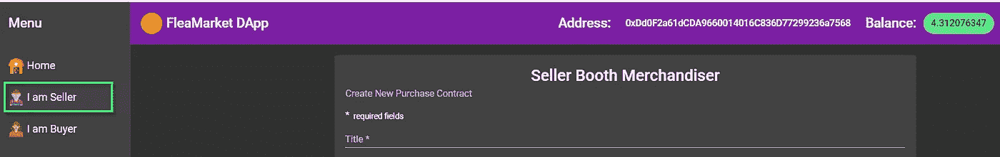
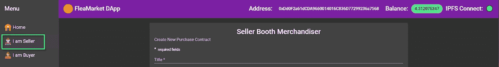

# 以太坊 DApp 用 Ethers.js 和 IPFS 用 Angular，Angular Material 和 NgRx。第二部分

> 原文：<https://betterprogramming.pub/ethereum-dapp-with-ethers-js-and-ipfs-using-angular-angular-material-and-ngrx-part-ii-3ad292a1dc16>


图片来自 [Pixabay](https://pixabay.com/?utm_source=link-attribution&utm_medium=referral&utm_campaign=image&utm_content=2750995) 的[斯蒂芬·凯勒](https://pixabay.com/users/KELLEPICS-4893063/?utm_source=link-attribution&utm_medium=referral&utm_campaign=image&utm_content=2750995)

在这个博客系列的第二部分，我们将继续为 FleaMarket 智能合约构建 [NgRx](https://ngrx.io/) 驱动的 DApp。

在[第一部分](https://medium.com/p/dcf049430cbf/edit)中，我们开始实现根状态，并引入了 [Ethers.js](https://github.com/ethers-io/ethers.js/) Web3 提供者来与[以太坊](https://www.ethereum.org/)区块链交互。

在本节中，我们将继续扩展全局状态，并将重点放在使用 Angular NgRx 在 [Infura](https://infura.io/) 上建立与 [IPFS](https://ipfs.io/) 的通信的过程上。我们将利用 IPFS 网络上传和存储图像文件，用于在我们建立的虚拟跳蚤市场 DApp 展位上宣传我们的商品。

# 扩展 Web3 提供程序状态的功能

让我们看看如何利用 NgRx 存储来显示用户帐户和当前余额信息。余额和账户属性在`web3Provider`状态中定义，它是全局状态树的一部分。

我们还利用最近在 NgRx v8 中引入的新的[创建函数](https://blog.angularindepth.com/ngrx-action-creators-redesigned-d396960e46da)来构造动作、缩减器和效果。

在我们成功地建立了与以太坊区块链的连接之后，我们发送了`'[Web3/Provider] Init Success’`动作。在`Web3ProviderEffects` 类中，我们定义了两个监听这个动作的效果:

在`Web3ProviderEffects` 构造函数中，我们还注入了`ProviderService`，它允许我们通过从 [Ethers.js](https://docs.ethers.io/ethers.js/html/index.html) 库中调用相应的 API 来检索当前账户的地址和余额:

在收到`'[Web3/Provider] Init Success'`通知后，这两个效果都将触发对服务的调用，以从包装在`Promise`中的区块链中检索相应的值。

然后，我们使用 RxJS `from`操作符将其转换为可观察值，并使用`map`操作符将其展平，以创建`balanceSuccess`和`account`操作并将其发送回商店。

在组件`Nav`中，我们使用选择器和异步管道函数，因此我们可以检索全局状态的帐户和余额属性。

```
*this*.account$ = *this*.store.pipe(select(fromRoot.getAccount));
*this*.balance$ = *this*.store.pipe(select(fromRoot.getBalance));
```

本质上，一旦用户确认连接到区块链，选择器将发出当前帐户和余额状态值，然后观察并在工具栏上显示这些值。



# 使用 Angular NgRx 管理 Infura 上的 IPFS 守护程序

安全远程购买智能合同定义了一个状态变量`ipfsHash`，该变量存储产品映像文件的 IPFS 哈希值。

使用 IPFS 的重要优势在于，它确保了两个文件以及存储在 IPFS 网络上的相应哈希代码都是不可变的。这意味着不可能在不改变图像文件的散列的情况下改变图像文件。

我们使用 Infura 进入 IPFS。为了能够与 Infura 网络上的远程 IPFS 节点通信，我们需要安装 [IPFS HTTP 客户端库](https://github.com/ipfs/js-ipfs-http-client) `ipfs-http-client.`这需要创建一个自定义 webpack 配置文件`webpack.config.js`来告诉 angular 在编译中包含加密`node`模块。

首先安装自定义 Webpack 生成器:

`npm install -save-dev @angular-builders/custom-webpack`

然后，我们使用以下上下文向项目添加一个`extra-webpack.config.js`文件:

最后，修改`angular.js`文件以包含定制构建器:

接下来，让我们设置到运行在 Infura 上的 IPFS 节点的连接。用实例化`IpfsHttpClient`对象的工厂函数创建一个新的`InjectionToken`。

`ipfsToken`令牌被传递给`IpfsDaemonService`服务类。我们声明一个方法，通过检索它的`version`对象来验证到 IPFS 节点的连接。

我们还需要在`Effect`类中注入服务。

在`onConnectEffect`效果中，我们使用了`ROOT_EFFECTS_INIT`生命周期挂钩，它是在所有根效果都被添加后触发的。

在成功验证 IPFS 节点准备就绪后，我们调度`[IPFS/Daemon] Connect Success`动作，并将全局状态属性`connectStatus`更新为`true`:

```
export interface IpfsDaemonState {
   connectStatus: boolean;
}
```

这种变化将被存储缩减器中相应的选择器自动拾取，来自`Nav`组件的异步管道将更新工具栏上的 IPFS Infura 连接状态。



感谢阅读；请继续关注本博客系列的其他文章。

# 参考资料:

*   [建筑以太坊 DApp 用有角的、有角的材料和 NgRx](https://www.amazon.com/dp/B085B918LG) ，*可用*[*http://www.amazon.co.uk/kindlestore*](http://www.amazon.co.uk/kindlestore)*2020 年 3 月 5 日*作者[亚历克斯·叶夫谢维奇](https://medium.com/u/4f27e57aa12a?source=post_page-----3ad292a1dc16--------------------------------)