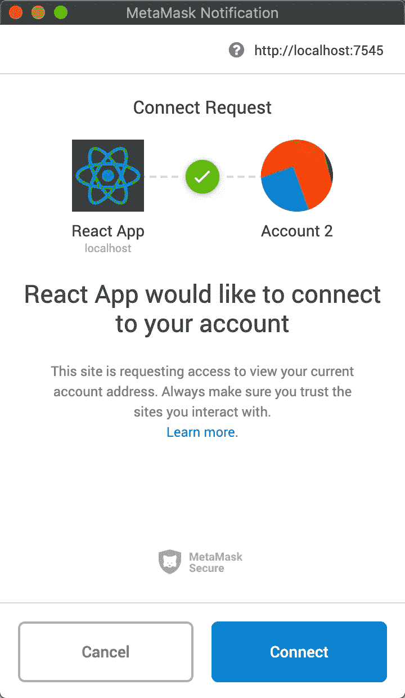

# 以太坊 DApps:如何监听事件

> 原文：<https://betterprogramming.pub/ethereum-dapps-how-to-listen-for-events-c4fa1a67cf81>

## 订阅智能合同事件的 3 个步骤

照片由 [Clifford 摄影](https://unsplash.com/@cliffordgatewood?utm_source=unsplash&utm_medium=referral&utm_content=creditCopyText)在 [Unsplash](https://unsplash.com/s/photos/blockchain?utm_source=unsplash&utm_medium=referral&utm_content=creditCopyText)

*先决条件:了解 Node.js，并对区块链和以太坊智能合约有基本了解*

# 介绍

分散式应用(DApps)的最大问题之一是用户体验。DApps 可能很笨重，很难共事。在您的 DApp 中提供实时、最新的信息至关重要。

以下是订阅智能合同事件的方法，这样您的 DApp 就可以始终显示来自区块链的最新信息。

# 1.加载网站 3

首先，我们需要通过在浏览器中加载 web3 来将 MetaMask 连接到我们的 DApp。图 1 展示了我们如何做到这一点。

图 1:加载 web3

第 4 行显示了尝试将 MetaMask 连接到我们的 DApp 的命令。当调用它时，MetaMask 将打开一个请求连接的提示窗口，如图 2 所示。

图 2:元掩码提示

一旦被接受，您的 DApp 就连接上了。

**额外提示:**加载到区块链时使用[这种模式](https://medium.com/better-programming/ethereum-dapps-how-to-load-the-blockchain-8756ca0fa0d1)可以获得更好的用户体验。

# 2.加载智能合同

接下来，我们需要加载智能契约，它发出我们想要订阅的事件。对于这个例子，我们有一个名为`MyContract`的智能契约，它发出一个名为`MyEvent`的事件。

图 3:加载智能契约

图 3 显示了我们如何将智能合同实例加载到我们的 DApp 中。在第 1 行，我们导入编译后的智能合约 JSON 文件。第 3 行和第 4 行收集网络细节。然后，第 5 行通过用我们的网络细节调用`web.eth.Contract()`来初始化我们的智能合同实例。我们现在可以使用`myContract`实例与区块链上的智能合约进行交互。

# 3.订阅

使用我们在步骤 2 中创建的实例，我们可以订阅监听它发出的任何事件。

图 4:订阅“MyEvent”

如前所述，我们想要监听的事件被称为`MyEvent`，图 4 向我们展示了如何监听。我们的`myContract`实例有一个名为`events`的访问器，我们可以从这里访问`MyEvent`。这是一个返回承诺的异步函数，每次发出`MyEvent`时都会调用它。

第 3 行定义了从承诺返回数据后会发生什么。在这里，我们只是将事件值记录到控制台，但在这里，我们会编写警报或界面更新等功能，以便向用户更新刚刚发生的事件。

使用这个逻辑，从`MyContract`发出的每个`MyEvent`都会在这里被捕获。

# 进一步阅读

 [## 区块链开发资源马上跟进

### 学习区块链、以太坊和 DApp 开发的资源列表

medium.com](https://medium.com/blockcentric/blockchain-development-resources-b44b752f3248)