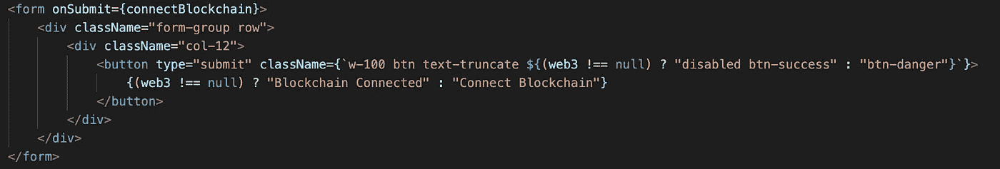
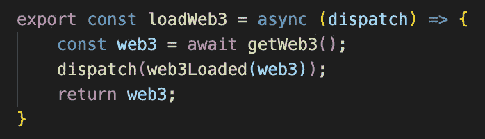
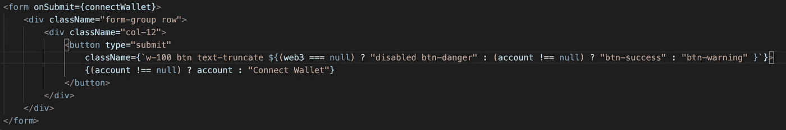
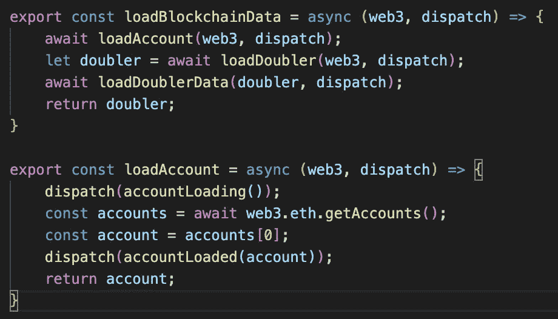

# 以太坊 DApps:如何加载区块链

> 原文：<https://betterprogramming.pub/ethereum-dapps-how-to-load-the-blockchain-8756ca0fa0d1>

## 使用[松露](https://www.trufflesuite.com/)、React、Redux、 [Web3](https://web3js.readthedocs.io/en/v1.2.6/) 和[元掩码](https://metamask.io/)的良好用户体验实践


由 [Tumisu](https://pixabay.com/users/tumisu-148124/) 在 [Pixabay](https://www.needpix.com/photo/1213172/blockchain-block-chain-technology-digital-finance-business-cryptocurrency-electronic) 上拍摄的图像

# 介绍

*先决条件:了解* [*反应*](https://reactjs.org/) *、* [*重复、*](https://redux.js.org/introduction/getting-started/) *以及基本的区块链/DApp 概念。*

Truffle 使开发人员能够创建具有区块链后端的全栈应用程序。在这个例子中，我使用 Truffle 来实现 React 和 Redux 前端，以及区块链后端。

由于这个领域还处于起步阶段，而且与所有网络用户相比，用户基数很小，所以在浏览器中与 Web3 交互还没有一个被广泛接受的标准。这里有一个简单的方法来确保用户在使用以太坊 DApp 时有良好的体验。

# 加载区块链

默认情况下，页面一加载， [React Truffle 框](https://www.trufflesuite.com/boxes/react)就会尝试连接到 Web3。如果用户未登录元掩码或配置到未部署 DApp 的区块链，这会抑制用户体验。

## 提议:➼帐户➼互动区块链

我建议采用以下模式来加载 DApp，而不是一次性加载所有内容:➼➼区块链账户交互。每一步都与其他步骤截然不同，为用户提供了清晰的视觉反馈。

*   步骤 1:加载区块链
*   第 2 步:加载帐户
*   第三步:实现互动

在本例中，有一个合同，以及该合同的 DApp 前端。在用户可以与合同交互之前，他们需要连接到区块链(我这里使用的是`localhost`区块链，由 [Ganache](https://www.trufflesuite.com/ganache) 提供)。

这里发生了几件事:

*   当页面加载时，不会加载 Web3
*   **区块链** —用户点击“连接区块链”将网页连接到他们在 MetaMask 中选择的区块链
*   **账户** —一旦加载，应用程序提供第二个按钮来连接他们的钱包
*   **交互** —用户现在能够与 DApp 交互

## 连接区块链



图 1: React 渲染“连接区块链”按钮

使用 [Bootstrap](https://getbootstrap.com/) ，我们可以向用户提供关于他们选择的区块链是否连接的视觉反馈。在图 1 中，`className`包括尚未加载的`btn-danger`和已加载的`btn-success`和`disabled`类。Web3 代表一个 Redux 状态选择器。

在图 1 中，`connectBlockchain` `onSubmit`动作通过交互获取 Web3 实例，如图 2 所示。它调度`web3Loaded(web3)`缩减器，该缩减器将 Web3 实例保存到状态。



图 2:将 Web3 加载到状态

## 连接账户



图 3:连接钱包

图 3 显示了一个类似的渲染，其中我们根据是否已经加载了一个帐户，对“Connect Wallet”按钮应用了类似的规则。但是，这一次，如果加载了 Web3，我们将对是否加载帐户应用一个额外的条件:

```
(account !== null) ? “btn-success” : “btn-warning”
```

`connectWallet` `onSubmit`动作是一个调用名为`loadBlockchainData()`的交互的函数，如图 4 所示。



图 4:加载区块链数据

图 4 显示了`loadBlockchainData()`，它依次在其第一行调用`loadAccount()`。该函数获取 MetaMask 提供的帐户，并调度一个名为`accountLoaded()`的动作，该动作通过一个 reducer 将帐户存储在我们的状态中。

一旦这些步骤完成，界面的其余部分就启用了，用户可以自由地与 DApp 交互。

# 结论

将 MetaMask 与 DApps 一起使用可能会带来紧张的体验，这会阻止用户与您的 DApp 进行交互。使用类似`*Blockchain-Account-Interaction*` 的简单流程来构建你的 DApps。

感谢阅读！

[](https://medium.com/blockcentric/blockchain-development-resources-b44b752f3248) [## 区块链开发资源马上跟进

### 学习区块链、以太坊和 DApp 开发的资源列表

medium.com](https://medium.com/blockcentric/blockchain-development-resources-b44b752f3248)