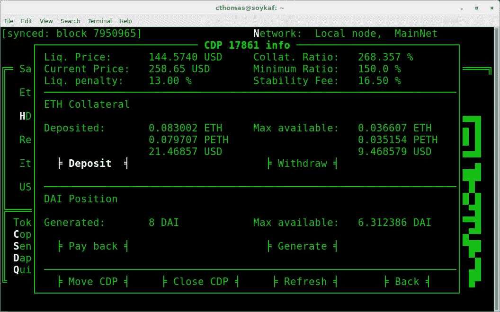

# 以太坊 DApps 没有网络

> 原文：<https://betterprogramming.pub/ethereum-dapps-without-the-web-309f09513b64>

## 阴影之地——快速完成以太坊最常见任务的有效方式

当我为[以太坊](https://www.ethereum.org/)写智能合同时，我想起了 1997 年我第一次开始编写 ANSI C 的时候。有一种离硬件足够近可以触摸到它的感觉。我们操纵数据类型，我们从每条指令中榨取尽可能多的效率，我们尽可能紧密地压缩数据。

这种思维方式——效率程序员的思维方式——对于来自“后端”的合同制程序员来说是很常见的。这种程序员原型的另一个共同特点是，我们通常最终会把用户界面交给别人。

作为后端人员，当我们有自己的想法想要实现时，这可能会成为一个问题。这个想法的实现变得依赖于别人，比我们希望的要早得多。

我写了[暗影之地](https://github.com/kayagoban/shadowlands)来解决这个问题。用 [Python](http://python.org) 写了一个下午的代码，就有可能建立一个完全可服务的 DApp，而不用接触网络浏览器。

我从`cdp.shadowlands.eth`开始 Maker CDP 门户的[阴影之地版本:](https://github.com/kayagoban/shadowlands_cdp_manager)

我并不是说你可以在一个下午内编写 CDP 门户，但是你可以编写类似于 [Burninator](https://github.com/kayagoban/burninator) ( `burninator.eth`)的东西——一个我为之编写的游戏，并在 [Shadowlands 编程教程中引用。](https://shadowlands.readthedocs.io/en/latest/Tutorial.html)

除了作为一个编写 DApps 的平台之外，我还试图让 Shadowlands 成为一个非常有效的方式来快速完成以太坊上最常见的任务——发送以太和令牌，以及跟踪和操纵交易。我还增加了原生的 Uniswap 支持。

我在许可的 MIT 许可下向社区提供这个工具，希望它能鼓励更多人使用这个非凡的平台。