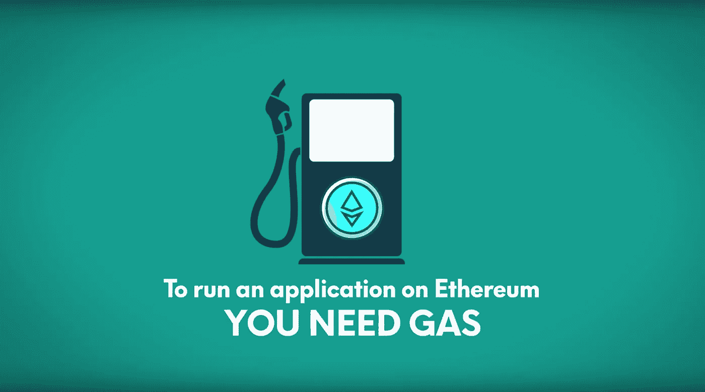
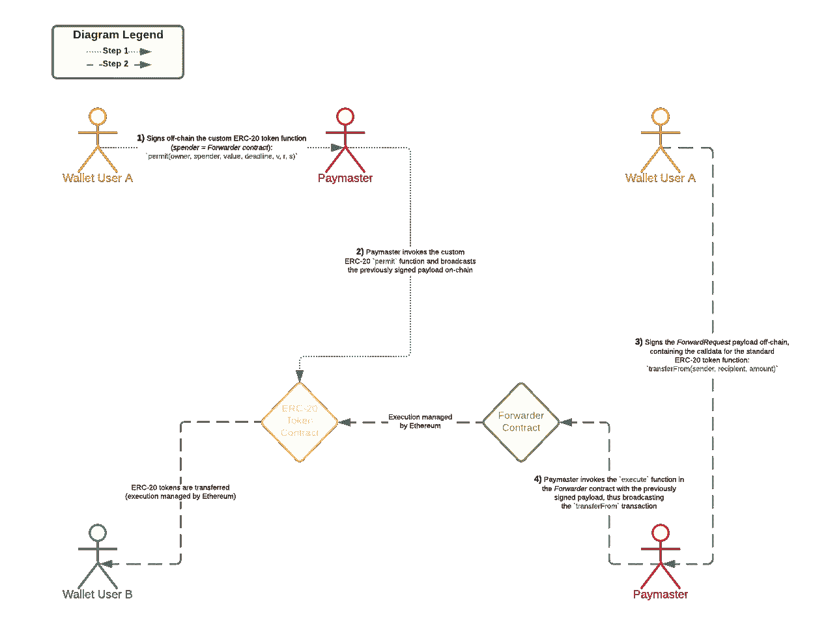

# 了解以太坊 ERC-20 元交易

> 原文：<https://betterprogramming.pub/ethereum-erc-20-meta-transactions-4cacbb3630ee>

## 在本指南中，我们将在 [ERC-20](https://eips.ethereum.org/EIPS/eip-20) 代币的背景下探讨无汽油交易的概念，也就是通常所说的 *meta-* 交易，其中**用户不需要支付他们的汽油费**。



[原始来源](https://www.ethos.io/what-is-ethereum-gas)

> *“哦，一个非常酷的项目在我的以太坊钱包上空投了一个令牌，但不幸的是，现在我无法将它转移到我的主钱包，因为我在这个地址上没有任何以太。那真的很烂！”*

如果您对此很熟悉，您可以跳过下一部分。然而，如果整件事对你来说听起来很神秘，这里是以太坊上气体挑战的简要说明。

气体是以太世界的关键。打个比方，是燃料让它运转，就像汽车需要汽油一样。

总之，gas 是指测量在以太坊网络上执行特定操作(例如发送以太网(ETH)或令牌)所需的计算工作量的单位。

由于每一笔以太坊交易都需要计算资源来执行，所以每一笔交易都需要费用(=俗称的气价和交易消耗的气的倍数)。

燃气费用以太坊的本币 ETH 支付。此外，天然气价格通常用一个叫做 *gwei* 的单位来表示，gwei 本身就是 ETH 的一个单位——每个 gwei 等于 0.000000001 ETH(或 10⁻⁹ ETH)。

例如，不要说你的汽油值 0.000000001 ETH，你通常会说你的汽油值 1 gwei。gwei 这个词本身的意思是千兆位，它等于 1'000'000'000 位(1 位= 10⁻ ⁸联邦理工学院)。卫本身——以 b 币的发明者的名字命名——是 ETH 的最小单位。

但是为什么气费实际存在呢？简而言之，燃气费有助于保持以太坊网络的安全。通过对网络上执行的每项计算收取费用，我们可以防止不良行为者在网络上发送垃圾邮件。为了进一步深入这个话题，我可以推荐[这个](https://ethereum.org/en/developers/docs/gas/)参考。

因此，我们到目前为止了解到，以太坊区块链上的每个(写)交互都需要交互地址上的少量 ETH。

从 UX 的角度来看，对于令牌持有者来说，这听起来真的很可怕，因为用户首先需要通过集中交换获得 ETH，并相应地将其转移到钱包地址。但是，等等，难道不是这样的吗——非常简单——在最基本的区块链级别，它只是一个验证签名有效载荷的问题，即链外加密？

啊，是的，听起来不错！那么，钱包用户只需在链外签署有效载荷，而其他人(如运营商)广播并支付交易费用，这种情况如何？

这就是我们的解决方案:**元事务**。

# 背景

一个*元事务*是一个常规的以太坊事务，它包含另一个事务，即实际事务。实际交易由用户签名，然后发送给运营商或类似的机构；不需要气体和区块链相互作用。运营商接受这一签署的交易，并将其提交给自己支付费用的区块链。 *forwarding* 智能合约确保实际交易上有有效的签名，然后执行它。

在 [ERC-20](https://eips.ethereum.org/EIPS/eip-20) 令牌转移的背景下，我们还必须意识到以下重要的治理层:可以说，ERC-20 令牌成功的主要原因之一在于`[approve](https://docs.openzeppelin.com/contracts/4.x/api/token/erc20#ERC20-approve-address-uint256-)`和`[transferFrom](https://docs.openzeppelin.com/contracts/4.x/api/token/erc20#ERC20-transferFrom-address-address-uint256-)`之间的相互作用，这使得令牌不仅可以在[外部拥有的账户](https://ethdocs.org/en/latest/contracts-and-transactions/account-types-gas-and-transactions.html) (EOA)之间转移，还可以在特定于应用程序的条件下用于其他合同，方法是将`msg.sender`抽象为令牌访问控制的定义机制。

然而，这种设计的一个限制因素源于 ERC-20 `approve`函数本身是根据`msg.sender`定义的。这意味着用户涉及 ERC-20 代币的初始动作必须由 EOA 执行。如果用户需要与智能合约交互，那么他们需要进行两个事务(`approve`和智能合约调用，后者将在内部调用`transferFrom`)。即使在向另一个人付款的简单用例中，他们也需要持有 ETH 来支付交易气成本。

为了解决这个挑战，我们可以用一个新的函数`[permit](https://docs.openzeppelin.com/contracts/4.x/api/token/erc20#ERC20Permit-permit-address-address-uint256-uint256-uint8-bytes32-bytes32-)`来扩展 ERC-20 令牌契约，该函数允许用户使用签名消息(通过`[secp256k1](https://en.bitcoin.it/wiki/Secp256k1)`签名)来修改许可映射，而不是通过`msg.sender`。或者换句话说，`permit`方法可用于通过提交由账户签名的消息来改变账户的 ERC-20 津贴(参见`[IERC20.allowance](https://docs.openzeppelin.com/contracts/4.x/api/token/erc20#IERC20-allowance-address-address-)`)。通过不依赖`[IERC20.approve](https://docs.openzeppelin.com/contracts/4.x/api/token/erc20#IERC20-approve-address-uint256-)`，令牌持有者账户不需要发送交易，因此根本不需要持有 ETH。

为了改善用户体验，签名数据的结构遵循 [EIP-712](https://eips.ethereum.org/EIPS/eip-712) ，这已经在主要的 RPC &钱包提供商中广泛采用。

这种设置将我们引向以下架构:



ERC 20 元事务架构

# EIP-712 —以太坊类型的结构化数据哈希和签名

[EIP-712](https://eips.ethereum.org/EIPS/eip-712) 是一个用于散列和签名类型化结构化数据的标准。EIP 中指定的编码非常通用，在 Solidity 中这样的通用实现是不可行的，因此我们的合同本身并不实现编码。协议需要使用`abi.encode`和`keccak256`的组合来实现它们在契约中需要的特定于类型的编码。

我们标为`Forwarder.sol`的示例智能契约实现了 EIP-712 域分隔符(`[_domainSeparatorV4](https://docs.openzeppelin.com/contracts/4.x/api/utils#EIP712-_domainSeparatorV4--)`)，它被用作编码方案的一部分，编码的最后一步是获得消息摘要，然后通过`[ECDSA](https://docs.openzeppelin.com/contracts/4.x/api/utils#ECDSA)` ( `[_hashTypedDataV4](https://docs.openzeppelin.com/contracts/4.x/api/utils#EIP712-_hashTypedDataV4-bytes32-)`)对消息摘要进行签名。

域分隔符的 [OpenZeppelin 实现](https://docs.openzeppelin.com/contracts/4.x/api/utils#EIP712)被设计为尽可能高效，同时仍然正确地更新链 ID，以防止对链的最终分支的重放攻击。

**注意:**smart contract forwarder . sol 实现称为“v4”的编码版本，由 MetaMask 中的 JSON RPC 方法`[eth_signTypedDataV4](https://docs.metamask.io/guide/signing-data.html#sign-typed-data-v4)` [实现。](https://docs.metamask.io/guide/signing-data.html#sign-typed-data-v4)

# **Forwarder 契约——以太坊上可扩展元交易转发的智能契约**

智能合同`Forwarder.sol`扩展了 [EIP-2770](https://eips.ethereum.org/EIPS/eip-2770) ，并包含以下核心功能:

*   `verify`:基于类型化的结构化数据验证签名。

```
/**
 * [@dev](http://twitter.com/dev) Verifies the signature based on typed structured data. 
 * See [https://eips.ethereum.org/EIPS/eip-712](https://eips.ethereum.org/EIPS/eip-712)
 */
function **verify**(ForwardRequest calldata req, bytes calldata signature) public view returns (bool) {
    address signer = _hashTypedDataV4(keccak256(abi.encode(
        _TYPEHASH,
        req.from,
        req.to,
        req.value,
        req.gas,
        req.nonce,
        keccak256(req.data)
    ))).recover(signature);
    return _nonces[req.from] == req.nonce && signer == req.from;
}
```

*   `execute`:通过底层调用执行元事务。

```
/**
 * [@dev](http://twitter.com/dev) Main function; executes the meta-transaction via a low-level call.
 */
function **execute**(ForwardRequest calldata req, bytes calldata signature) public payable whenNotPaused() returns (bool, bytes memory) {
    require(_senderWhitelist[msg.sender], "AwlForwarder: sender of meta-transaction is not whitelisted");
    require(verify(req, signature), "AwlForwarder: signature does not match request");
    _nonces[req.from] = req.nonce + 1; // solhint-disable-next-line avoid-low-level-calls
    (bool success, bytes memory returndata) = req.to.call{gas: req.gas, value: req.value}(abi.encodePacked(req.data, req.from));

    if (!success) {
        // solhint-disable-next-line no-inline-assembly
        assembly {
        returndatacopy(0, 0, returndatasize())
        revert(0, returndatasize())
        }
    } /**
     * [@dev](http://twitter.com/dev) Validates that the relayer/forwarder EOA has sent enough gas for the call.
     * See [https://ronan.eth.link/blog/ethereum-gas-dangers/](https://ronan.eth.link/blog/ethereum-gas-dangers/).
     */
    assert(gasleft() > req.gas / 63); emit MetaTransactionExecuted(req.from, req.to, req.data); return (success, returndata);
}
```

> 完整的智能合同可在[这里](https://github.com/pcaversaccio/metatx/blob/main/contracts/Forwarder.sol)找到。

# 安全考虑

为了确保重放保护，我们跟踪链上的一个`nonce`映射。此外，为了防止任何人传播具有潜在恶意的交易，`Forwarder.sol`智能合约为`execute`功能实现了一个白名单。此外，智能契约是`[Ownable](https://docs.openzeppelin.com/contracts/4.x/api/access#Ownable)`，它提供了一个基本的访问控制机制，其中有一个 EOA(一个`owner`，它被授予对特定功能(即`addSenderToWhitelist`、`removeSenderFromWhitelist`、`killForwarder`、`pause`、`unpause`)的独占访问权。此外，智能合约功能`execute`为`[Pausable](https://docs.openzeppelin.com/contracts/4.x/api/security#Pausable)`，即实现可由`owner`触发的紧急停止机制。最后，作为紧急备份，通过功能`killForwarder`执行`selfdestruct`操作。

*   **注 1:** 白名单中的 eoa 在发送交易前仔细检查编码(用户签名)`calldata`非常重要。
*   **注 2:** `calldata`是存储函数外部调用数据的地方。函数可以在内部调用，例如从契约内部调用，也可以在外部调用。当函数的可见性是外部的时，只有外部契约可以调用该函数。当这样的外部呼叫发生时，该呼叫的数据存储在`calldata`中。
*   **注 3:** 对于函数`addSenderToWhitelist`和`killForwarder`，我们并没有实现一个专用的严格策略来从不允许零地址`0x0000000000000000000000000000000000000000`。这样做的原因是，首先，这些功能受到了`[Ownable](https://docs.openzeppelin.com/contracts/4.x/api/access#Ownable)`的保护，其次，可以说像`0x00000000000000000000000000000000000001`这样的地址同样危险，但我们对此无动于衷。

# “允许”和“执行”的签名用户数据(输入参数)

我准备了一个基于 JavaScript 的示例脚本，可以在这里访问[。](https://github.com/pcaversaccio/metatx/blob/main/scripts/sign-data.js)

**注:**函数调用的`calldata`的前四个字节指定要调用的函数。它是函数签名的`keccak256`散列的第一个(左，高位字节)四个字节。因此，由于 1 个半字节(4 位)可以由一个十六进制数字表示，所以我们有 4 个字节= 8 个十六进制数字。

# 结束语

需要强调的是，整个代码库都没有经过审计，所以使用时风险自担(并且首先在一个实时测试网络上进行测试)。

此外，有人可能会说，由于可暂停的功能，像`killForwarder`这样的定制函数是不必要的。在这里，我并不要求完美的智能契约，而是提供了一个良好的平台，其中考虑了足够多的安全方面(如重播保护)。

此外，一套完整的单元测试是可用的[这里](https://github.com/pcaversaccio/metatx/blob/main/test/Forwarder.test.js)实现了 100%的测试覆盖率。然而，非常重要的是，100%的测试覆盖率并不意味着没有漏洞。真正重要的是测试本身的质量和范围。

最终，上述方法绝不是路的尽头，但是存在潜在的弱点，例如关于支付者的分散化。

一个解决这个问题并实现了高级实现架构的项目是[以太坊加油站网络](https://docs.opengsn.org) (GSN)。去看看吧！

# 更多参考

[1][https://github.com/pcaversaccio/metatx](https://github.com/pcaversaccio/metatx)

[2][https://soliditydeveloper.com/meta-transactions](https://soliditydeveloper.com/meta-transactions)

[3]https://docs.openzeppelin.com/contracts/4.x/api/metatx

[4]https://docs.opengsn.org

[5][https://eips.ethereum.org/EIPS/eip-2612](https://eips.ethereum.org/EIPS/eip-2612)

[https://eips.ethereum.org/EIPS/eip-712](https://eips.ethereum.org/EIPS/eip-712)