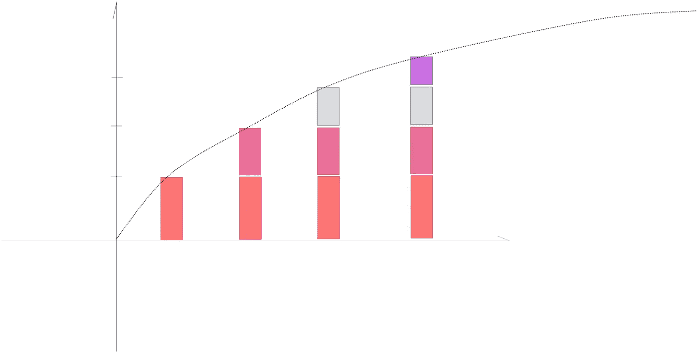
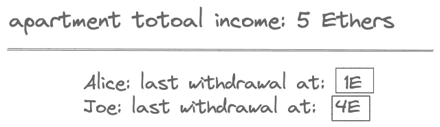
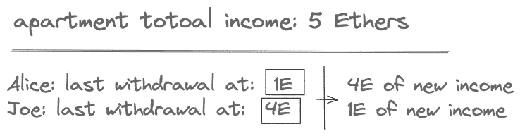
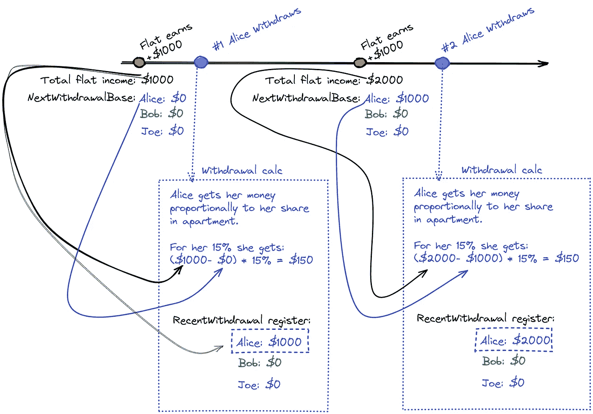
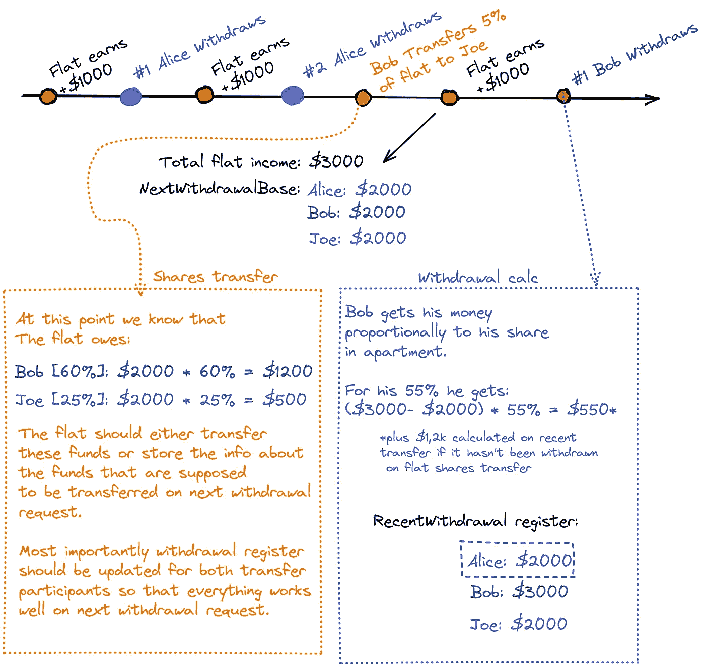

# 以太坊教程:编写房地产智能合同

> 原文：<https://betterprogramming.pub/ethereum-tutorial-real-estate-smart-contract-in-solidity-75a6c47023ce>

## 查看 solidity 智能合同开发流程。根据 TDD 的单元测试

> 免责声明:
> 
> 这里介绍的解决方案不是生产就绪的，而是一个教育演示。我自己也在学习，所以导致严重漏洞的错误可能会出现在显示的解决方案中。请小心提及此事，因为可能涉及各种风险，包括损失您和您的用户的资金。
> 
> **请记住，部署智能合同不可避免地会带来一些漏洞和风险，可能会被利用来攻击您和您的解决方案。**

下面我展示了我如何编写智能合约的整个过程，以及我对这个问题的看法。

注:要浏览分红智能合约的快速摘要，[查看我的另一篇文章](https://rotynski.dev/7-key-takeaways-from-my-first-implementation-of-dividend-paying-token/)。

# 问题定义

1.  这套公寓太贵了，一个人买不起。一群朋友或投资者可以一起购买一套公寓，然后按比例分享投资收益。
2.  住在公寓的任何人都直接向公寓智能合同地址支付租金。
3.  这种租金可以由任何股东在任何时候根据股份数量按比例提取。

# 工具

我将在安装安全帽的情况下使用`vscode`。我将在`chai.js`中编写单元测试，并附带一个现成的安全帽。我假设我将使用`openzepellin's erc20`实现，并将 100 股中的每一股视为一枚硬币。

# 贮藏室ˌ仓库

Github repository 提供了一条获得最终结果的途径，这样每一步(单元测试)都可以单独提交，测试用例描述作为提交消息。

[Github 库](https://github.com/piorot/solidity-tdd)

# 内容(单元测试标题):

1.  合同创建人应该有 100 份公寓的股份。
2.  应该可以将一些份额转让给另一个用户。
3.  在公寓合同中应该有可能支付租金并存入乙醚
4.  所有者应该能够收回资源支付租金
5.  股东应该能够收回作为租金支付资源
6.  非股东退股的企图应予以恢复
7.  公寓股东可以按其股份比例提取资源
8.  应该不可能收回超过一个人拥有的
9.  只要中间有收入，应该可以多次提取
10.  每次提款都应该根据新的收入来计算，而不是总余额
11.  股份转让应收回双方的流动资金

# 测试案例 1:合同创建者应该拥有公寓的 100 份股份。

↘️ [在 github 上看到这个](https://github.com/piorot/solidity-tdd/commit/7f1672ed36cd82cd7e3da89fd30d891c574d36cb)

让我们从测试用例开始。我们假设公寓只有 100 份股份，所有这些股份最初都归合同所有者所有，他也是房地产的最初所有者。

随着`ERC20`而来的是`_mint`这个函数在这种情况下非常方便，因为它不需要任何努力来完成第一个测试。

# 测试用例 2:应该可以将一些共享转移给另一个用户

↘️ [在 github 上看到这个](https://github.com/piorot/solidity-tdd/commit/dd210bb9cdd12e8fb452a1ca038fac869f59b70e)

这个测试案例表明公寓**的股份可以简单地转让**给其他人。例如第二投资者。

就像之前在问题上下文中描述的那样，一个人买不起自己的公寓，所以他们邀请其他人(股东或共同投资者)来分担成本和收入。

智能合约方面不需要实现，因为它也是所有的`ERC20`标准。

# 测试用例 3:应该可以在公寓合同中支付租金并存入以太网

↘️ [在 github 上看到这个](https://github.com/piorot/solidity-tdd/commit/71d6021b13b02b92d5f8d838b8f7f5c9355d6500)

这个问题的全部意义在于让投资者赚到钱。他们想通过购买公寓并出租来赚钱。智能契约的美妙之处在于它内部实现了所有的逻辑。如果合同获得任何资金，它将根据编程逻辑进行管理。没有必要去银行提取现金，然后分给任何一个投资者。智能合约将实现这一点，使整个现金流:

1.  **方便** —无需任何操作，引入自动化
2.  不可信的——没有人拥有全部的现金，哪怕是一瞬间

这个测试用例确保智能契约中有一个方法，每当调用资金转移时都会调用这个方法。这个方法将会是`receive`并且用一个`external`修改器来修饰。在[接收关键字](https://docs.soliditylang.org/en/latest/060-breaking-changes.html#semantic-and-syntactic-changes)下有更多关于这个函数背后的逻辑

所以让我们看看代码和单元测试用例

新方法“接收”和单元测试，确保其正常工作

正如我们在测试用例中看到的，图片`Bob`中引入了另一个玩家。他不是投资者。他是公寓的客人，他直接向智能合同地址支付住宿费用。智能合同余额会增加，并且可以查询。接下来，这些付费资金将在投资者之间按比例分配。敬请期待！

# 测试用例 4:所有者应该能够收回作为租金支付的资源

↘️ [在 github 上看到这个](https://github.com/piorot/solidity-tdd/commit/13e7f59b4989783718bb8efe6abaf32e8dda228a)

这一课是关于从智能合约功能中提取资金的几个提交的开始。一般来说，目标是能够允许股东(并且仅仅是股东)从智能合约中提取适当数量的资金。它应该是安全的，这样股东就不能调用这个函数无限地消耗合同资金，并且总是允许提取**适量的资金**。计算正确的资金数额似乎很容易，但需要分析几个案例，为了简单起见，将通过几个测试案例来讨论。一次一个细节。

在本课中，只添加了起点。没有任何安全机制，听之任之将会有严重的后果，如失去所有资金，因为任何人都可以打电话撤回所有资金，而不涉及数学。

让我们来看看退出方法，这只是一个起点。

智能合约方法的单元测试，确保被调用方余额已更改

相应的单元测试确保被调用方在交易后的余额大于交易前的余额。

# 测试用例 5:股东应该能够收回作为租金支付的资源

↘️ [在 github 上看到这个](https://github.com/piorot/solidity-tdd/commit/51143eece83180751e6a4192b9d84eea277964ec)

这个增量没什么大不了的。我们添加了一些防止滥用取款功能的保护措施。在前面的课程中，每个人都被允许调用这个方法并接管所有的资金。很可怕，是吧？。现在，我们只限于那些至少有一个份额的人(更准确地说是大于零)。让我们记住，它仍然没有提供安全保障，因为现在任何股东都可以在任何时候耗尽智能合同。这比允许对任何人做同样的事情要好一点点。但是不多:)

在这里，我们测试不是所有者而是股东可以要求撤回，她的余额增加

# 测试用例 6:非股东退出的尝试应该被恢复

↘️ [在 github 上看到这个](https://github.com/piorot/solidity-tdd/commit/271c160466999e03a3edd4c92b0df278c383cf3e)

这里没什么好讨论的。唯一的新东西是当一个`unauthorized`人调用这个方法时有意义的消息。这里最重要的是负责确保这个条件的单元测试。只有股东才能退出，如果你不是股东，任何退出的企图都应该被拒绝。冷却安全帽允许这样单元测试，该单元测试明确地测试一些特定的调用被拒绝。我已经在这里写了关于测试[交易拒绝的文章。](https://rotynski.dev/unit-testing-transaction-errors-and-reverts/)

# 测试案例 7:公寓股东能够按其股份比例提取资源

↘️ [在 github 上看到这个](https://github.com/piorot/solidity-tdd/commit/ab3d0a4875de011baf14196f6250785c0836aec5)

好了，现在来做一些数学计算。我们不允许任何人提取所有资金，只能按公寓股份的比例提取资金。我们来看看功能。

正如我们所看到的，数学很简单，但它允许我们计算出要提取的确切资金。这里的数学很简单，因为它基于一些整数数学。如果这些数字需要四舍五入，情况会复杂得多。像往常一样，有一个指定的单元测试来确保这个东西按预期工作。现在和将来。

单元测试只是确保在用户余额上有正确的增加(估计),并且在交易之后在合同上有正确的剩余资金量。这里缺少的部分是，尽管我们精确地计算了基金的数量，但是我们没有限制对这个函数连续调用的次数。让我们在下一课看到这个问题。

# 测试用例 8:应该不可能撤销多于一个的 has

↘️ [在 github 上看到这个](https://github.com/piorot/solidity-tdd/commit/069fd3d7f6779a44ea675b88287a47f96a5f4680)

即使 Alice(来自上面的单元测试)不能提取超过与她的份额成比例的值，她也可以轻易地欺骗并多次调用该函数。几乎将智能合约消耗为零。下面是一个可能发生的例子:

1.  爱丽丝提取 1 乙醚的 20%(爱丽丝有 0.2 乙醚，合同有 0.8 乙醚)
2.  爱丽丝提取 0.8 乙醚的 20%(爱丽丝:0.2 + 0.16，合约 0.64)
3.  爱丽丝提取 0.64 乙醚的 20%(爱丽丝:0.488，合约 0.512)

随着每次连续提款，爱丽丝将得到更少的资金，但无论如何，她将能够很快得到几乎所有的资金

现在我们知道了上一课留下的威胁，让我们来修复它。

1.  有一个新的映射被引入。在这个每个股东的映射中，我保存了到目前为止在智能合约上获得的总收入。它就像是一个指针，指示出上次有人撤回时智能合约的状态。它可能看起来像下图。
2.  通过在任何时候有人试图撤销注册，我就可以确保自从那个用户最后一次撤销以来，有任何新的收入。
3.  如果有**新的资金**赚到，用户被允许继续前进，并提取**他们在这些新资金中的份额*** 。然而，当前合同总收入写在他名字旁边，下次提款时，这个值将用于验证

**他们在那些新基金中的份额*——***事实上，这是不正确的。用户将获得智能合约上所有资金的 20%,而不是新资金的 20%。这将在“第 10 课”中予以考虑*

取款登记簿的简化表示

现在让我们来看看单元测试。如这里所述，没有办法调用两次撤回，所以爱丽丝将只能调用一次每一个新的收入。

# 测试用例 9:如果中间有收入，应该可以多次提取

↘️ [在 github 上看到这个](https://github.com/piorot/solidity-tdd/commit/0910c3894896abf2ea92c3367f6f9867160e45c1)

这里没有新的可靠性代码，只是确保如果新的基金出现在中间的智能合约上，仍然有可能提取多次。

# 测试用例 10:每次提款都应该根据新的收入来计算，而不是总余额

↘️ [在 github 上看到这个](https://github.com/piorot/solidity-tdd/commit/5137e260d3ffc79def7031dccf48bf55a21fd401)

因此，如第 8 课所述，每次提款都应根据智能合约赚取的新资金来计算，而不是根据现有的总资金来计算。

正如我们所看到的,`withdrawRegister`有很大的用处。由于这一点，我们不仅限制不公平的提款方法，而且还根据该用户上次提款的新收入计算提款金额。这确保了我们总会有资金留给那些更有耐心、不会像其他人那样频繁撤资的耐心股东。

这就是如何根据登记簿和公寓总收入计算新收入的方法

这一次有一个大规模的单元测试，它创建了各种操作的整个历史，比如几次收入和取款。

让我们看看时间线上的历史。在下图中，Alice 有 15%的分数，而不是单元测试中的 20%,但是理解它仍然是有帮助的。

# 测试案例 11:股份转让应提取双方的流动资金

在这一课中，有太多的代码需要演示，所以不会粘贴。看一下 GitHub，看看变化的确切源代码

↘️ [在 github 上看到这个](https://github.com/piorot/solidity-tdd/commit/f57540c32eecfaa73482fe61599ca84af4623a0f)

现在是最复杂的情况。至少在代码方面是这样。从商业逻辑的角度来看，这很容易理解。每当有股份转让(将公寓的一些股份从一个用户转移到另一个用户的操作)时，受影响的双方应在股份转让行动之前提取其资金。

为什么？只是为了使整个逻辑更容易，因为在这一点之前赚取的所有资金和未提取的资金都应根据旧的份额划分进行处理，而在这一点之后赚取的所有新资金都应根据新的份额划分进行处理。为了清楚地陈述转换点，最好把事情清理掉，忘记旧的现实，从现在开始只考虑新的现实。

这里的另一个问题可能是，参与股份转让的一方实际上可能不知道这一操作。接收者将不需要进行股份转让，并且在当前的解决方案中，该用户不仅将获得一些新的股份，还可能获得意外的醚。

时间线解释如下:

这是一个关于合同的一些简单需求的思考和工作方式的简单展示。在这些代码可以投入生产并以安全的方式为用户服务之前，这还远远不是所有需要完成的工作。谢谢你走了这么远！

# 资源

深入研究这一问题的重要资源有:

*   [https://WEKA . medium . com/dividend-bearing-tokens-on-ether eum-42d 01 c 710657](https://weka.medium.com/dividend-bearing-tokens-on-ethereum-42d01c710657)
*   [https://programtheblockchain . com/posts/2018/02/07/writing-a-simple-dividend-token-contract/](https://programtheblockchain.com/posts/2018/02/07/writing-a-simple-dividend-token-contract/)

*最初发布于*[*https://www . rotynski . dev*](https://www.rotynski.dev/unit-testing-for-solidity/)