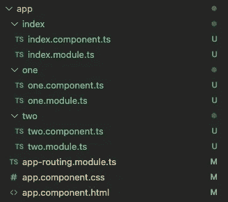
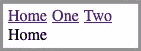
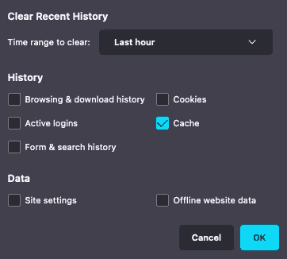
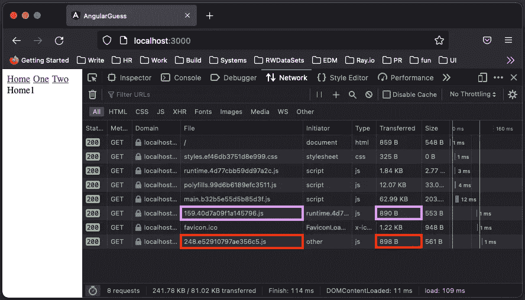
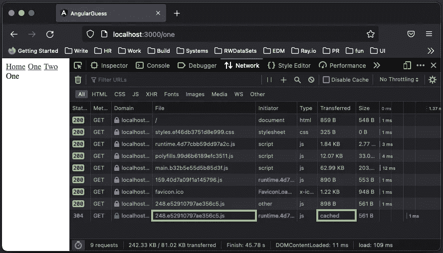
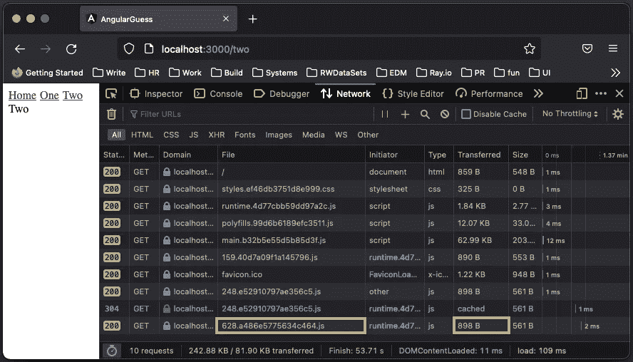

# 在角度应用中评估 Guess.js

> 原文：<https://betterprogramming.pub/evaluating-guess-js-in-angular-applications-68803b475695>

## 预测预取在角度应用中获得好评


由[巴勃罗·祖切罗](https://unsplash.com/@pablozuchero?utm_source=medium&utm_medium=referral)在 [Unsplash](https://unsplash.com?utm_source=medium&utm_medium=referral) 拍摄的照片

# 为什么是 Guess.js？

[页面预测](https://developer.mozilla.org/en-US/docs/Glossary/Page_prediction)是一种浏览器功能或脚本，当启用时，它会告诉浏览器在用户请求内容之前下载他们可能会访问的资源。这些资源被下载并缓存以备将来使用，而无需用户发出明确的请求。这个过程称为预取。

页面预测通过几乎即时加载预测内容来提高性能。然而，页面预测也可能下载用户不寻找的内容。“正确地”执行页面预测是很重要的，它的成功将增强用户体验。

[Guess.js](https://github.com/guess-js/guess) 是一个 JavaScript 库和工具，用于自动化预测预取过程。

# Guess.js 是什么？

Guess.js 创建于 2018 年 4 月左右。目前的版本是 0.4.22，还在 alpha 中。它基于从数据分析驱动的方法中提取的数据来执行页面预测，如[谷歌分析](https://analytics.google.com/analytics/web/provision/#/provision)和[机器学习模型](/machine-learning-theory-and-programming-supervised-learning-regression-analysis-8ed2d86f5714)。

预测数据分析可应用于多种环境:

*   预测用户可能访问的下一页(或多页)并预取这些页面。
    —页面级:预渲染或预取接下来最有可能被访问的页面。
    —包级:预取与顶部`N`页面相关联的包。
*   预测用户可能会查看的下一条内容(文章、产品或视频)。
*   预测用户可能会更多互动的微件类型，如游戏。

Guess.js 支持静态站点，Angular，Gatsby，Next.js，Nuxt.js 等等。我们使用 Angular 应用程序来看看它是如何工作的。

# Guess.js 在角度应用中很受欢迎

我们要探讨的是 Angular 工作环境下的 Guess.js。它需要七个步骤，其中前三个步骤为每条路线设置一个带延迟加载的角度项目，最后四个步骤用 Guess.js 设置并运行预测预取。

1.  [创建一个角度项目](#3e02)。
2.  [设置三条路线:](#d55f)`['/'](#d55f)``['/one'](#d55f)``['/two'](#d55f)`。
3.  [运行应用程序查看下载的包](#f9a1)。
4.  [创建预测分析文件，](#1ae9)T3。
5.  [扩展 Angular CLI 以配置 Webpack](#acce) 。
6.  [在角度应用](#96e4)中配置 Guess.js。
7.  [用 Guess.js](#2b29) 执行预测预取。

## 1.创建角度项目

全局设置 Angular CLI:

```
% npm i -g @angular/cli
```

检查版本:

```
% ng version
Angular CLI: 14.2.1
```

安装了`ng`后，创建一个新项目:

```
% ng new angular-guess
? Would you like to add Angular routing? Yes
? Which stylesheet format would you like to use? CSS
```

## 2.设置三条路线:'/'、'/一'和'/二'

设置三条路线:`'/'`、`'/one'`、`'/two'`。修改三条路线的应用程序文件。



作者图片

在上面的截图中，绿色表示新添加的文件，黄色表示修改的文件。

**索引路线，**

索引模块在`src/app/index/index.module.ts`中定义:

它用`IndexComponent`(第 11 行)定义了子节点`RouterModule`(上面代码中的第 8–13 行)。

`IndexComponent`在`src/app/index/index.component.ts`中定义:

它将选择器定义为`'app-index'`(上面代码中的第 4 行)，模板只是文本，`'Home1'`(第 5 行)。

**路线，** `**/one**`

`one`模块在`src/app/one/one.module.ts`中定义:

它用`OneComponent`(第 11 行)定义了子节点`RouterModule`(上面代码中的第 8–13 行)。

`OneComponent`在`src/app/one/one.component.ts`中定义:

它将选择器定义为`'app-one'`(上面代码中的第 4 行)，模板只是文本，`'One'`(第 5 行)。

**路线，**

`two`模块在`src/app/two/two.module.ts`中定义:

它用`TwoComponent`(第 11 行)定义了子节点`RouterModule`(上面代码中的第 8–13 行)。

`TwoComponent`在`src/app/two/two.component.ts`中定义:

它将选择器定义为`'app-two'`(上面代码中的第 4 行)，模板只是文本，`'Two'`(第 5 行)。

**应用程序文件**

`src/app/app-routing.module.ts`定义应用程序路线:

`''`(索引路线)在上面代码的第 5–9 行定义，`'/one'`在第 10–13 行定义，`'/two'`在第 14–17 行定义。它们都是延迟加载的(第 8、12 和 16 行)。

`src/app/app.component.html`定义应用的 UI，如下图所示:

顶部有三个链接:`Home`(上面代码的第 1 行)、`One`(第 2 行)、`Two`(第 3 行)。

第 5 行有一个换行。

第 7 行是`router-outlet`，它是 select route 组件的占位符。

`src/app/app.component.css`定义应用的 CSS:

它只是在链接之间添加了`5px`缺口。

## 3.运行应用程序以查看下载的包

运行应用程序:`ng serve`。



这是一个显示选择路线内容的基本应用程序。

由于使用了延迟加载，每个页面都会发送一个请求，请求对应的 JavaScript 包。我们使用 Firefox 作为浏览器来查看网络请求。

执行前清除缓存。



作者图片

为什么选择 Firefox？

因为它的 Network inspector 有一个列`transferred`，显示了为加载资源而实际传输的字节数，或者是一个关于为什么资源没有被传输的消息，可能是`cached`。

下面是索引页面的截图:


作者图片

对于索引页面，上面的截图清楚地显示只下载了 bundle，`src_app_index_index_module_ts.js`。

## 4.创建预测分析文件 routes.json

对于一个真实的应用来说，它很可能会使用一些跟踪和分析工具或机器学习模型。为简单起见，我们创建一个名为`routes.json`的预测分析文件。

在上面代码的第 2 行，它假设当前会话是`'/'`。此后，用户访问了 80 个会话`'/one'`(第 3 行)和 20 个会话`'/two'`(第 4 行)。

在第 6 行，它假设当前会话是`'/one'`。此后，用户访问了 90 个会话`'/'`(第 7 行)和 10 个会话`'/two'`(第 8 行)。

在第 10 行，它假设当前会话是`'/two'`。此后，用户访问了 90 个会话`'/'`(第 11 行)和 10 个会话`'/one'`(第 12 行)。

# 扩展 Angular CLI 以配置 Webpack

在 Angular 5 中，有一个命令`ng eject`，用于弹出底层 Webpack 配置进行定制。从 Angular 6 开始，此命令已被替换为使用构建器进行自定义。

```
% npm i -D @angular-builders/custom-webpack
```

`@angular-builders/custom-webpack`成为`package.json`中`[devDependencies](/package-jsons-dependencies-in-depth-a1f0637a3129)`的一部分:

在`angular.json`中，将`builder`值从`@angular-devkit/build-angular:browser`更新为`@angular-builders/custom-webpack:browser`(下面代码中的第 14 行)，并将`customWebpackConfig`添加到`options`(第 16–18 行)。

现在我们可以使用`extend.webpack.config.js`在 Webpack 中设置 Guess.js。

# 在 Angular 应用中配置 Guess.js

使用以下命令安装 Guess.js 包:

```
% npm i -D guess-webpack guess-parser
```

`guess-webpack`是一个包含 Guess.js Webpack 插件的包，`guess-parser`是一个包含一组解析器来静态分析应用程序的包。

这两个包用于`extend.webpack.config.js`:

在上面代码的第 9–11 行，`reportProvider`返回了`GuessPlugin`将使用的分析数据，并使用这些数据构建了一个机器学习模型。在简化的情况下，它读取静态文件`routes.json`。更常见的是，`GA`用于指向 Google Analytics 视图 ID，Guess.js 从 Google Analytics 帐户获取数据并自动构建报告。

在第 12–14 行，`runtime`设置运行时配置，其中`delegate`是`false`。它让 Guess.js 处理包预取。

在第 15–17 行，`routeProvider`将其调用委托给`parseRoutes`，后者返回路由和 JavaScript 块之间的映射。

# 使用 Guess.js 执行预测预取

我们在 Angular 应用程序中设置了 Guess.js。预测预取仅在生产环境中有效。

使用以下命令创建生产版本:

```
% npm run build
```

转到`dist`目录运行生产构建:

```
% cd dist/angular-guess && serve -s .
```

转到 Firefox 浏览器，并清除缓存。

*   请访问索引页面:



作者图片

下载索引包`159.40d7a09f1a145796.js`(粉色)。此外，`one`包`248.e52910797ae356c5.js`(红色)已预装，启动器为`other`。

基于预测分析文件`routes.json`，当用户在`[http://localhost:3000](http://localhost:3000)`时，他或她更有可能访问`/one`而不是`/two`。

```
"/": {
  "/one": 80,
  "/two": 20
}
```

因此，`http://localhost:3000/`下载`/`和`/one`的包，但不下载`/two`的包。

*   点击链接`One`，进入`/one`:



作者图片

预加载的包`248.e52910797ae356c5.js`(绿色)作为`cached`下载。

基于预测分析文件`routes.json`，当用户在`[http://localhost:3000/one](http://localhost:3000/one.)` [时，他或她更有可能访问`/`而不是`/two`。](http://localhost:3000/one.)

```
"/one": {
  "/": 90,
  "/two": 10
}
```

`/`的捆绑包已经下载，不需要预加载`/two`的捆绑包。

*   点击链接`Two`，转到`/two`:



作者图片

包`628.a486e5775634c464.js`(橙色)被下载。

基于预测分析文件`routes.json`，当用户在`[http://localhost:3000/two](http://localhost:3000/two.)` [时，他或她更有可能访问`/`而不是`/one`。](http://localhost:3000/two.)

```
"/two": {
  "/": 90,
  "/one": 10
}
```

已经下载了`/`的包，不需要预加载`/one`的包。

至此，所有的包都已经下载完毕。

Guess.js 智能地执行下载或预加载。以下视频捕捉到了上述过程:

作者提供的视频

完整的代码驻留在[这个库](https://github.com/JenniferFuBook/angular-guess)中。

# 结论

Guess.js 是一个 JavaScript 库和工具，用于自动化预测预取过程。我们评估了它在角度应用中的工作原理。预测预取在 Angular 应用程序中备受好评，我们期待这种创新方法很快正式发布。

感谢阅读。

```
**Want to Connect?**If you are interested, check out [my directory of web development articles](https://jenniferfubook.medium.com/jennifer-fus-web-development-publications-1a887e4454af).
```