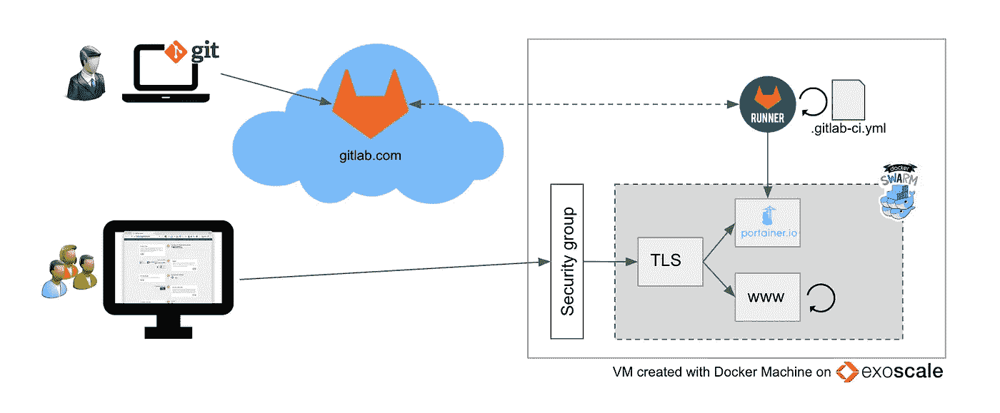
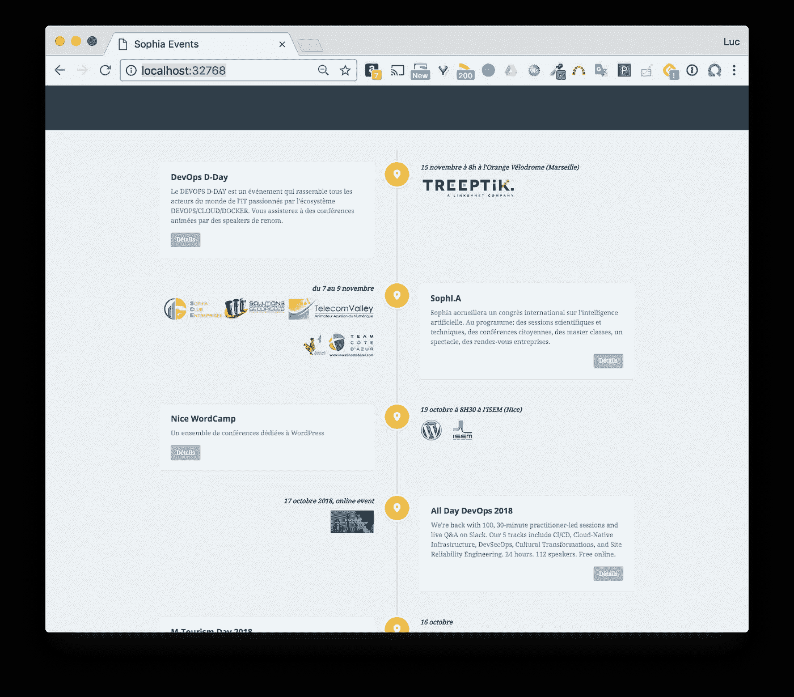
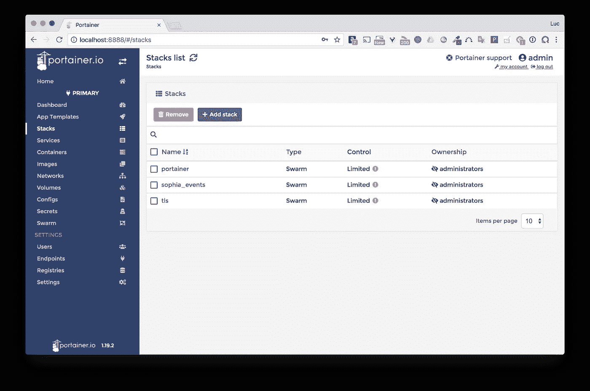
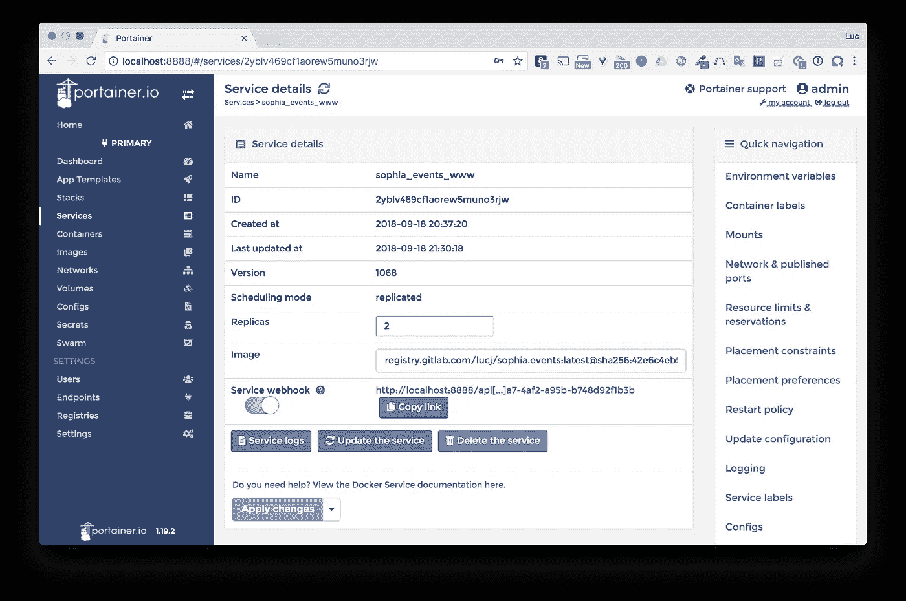
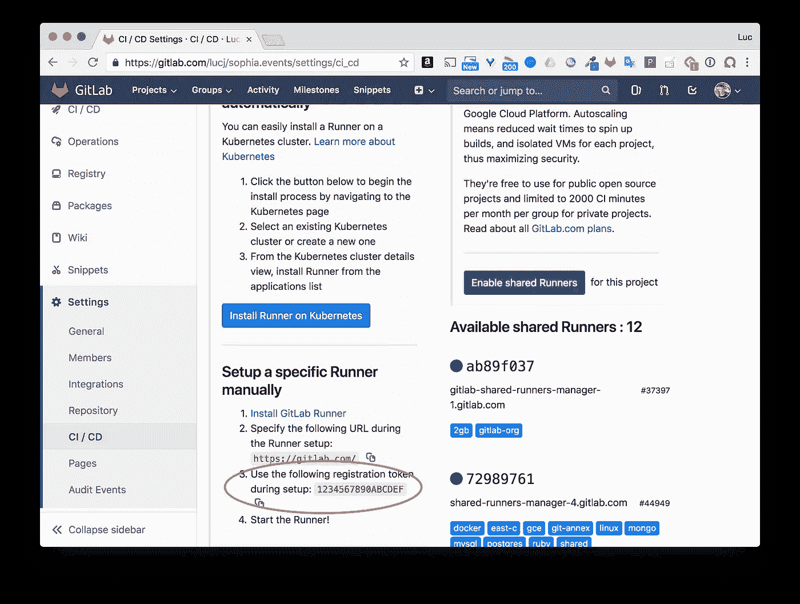
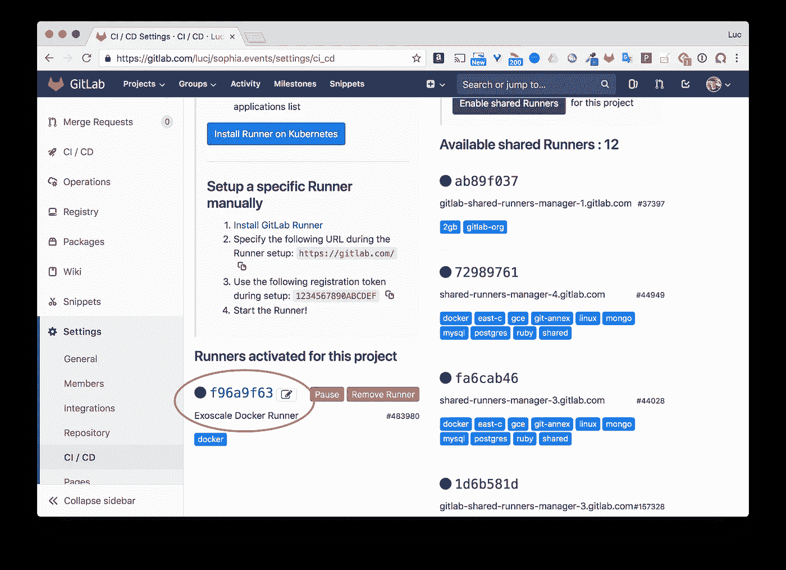
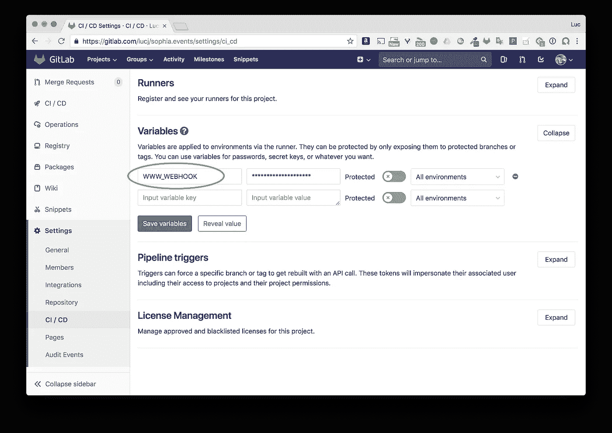
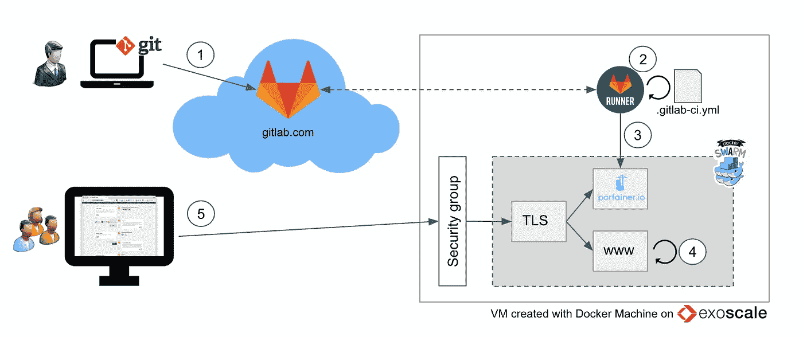
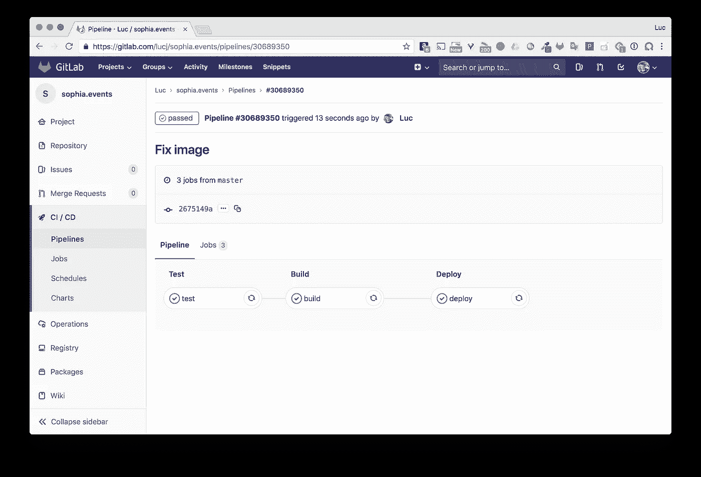
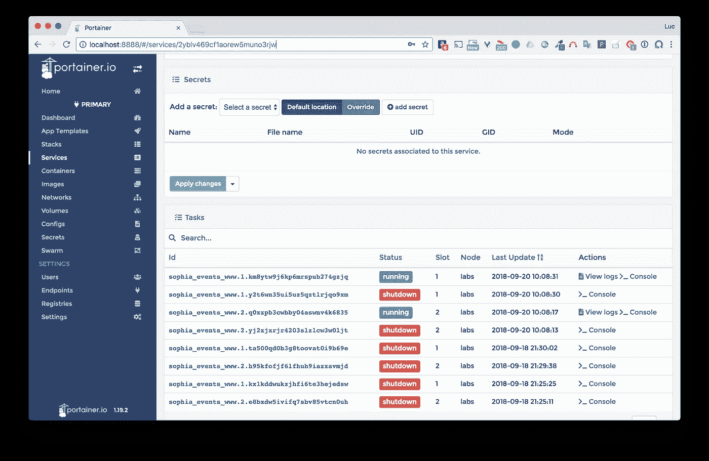

# 即使最小的次要项目也值得拥有 CI/CD 管道

> 原文：<https://betterprogramming.pub/even-the-smallest-side-project-deserves-its-ci-cd-pipeline-281f80f39fdf>



# **TL；博士**

使用今天的工具，建立一个简单的 CI/CD 管道并不困难。即使是为了一个副业，这样做也是学习很多东西的好方法。Docker、GitLab 和 Portainer 是用于这种设置的一些很好的组件。

# **样板工程**

作为 Sophia-Antipolis 地区(法国南部)技术活动的组织者，我经常被问到是否有办法了解所有即将到来的活动(聚会、壶、由当地协会组织的活动等)。)因为没有一个地方可以列出所有的事件，所以我想出了 [https://sophia.events](https://sophia.events) ，一个简单的网页，试图保持这样的事件列表是最新的。这个项目在 [GitLab](https://gitlab.com/lucj/sophia.events) 中可用

声明:这是一个简单的项目，但项目的复杂性在这里并不重要。我们将详述的 CI/CD 管道的组件可以以非常相似的方式用于更复杂的项目。不过，它们非常适合微服务。

# **快速查看代码**

基本上，为了使事情非常简单，有一个 events.json 文件，其中添加了每个新事件。下面的代码片段中提供了该文件的一部分(抱歉是法语部分)。

小胡子[模板](https://gitlab.com/lucj/sophia.events/blob/master/index.mustache)被应用到这个文件来生成最终的 web 资产。

# Docker 多阶段构建

一旦生成了 web 资产，它们就被复制到 nginx 映像——部署在目标机器上的映像。

由于采用了多阶段构建，构建分两部分完成:

*   资产的生成
*   创建包含资产的最终图像

这是用于构建的 docker 文件:

```
# Generate the assets
FROM node:8.12.0-alpine AS build
COPY . /build
WORKDIR /build
RUN npm i
RUN node clean.js
RUN ./node_modules/mustache/bin/mustache events.json index.mustache > index.html# Build the final image used to serve them
FROM nginx:1.14.0
COPY --from=build /build/*.html /usr/share/nginx/html/
COPY events.json /usr/share/nginx/html/
COPY css /usr/share/nginx/html/css
COPY js /usr/share/nginx/html/js
COPY img /usr/share/nginx/html/img
```

# 本地测试

为了测试站点的生成，只需克隆 repo 并运行 test.sh 脚本。然后，它将创建一个图像，并从中运行一个容器。

```
$ git clone [git@gitlab.com](mailto:git@gitlab.com):lucj/sophia.events.git$ cd sophia.events$ ./test.sh
Sending build context to Docker daemon  2.588MB
Step 1/12 : FROM node:8.12.0-alpine AS build
 ---> df48b68da02a
Step 2/12 : COPY . /build
 ---> f4005274aadf
Step 3/12 : WORKDIR /build
 ---> Running in 5222c3b6cf12
Removing intermediate container 5222c3b6cf12
 ---> 81947306e4af
Step 4/12 : RUN npm i
 ---> Running in de4e6182036b
npm notice created a lockfile as package-lock.json. You should commit this file.
npm WARN www@1.0.0 No repository field.added 2 packages from 3 contributors and audited 2 packages in 1.675s
found 0 vulnerabilitiesRemoving intermediate container de4e6182036b
 ---> d0eb4627e01f
Step 5/12 : RUN node clean.js
 ---> Running in f4d3c4745901
Removing intermediate container f4d3c4745901
 ---> 602987ce7162
Step 6/12 : RUN ./node_modules/mustache/bin/mustache events.json index.mustache > index.html
 ---> Running in 05b5ebd73b89
Removing intermediate container 05b5ebd73b89
 ---> d982ff9cc61c
Step 7/12 : FROM nginx:1.14.0
 ---> 86898218889a
Step 8/12 : COPY --from=build /build/*.html /usr/share/nginx/html/
 ---> Using cache
 ---> e0c25127223f
Step 9/12 : COPY events.json /usr/share/nginx/html/
 ---> Using cache
 ---> 64e8a1c5e79d
Step 10/12 : COPY css /usr/share/nginx/html/css
 ---> Using cache
 ---> e524c31b64c2
Step 11/12 : COPY js /usr/share/nginx/html/js
 ---> Using cache
 ---> 1ef9dece9bb4
Step 12/12 : COPY img /usr/share/nginx/html/img
 ---> e50bf7836d2f
Successfully built e50bf7836d2f
Successfully tagged registry.gitlab.com/lucj/sophia.events:latest
=> web site available on [http://localhost:32768](http://localhost:32768)
```

使用输出末尾提供的 URL，我们可以访问该网页:



# **目标环境**

## 在云提供商上调配的虚拟机

您可能已经注意到，这个网站并不重要(每天只有几十次访问)，因此它只在一台虚拟机上运行。这是一个伟大的欧洲云提供商 Exoscale 上的 Docker Machine 创建的。

顺便说一句，如果你想试试 Exoscale，ping me 和我可以提供大约 20 张€代金券。

## 群体模式下的 Docker 守护进程

在上述虚拟机上运行的 Docker 守护进程被配置为在 Swarm 模式下运行，因此它允许使用 Docker Swarm 的堆栈、服务、配置和秘密原语以及强大(且易于使用)的编排功能。

## 应用程序作为 Docker 堆栈运行

以下文件定义了运行包含 web 资产的 nginx web 服务器的服务。

```
version: "3.7"
services:
  www:
    image: registry.gitlab.com/lucj/sophia.events
    networks:
      - proxy
    deploy:
      mode: replicated
      replicas: 2
      update_config:
        parallelism: 1
        delay: 10s
      restart_policy:
        condition: on-failurenetworks:
  proxy:
    external: true
```

一些解释:

*   该图像位于 gitlab.com 托管的私人注册表中(这里不涉及 Docker Hub)。
*   服务处于复制模式，有两个副本，这意味着服务的两个任务/容器同时运行。通过 Swarm 将一个 VIP(虚拟 IP 地址)与服务相关联，以便每个针对服务的请求在两个副本之间实现负载平衡。
*   每次完成服务更新(部署网站的新版本)时，都会更新一个副本，10 秒钟后再更新第二个副本。这确保了网站在更新过程中仍然可用。我们也可以使用回滚策略，但此时不需要。
*   该服务连接到外部*代理*网络，因此 TLS 终端(运行在部署在 swarm 上的另一个服务中，但在该项目之外)可以向 *www* 服务发送请求。

该堆栈使用以下命令运行:

```
$ docker stack deploy -c sophia.yml sophia_events
```

## Portainer 来管理它们

[Portainer](https://portainer.io) 是一个很棒的网络用户界面，可以让你非常容易地管理 Docker 主机和 Docker Swarm 集群。下面是 Portainer 界面的截图，列出了 swarm 中可用的堆栈。



当前设置显示 3 个堆栈:

*   集装箱本身
*   sophia_events 包含运行我们网站的服务
*   tls，TLS 终端

如果我们列出 *www* 服务的详细信息，它在 *sophia_events* 堆栈中，我们可以看到**服务 webhook** 被激活。这个特性从 Portainer 1.19.2(到目前为止的最新版本)开始就可用了，它允许我们定义一个 HTTP Post 端点，可以调用这个端点来触发服务的更新。正如我们将在后面看到的，GitLab runner 负责调用这个 webhook。



**注意**:从截图可以看到，我从 localhost:8888 访问 Portainer UI。因为我不想向外界公开 Portainer 实例，所以访问是通过 ssh 隧道完成的，该隧道是用以下命令打开的:

```
ssh -i ~/.docker/machine/machines/labs/id_rsa -NL 8888:localhost:9000 $USER@$HOST
```

随后，所有以端口 8888 上的本地机器为目标的请求都通过 ssh 发送到虚拟机上的端口 9000。9000 是 Portainer 在虚拟机上运行的端口，但此端口不对外界开放，因为它被 Exoscale 配置中的安全组阻止。

**注意**:在上面的命令中，用来连接虚拟机的 ssh 密钥是 Docker Machine 在创建虚拟机时生成的。

## GitLab runner

GitLab runner 是负责执行。gitlab-ci.yml 文件。对于这个项目，我们将自己的 runner 定义为 VM 上的一个容器。

第一步是注册跑步者，提供几个选项:

```
CONFIG_FOLDER=/tmp/gitlab-runner-configdocker run — rm -t -i \
 -v $CONFIG_FOLDER:/etc/gitlab-runner \
 gitlab/gitlab-runner register \
   --non-interactive \
   --executor "docker" \
   —-docker-image docker:stable \
   --url "[https://gitlab.com/](https://gitlab.com/)" \
   —-registration-token "$PROJECT_TOKEN" \
   —-description "Exoscale Docker Runner" \
   --tag-list "docker" \
   --run-untagged \
   —-locked="false" \
   --docker-privileged
```

在这些选项中，PROJECT_TOKEN 由 GitLab.com 的项目页面提供，用于注册外部跑步者:



用于注册新跑步者的注册令牌

当跑步者注册后，我们需要启动它:

```
CONFIG_FOLDER=/tmp/gitlab-runner-configdocker run -d \
 --name gitlab-runner \
 —-restart always \
 -v $CONFIG_FOLDER:/etc/gitlab-runner \
 -v /var/run/docker.sock:/var/run/docker.sock \
 gitlab/gitlab-runner:latest
```

一旦注册并启动，跑步者就会列在 GitLab.com 上的项目页面中:



为此项目创建的跑步者

每当一个新的提交被推送到存储库时，这个运行者将接收一些工作要做。它依次执行在中定义的*测试*、*构建*和*部署*阶段。gitlab-ci.yml 文件:

*   测试阶段运行一些预检查，确保 events.json 文件格式良好，并且没有丢失任何图像..
*   构建阶段构建图像并将其推送到 GitLab 注册表。
*   部署阶段通过发送到 Portainer 的 webhook 触发服务的更新。WWW_WEBHOOK 变量是在 GitLab.com 项目页面的 CI/CD 设置中定义的。



**备注:**

这个跑步者在蜂群上的一个容器里跑步。我们可以使用一个共享的 runner——公共可用的 runner，它们在托管在 itLab 上的不同项目所需的作业之间共享时间——但是，由于 runner 需要访问 Portainer 端点(以发送 webhook ),并且因为我不希望 Portainer 从外部被访问，所以将 runner 放在集群内部更安全。

此外，因为 runner 在容器中运行，所以它将 webhook 发送到 Docker0 桥网络的 IP 地址，以便通过它在主机上公开的端口 9000 联系 Portainer。因此，webhook 具有以下格式:*http://172 . 17 . 0 . 1:9000/API[…]a7-4a F2-a95b-b 748d 92 f1 B3 b*

# **部署流程**

网站新版本的更新遵循如下所示的工作流程:



1.  一名开发人员对 GitLab 进行了一些修改。这些变化主要涉及 events.json 文件中的一个或几个新事件，以及一些额外的赞助商标志。

2.GitLab runner 执行中定义的操作。gitlab-ci.yml。

3.GitLab runner 调用 Portainer 中定义的 webhook。

4.收到 webhook 后，Portainer 部署新版本的 *www* 服务。它这样做，调用 Docker Swarm API。Portainer 可以访问 API，因为 socket /var/run/docker.sock 是在启动时绑定安装的

如果您想了解更多关于这个 unix 套接字的用法，您可能会对以前的文章感兴趣

[](https://medium.com/lucjuggery/about-var-run-docker-sock-3bfd276e12fd) [## 关于/var/run/docker.sock

### TL；速度三角形定位法(dead reckoning)

medium.com](https://medium.com/lucjuggery/about-var-run-docker-sock-3bfd276e12fd) 

5.然后，用户可以看到网站的新版本

## 例子

让我们更改代码中的一些内容，并提交/推送这些更改。

```
$ git commit -m 'Fix image'

$ git push origin master
```

下面的屏幕截图显示了由 GitLab.com 项目页面中的提交触发的管道



在 Portainer 端，接收到了 webhook 并执行了服务更新。我们在这里看不清楚，但是一个副本已经被更新，使得可以通过第二个副本访问网站。然后，几秒钟后，第二个副本被更新。



## 摘要

即使对于这个小项目，建立一个 CI/CD 管道也是一个很好的练习，特别是为了更熟悉 GitLab(它已经在我的学习清单上很长时间了)。这是一款优秀的专业产品。这也是一个很好的机会来体验期待已久的 Portainer 最新版本(1.19.2)中的 webhook 特性。此外，对于像这样的副业项目，Docker Swarm 的使用是显而易见的——它太酷了，而且易于使用！