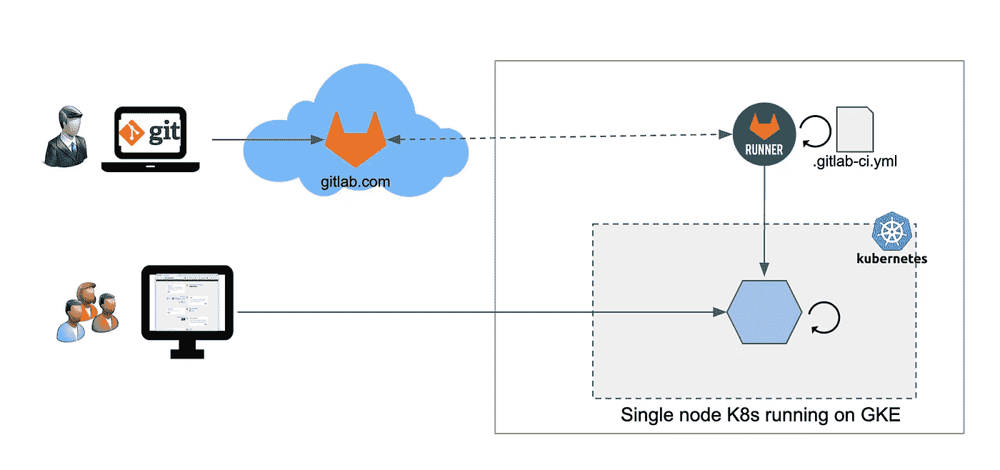
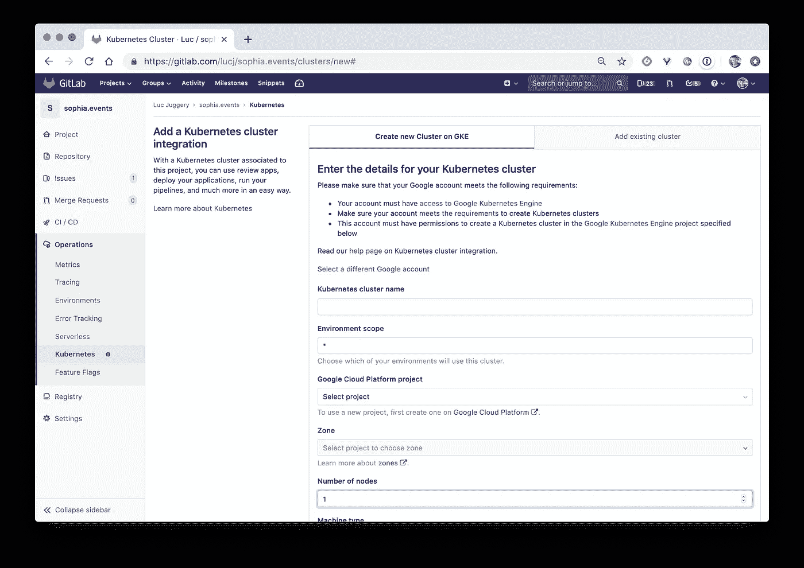
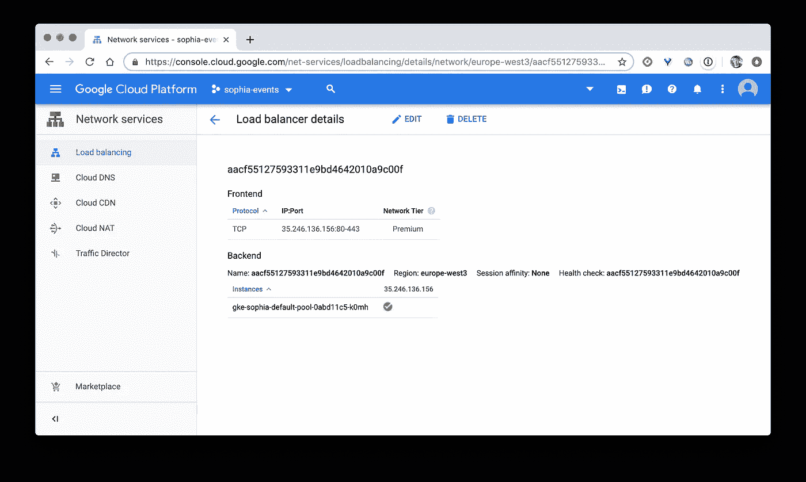
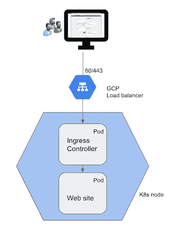
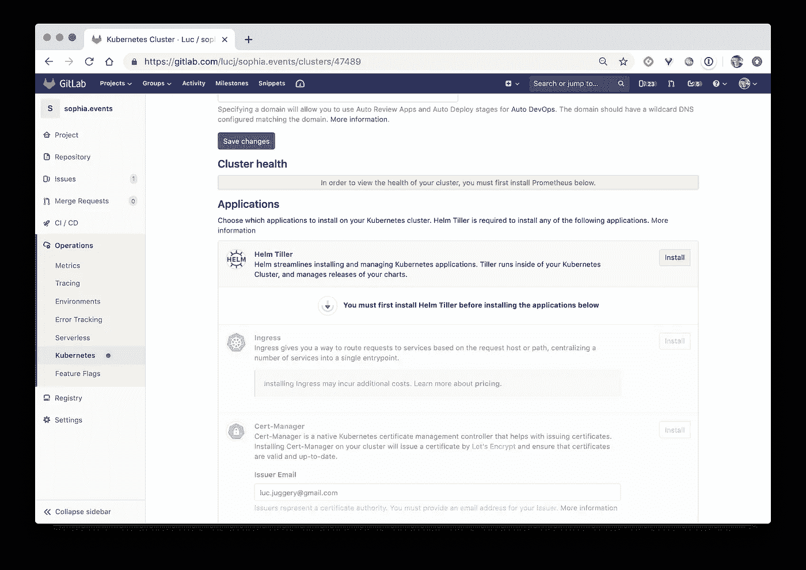

# 即使是最小的边项目也配得上它的 K8s 集群

> 原文：<https://betterprogramming.pub/even-the-smallest-side-project-deserves-its-k8s-cluster-3fc6f8a65e13>



在上一篇文章中，我详细介绍了为一个简单的附带项目设置 CI/CD 管道的步骤。这个设置中使用的主要组件是 [GitLab](https://gitlab.com) 、 [Portainer](https://portainer.io) 和一个单节点 [Docker Swarm](https://docs.docker.com/engine/swarm/) orchestrator。

在这个 CI/CD 管道中执行了几个操作:

*   几个测试
*   构建新图像并上传到 GitLab 注册表中
*   扫描图像以确保它没有 cv，或者至少没有关键 cv
*   通过 Portainer webhook 在群集上部署新图像

你可以点击下面的链接了解所有的细节。

[](https://medium.com/better-programming/even-the-smallest-side-project-deserves-its-ci-cd-pipeline-281f80f39fdf) [## 即使最小的次要项目也值得拥有 CI/CD 管道

### TL；速度三角形定位法(dead reckoning)

medium.com](https://medium.com/better-programming/even-the-smallest-side-project-deserves-its-ci-cd-pipeline-281f80f39fdf) 

我非常喜欢 Docker Swarm 这是一个很好的解决方案，非常容易设置，并且具有强大的默认安全特性。但是当谈到今天的容器编排器时，Kubernetes 是事实上的标准，所以我认为详述 Kubernetes 世界中的同类设置会很有趣。

该项目是一个简单的网站，列出了法国南部索菲亚安蒂波利斯地区的科技事件。这里没有什么特别的，只有一个很好的测试场地。

在本文中，我们将看到这个 Docker Compose 项目是如何设计的，因此它可以很容易地部署在 Kubernetes 上，并通过 CI/CD 管道进行更新。

## GitLab 和 Kubernetes

第一步是建立一个小型 Kubernetes 集群。对于这个项目来说，一个节点就足够了，因为正如你所想象的，这不是一个关键的节点:)。这一步实际上很容易，因为几个月前，GitLab 做出了一个决定性的举动，使得创建一个新的集群变得非常简单，*目前在 GKE* 上，或者将一个现有的集群，*不限于 GKE* 集成到 GitLab 存储库中。该功能可通过*操作> Kubernetes* 菜单获得。



从 GitLab 界面集成 K8s 集群

对于这个项目，我在 GKE 上设置了一个单节点 Kubernetes 集群，需要几分钟时间将集群部署到我们简单的 web 站点上。

## 从 Docker Compose 到 Kubernetes 资源

在*甚至最小的项目*系列的第一篇文章中，我详细介绍了如何在 Swarm 上部署应用程序。它在 Docker Compose 格式中使用了以下规范。

```
// sophia.yaml
version: '3.7'
services:
  www:
    image: registry.gitlab.com/lucj/sophia.events
    networks:
      - proxy
    deploy:
      mode: replicated
      replicas: 2
      update_config:
        parallelism: 1
        delay: 10s
      restart_policy:
        condition: on-failure

networks:
  proxy:
    external: true
```

在一个集群上，它被部署为一个**堆栈**，命令如下:

```
$ docker stack deploy -c sophia.yaml
```

由于**栈**不是 Kubernetes 资源，上面的文件不能部署在我们的新集群上。在 Kubernetes 的世界中，我们需要创建部署和服务资源来部署我们的应用程序。

> 注意:像 Docker Enterprise 这样的产品嵌入了自己的操作符和自定义资源，以使栈对象能够被 Kubernetes 理解。

我们可以使用像 [Kompose](https://github.com/kubernetes/kompose) 这样的工具将 Docker Compose 文件翻译成 Kubernetes 资源，但是对于我们这个简单的应用程序，手工翻译不成问题。

我们首先定义一个部署资源。在这个示例中，我们指定了同一个 Pod 的两个副本(Kubernetes 中最小的工作负载单元),因为只有一个基于您的应用程序映像的容器:

```
// deployment.yamlapiVersion: apps/v1
kind: Deployment
metadata:
  name: sophia
  labels:
    app: sophia
spec:
  selector:
    matchLabels:
      app: sophia  
  strategy:
    type: RollingUpdate
    rollingUpdate:
      maxSurge: 1
      maxUnavailable: 0
  replicas: 2
  template:
    metadata:
      labels:
        app: sophia
    spec:
      containers:
      - name: app
        image: registry.gitlab.com/lucj/sophia.events
```

> 注意:策略键用于指定更新方式的附加配置。这与合成文件的 *update_config* 键相匹配。

然后，我们定义服务资源来公开集群中由上述部署创建的 pod。

```
// service.yamlapiVersion: v1
kind: Service
metadata:
  name: sophia
spec:
  type: ClusterIP
  ports:
    - name: www
      port: 80
      targetPort: 80
      protocol: TCP
  selector:
    app: sophia
```

我们的应用程序的资源可以用通常的命令创建:

```
$ kubectl apply -f deployment.yaml
$ kubectl apply -f service.yaml
```

## 公开应用程序的入口

为了向外界公开应用程序，我们将使用一个入口资源。它基本上是一种资源，定义了传入的请求应该如何路由到集群中运行的服务。在本例中，所有以域 *test.sophia.events* 为目标的请求都将被转发到名为 *sophia —* 的服务，从而公开网站。

```
// ingress.yamlapiVersion: extensions/v1beta1
kind: Ingress
metadata:
  name: sophia
  annotations:
    kubernetes.io/ingress.class: "nginx"
spec:
  rules:
  - host: **test.sophia.events**
    http:
      paths:
      - path: /
        backend:
          serviceName: sophia
          servicePort: 80
  tls:
  - hosts:
    - **test.sophia.events**
    secretName: sophia-tls-cert
```

> 注意:入口资源也可以充当 TLS 终端，但我们不会在这里深入讨论细节。

这个资源是像 Kubernetes 中的其他资源一样创建的:

```
$ kubectl apply -f ingress.yaml
```

单独创建入口资源不是很有用；我们需要运行一个入口控制器来使它工作。与 Kubernetes 中的几乎所有流程一样，这个在 Pod 中运行的流程是一个反向代理，使用集群上现有的入口资源进行配置。它侦听传入的请求，并根据其配置将每个请求转发给正确的内部服务。

可以按照官方文档的说明安装入口控制器:运行入口控制器 Pod，然后创建服务以将其暴露给外部。

[](https://kubernetes.github.io/ingress-nginx/deploy/) [## 安装指南- NGINX 入口控制器

### 在 AWS 中，我们使用弹性负载平衡器(ELB)来将 NGINX 入口控制器暴露在服务之后…

kubernetes.github.io](https://kubernetes.github.io/ingress-nginx/deploy/) 

如果 HELM 服务器已经在集群中运行，也可以使用 HELM — *Kubernetes 软件包管理器—* 通过简单的命令安装入口控制器:

`$ helm install nginx/nginx-ingress — version 0.3.0`

> 注意:这里我们使用基于 Nginx 的入口控制器，我们也可以使用基于 [HAProxy](http://www.haproxy.org/) 或 [Traefik](https://traefik.io/) 的入口控制器。

在这个示例中，我们使用第一种方法来部署这个控制器，因为集群部署在云提供商上，所以我们使用负载平衡器服务类型来公开它。这将在 GCP 基础设施上创建一个外部负载平衡器，公开端口 80 和 443，并将所有请求转发到集群中运行的入口控制器。



负载平衡器类型的服务会触发在 GCP 创建负载平衡器

为了让每个以 *test.sophia.events* 为目标的请求到达网站，应该更新该域的 DNS 条目，因此它围绕这个负载平衡器的 IP 旋转。



请求的目标是公开入口控制器的负载平衡器服务

我们完了！部署、服务和入口资源是我们在集群中运行应用程序并使其对外部可用所需的全部资源。但是为了简化这个应用程序的整个生命周期，我们将看看如何以 Kubernetes 的方式对它进行打包。

## 带头盔的包装

Kubernetes 的包管理器 Helm 简化了复杂应用程序的打包、部署和升级。这是一个由 [CNCF](https://cncf.io) 孵化的项目，在 Kubernetes 生态系统中被广泛使用。在这一部分中，我们将详细介绍如何使用这个工具来打包和更新我们的应用程序。

Helm 包括 helm 客户端和 helm 服务器——名为 *tiller* 。一旦下载了客户端，就需要一个简单的 *helm init* 来将服务器组件运行到 Pod 中。

> 注意:helm 服务器可以直接从 Gitlab 界面安装。其他组件，如入口控制器、Prometheus……可以在同一个界面上点击安装。



GitLab 接口使得在 K8s 中安装附加组件变得容易

一旦 Helm 设置完毕，我们就可以使用以下命令生成图表的框架——这就是 Helm 包的命名方式:

```
$ helm create k8s-chart
```

这将创建一个包含一些资源的文件夹，用于部署一个基于 nginx 的示例 web 服务器。

```
$ cd k8s-chart
$ tree .
.
├── Chart.yaml
├── charts
├── templates
│   ├── NOTES.txt
│   ├── _helpers.tpl
│   ├── deployment.yaml
│   ├── ingress.yaml
│   ├── service.yaml
│   └── tests
│       └── test-connection.yaml
└── values.yaml3 directories, 8 files
```

由于我们想要创建自己的图表，第一步是删除默认创建的资源，并用我们自己的`*deployment.yaml*`、`service.yaml`、*、*和`ingress.yaml`替换它们。

接下来，我们更改 YAML 文件的内容，以便使一些字段更加动态。例如，我们可能不想在`deployment.yaml` *中硬编码所有内容。我们可以用下面的方式定义在容器中使用的图像:*

```
// deployment.yamlapiVersion: apps/v1
kind: Deployment
metadata:
  name: sophia
  labels:
    app: sophia
spec:
  selector:
    matchLabels:
      app: sophia  
  strategy:
    type: RollingUpdate
    rollingUpdate:
      maxSurge: 1
      maxUnavailable: 0
  replicas: 2
  template:
    metadata:
      labels:
        app: sophia
    spec:
      containers:
      - name: app
        **image: {{ .Values.image.registry }}/{{ .Values.image.repository }}:{{ .Values.image.tag }}**
        ports:
        - containerPort: 80
```

这同样适用于`service.yaml`文件，在这里我们可以*临时化*一些字段，就像服务的`type`一样——我们有时可能需要一个节点端口而不是集群 IP——以及它公开的`port`。

```
// service.yamlapiVersion: v1
kind: Service
metadata:
  name: sophia
spec:
  type: {{ .Values.service.type }}
  ports:
    - name: www
      port: {{ .Values.service.port }}
      targetPort: 80
      protocol: TCP
  selector:
    app: sophia
```

我们可以对入口资源使用相同的方法，并更改主机键的值，主机键是根据特定域名路由请求的键。

```
// ingress.yamlapiVersion: extensions/v1beta1
kind: Ingress
metadata:
  name: sophia
  annotations:
    kubernetes.io/ingress.class: "nginx"
spec:
  rules:
  - **host: {{ .Values.domain }}**
    http:
      paths:
      - path: /
        backend:
          serviceName: sophia
          servicePort: 80
  tls:
  - hosts:
    - **{{ .Values.domain }}**
    secretName: sophia-tls-cert
```

使用`{{ .Values.xxx }}`语法表示这些值是从位于 *k8s-chart* 文件夹根目录下的`values.yaml`文件中读取的。

```
// Definition of our own values.yamldomain: test.sophia.events

image:
  registry: registry.gitlab.com/lucj
  repository: sophia.events
  tag: latest
  pullPolicy: Always

service:
  type: ClusterIP
  port: 80
```

> 注意:也可以从 Chart.yaml 文件中检索值，该文件也位于文件夹的根目录下，包含项目的元数据。

总而言之，为了将我们的应用程序打包到一个舵图中，我们可以遵循以下步骤:

*   创建图表框架
*   从模板文件夹中删除默认资源
*   将我们自己的资源复制到模板文件夹中
*   确定不应该硬编码的字段，并使用模板符号定义它们
*   在`values.yaml`文件中设置这些字段的值

一旦我们定义了所有资源，就可以使用以下命令创建图表:

```
$ helm install -f values.yaml -n sophia .
```

然后，我们可以确保图表及其包含的资源是正确创建的:

```
**$ helm list** NAME   REV UPDATED     STATUS   CHART        APP VERSION NAMESPACE
sophia 1   30/06 11:58 DEPLOYED sophia-0.1.0 1.0         default**$ kubectl get deploy,po,svc,ingress**
NAME                           READY   UP-TO-DATE   AVAILABLE   AGE
deployment.extensions/sophia   2/2     2            2           34sNAME                          READY   STATUS    RESTARTS   AGE
pod/sophia-575d8486cf-bj6vj   1/1     Running   0          34s
pod/sophia-575d8486cf-tz6z8   1/1     Running   0          34sNAME               TYPE      CLUSTER-IP   EXTERNAL-IP PORT(S)   AGE
service/kubernetes ClusterIP 10.245.0.1   <none>      443/TCP   26h
service/sophia     ClusterIP 10.245.58.76 <none>      80/TCP    34sNAME                       HOSTS              ADDRESS PORTS     AGE
ingress.extensions/sophia  test.sophia.events         80, 443   34s
```

我们现在将了解如何在 CI/CD 管道中自动升级。

## 管道中的部署步骤

在 GitLab CI 文件中，我们将添加一个将在**部署**阶段触发的额外步骤。它基本上连接到与存储库相关联的 Kubernetes 集群，并使用 *helm* 用在**构建**阶段创建的新图像更新图表。

让我们更详细地描述一下这个步骤:

*   L4:定义用于此步骤的图像。在下面的*脚本*键下执行的所有命令都将在一个从这个映像创建的容器中运行，其中嵌入了我们需要的两个工具: *kubectl* 和 *helm* 客户端
*   l5–8:创建`kube config`上下文，helm 客户端将使用该上下文与 Kubernetes API 服务器进行通信。GitLab 通过环境变量自动提供创建这个上下文所需的信息:API 服务器的 URL、集群的 CA、认证用户的令牌
*   L9:将新创建的上下文设置为当前上下文
*   L10:使用 *helm* 客户端升级应用程序。`*-- reuse-values*`标志表示图表当前使用的所有值(在`values.yaml`文件中指定的值)需要保持原样。 `-*- set image.tag*`指令用于用图像的最后一个标签更新路径`image.tag` 引用的值。`*$CI_BUILD_REF*`是 Gitlab 提供的一个环境变量，它包含 git 提交散列，这是一个在构建步骤中用来标记当前图像的值。

在当前的设置中，每次在 *events.json* 文件中创建一个新事件时，都会执行几个操作，其中包括:触发管道、构建新的映像，以及自动更新部署在 Kubernetes 上的应用程序。

如果您想仔细看看，可以在下面的存储库中找到整个项目:[https://gitlab.com/lucj/sophia.events](https://gitlab.com/lucj/sophia.events)。

## 摘要

显然还有其他方法来设置 CI/CD 和其他可用的有用工具。但是正如我们在这个例子中看到的，这个设置非常简单，允许我们测试和演示一些非常酷的东西，这些东西可以用在更雄心勃勃的项目上。