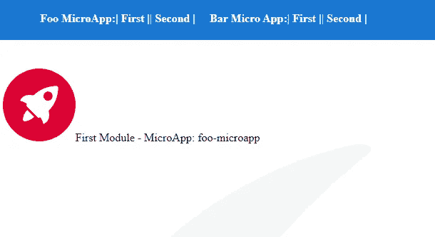

# 基于事件的角度微前端布线

> 原文：<https://betterprogramming.pub/event-based-routing-for-angular-micro-frontends-3bf2c9597ac1>

## 如何在同一个窗口中运行的多个 Angular 应用程序之间进行路由


[R 莫](https://unsplash.com/@mooo3721?utm_source=medium&utm_medium=referral)在 [Unsplash](https://unsplash.com?utm_source=medium&utm_medium=referral) 上拍照

# 介绍

在我之前的一篇[文章](https://itnext.io/how-to-run-separate-angular-apps-in-one-spa-shell-5250e0fc6155)中，我描述了如何在一个`window`上下文中运行两个 Angular 应用程序。我们这样做的原因可能是我们正在采用微前端架构。显然，微前端架构是一件大事，我们必须有信心能够面对所有的挑战。微前端的挑战之一是特定微应用程序之间的路由。

# 外壳应用程序中的路由

老实说，在微前端架构中，我们需要处理两种类型的路由:

*   特定微应用内部的内部路由
*   不同微应用之间外壳层的外部路由

只要内部路由完全没有问题，因为它通常由我们选择作为微应用基础的框架开箱即用地处理，外部路由就可能是一个挑战。

## 为什么它实际上可能是一个挑战，以及我们想要实现什么

最终用户不关心我们的架构，也不关心我们在架构下有什么技术解决方案。用户希望在使用应用程序时拥有完美的体验。用户习惯于 SPA 体验，如果他们在应用程序的不同部分(不同的微应用程序片段)之间移动，应该不会影响他们的统一感。

有一个结论:改变单个微应用程序之间的路由不应该重新加载页面，而是应该让每个微应用程序知道路由责任被委派给了它们。

# 现实生活中的例子

在我之前的文章中，我提到我准备了一些基于@angular/elements 结合 React(包装为 web 组件)的微前端解决方案的例子，并在我自己的微前端解决方案中推出。您可以在这个库中查看这个例子:[https://github.com/marcinmilewicz/microfrontendly](https://github.com/marcinmilewicz/microfrontendly)

当您运行上面的示例时，您将看到一个包含四条路线的简单页面:



事实上，我们在一个视图中观察到了上述两个角度应用程序:Foo MicroApp 和 Bar MicroApp。这些应用程序中的每一个都有两个延迟加载的模块:第一个和第二个，除了它是延迟加载的，没有编译时绑定。在单个 Angular 应用中，这种情况下的路由是微不足道的，但是如果我们同时在一个`window`中有两个 Angular 应用会怎么样呢？

# 基于事件的方法

显然，我意识到我可以为这些应用程序等编写一个相当复杂的定位策略，但我更愿意保持对解决方案的不可知论。因为如果我们添加第三个应用程序，比如 Vue，会怎么样？当然解决方法会不一样，但是概念本身应该是一样的。事实上，我选择的并且已经在大型实际应用中得到证明的概念是基于事件的方法。

假设独立的和不可知的应用程序之间的路由变化是由一个事件触发的，我们可以知道此刻我们真正要显示的是什么，并且我们不需要用这个信息来保持状态(到处去无状态！).

坦率地说，我们可以根据自己的需要和最方便的方式来设计我们的事件。对于我的例子，方便的形式如下:

```
export type RouteChangedEvent<RouteData = never> = {
  route: {
    path: string;
    app: string;
    data?: RouteData;
  };
};
```

这里的`path`是我们的 URL 路径，`app`是特定的微应用程序名称，数据可以是任何东西。

shell 应用程序或其他微应用程序(在我的例子中，我准备了 [React header](https://github.com/marcinmilewicz/microfrontendly/blob/master/microfrontend-example/header-app/src/Header.jsx) ，它可以触发这个事件)可以将这种类型的事件作为`[CustomEvent](https://developer.mozilla.org/en-US/docs/Web/API/CustomEvent/CustomEvent)`发送，这是一个众所周知的标准。

## 基于角度的微应用解决方案

一旦我们决定我们的架构采用基于事件的形式，并且我们用 Angular 编写的微应用程序应该反映这些假设，我们就应该准备一些方便的方法来集成外部 shell 路由和 Angular。


我们可以编写一个能够收集适当事件的调度程序，检查事件是否针对这个特定的应用程序，并为内部角度路由器调度适当的操作。

为了使上述服务工作，它必须有适当的`InjectionTokens`设置，并在应用程序开始时启动(实际上，在角度路由初始化时)。所以我们可以准备这个模块:

然后我们可以在特定的角度应用中使用它。正如最佳实践所说，我们应该有`app-routing.module.ts`来放置代码。

瞧，一切都像预期的那样工作。此外，我已经将负责上述路由部分的一段代码分离为一个小库[@ microfrontendly/angular-element-routing](https://www.npmjs.com/package/@microfrontendly/angular-element-routing)。

# 摘要

*   当我们开发微前端架构时，我们面临两种路由:外壳中的外部路由和特定应用程序中的内部路由。
*   一个有效的解决方案是基于事件的方法。
*   我用两个独立的 Angular 应用程序准备了一个微前端架构的工作示例，一个 React 应用程序和一个不可知的 shell。https://github.com/marcinmilewicz/microfrontendly
*   我准备了一个在基于 Angular 的微应用中处理外部路由的解决方案:[https://www . npmjs . com/package/@ microfrontendly/Angular-element-routing](https://www.npmjs.com/package/@microfrontendly/angular-element-routing)