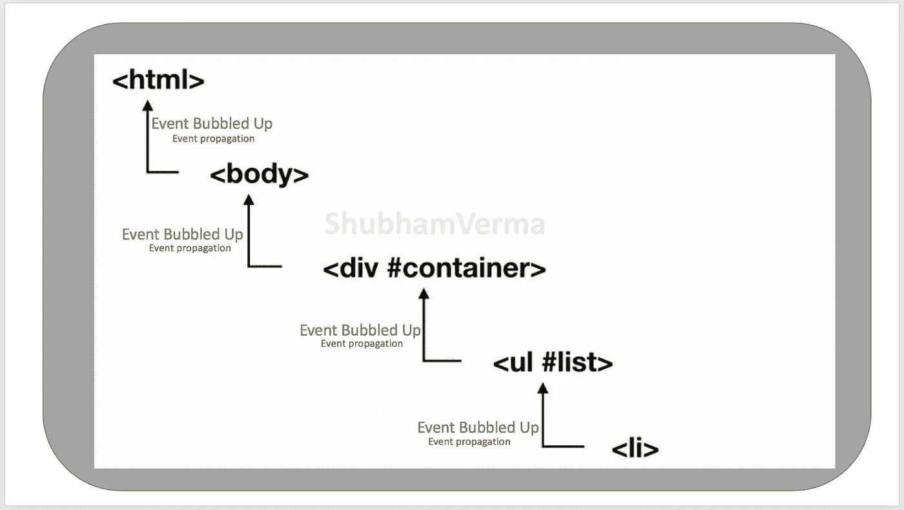
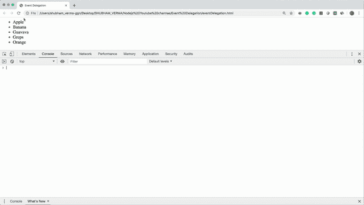
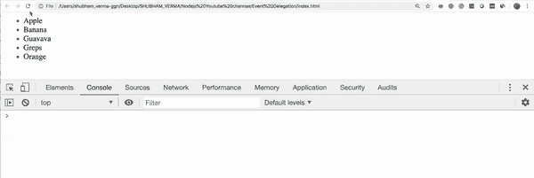

# JavaScript 中的事件委托

> 原文：<https://betterprogramming.pub/event-delegation-in-javascript-boost-your-app-performance-5f10f25cec96>

## 提升你的应用性能



事件委托

事件委托是在我们的 web 应用程序中处理事件的一种更好的技术。这是可能的，因为 JavaScript 在 DOM 树的层次结构中有一个冒泡(传播)的事件。

事件委托的概念来自事件冒泡。这意味着如果事件冒泡是可能的，那么事件委托也是可能的。

如果您在应用程序中使用事件，那么您应该了解事件委托，并且只使用一个事件侦听器，而不是编写更多的事件侦听器。

但是，在了解事件委托之前，您必须了解事件冒泡。我写了一篇关于[事件冒泡](https://medium.com/@svsh227/event-bubbling-in-javascript-a-better-understanding-9c7e0096a7e9)的文章，所以请先阅读这篇文章，然后再回到这里。

# 事件委托

一般来说，在我们的网页上，我们有很多处理所有事情的事件，像点击、击键、输入、鼠标事件，很多随机事件。

当我们的应用程序增长时，如果我们遵循相同的方法，我们需要添加更多的事件，然后事件的数量不断增加，我们的 web 应用程序不断加载大量的事件处理程序。

在某些时候，它会导致性能问题，我们的 web 应用程序会变慢。

例如:

假设我们有一个包含五个类别的网页，并且这五个类别都附带了事件处理程序。当我们点击一个类别，然后一个警告框将与信息打开。我们可以在这个点击上执行任何操作，比如重定向到一个单独的网页、控制台、调用一个函数等等。

让我们看看上面场景的代码实现。在文件`index.html`中编写以下代码，并在浏览器中打开。

`index.html`:

```
<!DOCKTYPE HTML>
<html>
  <head>
    <title>Event Bubbling</title>
  </head>
  <body> <div class="container">
      <ul id="fruits">
        <li id="apple">Apple</li>
        <li id="banana">Banana</li>
        <li id="guavava">Guavava</li>
        <li id="greps">Greps</li>
       <li id="orange">Orange</li>
    </ul> </body>

  <script> *// Bind an event listener for apple.* **var** apple = document.querySelector('#apple');
    apple.addEventListener('click', (event) **=>** {
      console.log("Apple clicked");
      alert("Apple clicked");
    }); *// Bind an event listener for Banana.* **var** apple = document.querySelector('#banana');
    apple.addEventListener('click', (event) **=>** {
      console.log("Banana clicked");
     alert("Banana clicked");
    }); *// Bind an event listener for Guavava.* **var** apple = document.querySelector('#guavava');
    apple.addEventListener('click', (event) **=>** {
      console.log("Guavava clicked");
      alert("Guavava clicked");
    }); *// Bind an event listener for Greps.* **var** apple = document.querySelector('#greps');
    apple.addEventListener('click', (event) **=>** {
      console.log("Greps clicked");
      alert("Greps clicked");
    }); *// Bind an event listener for orange.* **var** apple = document.querySelector('#orange');
    apple.addEventListener('click', (event) **=>** {
      console.log("Orange clicked");
      alert("Orange is 250/- per KG");
    });
  </script>
</html>
```

让我们在浏览器中打开这个文件:



在浏览器中打开的文件

太好了，它工作正常...但是我们上面的代码有什么问题呢？

我们的代码没有问题，但问题是我们有五个`<li>`元素，并且我们给它附加了五个事件处理程序。

如果将来我们的类别增加到 *N* 会怎么样？我们会写 *N* 事件处理程序吗？

同样在这段代码中:

*   我们能去掉一些代码吗？
*   能不能去掉一些事件处理程序，达到我们想要的效果？
*   这项任务可以通过编写更少的代码来完成吗？
*   我们能优化代码吗？

答案是:“是的，我们可以。”通过使用事件委托，我们可以编写更少的代码并获得我们想要的结果。

事件委托不是将事件处理程序分别附加到每个子元素或 HTML 元素，而是将事件直接附加到其父元素。因此，由于 JavaScript 中的事件冒泡，这是可能的，可以完成事件委托。

将事件附加到其父元素后会有什么变化？发生的事件是子元素将传播(冒泡)到它的父元素，父元素的附加事件处理程序将侦听并调用处理程序函数。

让我们在代码中实现这一点。我们将对我们的`index.html`做一些修改，所以现在我们的`index.html`将有如下代码:

```
<!DOCKTYPE HTML>
<html>
  <head>
    <title>Event Delegation</title>
  </head>

  <body>
    <div class="container">
      <ul id="fruits">
        <li id="apple">Apple</li>
        <li id="banana">Banana</li>
        <li id="guavava">Guavava</li>
        <li id="greps">Greps</li>
        <li id="orange">Orange</li>
      </ul>
    </body> <script> *// Bind an event listener to parents which is fruits.* **var** apple = document.querySelector('#fruits');
    apple.addEventListener('click', (event) **=>** {
      console.log(event.target.id + " clicked");
      alert(event.target.id + " clicked");
    });
  </script>
</html>
```

现在，我们可以在上面的代码中看到，我已经从前面的代码中删除了所有的事件处理程序，只写了一个事件处理程序给父元素，它就是`fruits`。

这个事件处理程序做的事情与前面五个处理程序分别做的事情相同。

让我们在浏览器中打开这个文件(`index.html`)并查看结果。



优化(事件委托)代码执行

这就是我们如何使用事件委托优化代码并提高代码质量的方法。

# 事件委托的利弊

## **优点**

*   代码质量:我们可以提高我们的代码质量，维护会很容易。
*   内存:在我们的代码中包含更多的事件将会占用大量的内存，而使用事件委托将会节省内存。
*   性能:事件委托将提高应用程序的性能。
*   DOM 操作:如果我们在每个子元素上实现事件处理程序，并且我们有无限滚动，那么每次动态添加子元素时，DOM 都会更新。使用事件委托，DOM 操作会更少。

## **缺点**

*   并非所有的事件都会发生。有些事件不会冒泡，比如模糊、聚焦、调整窗口大小或滚动。在这种情况下，使用事件委托会很困难。
*   子代停止传播。有时，HTML 元素使用`stopPropagation()`T9 停止事件传播。在这种情况下，事件传播将停止，不会在层次结构中冒泡。

# 结论

结论是，我们不需要将事件处理程序附加到所有的子元素上。相反，我们可以只将一个事件处理程序附加到它的父级，并处理实现目标的函数。

感谢阅读。