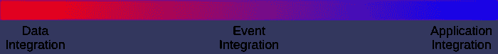
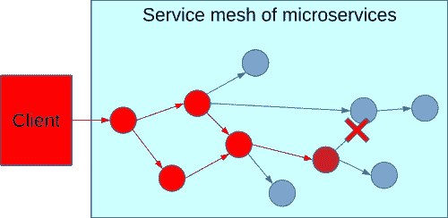
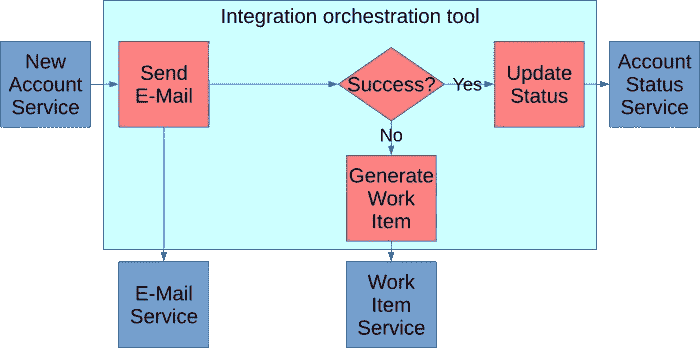
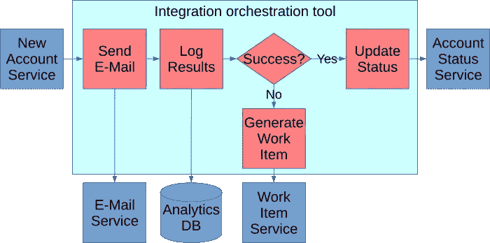
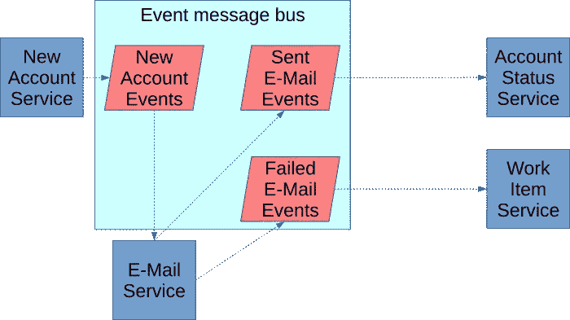
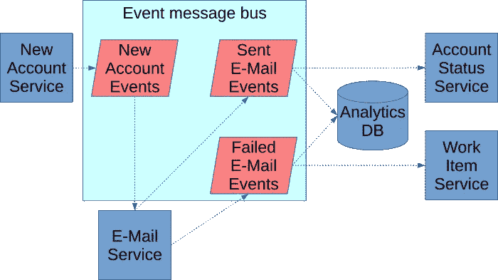
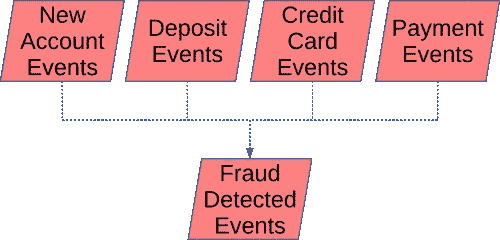
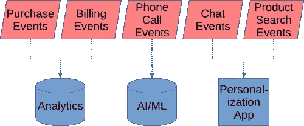
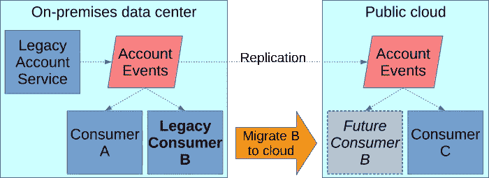
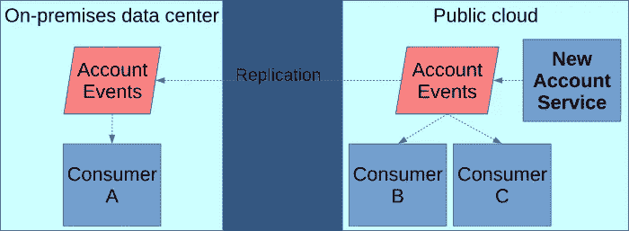

# 作为策略的事件驱动架构

> 原文：<https://betterprogramming.pub/event-driven-architecture-as-a-strategy-dfb8370724c9>

## 深入了解 EDA 以及如何在您的堆栈中实现它

在 [Unsplash](https://unsplash.com/?utm_source=unsplash&utm_medium=referral&utm_content=creditCopyText) 上[温刚斋](https://unsplash.com/@wgzhai?utm_source=unsplash&utm_medium=referral&utm_content=creditCopyText)的照片

事件驱动架构(Event-driven architecture，简称 EDA)是一种集成模式，其中应用程序面向发布事件和响应事件。它为现代应用程序架构提供了五个关键优势:可伸缩性、弹性、敏捷性、数据共享和云支持。

本文探讨了 EDA 如何融入企业集成、它的三种风格、它如何支持业务战略、它的好处和利弊，以及开始 EDA 实现的后续步骤。

虽然有许多经纪人可以用来发布活动消息，但开源软件 Apache Kafka 已经成为这一领域的市场领导者。本文主要关注基于 Kafka 的 EDA，但是这里的大部分原则适用于任何 EDA 实现。

# 积分谱

如果一年前让我描述集成，我会说有两种模式:应用集成和数据集成。今天，我认为集成是一个光谱，一端是数据，另一端是应用程序，中间是事件集成。

整合的范围。

应用集成是 REST，SOAP，ESB 等。这些模式使一个应用程序的功能运行以响应另一个应用程序的请求。这对于 B2B 合作伙伴关系以及将一个应用程序的价值展示给另一个应用程序来说尤其重要。对于许多数据用例来说，比如 BI 报告和 ML 管道，它就不那么强大，因为大多数应用程序集成都是被动地等待客户端调用，而不是主动地将数据推送到需要的地方。

数据集成是从 A 点到 B 点获取数据的模式，包括 ETL、托管文件传输等。它们对于 BI 报告、ML 管道和其他数据移动任务来说很强大，但是对于许多 B2B 合作伙伴和相互共享功能的应用程序来说，它们弱于应用程序集成。

事件集成一只脚在数据，另一只脚在应用程序集成，它很大程度上获得了两者的好处。当一个应用程序订阅另一个应用程序的事件时，它可以触发应用程序代码来响应这些事件，这有点像来自应用程序集成的 API。触发该功能的事件还携带大量数据，这有点像数据集成。

EDA 在这两种经典集成模式之间取得了平衡。将传统的应用程序集成重构为事件集成模式，为应用程序之间的分析、机器学习、BI 和数据同步打开了更多的大门。它充分利用了应用程序和数据集成模式。这对于转向利用数据推动新渠道和合作伙伴关系的运营模式的公司尤其重要。如果您的集成策略不能释放您的数据，那么该策略将会失败。但是，如果您的集成策略以牺牲可伸缩和敏捷的应用程序架构为代价来释放数据，那么它将再次失败。事件集成在这两种需求之间取得了平衡。

# 战略与战术

EDA 通常从孤立的团队开始，作为交付项目的一种策略。理想情况下，这样的项目应该有一个谨慎的 EDA 方法和一个公共事件消息代理，通常是 AWS、Azure 等云原生代理。不同的团队选择不同的经纪人来满足他们眼前的需求。他们不考虑超出其项目范围的集成。最终，他们可能会在以后面临企业集成的需求。

当对 EDA 的投资通过公共事件总线(通常是 Apache Kafka)从项目策略转移到企业策略时，EDA 成熟度发生了重大转变。事件可以在整个企业的组织业务和技术创新中发挥作用。数据在整个企业之间以及您和外部战略合作伙伴之间的共享变得更加迅速。

# EDA 样式

在讨论 EDA 的好处之前，让我们先了解 EDA 的三种常见风格:事件通知、事件承载状态转移和事件源。

## 事件通知

这种模式用最少的信息发布事件:事件类型、时间戳和一个键值，如账号或引发事件的实体的其他键。这通知订户事件发生了，但是如果订户需要关于该事件如何改变事物的任何信息(例如哪些字段改变了，等等)。)，它必须从记录系统调用数据检索服务。这是最简单的 EDA 形式，但它提供的好处最少。

## 事件携带状态转移

在这种模式中，事件携带关于状态变化的所有信息，通常是前后图像。订阅系统可以存储自己的数据缓存，而不需要从记录系统中检索数据。

这建立了弹性，因为如果源变得不可用，订阅系统可以运行。它有助于提高性能，因为不需要远程调用来访问源信息。例如，如果库存系统发布所有库存更改的完整状态，订阅它的销售服务无需从库存系统中检索就可以知道当前的库存—它可以简单地使用它根据库存事件构建的缓存，即使在库存服务中断期间也是如此。

它还有助于提高性能，因为用户的数据存储可以根据其独特的性能需求进行定制。使用前面的例子，也许库存服务最适合使用关系数据库，但是销售服务可以从 MongoDB 这样的非 SQL 数据库获得更好的性能。因为销售服务不再需要从库存服务中检索，所以可以自由地使用与库存服务不同的 DBMS。此外，如果库存服务发生故障，销售服务不会受到影响，因为它会从本地缓存中提取库存数据。

缺点是，大量的数据被复制，而且接收方更加复杂，因为他们必须整理和维护他们接收到的所有状态。

## 活动采购

通过事件携带的状态转移，您看到了如何从事件流中再现记录系统。假设您的代理是一个持久事件流，这意味着消息永远不会被删除。这是卡夫卡区别于传统消息经纪人的一个特征。现在，事件代理可以是记录系统，也就是事件源。所有应用程序都通过重放事件来重建实体的当前状态。这是 EDA 最成熟的版本，但也是最难实现和管理的。

它创建了一个强大的审计，因为我们可以看到导致当前状态的所有事件。为了调试的目的，我们可以通过重放事件日志来重新创建以前的状态。它还支持应用程序状态的临时工作副本，例如内存中的数据库和缓存，可以通过重放事件流动态地重新创建这些副本。这可以成为微服务、 [CQRS](https://microservices.io/patterns/data/cqrs.html) 或[传奇数据一致性模式](https://microservices.io/patterns/data/saga.html)的支柱。

一个挑战是客户端需要处理事件模式随时间的变化。即使模式在几年前发生了变化，您也不能重放该事件流，除非您的代码仍然可以解释旧的、过时的模式。出于法律合规性的目的，在物理上删除数据也可能存在挑战，因为除了追加新事件之外，事件流通常是不可变的。由于这些挑战，很少有公司接受活动采购。

读取事件流数据可能具有挑战性。对于数据库，由于提交/回滚功能，您不会看到未完成的事务。具体化事件流中的数据可能包含未完成的事务。例如，以一个已经被请求的购买为例，但是还不能确定是否有足够的库存来使它成功。购买事件将出现在事件流中，尽管我们还不知道购买是成功还是失败。

此外，您必须将流具体化到数据库中的事实意味着将流具体化到数据库中的代码中的错误可能会导致坏数据(尽管公平地说，修复错误、清除数据库并重新具体化流会立即纠正坏数据。)

# 利益

EDA 提供了五大优势:

*   可量测性
*   弹性
*   灵活
*   解锁数据
*   加速转向公共云

## 可扩展性和弹性

一种 EDA 弹性模式是减少数据检索。通过事件携带的状态转移或事件源，每个事件携带订阅者可能需要的关于状态改变的所有信息。这允许订户再现记录系统的状态，而不必回到另一个记录系统并进行检索请求。如上所述，这减少了记录系统的负载，并降低了大范围中断的风险。

EDA 可以单独使用，也可以支持微服务架构。它的可扩展性和弹性优势对于支持微服务架构尤为重要。

微服务是一种严格限定范围、松散耦合、独立部署和独立扩展的服务。因为它们的作用域紧密，耦合松散，所以它们更容易作为一个产品来管理，并有一个常设团队来更快地交付。您还可以获得更大的灵活性，因为更小的可部署代码包导致更小的回归测试。运行在私有云容器上的较小单元具有更大的可扩展性，允许您为一个服务纵向扩展硬件，而不必纵向扩展一个巨大的整体。例如，假设您的仓库应用程序的库存检索服务负载过重。在一个单一的应用程序中，您必须添加更多的整个仓库应用程序的实例来扩展它。如果库存检索服务是一个微服务，它将独立于仓库应用程序的其余部分，您可以扩展库存检索服务的新实例，而无需扩展仓库应用程序的其余部分。

微服务没有集中的数据库，因为共享数据库使它们不再能够独立部署，也不再能够独立扩展。这给微服务如何在不创建复杂、脆弱的相互依赖的服务网络的情况下共享数据带来了挑战。弹性在分布式应用程序中更重要，因为两个独立服务之间的每个调用都可能是一个新的网络故障点，而当应用程序是一个巨大的整体时，这个故障点并不存在。问题包括:

*   脆弱性，因为服务中断或性能下降会影响到调用该服务的所有客户端。
*   客户端必须等待服务调用完成，即使它可以处理其他任务，否则，您必须构建一个复杂的多线程客户端。

一次失败的服务调用可能会在整个微服务中产生广泛的级联效应。

这些限制会制约 IT 部门满足业务需求所需的响应能力和可伸缩性。EDA 已经成为解决这种通信挑战的模式。例如:

*   当事件被发布到消息代理时，订阅者中的失败不会像服务调用失败那样级联到事件生产者中。当故障恢复后，订阅者继续从消息代理读取消息，并从它停止的地方继续。
*   客户端和服务器也不会受到性能变化的影响。与同步服务调用不同，如果消息接收方速度变慢，或者消息生成客户端的伸缩速度超过了接收方的处理速度，这对消息生成客户端的伸缩能力没有影响。
*   订户相互隔离。同一个事件流的多个订阅者可以并行处理事件，即使其他订阅者中的一个发生故障或速度变慢。
*   事件生产者可以继续他们的下一个任务，而不需要等待消费者接收事件，甚至不需要消费者在线，允许更多的并行异步处理。

## 灵活

EDA 开放了一种称为编排的集成模式，它可以通过减少团队之间的依赖性来提高敏捷性。例如，假设您有以下流程:

基本的电子邮件编排。

这就是所谓的编排。当建立新帐户时，ESB 或 iPaaS 等中央集成工具会编排一封电子邮件。如果该电子邮件失败，集成工具将触发一个工作项进行人工审查。如果成功，它会触发帐户中的状态更改。

假设公司说他们想获得电子邮件成功或失败的结果，以便在尝试发送电子邮件之前获得预测电子邮件何时失败的洞察力:

更改业务流程集成需要插入代码更改。

一个挑战是，拥有分析数据库的团队可能不拥有这个集成编排工具，因此需要一个团队与另一个团队合作来完成这项工作。第二个问题是，我们在代码中间插入了一个步骤，这意味着您需要将测试人员分配到这个项目中，对代码插入的下游步骤进行回归测试。

这里你可以看到同样的事情通过事件驱动架构来执行。

基本的电子邮件编排。

在这种情况下，新的业务应用程序发布一个新帐户已经建立的事件。电子邮件应用程序订阅，知道它必须向所有新建立的帐户发送确认电子邮件。因为它使用事件携带的状态传输模式，所以电子邮件应用程序在发送电子邮件的事件消息中有关于该帐户的所有信息。当电子邮件成功或失败时，它会将该事件发布给代理。从那里，更新帐户状态的流程订阅成功事件流，而工作项流程订阅失败事件流。这种发布/订阅模型被称为编排。

现在，当业务引入这一新需求时，我们只需为分析数据库订阅两个相关的服务，如下所示:

更改编排集成并不是对集成层的代码更改。

正如您所看到的，由于这没有在流程中间插入代码，回归测试的需求就消失了。此外，如果您有一个自助服务模型，BI 团队可以在没有 IT 参与的情况下利用这些数据。即使没有自助服务，IT 部门向事件代理提供访问密钥也比 IT 部门实施代码更改(如流程编排)要快得多。

这也证明了每个事件流都是潜在的未来业务支持。一个项目启动后说，“如果我有采购和库存数据就好了。”如果数据已经可以通过事件流获得，项目可以简单地订阅该流，而不是构建一个全新的数据管道。因此，即使不是事件驱动的应用程序也可以从订阅其他 EDA 应用程序的事件流中受益。

例如，Capital One 启动了许多项目，首先进入现成事件流的仪表板，然后接入提供项目所需数据的流，并从那里开始编码。

# 解锁您的数据

在前面的示例中，您看到了如何通过接入现有数据流来解锁数据。你为一个特定的客户建立了一个流，但是任何需要它的人都可以使用它。这可能包括通过复制的 B2B 合作伙伴。在 Kafka 集群之间复制数据很容易:它只是一个使用 Mirror Maker 或 Confluent Replicator 等工具的短配置文件。许多初创公司使用 Kafka 进行数据集成，这使得它成为许多合作伙伴的可行选择。

事件流可以组合起来形成“复杂事件”和整个企业的视图。例如，在一家银行，来自同一个客户的事件在几个银行应用程序中的混合可能表明欺诈，这在查看竖井中的一个应用程序时是看不到的。Kafka 流处理工具可以连接来自不同事件流的事件，以发布一个“欺诈活动”事件供进一步调查。

基本事件流可以组合起来形成更高级别的事件。

您可以使用事件流将多个应用程序中的事件输入到分析、ML 工具和 CRM 个性化等其他应用程序中，从而获得公司范围内的洞察力。这可以洞察整个企业，而不仅仅是一个特定的应用程序。例如，收集有关客户活动的所有事件:销售、账单、电话、聊天以及客户所有账户的其他活动。这可以提供客户的 360 度视图，并让您从整个企业的活动中获得有关客户的主要预测变量。

除了有利于你的企业内部，它还可以提供见解，你可以与分享你的客户群的合作伙伴赚钱。

最后，其他应用程序(如 CRM personalization)可以实时响应企业中任何地方发生的客户活动。

整个企业的事件流提供了客户的 360 度视图。

# 转向云

Kafka 可以轻松复制事件，因此内部和公共云应用程序都可以看到彼此的事件。这有助于更快地采用公共云。例如，假设您需要将一个传统的内部部署应用程序迁移到公共云。这方面的一个常见挑战是“数据重力”，即流入和流出该应用程序的所有数据都与内部应用程序相关联。当数据发布到 Kafka 时，使用上面描述的复制特性可以使数据在所有数据中心和云中同等可用。这消除了数据重力问题—数据消费者看到的都是完全相同的数据，不管它们托管在哪里。

*当 EDA 事件被复制时，事件消费者可以轻松地迁移到公共云。*

通过逆转复制方向，传统数据生产者也可以更轻松地迁移到公共云，而不会影响其内部数据消费者。例如，如果上图中的传统帐户服务应用程序要迁移到公共云，它将如下所示，对其剩余的本地用户没有影响。

*事件复制还支持事件生产者的公共云迁移。*

此外，采用 [iPaaS](https://www.gartner.com/en/information-technology/glossary/information-platform-as-a-service-ipaas) 的公司可能会在他们的 iPaaS 工具中为 Kafka 或其他流行的事件代理提供一个连接器，允许开发人员使用低代码配置为他们的云应用程序读写事件消息。

# 挑战

像 IT 架构中的所有东西一样，EDA 不是银弹。它有其局限性和利弊。

## API 与 EDA

EDA 对 API 进行了补充，但并没有取代它们。在很多情况下，API 比 EDA 更适合。事件发布者不关心谁订阅了，也不会收到响应。它不太适合发布者要求响应或与订阅者进行其他耦合的情况。在这种情况下，请改用 API。例如，web 或移动 ui 应该使用 API，因为它们请求数据并需要响应。或者，如果你上传一个文件给一个供应商，并要求一个文件被接受的确认，使用 API。

一种看待 API 和 EDA 的方式是它们以相反的方向耦合。API 服务不关心客户端如何调用它，而事件生产者不关心它的接收端是什么服务。如果您有一个进程，您想要交换它的调用客户端，API 可以工作，但是 EDA 不行。相反，如果您有一个数据生成流程，您希望在其中交换接收服务，EDA 会比 API 好得多。

## 其他权衡

尽管团队获得了更多的独立性，但支持它的基础设施(像 Kafka)可能相当复杂。

EDA 是[最终一致](https://en.wikipedia.org/wiki/Eventual_consistency)。当数据的连续一致性是必须的时，它是不合适的。即使最终一致性是可以接受的，最终一致性也是对传统数据处理方式的重大转变。它要求开发人员和数据架构师进行富有挑战性的思维转变，并且将许多传统的数据架构师推出他们的舒适区。

最后，由于 EDA 使得整个系统如此分散和解耦，因此很难理解系统的全貌。具体来说，追踪一个事件的去向以及它随后触发的所有事件可能是一个挑战。EDA 的最佳可支持性将需要强有力的监控和日志记录。

# 真实世界的例子

让我们从理论转向一个真实的 EDA 成功故事。 [Centene](https://www.centene.com/) 是一家价值 600 亿美元的管理式医疗保健企业，提供医疗保险，并充当政府医疗保险计划(如医疗补助)的中介。他们面临的一个挑战是如何在经历快速增长和激进的营销和广告策略的同时共享数据。

*   拥有一个每个人都可以从中检索数据的单一数据库无法扩展，并且会成为单点故障。
*   批处理文件传输存在一致性问题，因为数据需要很长时间才能到达目的地。查询整个数据库以创建每日批量数据转储对数据库来说也是一项繁重的任务。
*   获取数据的 API 给它们的 API 服务器增加了负担。他们还发现重构遗留应用程序的成本很高，比如将 COBOL 服务转换成 API。通常，将事件从遗留应用程序发布到 Kafka 是一种更便宜的重构。API 也提出了可用性问题:如果 4 个数据检索 API 中只有 3 个成功了会怎样？可伸缩性仅限于性能最差的 API。

Centene 通过 EDA 解决了这些数据共享挑战。一旦这个架构就位，他们就看到了额外的业务优势。他们能够通过组合事件或通过检测预期事件与另一个事件同时缺失来构建更大的复杂事件。这也让他们的系统知道为什么事情会发生，并实时做出反应。最后，他们对事件消息实施了模式验证，并发现这提高了与合作伙伴共享的数据的质量。

# 后续步骤

要进入 EDA 的下一步，首先，让您的每个业务线参与评估客户价值链中的关键事件，这些事件将具有在企业事件代理上发布的战略价值。

同时，向您的 IT 组织传达 EDA 的价值。强调它的优点，但要清楚它的缺点。与 IT 合作，确定可以更轻松地迁移到 EDA 并从中受益的应用。

利用这两个讨论来确定 EDA 投资将在哪些方面提供最大价值，并制定一个计划——什么应用程序将发布什么数据，谁将订阅，以及上述五项优势中的哪一项正在推动投资。

投资 EDA 所需的基础设施。具体来说，您将需要强大的可观察性工具，如权衡讨论中所述，以及一个或多个事件代理。

您使用哪个(哪些)经纪人将取决于各种因素:

*   你会将 EDA 作为项目策略还是企业战略？
*   您是使用公共云、内部云还是两者的混合云？

对于企业战略，整个企业的统一代理将具有更大的价值，而战术方法可能会看到不同的团队使用不同的代理。

如果你在一个公共云中，云提供商提供了许多工具来促进 EDA: SQS/SNS、Kinesis、EventBridge、Service Bus 等。你也许可以选择其中的一个。如果你在一个混合或多云环境中，并且你的许多事件将跨越云的边界，那么像 Kafka 这样的统一工具将更适合于消除在几个不兼容的代理之间进行调解的需要。对于只有内部部署的情况，考虑到建立一些消息代理的复杂性，可以考虑使用一个供应商，该供应商提供的功能和支持将减轻您的基础设施和操作团队的负担。

# 结论

总之，EDA 在您的 IT 架构工具箱中提供了一个新工具，用于构建需要可伸缩性、弹性和敏捷性的现代系统。它有助于释放数据，建立新的数据驱动的渠道和数据驱动的合作伙伴关系。它可以帮助您转向云。虽然它有一些缺点，但它提供的价值可能是相当重要的。

通向 EDA 的旅程可能是漫长的，但回报将是构建在市场中脱颖而出的 IT 系统的关键。