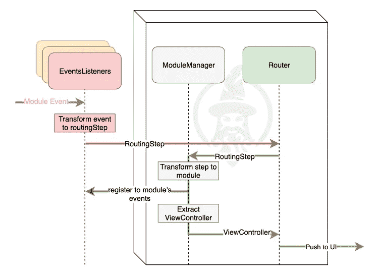

# 基于 MERLin 的 iOS 事件驱动架构

> 原文：<https://betterprogramming.pub/events-driven-architecture-in-ios-with-merlin-63d211e64698>

## 使用 MERLin 框架在 iOS 项目中实现事件驱动架构的简单方法

如果你熟悉 iOS 开发，你就会知道正确解耦 app 组件对于可测试性和整体灵活性有多重要。每个功能都应该独立于其他功能工作。理想情况下，每个功能都应该可以很容易地用提供相同功能的另一个组件替换。为了达到这个结果，我们采用面向协议的开发和依赖注入。最重要的是，我们按照众所周知的架构设计模式正式构建我们的应用程序。

事件驱动架构被 Wikipedia 描述为一种"*软件架构模式，促进事件的产生、检测、消费和反应。*

简而言之，在这个架构设计模式中有两个主要角色:一个事件*生产者*和一个事件*消费者*(或*监听器*)。

我们将*事件*定义为系统发送的通知监听器状态变化的消息。事件生成器是一个组件，它能够通知侦听器其内部状态的变化。生产者唯一的责任是发送这些消息，而不知道是否存在将对发出的事件做出反应的侦听器。

另一方面，监听器是一个对一个或多个*生产者*发出的事件感兴趣的系统。它的工作是监听发出的事件并对其做出反应，产生一种效果来实现听者的目的。电子商务应用程序中的产品列表分析事件监听器就是一个例子。它将监听由产品列表生成者生成的事件，并向分析提供者记录“选择产品”、“点击细化按钮”等事件…

如前所述，每个生产者实例可能有许多侦听器。每个监听器应该有一个独特的职责(分析、路由、内部日志等等)。

这样的架构设计模式给项目带来了很多好处。

**松耦合组件:**让生产者广播事件确保了生产组件不知道消息的接收者。此外，生产者和接收者都不知道对方的实现细节(通常被协议掩盖)。

由此衍生出**高度模块化**:只要两个生产者产生相同的事件集合，他们就可以互相替换，而不会影响监听器的实现或其他生产者。

**并行化开发:**在就特定生产者可以发出的事件集达成一致后，两个不同的开发人员可以并行化监听器和生产者的开发。当真正的实现还在构建中时，生产者可能会被嘲笑来触发听者的反应。从生产者的角度来看，它不知道将订阅其事件的侦听器。

**可测试性:**生产者可以独立于应用程序的其他部分进行测试，这要归功于他们自己的隔离组件的性质。生产者也可以被发出特定监听器所期望的相同事件的模拟所代替，因此监听器可以用模拟生产者来测试。

在事件驱动的架构中，拥有可靠的事件结构和可靠的事件调度机制非常重要。不幸的是，在 iOS 中，这些都不是现成的。开发者唯一可用的开箱即用的事件分派机制是缺乏类型安全的`NotificationCenter`,事件基本上是字符串。

这就是梅林发挥作用的地方。MERLin 是一个反应式框架，旨在简化 iOS 应用程序中事件驱动架构的采用。它强调模块化的概念，提倡一种易于实现的通信渠道，以便将事件从生产者传递给听众。

MERLin 使用 [RxSwift](https://github.com/ReactiveX/RxSwift) 在制作者和听者之间建立沟通渠道。

**模块:**在 MERLin 中，[模块](https://github.com/gringoireDM/MERLin/wiki/Modules)是一个框架，它公开了一个特定的功能，一个应用程序特性。

*   它是独立的，或者有非常有限的依赖性。
*   它不应该知道其他模块，也不公开实现细节。
*   任何模块都可以是特定类型事件的生产者，并且它必须被上下文化(它需要一个上下文来构建)。
*   理想情况下，提供相同功能的不同模块应该产生相同的事件。

在这个例子中，模块提供了一个能够显示餐馆列表的特性。它必须提供一个`unmanagedRootViewController`作为视图控制器，在需要时显示在屏幕上。

该模块正在创建`RestaurantsListViewController`正常工作所需的所有堆栈。在这个特定的实现中，有一个`RestaurantsListViewModel`将能够使用初始化器中传递的`_events` PublishSubject 来发出视图控制器上发生的事件。这只是处理事件发射的一种方式。这可能因您的实施细节而异。

**事件:**[事件](https://github.com/gringoireDM/MERLin/wiki/Events)在同一个系统域中被命名并且是唯一的，并且可以具有描述域中发生的变化的有效载荷。

提供相同服务的不同系统应该发出相同的事件。

在 MERLin 中，模块可以是事件生产者，并发出事件来表示状态的改变或动作的开始/结束。

在 MERLin 中，事件是符合`EventProtocol`协议的枚举:

在这个例子中，我们定义了一个`ProductDetailPageEvent`类型的事件列表。发出这些事件的模块使用该枚举来发布它可以发送给侦听器的所有可能的事件。MERLin 提供了一种从事件流中捕获特定事件的简单方法:

**路由器:**某些事件可能会导致路由到应用程序的另一个模块。[路由器](https://github.com/gringoireDM/MERLin/wiki/Routing)是根据 UI 使连接成为可能的对象。你必须在你的应用中构建一个`Router`对象，它必须符合`Router`协议。在协议扩展中，MERLin 提供了许多符合`Router`的功能。这使得新路由器的创建非常简单；所有的复杂性都简化为定义应用的根视图控制器:

在这个例子中，根视图控制器是一个简单的`UINavigationBar`，根是`restaurantList`。

**监听器:**在 MERLin 中，事件消费者被称为[事件监听器](https://github.com/gringoireDM/MERLin/wiki/Listeners)。

事件侦听器对模块的事件做出反应；它可以监听特定类型的事件，或者任何事件(来自任何生产者)。一些事件监听器可能导致应用程序内的路由。在这种情况下，我们称它们为路由事件监听器。这些特殊的侦听器有一个路由器，使得路由到新模块成为可能。

这里有三个事件监听器的例子:

每个监听器应该只有一个责任。可以监听特定模块事件通道的监听器数量没有限制，因此每个分析提供程序和每个模块都可以有一个特定的监听器。

# 模块管理器

新模块必须在某个时间点呈现给现有的事件监听器。这发生在`moduleManager`中。

MERLin 提供了一个现成的模块管理器实现。你所需要做的就是:在你的应用委托中创建一个`moduleManager`，创建你的监听器并将监听器数组传递给`moduleManager`的实例。

路由器需要模块管理器将一个`routingStep`转换成一个视图控制器，所以在实践中，一旦这个小设置完成，你将永远不必直接处理`moduleManager`。你所要做的就是专注于编写模块和监听器。

`RoutingEventsListeners`将使用带有路由步骤的路由器。路由器将向`ModuleManager`请求特定步骤的视图控制器，而`moduleManager`将创建正确的模块，将模块呈现给事件监听器，从中提取`viewController`，并将视图控制器返回给路由器。在这个阶段，如果侦听器对新生成器的事件感兴趣，那么它会订阅。

只要`ViewController`还活着，模块就会一直活着。当`ViewController`被释放时，模块实例也将被释放。

关于这个框架还有很多东西要讲。如果你很好奇，可以在 [GitHub](https://github.com/gringoireDM/MERLin) 上查看一下，阅读[文档](https://github.com/gringoireDM/MERLin/wiki)或者等待下一篇文章，在下一篇文章中，我们将详细探讨`EventsListeners`，并给出如何利用`routingContexts`以智能和可扩展的方式构建项目的提示。