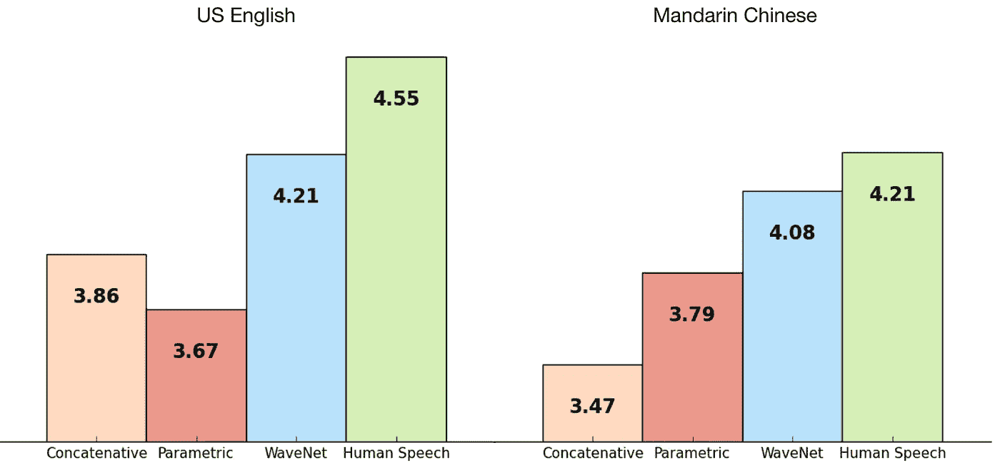

# 曾经想要建立一个文本到语音的应用程序吗？

> 原文：<https://betterprogramming.pub/ever-wanted-to-build-a-text-to-speech-app-115dee18f8c4>

## 文本转语音的应用思路及启示

[女同胞](https://unsplash.com/@cowomen?utm_source=unsplash&utm_medium=referral&utm_content=creditCopyText)在 [Unsplash](https://unsplash.com/s/photos/microphone?utm_source=unsplash&utm_medium=referral&utm_content=creditCopyText) 上拍照

文本到语音合成，简称 TTS，是人类语音的人工产物，在过去，这主要是通过人工使用称为[拼接](https://scholar.google.com/citations?view_op=view_citation&hl=en&user=Es-YRKMAAAAJ&citation_for_view=Es-YRKMAAAAJ:u5HHmVD_uO8C)文本到语音的过程生成人类语音来实现的。

这种方法只依赖于一个非常大的简短语音片段数据库，这些片段是从单个说话者那里记录下来的，然后重新组合以形成完整的话语。

一旦需要将文本转换为语音，文本到语音引擎将在这个大型数据库中搜索语音单元，匹配用户定义的输入文本，然后开始拼接过程，以获得最终的音频文件——可以将这想象为将音频片段拼接在一起。

虽然这个过程很大程度上已经过时了通过这种语音合成模式产生的语音，但它听起来非常单调，有点像机器人。

记住这实际上听起来如何——在某个时候，你们中的一些人可能已经涉猎了 Adobe 的 PDF 阅读器的文本到语音转换功能，并且可以理解听起来是多么难以忍受和机器人化。

随着深度学习和神经网络的最新进展，如 [WaveNet](https://wavenet.pepperdine.edu/) 的文本到语音，它现在已经从单纯的文本到语音的拼接转变为一个近乎流畅的类似人类的合成过程——至少根据我与传统文本到语音应用程序的比较。

WaveNet 是一个深度神经网络，用于生成原始音频波形，利用由谷歌在 2014 年收购的公司 [DeepMind](https://deepmind.com/) 设计的概率和自回归模型。

这种新的文本到语音合成方式产生了更真实的人类计算机生成的语音，人类听众将其评价为比最好的拼接系统明显更自然的声音。

随着 [WaveNet](https://deepmind.com/blog/article/wavenet-generative-model-raw-audio) 的推出，文本到语音空间已经开始获得更广泛的采用，特别是随着云服务的推出，如[谷歌的文本到语音](https://cloud.google.com/text-to-speech/) h 和其他技术，如 [AWS Polly](https://aws.amazon.com/polly/) 。

*图一。显示 WaveNet 与其他合成声音、人类语音的比较的图表。来源*[https://cloud.google.com/text-to-speech/docs/wavenet](https://cloud.google.com/text-to-speech/docs/wavenet)

人机交互是一件长期以来难以捉摸的事情。因此，这些更新的文本到语音合成方式让我们更加接近那个星际迷航时代，在那个时代，我们可以用自然、类似人类的声音进行口头交流，并从计算机系统获得实时反馈，如上图所示。

文本和语音之间的转换可以为您的应用程序增加强大的功能。

实现文本到语音和语音到文本选项最明显的好处是可访问性。一个有视觉障碍或阅读障碍的用户会从一篇文章的叙述版本中受益，而一个聋人可以通过阅读节目的抄本成为你的播客观众的一员。

既然我们已经了解了文本到语音转换的历史和现状，让我们来看看一些实用的开箱即用的用例以及我们可以应用文本到语音合成的地方。

其中一些可能会启发您如何开始将这项技术集成到您自己的应用程序中，并真正体会到应用程序集成文本到语音的可能性。

# ***阅读应用***

这是一个简单的用例，然而如此广泛，只受你的想象力的限制。想象一下，构建一个 Chrome 插件或应用程序，在你进行日常工作(如上下班)时，它会读取你最喜欢的内容并大声朗读出来。

以你正在阅读的这篇文章为例，它可以很容易地转换成 MP3，你可以随时随地听。

通过文本到语音转换，您现在能够获取文本内容并构建几乎任何内容的音频记录。我们中有些人没有好嗓子。

利用文本到语音的生成可能会节省时间和额外的成本，这些成本可能会用于建立家庭录音室或雇用帮手。

# **通知系统**

文本到语音转换可以集成到需要执行通知的系统中，如机场的通知，以逼真的声音提供实时乘客信息，医院基于队列的应用程序，或约会提醒。

想象一下，能够构建一个为 2FA 认证服务提供 PIN 码语音传递的应用程序。如果你使用过 [Telegram](https://telegram.org/) 或类似的要求你执行 2FA 的应用程序，你可能会注意到这样一个选项。

用户可以通过手机验证进行验证——通过向潜在注册者发送 PIN 码，然后注册者必须收听并在应用程序或网络服务中输入 PIN 码以完成该过程。

在这样的通知系统中启用文本到语音转换，可以让您不必雇用专业播音员。降低成本，因为对动态自动化的程度没有限制。

# **在游戏中——会说话的化身**

游戏玩家可以与游戏中的虚拟角色产生共鸣。当一个人创建一个数字化身时，本质上，他们是在给自己一个第二身份。

拥有数字化身的想法通常是为了逃避到另一个现实，就像音乐或写作中的创造性爱好一样。通过沉浸在虚拟世界中，数字身份扩展了我们自己的身份

想象一下，在基于用户定义的文本的游戏中，一个实时说话的角色通过文本到语音合成来呈现信息并与用户交互。

就像我们如何使用聊天应用程序一样，我们可以在您的网站上使用数字化身或自动聊天机器人来控制口头语言，以帮助您的用户提出支持请求。

一种培训模拟，您可以在其中与虚拟人物或卡通人物聊天，从而为复杂的主题添加人性化的内容。

会说话的头像可用于在演示文稿、视频、直播流等中与观众互动，从而帮助您以自动或实时的方式传达您的信息。

会说话的化身可以是任何东西，从虚拟接待员到个人助理，再到孤独或年老的用户。具有显著改善人机交互和人与人交流质量潜力的代理。

【https://ttsdemo.com/ 

# **物联网**

文本到语音的物联网结合文本到语音，带来了一些令人惊讶的智能和互联的用户体验——它实际上实现了许多连接到物联网的物品的语音。

你的闹钟、洗碗机、电视、家用和工业用电器现在都可以说话了。

想象一下，您的机顶盒现在可以大声读出您的节目指南、电影评论和摘要，或者您的智能电视以逼真的文本到语音合成语音读出您的天气通知、新闻报道、体育比赛结果、电影描述等。

# **电子学习**

文本到语音的另一个实际集成点是在电子学习系统中。将文本添加到语音中给这种应用带来了静态内容，如 PDF 材料、电子书或任何其他学习内容。

静态内容现在可以大声朗读出来，为学生提供更加刺激和吸引人的用户体验，否则用户将不得不通过阅读来消费。

虽然在语音中添加文本很棒，也有它的好处——它并不能免除阅读印刷品的需要，但可以补充和帮助那些由于残疾等限制因素而无法阅读内容的人。

# **监控和呼叫中心应用**

如果您是一名构建自动化呼叫管理系统的软件开发人员，或者您可能正在将监控和可观察性集成到微服务应用中，以便在出现问题时定期触发事件，所有这些现有的应用都可以得到增强，并可以从文本到语音合成集成中受益。

# 银行和金融

我一直着迷于银行应用程序是如何在可用性方面变得如此之好的。

我们现在有像亚马逊 Echo 这样的服务，可以让你不用手就能查看你的银行账户余额、转账和处理你最近的交易。

文本到语音转换可以通过提供免排队、免提服务来改变银行体验，从而为用户带来更好的体验。

无论您身在何处，都可以随时查看您的财务状况，随时获取股市通知——有时您只想快速了解某些金融产品的当前价格。

电话银行 IVR 当您需要在旅途中查看余额或支付最后一刻的账单时。

债务催收机构可以提前个性化、自动化和安排呼出电话通知来催收债务——我目前的银行仍然手动这样做，许多印度尼西亚银行也是如此。

想象一下，投入的时间可以更好地用于其他任务。

# 不太适合文本到语音转换的用例

像所有好的东西一样，也有同样数量的坏人，他们潜伏在幕后策划各种方法来利用这种技术进行非法使用。

让我们举个例子，利用恶意行为者操纵人们发布个人信息或冒名顶替来欺骗语音认证系统，或创建伪造的录音来诋毁公众人物的电话诈骗，等等。

因为声音是唯一的标识符，所以它是一种可行的安全生物识别措施。

随着物联网变得越来越普遍，语音激活访问变得越来越普遍。一些银行甚至对账户持有人采用语音认证解决方案。像所有的事情一样，当需求增加时，坏演员也增加，潜伏并等待规避系统。

如果你没有意识到或者一直过着有点与世隔绝的生活——2016 年，Adobe 发布了一款名为 Voco 的软件应用程序的实验演示，该应用程序允许进行新颖的编辑和生成音频。

被称为声音的 Photoshop。使用 Voco 工具，用户可以通过键入新单词来更改 voiceover 中的单词。我们可能会看到这种技术的各种不太好的应用，和 TTS 一起使用，来合成你的声音。它可能被用于非法目的。

一想到它就令人头脑麻木，有了这样的技术，你的声音可以被劫持并用于非法手段。暗示是不真实的，这里有一个有趣的[视频](https://www.youtube.com/watch?time_continue=286&v=0ybLCfVeFL4)你可以看看 deepfake 音频的可能性。

# 最后的想法

文本到语音的算法已经走了很长的路，绝对值得一提。我认为这项技术被低估了——随着越来越多的软件开发人员将这项技术集成到更多的应用程序中，我们可以看到更多的增长和采用。

您想知道如何轻松地开始将文本到语音集成到您的应用程序中，并利用基于深度学习的更强大的云文本到语音服务吗？

您可以阅读我的另一篇文章，介绍如何将文本到语音合成与 AWS Polly 和 Node.js 集成，并提供代码示例。

 [## 文本到语音:构建与 AWS Polly 和 Node.js 对话的应用程序

### 深入探讨如何构建“会说话的应用程序”

medium.com](https://medium.com/better-programming/text-to-speech-build-apps-that-talk-with-aws-polly-and-node-js-a9cdab99af04)