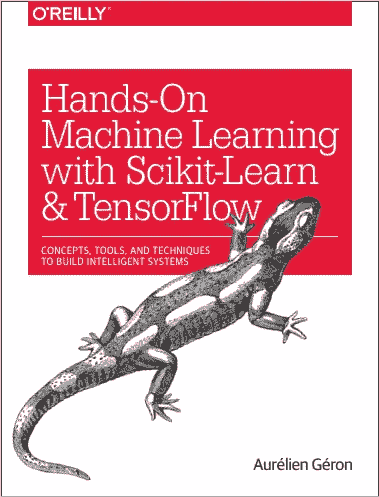
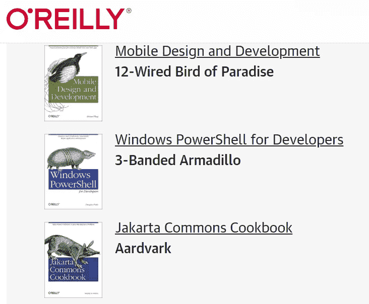
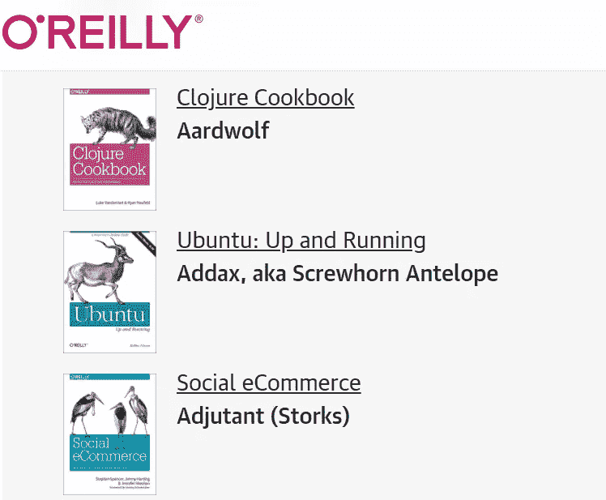

# 想过为什么奥莱利的书封面上有动物吗？

> 原文：<https://betterprogramming.pub/ever-wondered-why-all-the-oreilly-books-have-animals-on-their-covers-b9440d41570>

## 真的很有趣

图片来源:奥赖利

这是我正在读的书，当我吃午饭的时候，它的封面在我的笔记本电脑上打开了。我必须承认，几秒钟后，我对三明治后面的变色龙感到相当不安。我当时把屏幕收了起来，但这让我开始思考，在所有奥莱利书籍的封面上使用动物这种古怪的设计模式背后的原因可能是什么。我深入了解了这一点，并发现了一些有趣的事实。

# 奥莱利书籍封面设计的历史

在文章“[O'Reilly animals 的简史](https://www.oreilly.com/content/a-short-history-of-the-oreilly-animals/)”中提到，在 20 世纪 80 年代中期，O ' Reilly 曾经通过邮购的方式销售 Unix 主题的短篇书籍。这些书是用订书钉装订在一起的，有着朴素的棕色封面。随着时间的推移，蒂姆·奥莱利(生于 1954 年 6 月 6 日，奥莱利媒体公司的创始人，前身是奥莱利&联合公司】*T3)决定通过实体店销售书籍。他为书店出售的前两本书聘请了一名图形设计师，但他对它们并不满意。*

然后一个叫伊迪·弗里德曼的女人出现了。她和一位参与公司营销和技术写作团队的女性是邻居。在一次友好的聊天中，两位女士讨论了当时由奥莱利出版的两本书的封面，弗里德曼被问及她是否有一些更好的想法。

从文章中直接引用弗里德曼的话:

> “我听说过 Unix，但我对它的概念非常模糊。我从未遇到过 Unix 程序员或试图用 vi 编辑文档。甚至与 Unix 相关的术语——VI、sed 和 awk、uucp、lex、yacc、curses 等等——都很奇怪。在我听来，它们就像是《龙与地下城》中的词汇，这是一款在极客(主要是男性)亚文化中流行的游戏。有时候在设计时，事情会毫不费力地结合在一起——一切都井井有条，就好像这是不可避免的一样。它只是流动。当我寻找书籍封面的图片时，我发现了一些 19 世纪的奇怪的动物版画。它们似乎很适合那些听起来奇怪的 UNIX 术语，而且非常深奥，我想它们可能会吸引程序员。而且，当我调查真实动物的属性时，我很快发现特定技术和特定动物之间有着有趣的对应关系。随着我对技术和动物的了解越来越多，这种共鸣也越来越强烈。我是如此充满活力和灵感，以至于我花了整整一个周末的时间在封面上工作，没有睡多少觉。周末结束时，我把几幅草图交给邻居带到办公室。
> 
> “奥莱利的一些人大吃一惊:他们认为这些动物怪异、丑陋，还有点吓人。但是蒂姆很快就明白了——他喜欢动物的古怪，认为这有助于使这些书从其他出版商的产品中脱颖而出——而且感觉很好。就这样开始了。从那时起，我们已经出版了数百本动物书籍，这个品牌在全世界都很有名。"

这肯定奏效了。由于封面上的动物，即使在最拥挤的书摊上，奥赖利的书也能被认出来。这种区别极大地促进了无形的品牌识别和价值体系。

这就是奥莱利书籍封面设计的历史。

我脑海中出现的下一个问题是，封面上描绘的动物背后是否有任何意义——也许它们濒临灭绝或其他什么。下一节回答这个问题。

# 封面上动物插图的意义

来源:[奥赖利动物](https://www.oreilly.com/animals.csp)

来源:[奥莱利动物](https://www.oreilly.com/animals.csp)

奥赖利用了整整一个章节来介绍迄今为止出版的超过 1245 本书中的动物。如果你想知道在你的任何一本奥赖利书中，那种盯着你看的动物的名字，你可以去下面的网页，很容易地找到它们的名字。

 [## 动物动物园-奥赖利媒体

### 你奥莱利书封面上的动物是什么？你会发现它列在这里。

www.oreilly.com](https://www.oreilly.com/animals.csp) 

弗里德曼和凯伦·蒙哥马利一起创作了许多这样的插图。最初，他们使用多佛图片档案馆，该档案馆提供 18 世纪和 19 世纪的动物雕刻作品，没有版权。

 [## 多佛图片档案馆

### 多佛画报档案馆在这个系列中有 141 个条目

www.overdrive.com](https://www.overdrive.com/series/dover-pictorial-archive) 

随着他们对动物研究的深入，他们意识到，由于各种原因，如栖息地破坏、狩猎、偷猎、人与动物的冲突以及非法野生动物贸易，许多在 19 世纪大量存在的动物在 21 世纪已经濒临灭绝。

## 一些例子

来自"[Learning The VI&Vim Editors](http://shop.oreilly.com/product/9780596529833.do)、来自" [sed & awk](http://shop.oreilly.com/product/9781565922259.do) 、来自"[的玳瑁龟、CouchDB 入门](http://shop.oreilly.com/product/0636920020837.do)、来自"[运行 Mac OS X Tiger](http://shop.oreilly.com/product/9780596009137.do) 的老虎、以及来自" [Hadoop:权威指南](http://shop.oreilly.com/product/0636920033448.do)的非洲象等等。

以下是对弗里德曼文章的直接引用:

> “我们希望通过在奥赖利动物网站上强调大大小小的保护项目，从非科技到高科技，不仅会提高人们对已经在做的事情的认识；也许它还会激励像你这样聪明、懂技术的人想出拯救和保护世界野生动物的新方法。对我们来说，这才是真正重要的工作。”

因此，这份遗产实际上是一份非常用心的遗产。他们在第一次尝试中就获得了如此正确的结果，这是埃迪·弗里德曼应该在她走进的每个房间里受到称赞的事情。一本书的一个有思想的封面几乎总是成为一个极好的营销点，不管是什么类型。但这里我们有一个出版社的例子，它为所有的极客社区出版了不止一本而是这么多令人惊叹的技术书籍(我很自豪地说，因为我也是其中之一)同时精心制作了如此有思想的遗产，并提出了我们的生态系统今天面临的最重要的问题之一。他们已经做了将近 30 年，这无疑是值得称赞的。

我对奥莱利图书封面插图背后的原因和历史非常满意，我希望你也是。如果你觉得我引用错了或者说错了什么，请在评论区告诉我，我会尽最大努力让这篇有价值的文章尽可能没有错误。

# 奖励积分

1.  奥赖利还发布了一本成人涂色书，专门介绍奥赖利的动物插图。

 [## 奥赖利动物:奥赖利媒体公司的成人涂色书(2016-02-29)

### 《奥赖利动物:Amazon.com 奥赖利媒体公司成人涂色书》( 2016-02-29)。*免费*送货到…

www.amazon.com](https://www.amazon.com/OReilly-Animals-Adult-Coloring-2016-02-29/dp/B01K3LH940) 

2.一个信息丰富的子域，完全致力于在一个地方收集奥赖利书籍封面上的所有动物。

 [## 动物动物园-奥赖利媒体

### 你奥莱利书封面上的动物是什么？你会发现它列在这里。

www.oreilly.com](https://www.oreilly.com/animals.csp?utm_source=thenewstack&utm_medium=website&utm_campaign=platform) 

3.埃迪·弗里德曼的博客

 [## 伊迪·弗里德曼的博客

### 我目前给大家的建议是这样的:爱上你的生活。追求给你带来快乐的事情。放开…

ediefreedman.blogspot.com](http://ediefreedman.blogspot.com/2011/06/fall-in-love-with-your-life.html?utm_source=thenewstack&utm_medium=website&utm_campaign=platform) 

下面是她博客中的一段美丽的引言，也是我目前给大家的建议:

> “爱上你的生活。追求给你带来快乐的事情。放下那些不重要的事情。知道区别。
> 
> 故意的。把它作为你的目标。让它成为你的现实。"

4.免费奥莱利书籍:这里有适合每个人的东西。

 [## 免费奥莱利书籍，电子书，网络广播，会议，教程，视频-奥莱利媒体

### 奥莱利媒体的免费产品汇编-电子书，在线书籍，网络广播，会议，教程，和…

www.oreilly.com](https://www.oreilly.com/free/) 

5.不是每个人都喜欢所有这些动物。事实上，O'Reilly 已经收到了客户的投诉，他们对蜘蛛、蟒蛇或变色龙感到不舒服，他们不得不用报纸或空白的白纸盖住这些图像。他们根据这些反馈不时地对他们的在线门户网站进行一些修改(曾经在结账页面上把一个看起来很危险的蛇插图改成了一个看起来很友好的兔子)*。*但总的来说，他们一直在做他们正在做的事情，因为每个知道这些插图最终目的的人都不会对它们感到任何不适。我希望我们都将爱我们的奥莱利书多一点！

这是一篇由我的好奇心引发的轻松文章。我会发表更多关于数据科学、机器学习、人工智能和统计学的文章。

快乐学习，快乐成长！