# 每个 JavaScript 数组方法

> 原文：<https://betterprogramming.pub/every-javascript-array-method-a50905f916bd>

## 移动、取消移动、推送、弹出、映射等等

Pierre Bamin 在 [Unsplash](https://unsplash.com?utm_source=medium&utm_medium=referral) 上拍摄的照片

数组是任何编程语言的一个重要方面，因为我们可以在里面存储数字、字符串、对象甚至其他数组的数据。能够有效地使用数组对于任何开发人员来说都是一项重要的技能，不管是哪种编程语言。JavaScript 提供了许多方法来简化数组操作。

我们可以用以下方式定义数组:

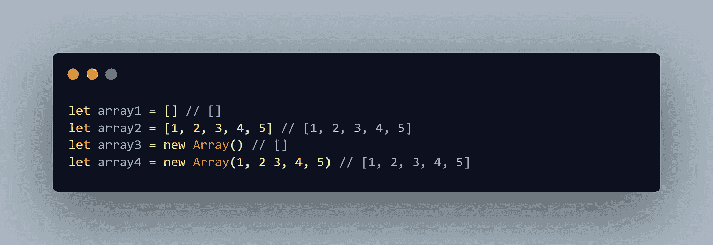

数组声明

数组是 JavaScript 中的一种数据类型。它们用于存储任何数据类型的数据，但与 JavaScript 中的对象不同(类似于 Python 中的字典)，每个元素的索引都很重要。

尽管数组可以用来存储任何类型的数据，但是在一个数组中存储类似的数据通常是有用的，比如一个注册了某个事件的用户数组或者一个待办事项数组。从上面的代码片段中，我定义了两个您可以使用的方法:

*   将所有内容放在方括号中
*   使用`Array`构造函数

第二种方法很少使用，但也很有用。让我们深入探讨这篇文章的主要目标。我很高兴向您介绍这些方法。我希望你也对开始感到兴奋。

照片由 [Unsplash](https://unsplash.com?utm_source=medium&utm_medium=referral) 上的 [Japheth Mast](https://unsplash.com/@japhethmast?utm_source=medium&utm_medium=referral) 拍摄

# 数组方法

JavaScript 数组有几种方法。这篇文章将带你了解其中的一些。

我将从最常见的开始:

大多数时候，给定一个数组，你会想在末尾或开头添加一个元素，去掉第一个或最后一个元素。实现以下内容有些容易。

## **推送方式**

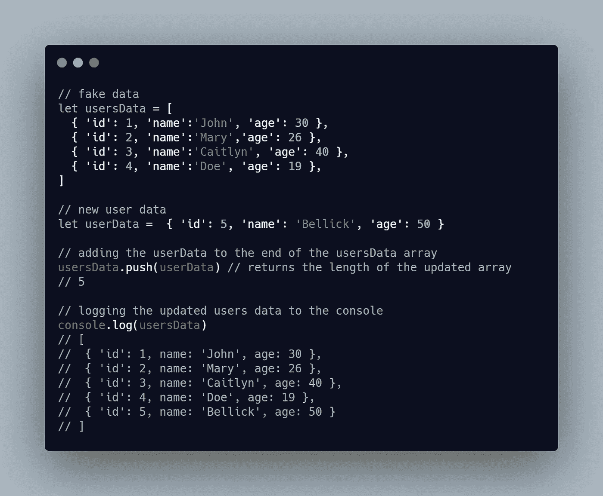

我要讲的第一个方法是`push` 方法。这个方法只是在数组末尾添加一个元素，并在添加元素后返回`usersData`数组的长度。上面的代码片段定义了一个`usersData`数组，它模拟了数据库/API 调用的结果。

然后我们创建一个新用户，我们想把这个新用户添加到我们的`usersData`中。除了对 ID 进行硬编码之外，一种不使用真实数据库的处理方法是，在将元素加 1 之前，将 ID 的值设置为数组的长度。

## 流行方法

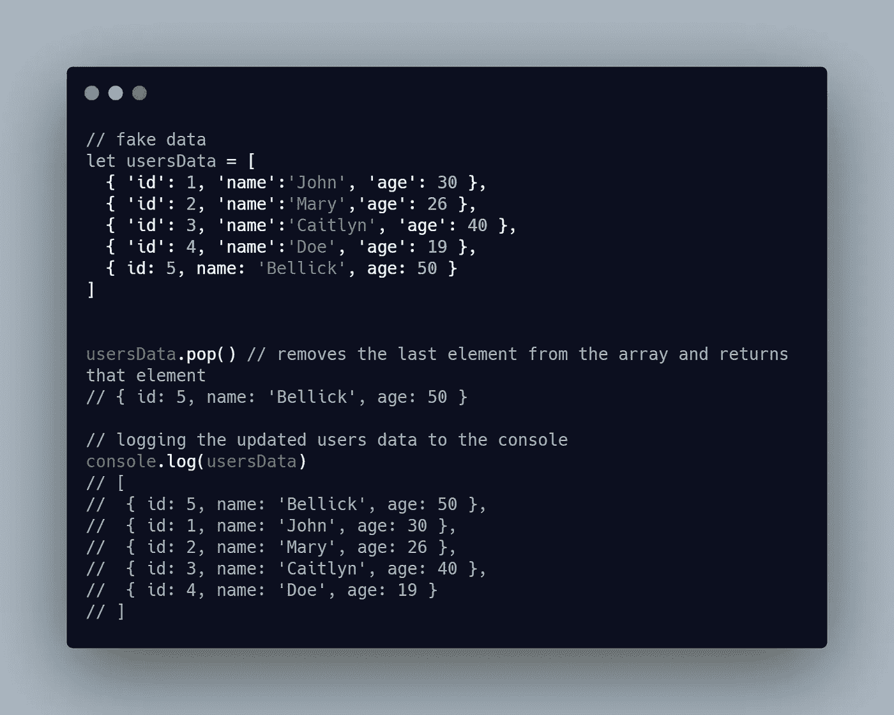

`pop`方法只是删除数组的最后一个元素并返回该元素。

上面的代码片段定义了一个模拟数据库/API 调用结果的`usersData`数组。然后，我们删除数据的最后一个元素。

## 移位法

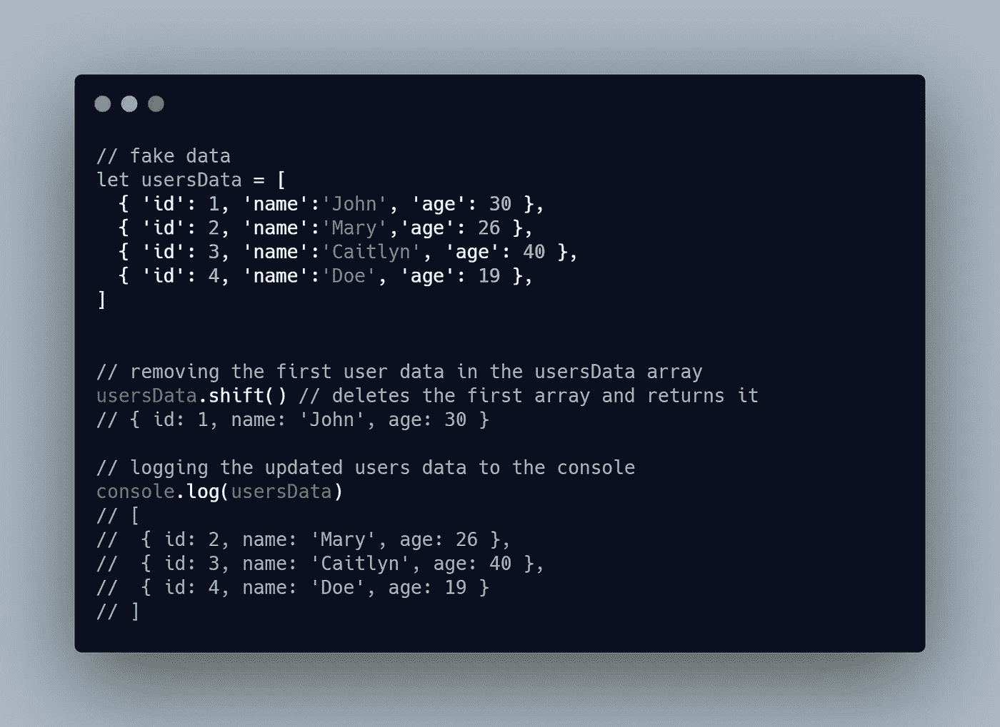

与`pop`方法不同，`shift`方法只是删除数组的第一个元素并返回该元素。上面的代码片段定义了一个`usersData`数组，它模拟了数据库/API 调用的结果。

## 非移位方法

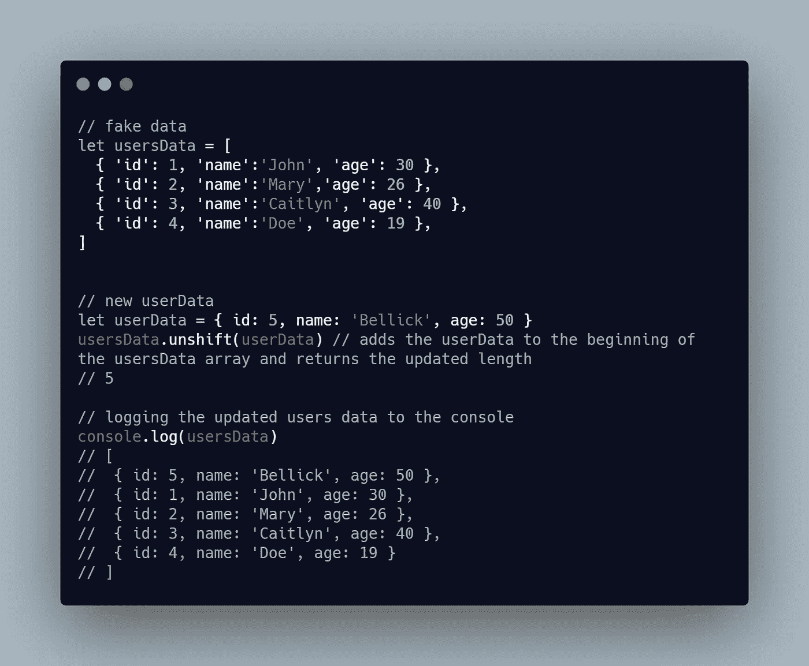

与`push`方法不同，`unshift`方法只是在数组的开头添加一个元素，并返回新数组的长度。上面的代码片段定义了一个`usersData`数组，它模拟了数据库/API 调用的结果。然后我创建了一个新的用户对象，我们想把它添加到数组的开头。

# ES6 方法

ES6

ES6 是 ECMAScript 6 的简称，是 2015 年 6 月发布的 JavaScript 版本。似乎维护 JavaScript 的开发人员喜欢我出生的月份，因为那是他们大多数版本发布的时间。

如果你只是在学习 JavaScript，ES6 会让你的生活更加轻松。它不仅提供了数组方法，还提供了诸如析构、箭头函数、编写面向对象和模块化代码的更好方法等等。

大多数 ES6 数组方法都采用回调函数，因此它们被称为*高阶数组方法。箭头函数在高阶函数中非常常见，因为它简化了我们的代码*

## **地图**方法

如果有什么 ES6 数组方法是您几乎会一直使用的，那就是这个方法。这是我在 JavaScript 和 Python 中最好的数组方法。即使一些 JavaScript 开发者已经尝试在 ES6 之前实现`map`，标准的`map` 方法还是在 ES6 的 JavaScript 中引入的。在下面的代码片段中，我以三种方式实现了`map`:

*   **使用常规的 JavaScript 函数:**这里我给函数传递了两个参数，第一个是`item`，这是我想对其执行操作的元素，另一个是可选参数`index`，这是每个元素的索引
*   **使用箭头函数:**我也像第一个例子一样传递了两个参数，但是这里的回调函数是一个箭头函数，这使得代码整洁了很多。
*   我也使用了箭头函数，但是我只传递了一个参数——我想要迭代的项。如果我不需要索引，这很有用。

如果我想在没有 ES6 方法的情况下实现这个函数，我必须使用标准的`for`循环:`for (let i = 0; i < arr.length; i++) {doSomething()}`在数组中循环。但是多亏了 ES6，我们可以做到这一点:

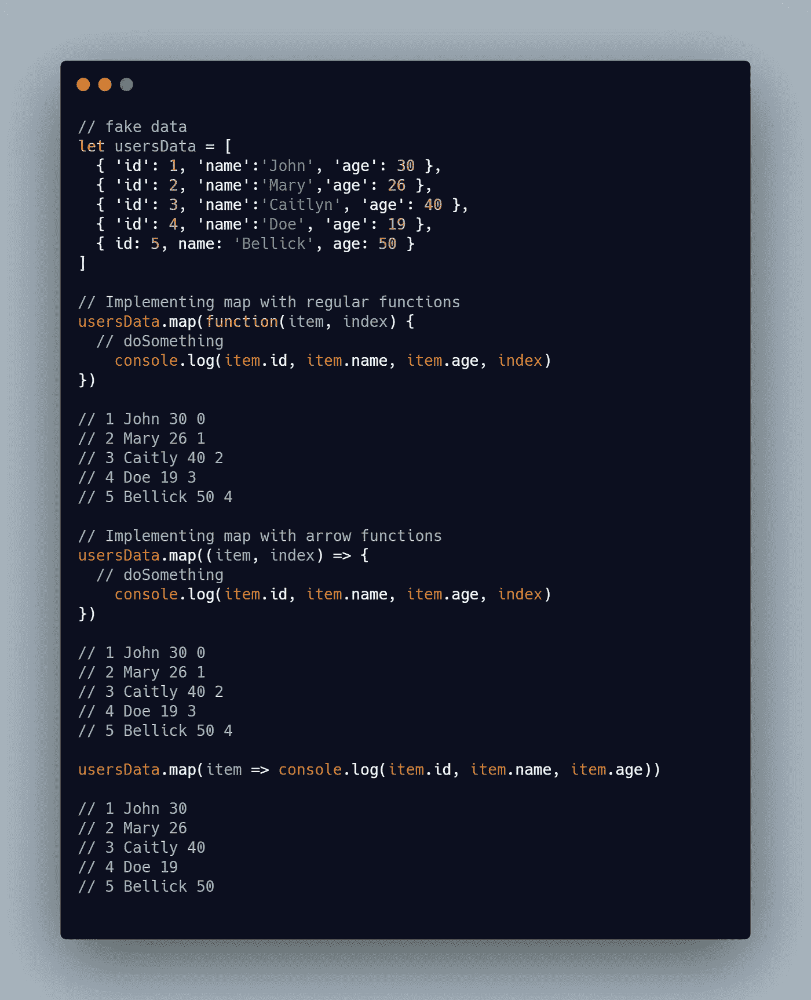

## 该过滤方法

`filter`方法是另一个你现在应该使用的高阶数组方法。`filter`做的事情很简单。给定一个元素数组，我们想从初始数组返回一个新数组，其中特定条件是`true`。回调函数必须返回一个布尔值，满足条件的元素将出现在新数组中。

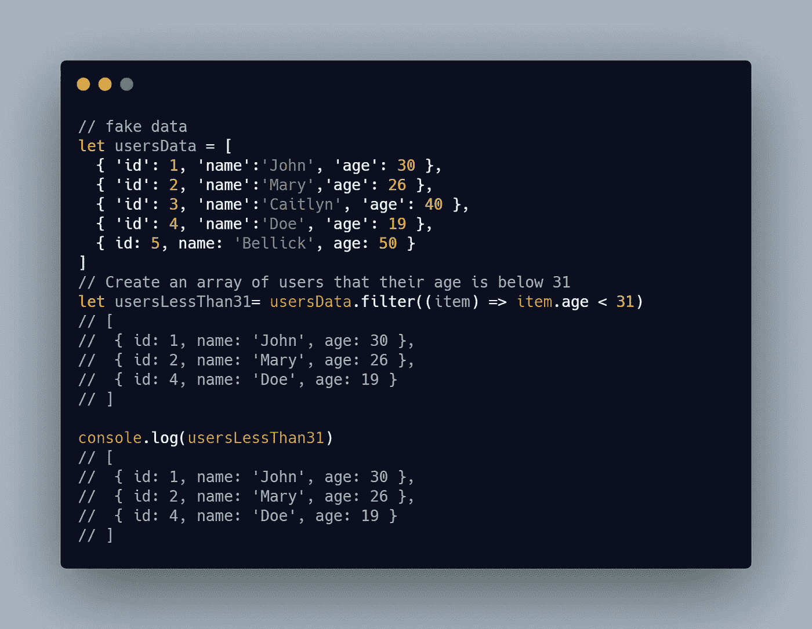

## 该简化方法

这非常好，我认为这是目前为止我提到的所有方法中最难的。这个方法做的是使用一个特定的回调来减少数组。例如，如果我想求出一个数组中所有元素的总和或一个数组中所有元素的乘积，这个方法是一个很好的使用方法，而不是循环和递增初始总和或乘积。

## forEach 方法

这个方法类似于`map`方法，但是在这种情况下，它不返回一个新的数组。它更像是 JavaScript 中的常规`for`循环，但是以一种更干净和更高级的方式。您可能已经知道，它需要三个参数。第一个是数组中的项目，第二个是项目的索引(可选)，第三个是当前元素所属的数组对象。

在下面的代码片段中，我使用了`forEach`来操作文档对象模型(DOM)，这非常酷。我可以更新数组，呈现在 DOM 上的列表项会自动改变。

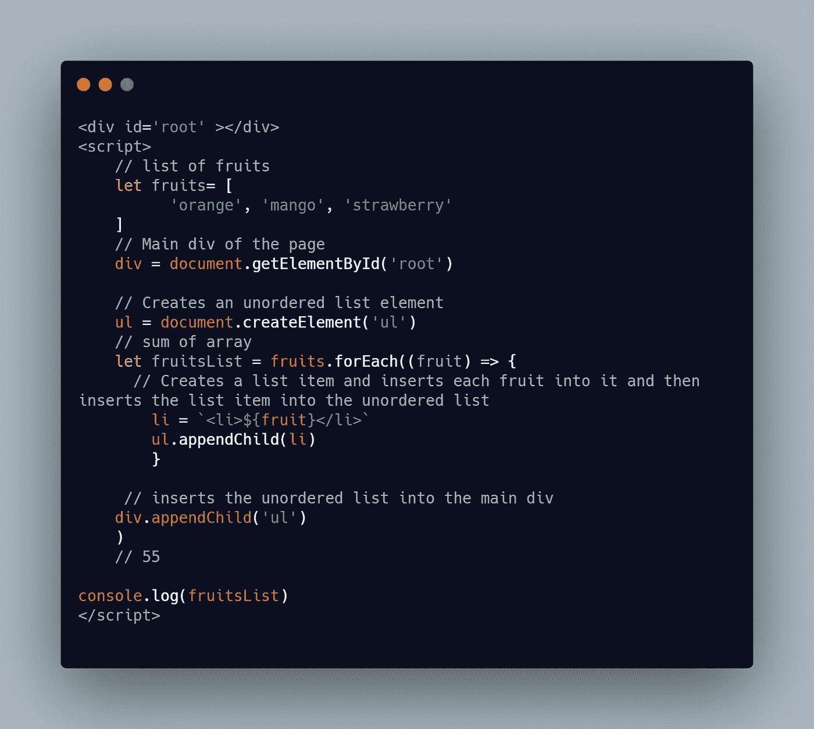

## concat 方法

有些情况下，您会想要将两个或多个数组连接或合并在一起。那么，这个功能就会非常得心应手。在两个数组上调用`concat`会产生一个由两个数组组合而成的新数组。

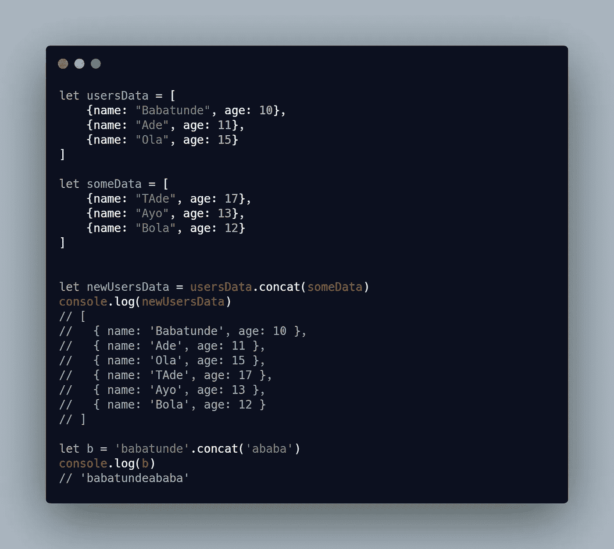

## 每一个和一些方法

如果您想知道数组中的所有元素是否都通过了某个条件，以及数组中的某些元素是否分别通过了某个条件，那么这些方法非常有用。

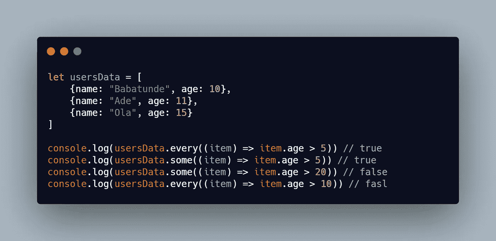

其他方法包括:

**填充方法**

用作为参数传递的值填充数组中的每个元素:`[1, 2, 3, 4].fill(1)` // `[1, 1, 1, 1]`。

**条目方法**

这使得数组表现得像一个具有键-值对的对象，其中键是索引，值是元素。

**查找方法**

此方法返回数组中通过测试的第一个元素。它接受一个回调函数，该函数返回一个布尔值。

**拼接方法**

此方法采用无限数量的参数，前两个参数分别是要开始插入和移除元素的索引以及要移除的元素数量，其余参数是要添加到数组中的元素。它返回一个移除元素的数组，并对该数组进行变异。

**反向法**

reverse 方法反转数组。请注意，它会对数组进行变异，这意味着它会更改数组，而不仅仅是创建数组的副本。

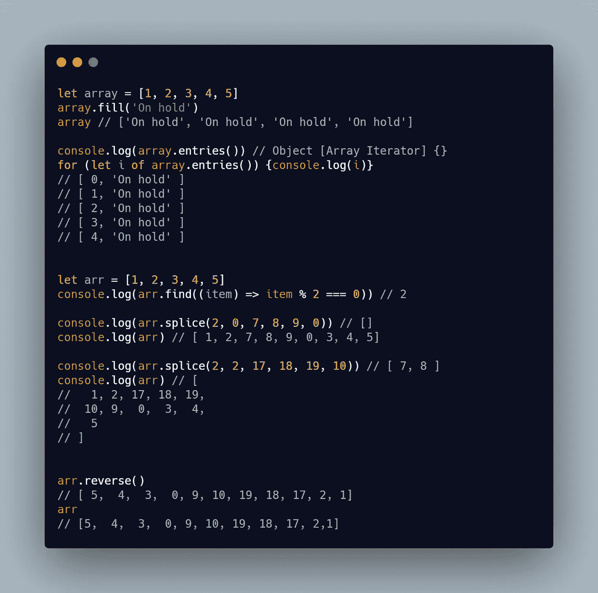

**加入方法**

此方法将数组转换为字符串。请注意，它并没有改变数组，只是创建了数组的一个副本。与此方法相反的是`split`方法，它将字符串转换为数组。它将一个字符串作为参数，这个字符串将用于连接数组的每个元素。

**平法**

`flat`方法是 ES11 中添加的新方法(ES11 是今年 6 月创建的)。此方法展平数组。

假设我们有一个包含一个数组的数组，我们想找出数组中每个元素的和与积。我的意思是，如果我有一个由`[[1, 2], [3, 4]]`定义的数组，那么总和应该是`10`，乘积应该是`24`。

一种方法是遍历初始数组，遍历每个元素，得到和与积。

使用 ES6，我可以遍历初始数组并使用`reduce`方法获得主数组中每个元素的和与积——使用它获得总和与积。但是使用`flat`数组，我可以将主数组扁平化，从而返回一个只包含数字的数组，并且我可以对它使用`reduce`方法。

**平面图方法**

这是`flat`和`map`的组合。它将数组中的每个元素映射到一个给定的回调函数，然后展平得到的数组。

假设我们想得到一个非扁平数组中每个元素的平方，我们想把它弄平。这种方法会让我们的生活更轻松。在我使用下面代码片段中的`flatMap`方法的部分，它接受一个数组元素，我返回了一个新数组，它是元素的平方。最后，它展平生成的数组。

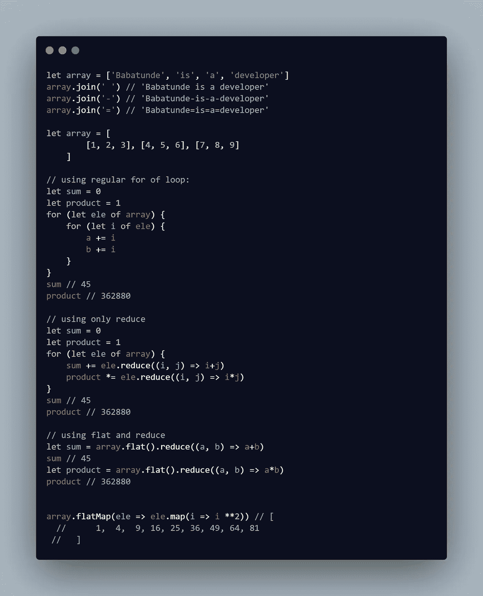

# 结论

本文向您介绍了一些 JavaScript 数组方法。相信我有更多的方法。你还想把其他方法添加到列表中吗？

黑客快乐！