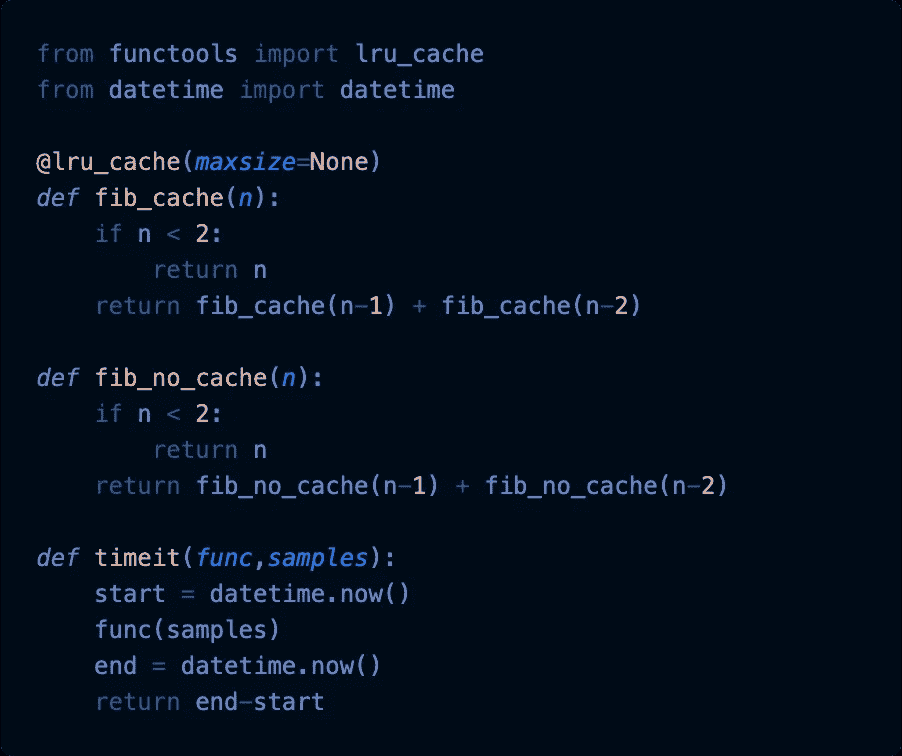
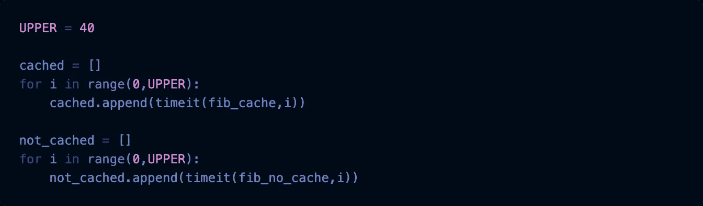
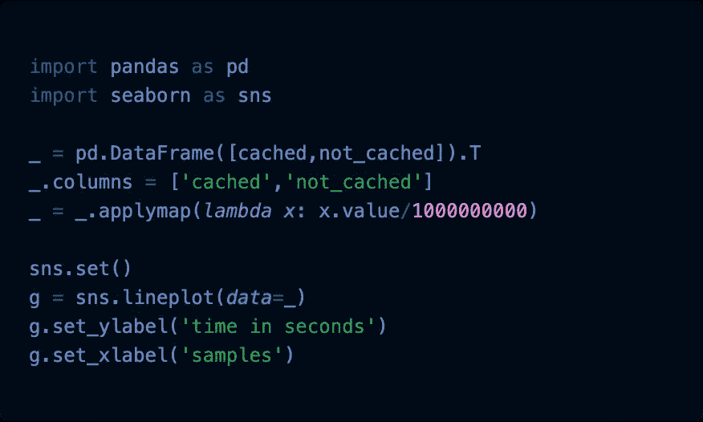

# 每个 Python 程序员都应该知道标准库中的 LRU 缓存

> 原文：<https://betterprogramming.pub/every-python-programmer-should-know-lru-cache-from-the-standard-library-8e6c20c6bc49>

## 通过使用简单的缓存功能，只需一行代码就可以加快函数的速度

来自 [Pixabay](https://pixabay.com/?utm_source=link-attribution&utm_medium=referral&utm_campaign=image&utm_content=1853340) 的[像素](https://pixabay.com/users/Pexels-2286921/?utm_source=link-attribution&utm_medium=referral&utm_campaign=image&utm_content=1853340)的图像

不久前，我构建了一个每天运行的 ETL 管道，从外部服务提取数据来丰富我的输入数据，然后将结果加载到数据库中。

随着输入数据的增长，我的 ETL 过程变得越来越慢，因为等待外部服务的响应非常耗时。经过一番调查，我意识到与总记录数(~500k)相比，我没有那么多不同的输入值(~500)。

所以，换句话说，我用相同的参数调用外部服务大约每条记录 1000 次。

像这样的情况是使用缓存的主要用例。缓存函数意味着每当我们第一次计算函数的返回值时，我们将输入和结果放入一个字典中。

对于每个后续的函数调用，我们首先通过查看缓存来检查结果是否已经被计算过。如果我们在那里找到它，完美，不需要计算！如果没有，我们计算结果并将输入和结果存储在缓存中，以便下一个函数调用可以查找它。

Python 标准库附带了许多鲜为人知但功能强大的包。对于我们手头的例子，我们将使用来自 [functools](https://docs.python.org/3/library/functools.html) 的`lru_cache`。(LRU 代表最近最少使用，确切地说，缓存将通过首先丢弃最近最少/最早的条目来保留最近的输入/结果对)

# 从 Fun(c)工具导入 lru_cache

括号中的`c`有点像爸爸开的玩笑，因为这样一来`functools`就变成了`fun tools`，使用缓存肯定很有趣！

[链接](https://gist.github.com/FBosler/7f5597b6e308762048d252f53ef8e4fe)

这里没有多少魔法。我们导入`lru_cache`并修饰一个函数，用它生成[斐波那契数列](https://en.wikipedia.org/wiki/Fibonacci_number)。

修饰一个函数意味着我们用缓存函数包装它，无论何时我们随后调用`fib_cache`函数，我们都在调用缓存的函数。

# 比赛开始了

[链接](https://gist.github.com/FBosler/7f5597b6e308762048d252f53ef8e4fe)

我们运行了一个实验，我们计算了从 0 到 40 的所有斐波纳契数在缓存和未缓存版本的函数中的计算时间，并将结果放入各自的列表中。

# 获胜者是

对于较低的斐波那契数，这没有太大的区别，但是一旦我们达到大约 30 个样本，缓存函数的效率增益就开始增加。

我没有耐心让非缓存版本运行超过 40 个样本，因为它需要的时间呈指数增长，而对于缓存版本，它只是线性增长。

[链接](https://gist.github.com/FBosler/7f5597b6e308762048d252f53ef8e4fe)

你有它！您离 Python 中的缓存只有一步之遥。这并不可怕。

如果你想了解更多关于如何加速你的代码，看看这篇关于如何并行化你的代码的文章。

 [## 每个 Python 程序员都应该知道并不秘密的线程池

### 使用多线程技术，只需几行代码就可以将 I/O 代码的速度提高几个数量级

medium.com](https://medium.com/better-programming/every-python-programmer-should-know-the-not-so-secret-threadpool-642ec47f2000)