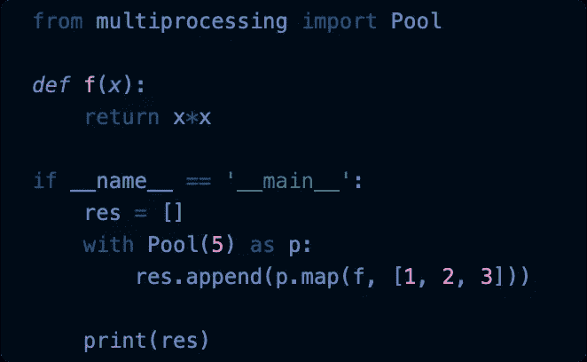
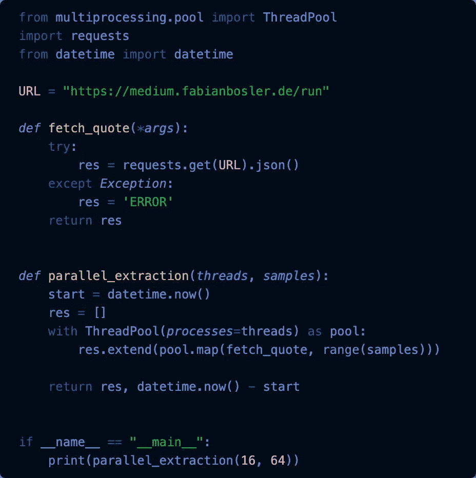
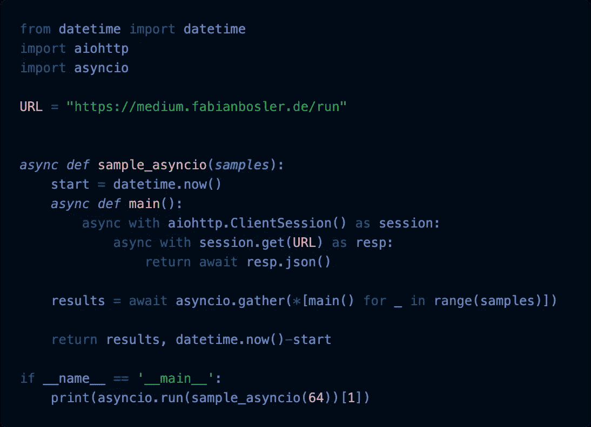
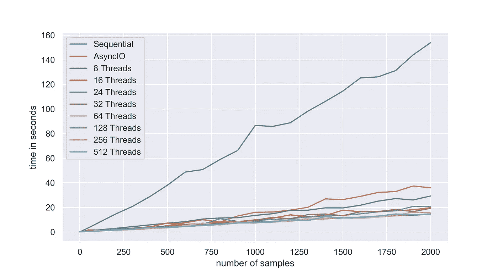
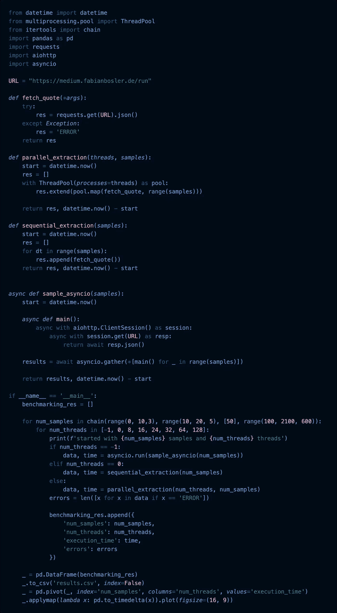

# 每个 Python 程序员都应该知道并不秘密的线程池

> 原文：<https://betterprogramming.pub/every-python-programmer-should-know-the-not-so-secret-threadpool-642ec47f2000>

## 通过多线程，您只需要几行代码就可以将代码速度提高几个数量级

图片来自 [Pixabay](https://pixabay.com/?utm_source=link-attribution&utm_medium=referral&utm_campaign=image&utm_content=3106134)

当我不得不在我们的 CRM 系统上运行数百个外部更新操作而没有批处理它们的选项时，我第一次遇到了用 Python 并行化我的代码的必要性。

每个更新操作将通过一个 API 调用提交，然后需要大约两到三秒钟来处理。这些更新会触发 CRM 中的流程，有时会引发错误。

出错的可能性意味着我不得不经历无数次的运动，以确保每件事都以我满意的方式完成。

使这一努力耗时如此之久的是这样一个事实，即在每一次 API 调用之后，我的脚本必须在提交下一个 API 请求之前等待响应。

像这样的情况是多线程(Python 中可用的并行概念之一)非常方便的典型用例！在 Python 中，本质上有三种形式的并发性:

*   多线程—通过`threading`先发制人。
*   协作式多任务处理——通过`asyncio`。
*   多重处理——通过`multiprocessing`。

一般的建议是对 CPU 受限的问题使用多处理(即计算密集型)，对 I/O 受限的问题使用多线程/多任务处理(即等待输入/输出完成)。

当然，可能会有例外，最终，这取决于手头的具体情况。以我的经验来看，一旦性能变得至关重要，考虑所有选项确实是有意义的。

我建立了一个 web API (AWS API gateway + Lambda ),它可以提供激励性的引用，我们可以“做”这些来进行基准测试。

这里有一个[样本！](https://medium.fabianbosler.de/run)

# 进程池

让我们先来看看来自`multiprocessing`图书馆的`Pool`。我发现`Pool`有一个非常容易使用的 API。本质上，您只需在`with`块中添加`Pool`，就已经并行化了您的代码。

[此处代码](https://gist.github.com/FBosler/c77d28f7d719ac52364bd8420cb0880d#file-multiprocessing-py)

如果你问我，我会觉得非常简单。并发的其他实现要复杂得多。

也就是说，它们要求你主动管理工人、任务、执行者、队列、协程等等。对我来说有点太多的认知开销了。真的很喜欢`Pool`的简洁。

> “简单比复杂好。”——蒂姆·彼得斯的《Python 之禅》

让我们快速探究一下`Pool`到底是做什么的。我们首先用特定数量的进程(在我们的例子中是五个)实例化这个池。作为一个经验法则(对于 CPU 受限的任务)，使用与 CPU 核心数量大致相同的进程。

接下来，我们有`p.map()`，`p.map(<func>, <iterable>)`带一个函数和一个 iterable，非常像常规的`map`。

然而，与`map`相比，主要的区别是我们现在有多个进程并行处理 iterable。一旦一个进程完成了来自 iterable 的当前元素，该进程就返回到 iterable 并获取下一个元素来应用函数。

多重处理的“问题”是它带来了一些[开销](https://stackoverflow.com/questions/18114285/what-are-the-differences-between-the-threading-and-multiprocessing-modules/18114475#18114475)，这就给我们带来了多线程。与进程相比，线程是轻量级的，带来的开销也少得多(并且允许彼此之间更容易地共享内存)。

# 秘密“从多处理池导入线程池”

你可能会问，为什么要保密？嗯，事情是这样的，`ThreadPool`是[没有真正记录](https://stackoverflow.com/questions/3033952/threading-pool-similar-to-the-multiprocessing-pool#answer-3386632)。

不过接口和`multiprocessing.Pool`是一样的(注意导入是从`multiprocessing**.pool**`而不仅仅是从`multiprocessing`)。

让我们开始以多线程的方式从 web API 获取报价！

[此处代码](https://gist.github.com/FBosler/c77d28f7d719ac52364bd8420cb0880d#file-multi_threading-py)

# 为了完整起见— Asyncio

Asyncio 似乎是一种新的狂欢派对(不要与“ay，se cayó”混淆，西班牙语意思是:“哦，他摔倒了”)。

Asyncio 是在 Python 3.4 中引入的，但后来有了很大的发展。我真的非常非常不喜欢这个语法，但是我想把它包含在基准测试中。

它不同于多线程和多处理，因为它只使用一个进程和一个线程，但异步执行代码。

这里的关键点是，这些异步例程可以暂停并等待它们的结果，同时移交给其他例程(执行程序决定上下文切换的时间)。事件循环有助于这一切。

[此处代码](https://gist.github.com/FBosler/c77d28f7d719ac52364bd8420cb0880d#file-asyncio-py)

# 获胜者是！

基准测试时间到了！

*   *顺序版本*(即一个接一个)是迄今为止最慢的，每 1000 个样本增加 80 秒左右。
*   其次是 *AsyncIO* ，大概比顺序版快 3-5 倍。
*   八个线程已经让我们的速度提高了五倍。
*   64 个以上的线程让我们的速度提高了 10 倍！(这是我的 Mac 开始封顶的地方。但是，如果有合适的环境，如硬件、足够大的样本量、互联网连接和可以处理您的请求的服务器，您可以走得更远，并看到积极的结果。)

我得说，从 160 秒到 15 秒是相当大的成就！

值得注意的是，在我的本地机器上，我能够通过`multiprocessing`将获取 2000 个样本所需的时间减少到大约 12 秒，这起初可能看起来违反直觉(考虑到这是一个 I/O 绑定的问题)。

然而，与`multithreading`不同的是，`multiprocessing`可以使用所有可用的内核，而不局限于一个内核。如果你对`multithreading`对`multiprocessing`的整体表现感到好奇，可以去看看 [PEP 371](https://www.python.org/dev/peps/pep-0371/) 。

如果你想重现结果，可以用下面的代码试一试。(我只要求你稍微留心一点，不要把 web API 当作机关枪一样扫射到遗忘。)

[此处代码](https://gist.github.com/FBosler/c77d28f7d719ac52364bd8420cb0880d#file-benchmark-py)

感谢阅读！