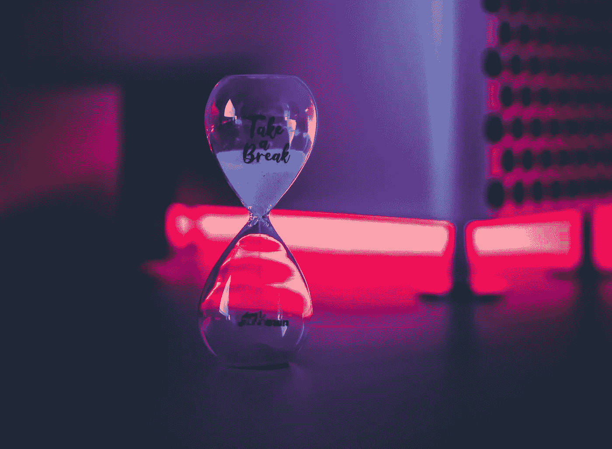

# 每个人都在挣扎

> 原文：<https://betterprogramming.pub/everybody-struggles-c98018d6510f>

## 一个新工程师的奋斗

[晨酿](https://unsplash.com/@morningbrew?utm_source=medium&utm_medium=referral)在 [Unsplash](https://unsplash.com?utm_source=medium&utm_medium=referral) 上拍摄的照片。

我的外展实习已经开始五个星期了，有很多次我陷入困境，在一些事情上挣扎了几个小时却没有任何进展。我确定我不是唯一一个被卡住的人。

我不会深入我遇到的问题的技术细节，但我想分享一些帮助我度过难关的事情。

# **休息一下**

我是 GitHub 新手，一直觉得 Git 很吓人。开始时，创建一个拉请求这样简单的事情通常会让我感到紧张。我为我的第一个外展任务创建了一个新的分支。每当我想让导师检查我的进步时，我都会努力去做。最后，当我想创建一个拉请求时，有 14 个提交。我希望我的公关看起来干净利落，只提交一次而不是 14 次。

照片由 [Unsplash](https://unsplash.com?utm_source=medium&utm_medium=referral) 上的 [Kristopher Roller](https://unsplash.com/@krisroller?utm_source=medium&utm_medium=referral) 拍摄。

我花了整整一个晚上试图弄清楚如何才能粉碎提交和许多其他事情，但最终真的很沮丧，通过推送所有提交来发出拉请求，并关闭我的笔记本电脑。

大概过了一个小时，突然想到一个解决方案，想马上试试。我立即打开我的笔记本电脑，创建一个新的分支，将我的所有提交推送到该分支，打开一个新的拉请求作为单个提交，并关闭我以前的拉请求。

有时候，你所需要的就是离开你正在做的事情，休息一下。给你自己和你的头脑一些安宁。有时候，你没有给你的大脑足够的空间去思考和处理。

阿莱西奥·扎卡里亚在 [Unsplash](/@alessiozaccaria?utm_source=unsplash&utm_medium=referral&utm_content=creditCopyText) 上拍摄的照片。

长时间不间断地工作会导致精神疲惫和压力。休息可以给你的大脑充电，填充你的精神能量，帮助你变得更有创造力。根据研究，“啊哈时刻”更经常出现在那些休息过的人身上。其他发现也表明，定期休息会提高投入程度，从而提高生产力。

# **提问**

我曾经在执行任务的时候被一个散列数组卡住了。在 Slack 上和导师讨论同一个问题的时候，从实现的需求到实现本身，他都详细的给我解释了。然后我连续花了 8-9 个小时试图找出正确的方法。像许多其他开发人员一样，我开始质疑自己的能力。我已经和我的导师讨论过这个问题及其解决方案，所以我犹豫着是否要再问他一次。

由[迭戈博士](https://unsplash.com/@jdiegoph?utm_source=medium&utm_medium=referral)在 [Unsplash](https://unsplash.com?utm_source=medium&utm_medium=referral) 上拍摄的照片。

但是我知道我必须再次寻求帮助——我确实这样做了！最棒的是他的回应。他欣赏我的努力，然后告诉我怎么做。下一次我不得不实现一些类似的事情时，我马上就能做到。

所以不要回避寻求帮助。我知道我们都害怕因为问愚蠢的问题而被评判，但是没关系。不要在一件事情上停留太久。问！

> 问问题的人在五分钟内都是傻瓜。不问问题的人永远是个傻瓜。”

# 结论

每个人都在挣扎。只要走出你的舒适区，准备好每天学习新的东西！