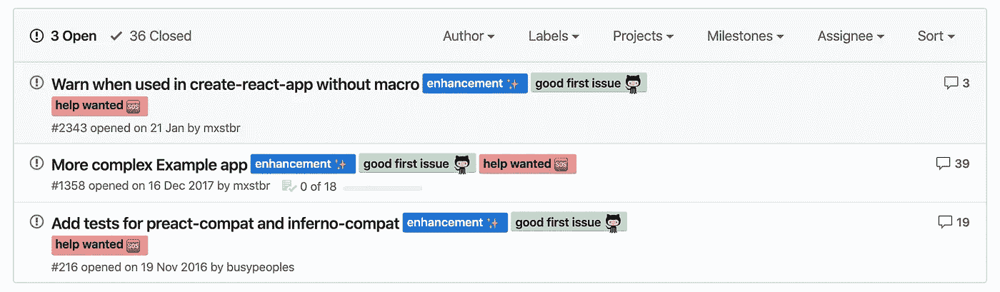

# 帮助你成为更好的开发者的日常活动

> 原文：<https://betterprogramming.pub/everyday-activities-to-become-a-better-developer-3d00ec8d14a5>

## 每天都变得更好是许多开发人员的目标

照片由 [@canmandawe](https://unsplash.com/@canmandawe?utm_source=medium&utm_medium=referral) 在 [Unsplash](https://unsplash.com?utm_source=medium&utm_medium=referral) 上拍摄

做教程和阅读文档应该成为你日常工作的一部分。但是你是否觉得这还不够，你需要更多的想法？

下面，你会发现我正在做的一些附带活动。我希望它会让你想尝试一下！

## 今天就可以开始的附带活动！

首先，我想指出并行处理多个活动是很好的。

在我看来，长时间做同样的事情会变得无聊，这会适得其反。

当你感到无聊时，在多个活动或项目之间轮换可以让你选择做些别的事情。

# 1.算法编码挑战

做一个算法编码挑战是好玩的。无论你的水平如何，都有挑战来匹配你的技能。

我的建议是和你的同事一起做。
我和以前公司的同事一起做的。早上，我们选择一个挑战，给自己 15 分钟来解决它。
15 分钟后，我们比较了我们的代码，看看哪个是最佳的。这引起了争论，而且总是很有趣。

你可以在简单的挑战和更复杂的挑战之间选择。简单挑战的目标可能是想出最佳解决方案。对困难的人来说，至少要试着解决问题。

这里有两个著名的网站可以使用: [FreeCodeCamp](https://www.freecodecamp.org/) 和 [**HackerRank**](https://www.hackerrank.com/) 。

两个我都喜欢！他们建议页面内编辑，任何级别都有挑战。此外，他们两人都为每个挑战提出了解决方案。通常有多个解决方案，从次优到最优。
分析不同的选项，理解为什么一个选项是最佳的，真的会教会你很多。

# 2.参与开源项目

我肯定有你喜欢的开源包。帮助他们的社区，帮助他们解决公开的问题或者开发新的特性怎么样？

这有很多好处。其中两个是你会对项目本身有更深入的了解。

更重要的是，你可以和你不认识的开发人员一起工作，和他们交流，这是一次非常有价值的合作经历。

如果为开源项目做贡献看起来很可怕，不要担心——有解决方案:

*   [首次投稿](https://github.com/firstcontributions/first-contributions)项目旨在为希望首次投稿的初学者提供指导。
*   [GitHub 寻求帮助](http://github-help-wanted.com/?languages=JavaScript&labels=good+first+issue&page=1&sort=created&order=desc)是一个应用程序，允许你通过语言和问题标签进行筛选，以找到你可以帮助的项目。

在样式化组件包存储库中打开的第一个好问题

通常，容易的问题会被贴上这样的名字:**好的第一期**、**容易的**、**适合初学者的**、**待价而沽的**等。

# 3.创建一个包

这是开源的另一种方式。

假设您必须为您的 React 应用程序构建一个非常棒的防弹组件，因为您无法在 NPM 上找到一个正确的组件。从它创建一个包，以便其他开发人员可以使用它，这可能会很好。

不久前，我创建了我的第一个包——这是我们的产品在工作中需要的一个特性。

虽然我在工作中尽了最大努力来确保这个特性中没有错误，但是将它转换成 NPM 包使我希望它更加没有错误！
该代码将在其他项目中使用，如果它在我的项目中工作，它将为他们任何工作。因此，我在它上面花了更多的时间，以完美地记录它(谁知道呢，开发人员可能会发现它并想提供帮助！)并完美理解其中的每一行。

看到我的包的下载量上升是令人满意的(到目前为止只有几百个，但仍然！).

# 4.开始你自己的产品

对于企业家来说，这是一个完美的兼职项目。作为开发者，我们几乎可以构建我们想要的东西。就我个人而言，我希望有一天能推出一款成功的产品。

这是你能拥有的最全面的项目。

如果你第一次就成功地创造了一个产品，那么你很幸运，但它可能需要多次尝试！

别担心，摔倒是正常的。开发产品会教会你很多东西——当然是编程知识，但也包括:

*   如何写规格说明书(独自一人不代表不写任何规格说明书)。
*   如何营销你的产品，将它货币化。
*   定义你希望你的用户如何体验你的产品。
*   如何在开发的同时解决问题？
*   如何对小细节做到严谨细心？

这是无价的专业知识，你可以从中受益，而不必一开始就冒任何风险。

我喜欢在业余时间做产品。到目前为止，他们都失败了，但这不是问题。我并不完美——我正在学习——这才是重点！

每次我在做一个产品的时候，我都非常兴奋，我可以一天 24 小时都在做。在我的情况下，这可能会适得其反，因为我不会花必要的时间后退一步，但每个人都不同。它教会你自律，并发现你想如何工作。

当我能从零开始开发一个应用程序时，我感到非常满足。老实说，我从来没有将相同的文件结构应用到我已经开始的项目中，因为我每次都在改进它。

最后，**的创客群体**非常庞大。以下是一些入门链接:

*   [产品搜寻](https://www.producthunt.com/):寻找所有新发布产品的地方，是灵感的绝佳去处，也是了解产品开发人员如何构建想法的绝佳场所。
*   如果这个社区里有一个人值得追随，他就是你要找的人。在过去的几年里，他制造了许多成功的产品。那是一个真正的制造者。你读过他的文章《把副业变成盈利的创业公司》——非常鼓舞人心。
*   其他一些有趣的链接… [wip.chat](https://wip.chat/) ，[Makerlog.com](https://getmakerlog.com/)，[Indiehackers.com](https://www.indiehackers.com/)，

# 5.为出版物写作来分享你的知识

这是我最费时间的。你不会意识到分享你的知识有多难，直到你不得不去做。以一种有趣的方式写一些东西，并检查 100 遍以确保你没有分享不正确的信息，这需要很多时间。我想确信它会取悦读者，并且他们会学到一些东西。

我想我们很多人都遇到过这种情况——因为缺少一个步骤或一个没有被覆盖的 bug 而陷入教程中。你来是为了学习一件事，现在你必须试着去修复一些一开始就不应该存在的东西。多么令人沮丧。

我花了很多时间来确保读者能顺利阅读。在这样做的时候，我几乎总是发现有一步不够清楚。

例如，在我的项目中可能有 10 行是从 StackOverflow 复制粘贴的，而我并不 100%确定它是做什么的(这并不可耻)。在我发布我的项目之前，我会了解它。如果有必要的话，我会在一行代码上花一个小时或者更多的时间——直到有人问我的时候，我有信心能够解释清楚。

工作量很大，但当我发表一些东西时，我真的很开心。当有人为我写的东西鼓掌时，我会更加开心和兴奋！当你的作品对某人有用时，你的感觉比一杯咖啡更好。

首先，我的建议是慢慢来。发表未完成的东西不会引起任何人的兴趣——你不会为自己感到骄傲。当你第一次出版后感到沮丧是令人难过的，当你第一次出版时是如此兴奋。慢慢来，确保你涵盖了标题中的主题，并通过提供来源、例子和你自己的观点使你的文章有趣。

# 6.流自己做一个以前的活动

能够在编码时解释我们在做什么是一项很好的技能。

作为开发人员，我们都经历过技术面试，我们被要求在白板或某种练习上解决问题。

聪明很酷，但如果你知道如何谈论你在做什么就更好了！清楚地描述你是如何解决问题的能力可以让你的简历处于最重要的位置。虽然对一些人来说这可能很容易，但其他人必须训练这种技能。

在 Twitch 这样的平台上流式传输自己可以让你练习口语技能。这个练习是为了能够谈论你正在做的事情。编码时你在解决什么问题。

作为一名流光，你希望观众对你感兴趣。

我喜欢在做产品的时候流我自己。有两个原因:

*   我可以获得关于我正在构建的产品的反馈，并获得我的潜在第一批用户。他们还可以分享我没有想到的功能。
*   我不想在流媒体播放时滚动 Twitter，这意味着我的工作效率非常高。在开始工作之前，我会写下我想在这段时间内完成的事情，这样我通常能快 50%完成。

流媒体播放时不要看观众人数，没人在乎。可能没有人，可能有 235 个观众，这不重要。告诉自己有 10，000 人在看着你，你必须让他们对你的工作感兴趣。

如果你还不想自己流，先看看其他的流。在 Twitch 流媒体平台上，有两个:[基础编程](https://www.twitch.tv/directory/game/Basic%20Programming)和[科学&技术](https://www.twitch.tv/directory/game/Science%20%26%20Technology) 。科技上的飘带更多&科技。

这些是我经常做的活动。我希望你能尝尝它们。最重要的是做自己喜欢的事情！

你看到我可以添加到我的列表中的活动了吗？

觉得这篇文章有用？在 Medium 上关注我([托马斯·吉伯特](https://medium.com/@th.guibert))，看看我下面最受欢迎的文章！请👏这篇文章分享一下吧！

*   [如何成为团队中受欢迎的开发人员](https://medium.com/better-programming/how-to-be-a-developer-that-people-want-on-their-team-7ab349293174)
*   [理解你代码的复杂性，使用大 O 符号](https://medium.com/swlh/write-scalable-code-using-the-big-o-notation-974d0bbe06e7)
*   [学习创建自己的 useFetch() React 钩子](https://medium.com/better-programming/learn-to-create-your-own-usefetch-react-hook-9cc31b038e53)
*   [将你的 Javascript React 应用程序转换成 TypeScript，简单的指南](https://medium.com/swlh/convert-your-javascript-react-app-to-typescript-the-easy-guide-631592dc1876)
*   [构建 React 组件库并发布到 GitHub 包注册表](https://medium.com/better-programming/build-your-very-own-react-component-library-and-publish-it-to-github-package-registry-192a688a51fd)
*   [使用 React 和 TypeScript 创建一个 Chrome 扩展](https://medium.com/better-programming/create-a-chrome-extension-using-react-and-typescript-50e94e14320c)