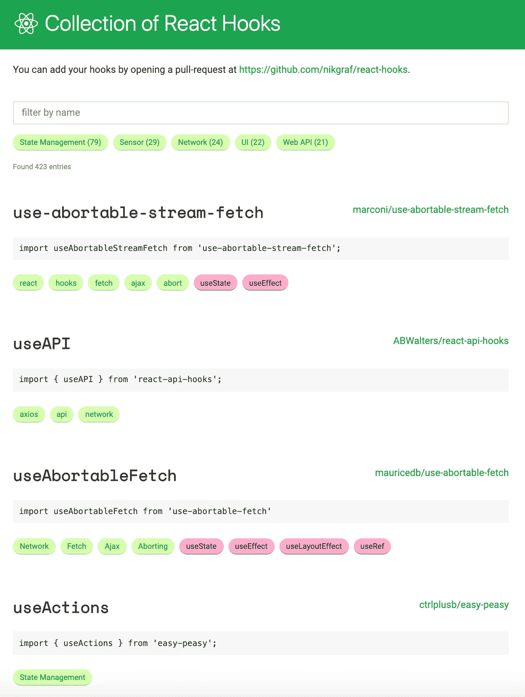

# 每个人都可以建立一个自定义挂钩

> 原文：<https://betterprogramming.pub/everyone-can-build-a-custom-hook-e0f1c6802ffe>

## React 钩子只是函数，它们比你想象的要简单


照片由 [Alexandru Acea](https://unsplash.com/@alexacea?utm_source=medium&utm_medium=referral) 在 [Unsplash](https://unsplash.com?utm_source=medium&utm_medium=referral) 上拍摄。

[React 钩子](https://github.com/reactjs/rfcs/pull/68)是 React 16.8 中新增加的。此更新为开发人员提供了在函数组件中使用状态和其他 React 特性的能力。内置挂钩——如`useState`、`useEffect`等。—已在各种反应应用中广泛采用。这是向函数式编程的巨大飞跃。

当钩子被引入时，它看起来有点可怕。文档本身有八章长，这个令人敬畏的 React Hooks Github 提供了关于这个主题的大量信息。你有机会通读它了吗？

我最初被这么大的阅读量吓到了。然而，在使用了一些内置的挂钩后，我真的惊讶于它们的简单和干净。然后，我发现强大之处不仅在于内置挂钩，还在于定制挂钩的有效性。

# 单行自定义挂钩

什么是自定义挂钩？它是一个 JavaScript 函数，可以调用其他钩子，其名称以“use”开头。

这是我们的第一个定制挂钩:

```
const useMyName = initialName => `My name is ${initialName}.`;
```

没错，就是一行代码。

这个自定义钩子返回一个字符串。使用以下示例调用它:

这段代码打印出一条消息:`"My name is Larry."`

# 使用方法返回对象的自定义挂钩

自定义钩子是一个特殊的函数。它可能会调用其他钩子，典型的有`useState`和`useEffect`，以及其他内置钩子和自定义钩子。所有挂钩都遵循一些限制:

1.  钩子名必须以“use”开头。
2.  必须从函数组件或另一个钩子调用钩子。
3.  只调用顶层的钩子。不要在循环、条件或嵌套函数中调用钩子。

我们编写了一个返回对象的钩子。它仍然像以前一样接受初始名称，但是它返回一个方法来设置一个新名称以及消息。

不知何故，这段代码行不通。该消息不显示在屏幕上，第 13 行无限期地在开发人员控制台上打印出`"My name is Larry."`。

发生了什么事？

React 的 [Hooks API 参考](https://reactjs.org/docs/hooks-reference.html)页面明确指出:

> 函数组件的主体内部不允许出现突变、订阅、定时器、日志和其他副作用(称为 React 的*渲染阶段*)。这样做将导致 UI 中令人困惑的错误和不一致。

在这种情况下，`myHook.setName(‘Larry’)`是一个突变。将它放在`App`的主体中会导致更改不会反映在 UI 上。此外，`setName`是一个状态变化，它触发一个重新渲染周期再次调用`setName`。这种情况不断重复，这种连锁反应会无限循环下去。

我们需要把`setName`放在`useEffect`里。那么状态变化将反映在 UI 上。

我们传递一个空数组(`[]`)作为第二个参数来运行一次效果。有趣的是，如果没有那个，我们可以再次看到无限的`console.log`循环。默认情况下，`useEffect`在第一次渲染和每次更新后都运行。`setName`是一个状态变化，导致重新渲染。然后再次调用`useEffect`。这导致了无休止的重新渲染。

关于`useEffect`还有一个有趣的事实。第 15 行打印出来:`“My name is undefined.”`为什么是`undefined`而不是`Larry`？那是因为`setName`可能不会马上发生。

我们可以向第 16 行传递可选的第二个参数(`[myHook.message]`)，而不是传递一个空数组。如果`myHook.message`在重新渲染之间没有变化，那么 React 跳过应用效果。使用这种方法，我们会看到两条控制台消息:

```
"My name is undefined."
"My name is Larry."
```

解释如下:`setName`不会立即发生。它打印出`"My name is undefined."`这个状态变化导致重新渲染，调用第二个输出，`"My name is Larry."`之后，`myHook.message`没有变化。因此，`useEffect`将不再被执行。

写或者用钩子是不是陷阱太多？为了避免这种错误，建议为钩子安装一个专门的 ESLint 插件:`npm install eslint-plugin-react-hooks --save-dev.`

这个 ESLint 插件需要如下配置:

默认情况下，[创建 React App](https://medium.com/better-programming/10-fun-facts-about-create-react-app-eb7124aa3785) 包含`eslint-plugin-react-hooks`。

如果您使用 [VSCode](https://medium.com/better-programming/10-useful-plugins-for-visual-studio-code-6ab62c0b14ee) ，ESLint 扩展可以在您编辑代码时显示错误或警告。

# 返回带有用户界面的对象的自定义挂钩

我们之前的 fancier 钩子返回一个两项对象:

```
{
  setName: newName => setCurrentName(newName),
  message: `My name is ${currentName}.`
}
```

我们想通过添加一个选项来使它看起来更漂亮一些，使单选按钮名称选择 UI 看起来像这样:


以下是代码片段:

这个钩子返回一个三项对象:

`display`值是 [JSX](https://reactjs.org/docs/introducing-jsx.html) ，是 JavaScript 的语法扩展。一般来说，自定义钩子可以返回值、对象、方法、JSX 等等。

# 返回数组的自定义挂钩

自定义钩子可以返回任何东西，只要调用方知道如何处理它。

我们重写了以前的花哨钩子，使它变得更加花哨。它以类似于`useState`的方式返回一个数组。调用者析构方法、消息和 UI 的数组。因为没有使用该方法，所以不需要在第 21 行命名它。

# React 挂钩的集合

钩子已经被广泛采用。每天都有新的定制挂钩出现。

这是 React 钩子的集合:



钩子打开了一个充满可能性的新世界。你准备好建立一个自定义挂钩了吗？

感谢阅读。我希望这有所帮助。你可以在这里看到我的其他媒体出版物。