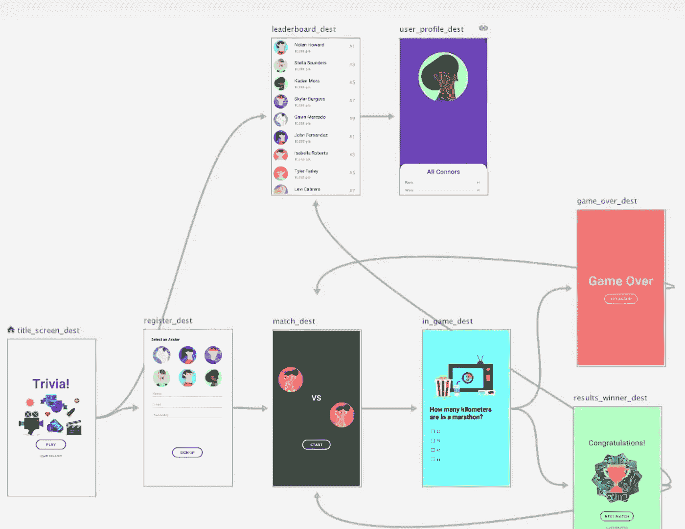
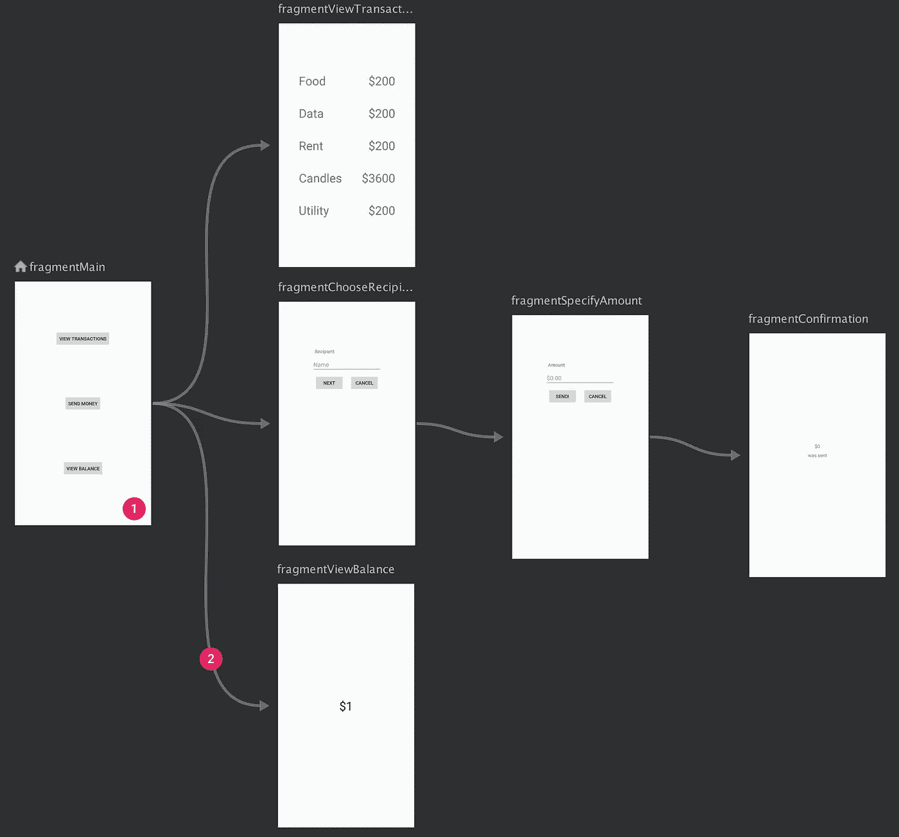
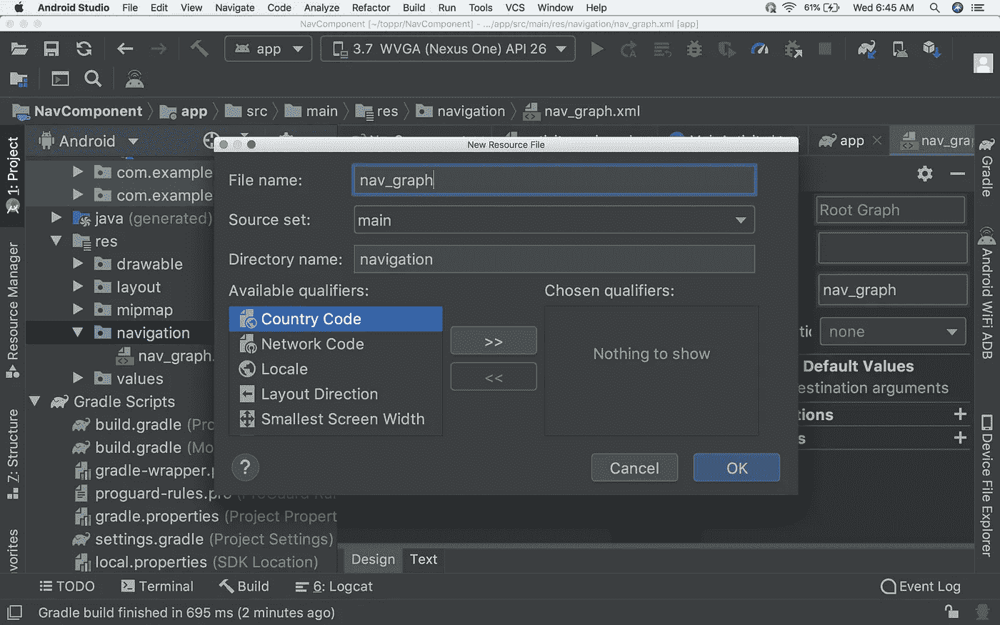
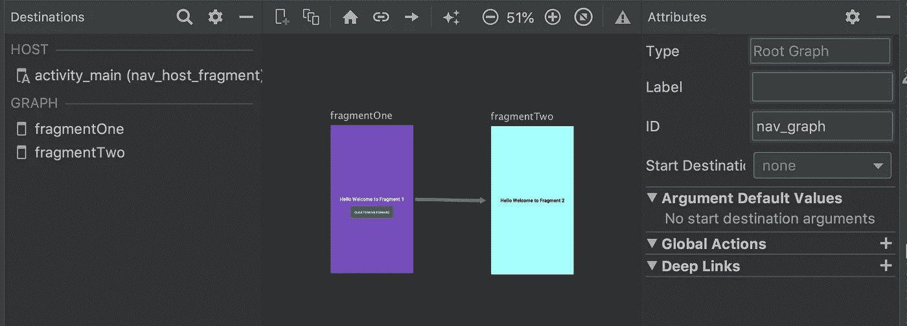
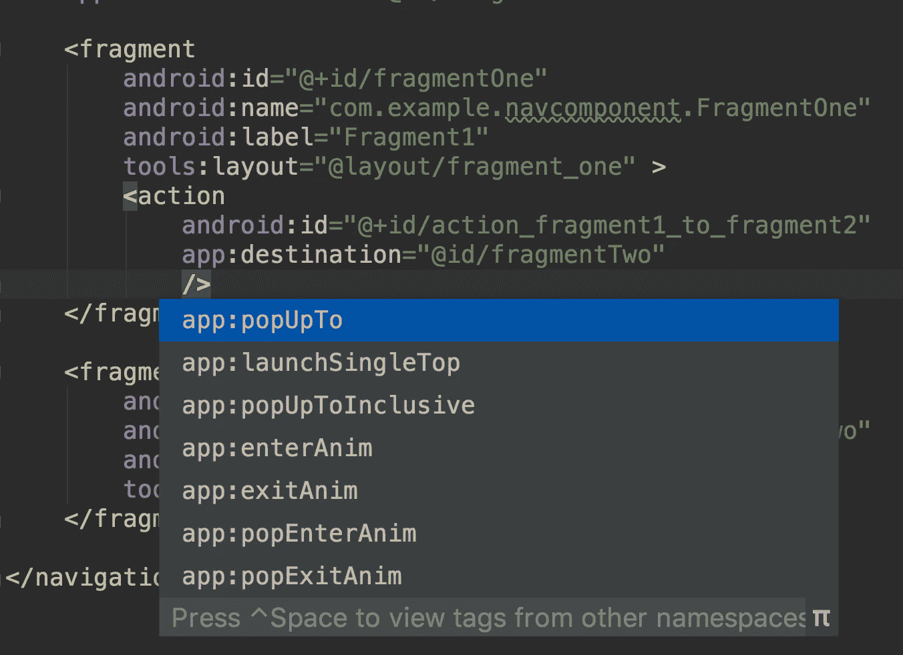
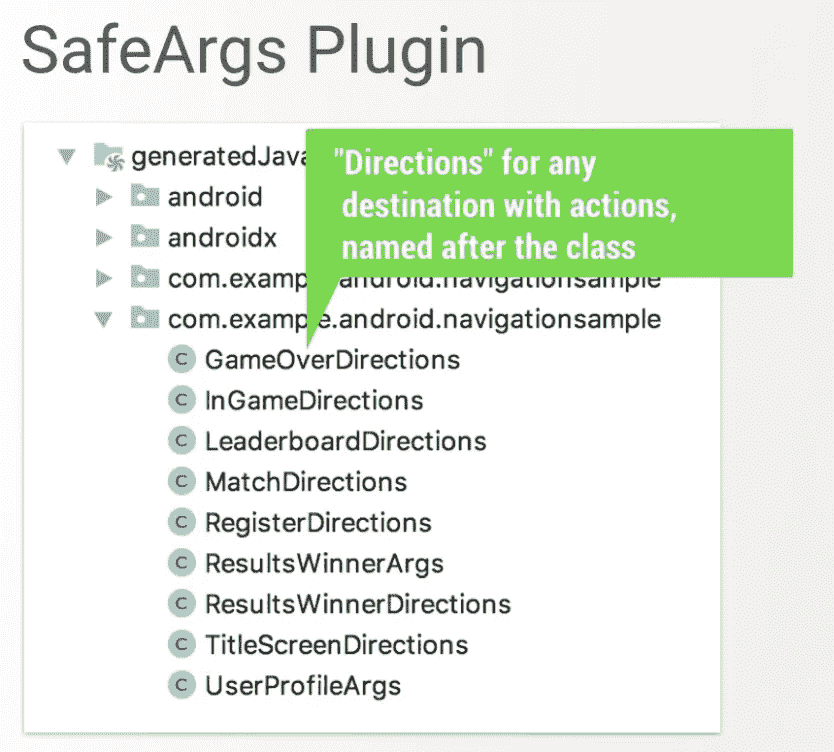
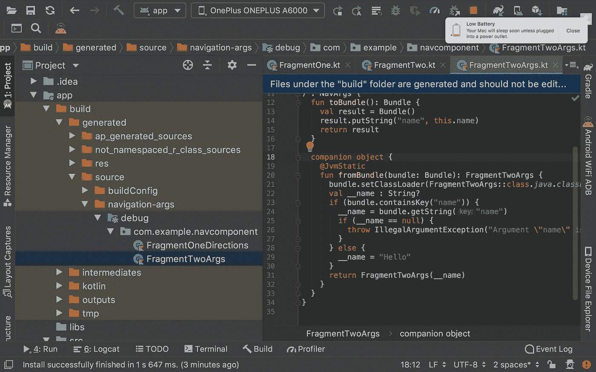
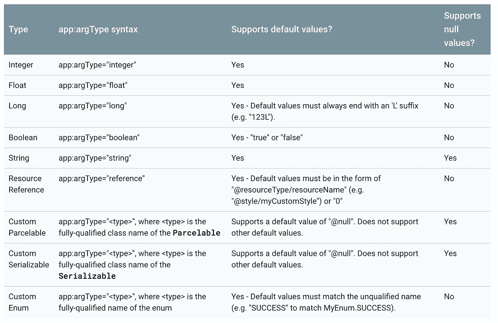

# 你想知道的关于 Android Jetpack 导航组件的一切

> 原文：<https://betterprogramming.pub/everything-about-android-jetpacks-navigation-component-b550017c7354>

## 它是什么，我们如何使用它？



在 Android 中，我们通常使用`Intent`来编写导航逻辑，以便在活动之间移动，使用`fragment transactions`来在片段之间导航。谷歌的导航架构组件简化了 Android 应用程序中的导航。在这篇文章中，我们讨论了使用`Navigation`组件的基本和高级方法。

# 出了什么问题？

当开发具有多个片段的应用程序时，我们倾向于进行大量的片段事务来在它们之间导航。编写这些片段事务和处理后台堆栈需要一定的努力。如果您没有以正确的方式实现它，另一个主要问题是可能发生的`IllegalStateException` 。

# 解决办法

为了让导航更容易，谷歌引入了`Navigation`组件。在导航组件的帮助下，编写片段之间的导航和处理案例(如后台堆栈、异常案例等)将变得很容易。让我们开始探索`Navigation`组件。

# 导航组件是什么？

组件是一组简化 Android 导航的库、插件和工具。Android Jetpack 的`Navigation`组件帮助我们实现*导航*，从简单的按钮点击到更复杂的模式，比如应用程序栏和导航抽屉。`Navigation`组件还通过遵循一套既定原则来确保一致且可预测的用户体验。

`Navigation`组件由三个关键部分组成。

## 导航图

这是一种新的资源类型——在一个集中的位置包含所有导航相关信息的 XML 文件。这包括应用程序中所有单独的内容区域，称为目的地，以及用户在应用程序中可能选择的路径。



导航编辑器中的`Navgraph`可以如上图所示。上面的屏幕被称为目的地——它们只不过是片段。这些目的地之间的箭头称为动作，它们定义了用户可以选择的导航路径。

## NavHost

这是一个空容器，显示导航图中的目的地。`Navigation`组件包含一个默认的`NavHost`实现`NavHostFragment` **，**，它显示了片段的目的地。

## **导航控制器**

在`NavHost`中管理应用导航的对象。当用户在你的应用中移动时，`NavController`协调`NavHost`中目的内容的交换。

*注意:导航图可以在 Android Studio 3.3 新推出的* ***导航编辑器*** *中可视化。这个很棒的功能让我们可以在一个地方看到所有的导航*

# 利益

`Navigation`组件提供了许多其他优势，包括:

*   处理片段事务。
*   默认情况下正确处理`Up`和`Back`动作。
*   为动画和过渡提供标准化的资源。
*   实现和处理深度链接。
*   包括导航 UI 模式，如导航抽屉和底部导航，只需最少的额外工作。
*   [安全参数](https://developer.android.com/guide/navigation/navigation-pass-data#Safe-args) —一个 Gradle 插件，在目的地之间导航和传递数据时提供类型安全。
*   `ViewModel`支持——您可以将`ViewModel`限定在导航图中，以便在图的目的地之间共享与 UI 相关的数据。

# 例子

让我们通过创建一个简单的例子来看看这个组件是如何工作的。我们将创建一个简单的带有两个片段的`Activity`，并检查我们如何使用`Navigation`组件在这些片段之间导航

## 第一步

创建一个支持 androidx 的新项目，或者重构您的代码库以支持 androidx。AndroidX 是一个开源项目，Android 团队使用它在 Jetpack 中开发、测试、打包、版本化和发布库。点击 [Androidx 概述](https://developer.android.com/jetpack/androidx)查看更多信息。

## **第二步**

在`build.gradle`中添加依赖关系。

```
dependencies {
  def nav_version = "2.3.0-alpha02"

  // Java language implementation
  implementation "androidx.navigation:navigation-fragment:$nav_version"
  implementation "androidx.navigation:navigation-ui:$nav_version"

  // Kotlin
  implementation "androidx.navigation:navigation-fragment-ktx:$nav_version"
  implementation "androidx.navigation:navigation-ui-ktx:$nav_version"

  // Dynamic Feature Module Support
  implementation "androidx.navigation:navigation-dynamic-features-fragment:$nav_version"

  // Testing Navigation
  androidTestImplementation "androidx.navigation:navigation-testing:$nav_version"
}
```

这些是不同需求的不同依赖项。根据您的需求选择。

## **第三步**

创建导航图。

要将导航图添加到项目中:

*   在项目窗口中，右键单击 res 目录并选择 New > Android Resource File。将出现“新建资源文件”对话框。
*   在文件名字段中键入一个名称，如“nav_graph”。
*   从资源类型下拉列表中选择导航，然后单击确定。



当您添加第一个导航图时，Android Studio 会在`res`目录中创建一个`navigation`资源目录。该目录包含导航图资源文件。创建的文件将如下所示:

```
<?xml version="1.0" encoding="utf-8"?>
<**navigation** xmlns:android="http://schemas.android.com/apk/res/android"
    xmlns:app="http://schemas.android.com/apk/res-auto"
    android:id="@+id/nav_graph"></**navigation**>
```

`<navigation>`元素是导航图的根元素。当您将目的地和连接动作添加到图表中时，您可以在这里看到相应的`<destination>`和`<action>`元素作为子元素。如果您有[嵌套图](https://developer.android.com/guide/navigation/navigation-nested-graphs)，它们会显示为子`<navigation>`元素。

## **第三步**

向活动 XML 文件添加一个`NavHost`

一个`nav_host_fragment`的解剖:

*   属性包含了你的`NavHost`的类名。实施。
*   `app:navGraph`属性将`NavHostFragment`与导航图相关联。导航图指定了此`NavHostFragment`中用户可以导航到的所有目的地。
*   属性确保你的`NavHostFragment`拦截系统返回按钮。注意只有一个`NavHost` 可以默认。如果在同一布局中有多个主机(例如双窗格布局)，请确保只指定一个默认的`NavHost`。

## **第四步**

在`nav_graph`中添加目的地和路径。

在添加目的地之前，创建两个片段及其 XML:


现在为`FragmentOne`类创建 XML 文件。

同样，创建第二个片段。现在让我们将目的地添加到`nav_graph`中。

目的地剖析:

*   `Type`字段指示目的地是作为源代码中的片段、活动还是其他自定义类来实现的。
*   `Label`字段包含目标 XML 布局文件的名称。
*   `ID`字段包含目的地的 ID，用于在代码中引用目的地。
*   `Class`下拉菜单显示与目的地相关的类的名称。您可以单击此下拉列表将关联的类更改为另一个目标类型。

在导航编辑器中，视图如下所示:



现在将`NavHost`添加到`activity_main` XML 文件中:

```
<androidx.constraintlayout.widget.ConstraintLayout
    xmlns:android="http://schemas.android.com/apk/res/android"
    xmlns:app="http://schemas.android.com/apk/res-auto"
    xmlns:tools="http://schemas.android.com/tools"
    android:layout_width="match_parent"
    android:layout_height="match_parent"
    tools:context=".MainActivity">

    <fragment
        android:id="@+id/nav_host_fragment"
        android:name="**androidx.navigation.fragment.NavHostFragment**"
        android:layout_width="match_parent"
        android:layout_height="match_parent"
        app:defaultNavHost="true"
        app:navGraph="@navigation/nav_graph" />

</androidx.constraintlayout.widget.ConstraintLayout>
```

我们的`MainActivity`会是这样的:

```
package com.example.navigationsampleimport android.support.v7.app.AppCompatActivity
import android.os.Bundle
import androidx.navigation.findNavControllerclass MainActivity : AppCompatActivity() { override fun **onCreate**(savedInstanceState: Bundle?) {
        super.onCreate(savedInstanceState)
        setContentView(R.layout.*activity_main*)
    } override fun **onSupportNavigateUp**() = *findNavController*(R.id.***nav_host_fragment*).navigateUp()**}
```

就这样——我们结束了。

点击运行按钮，查看`Navigation`组件的神奇之处:


带后栈的 FragmentOne

神奇之处在于片段一中的一行代码，按钮上的点击操作——因此不需要片段事务。

```
btn_next.setOnClickListener **{** view.***findNavController***().navigate(R.id.***action_fragment1_to_fragment2***)
**}**
```

我们需要找到`NavController`并给它我们在 XML 中指定的动作 ID。

# 其他需要知道的事情

随着每个导航动作，一个目的地被添加到后台堆栈。

在前面的实现中，当我们从片段一移动到片段二并点击返回时，按下片段二，我们回到片段一。

但是假设在 splash 片段的情况下，这不是预期的行为。在这种情况下，我们需要向`nav_graph`中的动作添加额外的属性，或者我们可以选择使用`NavOptions`以编程方式添加这些属性。`NavOptions`存储导航动作的特殊选项。

让我们检查 XML 的属性:



对于上述飞溅问题，我们需要使用两个不同的属性:

```
**app:popUpTo**="@id/fragmentOne"
**app:popUpToInclusive**="true"
```

将这些属性添加到`nav_graph`、**、**后，修改如下:

结果大概是这样的:


不带后叠的 FragmentOne

## 动作剖析

```
<action **android:id**="@+id/next_action"
            **app:destination**="@+id/flow_step_one"
            **app:enterAnim**="@anim/slide_in_right"
            **app:exitAnim**="@anim/slide_out_left"
            **app:popEnterAnim**="@anim/slide_in_left"
            **app:popExitAnim**="@anim/slide_out_right"
            **app:popUpTo**="@id/fragmentOne"
            **app:popUpToInclusive**="true" />
```

*   `id`字段包含由导航主机导航到哪里所使用的动作的 ID
*   有四种动画类型— `app:enterAnim, app:exitAnim, app:popEnterAnim, app:popExitAnim`我们可以在片段初始添加和移除时指定，在从其他片段弹出时也可以指定
*   `app:popUpTo` 属性用于表示当前片段的弹出选项，直到它应该从当前动作弹出。这将从后台堆栈中弹出所有不匹配的目的地，直到找到该目的地。
*   `app:popUpToInclusive` 该选项用于指定弹出选项是否包含当前实例
*   `app:launchSingleTop`用于该导航动作是否应该作为单顶启动(即，在后台堆栈的顶部至多有一个给定目的地的副本)。这与`android.content.Intent.FLAG_ACTIVITY_SINGLE_TOP`处理活动的方式类似。

*注意:如果你在片段间频繁导航时不使用*`*app:popUpToInclusive*`**，你的后栈将包含一个特定目的地的两个或更多实例。**

*为了以编程方式实现 Splash 行为，我们可以使用`NavOptions` builder。在按钮点击上，我们需要指定`NavController`:*

```
*btn_next.setOnClickListener **{** view.***findNavController***().navigate(R.id.*action_fragment1_to_fragment2*,null, **NavOptions.Builder**()
            .setPopUpTo(R.id.*fragmentOne*, true)
            .build())
**}***
```

*了解更多关于 NavOptions 的信息。*

# *如何在片段之间传递参数*

*在片段之间导航以在它们之间共享数据是很常见的。最简单的方法是使用共享的`[ViewModel](https://medium.com/better-programming/everything-to-understand-about-viewmodel-400e8e637a58)` **。**另一种方式就像发送参数，然后将它们读回目的地**。**由于我们正在使用`Navigation`组件，现在让我们看看如何使用`safe args` 插件在两个片段之间共享数据。*

# *安全参数*

*安全参数插件生成的代码允许我们进行类型安全导航和参数传递。当在目的地之间传递值时，安全参数允许您删除这样的代码:TK*

*首先，要将安全参数添加到您的项目中，请在您的顶级`build.gradle`文件中包含以下`classpath`:*

```
*buildscript {
    repositories {
        google()
    }
    dependencies {
        def nav_version = "2.3.0-alpha01"
        classpath "androidx.navigation:navigation-safe-args-gradle-plugin:$nav_version"
    }
}*
```

*要生成适用于 Java 或混合 Java 和 Kotlin 模块的 Java 语言代码，请将这一行添加到您的应用程序或模块的 `build.gradle`文件中:*

```
*apply plugin: "androidx.navigation.safeargs"*
```

*或者，要生成适用于纯 Kotlin 模块的 Kotlin 代码，请添加以下代码行:*

```
*apply plugin: "androidx.navigation.safeargs.kotlin"*
```

*添加上面的代码行后，我们的应用程序级`build.gradle`看起来会像这样:*

```
*apply plugin: 'com.android.application'

apply plugin: 'kotlin-android'

apply plugin: 'kotlin-android-extensions'
 **apply plugin: "androidx.navigation.safeargs.kotlin" //** add this*
```

*启用安全参数后，插件会为我们定义的每个动作生成包含类和方法的代码。对于每个动作，Safe Args 还为每个*发起目的地生成一个类，即动作发起的目的地。生成的类名是起始目的类名和单词“方向”的组合。例如，如果目的地名为`FragmentOne`，那么生成的类名为`FragmentOneDirections`。**

*生成的类包含在起始目的地定义的每个动作的静态方法。该方法将任何已定义的动作参数作为参数，并返回一个可以传递给`navigate()`的`NavDirections`对象。我们可以在生成的文件夹中找到生成的代码。*

**

*作为一个例子，假设我们有一个导航图，其中有一个连接始发目的地`FragmentOne`和接收目的地`FragmentTwo`的动作。*

*Safe Args 用返回一个`NavDirections`对象的单个方法`actionFragmentOneToFragmentTwo()`生成一个`FragmentOneDirections`类。这个返回的`NavDirections`对象可以直接传递给`navigate()`，如下例所示:*

*在`FragmentOne`中，它使用`Directories`对象创建参数来传递它:*

```
*btn_next.setOnClickListener **{** val action = **FragmentOneDirections.actionFragment1ToFragment2("Android")
**    view.*findNavController*().navigate(action)
**}***
```

*在片段二中，它接收到了`args`:*

```
*override fun onActivityCreated(savedInstanceState: Bundle?) {
    super.onActivityCreated(savedInstanceState)
    val args: **FragmentTwoArgs** by *navArgs*()
    args.*let* **{** Toast.makeText(*activity*!!,**it**.**name**,Toast.*LENGTH_SHORT*).show()
    **}** }*
```

*您可以在 build 文件夹中找到生成的代码:*

**

## *支持的参数类型*

**

# *结论*

*到目前为止，您应该对实现`Navigation`组件有了基本的了解，所以请尝试消除片段事务的遗留问题。*

# *参考*

*[导航组件](https://developer.android.com/guide/navigation/navigation-getting-started)*

*[在目的地之间传递数据](https://developer.android.com/guide/navigation/navigation-pass-data)*

*请让我知道你的建议和意见。*

*你可以在 [**中**](https://medium.com/@pavan.careers5208) 和 [**LinkedIn**](https://www.linkedin.com/in/satya-pavan-kumar-kantamani-61770a9b/) 上找到我…*

*感谢阅读…*