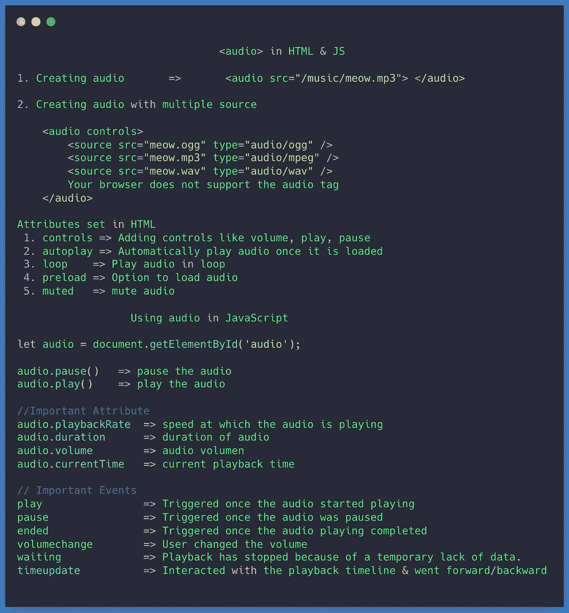

# 关于 HTML 和 JavaScript 中的音频标签，你应该知道的一切

> 原文：<https://betterprogramming.pub/everything-about-the-audio-tag-in-html-and-javascript-c531d3bb882a>

## 在 HTML 中包含音频，在 JavaScript 中播放和暂停



音频备忘单

标签允许你给你的网页添加音频。在`HTML5`中引入了`audio`标签。

添加一个`audio`标签非常简单:

```
**<audio src="/music/meow.mp3"> </audio>**
```

如果浏览器不支持`audio`标签，您也可以显示一条消息:

```
**<audio src="/music/meow.mp3">** You're browser is Outdated . Please Update The Browser**</audio>**
```

# 属性

## 控制

上面的代码不播放音乐也不显示任何东西。我们需要添加`controls`属性来启用音频的`play` 和`pause`。默认情况下，`controls`就是`false`。您可以通过添加`controls`或`controls = "true”`来添加音频标签的启用控制。

```
<audio src="/music/meow.mp3" controls> You're browser is Outdated . Please Update The Browser</audio>
```

别忘了加上`controls`；否则，不会显示任何内容。

## 多个音频源

如果同一个音轨有多个源文件，那么你需要使用`source`标签来包含多个音轨。如果有`mp3`、`ogg`、`wav`，使用以下:

```
<audio controls> <source src="meow.ogg" type="**audio/ogg**" />
  <source src="meow.mp3" type="**audio/mpeg**" />
  <source src="meow.wav" type="**audio/wav**" /> Your browser does not support the audio tag.</audio>
```

从上面的代码中，浏览器尝试播放`meow.ogg`。

*   如果浏览器能播放`meow.ogg`，浏览器不加载其他文件。
*   如果不支持`meow.ogg` ，浏览器将从下一个`source`开始加载音频。

## `autoplay`

您可以设置`autoplay`属性，以便在加载音频后自动播放音频。

```
<audio autoplay></audio><!-- Second Way -->
<audio autoplay="true"></audio>
```

注意:手机浏览器不允许自动播放。

如果不设置`autoplay`，那么浏览器不会加载音频。音频元数据(例如，持续时间、名称)将被下载，但是浏览器不会下载音频本身。您也可以通过将`preload`属性设置为`auto`来强制下载音频。

```
<audio preload="auto"></audio>
```

不同的预载值:

*   `none` →音频不应预加载。
*   `metadata` →仅提取音频元数据(如长度)。
*   `auto` →可以下载整个音频文件，即使预计用户不会使用它。
*   *空字符串→* 别名为`auto`

## 柔和的

如果您设置了`muted`属性，那么音频声音将被静音。

```
<audio muted></audio><!-- Second Way -->
<audio muted="true"></audio>
```

## 环

通过设置`loop`属性，您可以使音频循环播放(即音频在播放完毕后将从头开始连续播放)。

```
<audio loop></audio><!-- Second Way -->
<audio loop="true"></audio>
```

注意:音频受 CORS 的限制，除非你在服务器上允许，音频文件不能跨源播放。

# 在 JavaScript 中使用音频

先得到`audio`元素。

```
let audio = document.getElementById('audio');
```

## 检查音频状态

使用`paused`属性检查音频是否暂停。如果音频正在播放，则`paused`为`false`，否则为`true`。

```
let isPaused = audio.paused;let isPlaying = !isPaused;
```

## 控制音频

要暂停音频，可以使用`pause`方法。

```
audio.pause();
```

要播放暂停的音频，您可以使用`play`方法。

```
audio.play();
```

## 浏览器音量

您可以使用以下方法更改浏览器音量。

```
audio.volume = 1; // 100 %audio.volume = 0.5; // 50%
```

## 当前

您可以使用`currentTime`属性获取音频的当前播放时间。`currentTime`返回一个双精度浮点值，以秒为单位表示音频的当前播放位置。

```
audio.currentTime;
```

## 重绕

要倒回音轨，您可以使用以下命令。

```
myAudio.currentTime = 0; 
myAudio.play();
```

## 快速进带

要快进 30 秒，请使用:

```
myAudio.currentTime = 30; 
myAudio.play();
```

## 持续时间

要获得音频的持续时间，可以使用`duration`属性。

```
audio.duration
```

获取持续时间时:

*   如果元素上没有媒体，或者媒体无效，则返回值为`NaN`。
*   如果媒体没有已知的结尾(例如持续时间未知的直播流、网络电台、来自 WebRTC 的媒体等等)，该值为`+Infinity`。

# 重要的音频事件

`play` →音频开始播放时触发

```
audio.addEventListener('play', function(ev){console.log("audio started playing");});
```

`pause` →音频暂停时触发

```
audio.addEventListener('pause', function(ev){console.log("audio paused. Do you want to change track");});
```

`ended` →音频播放完成后触发

```
audio.addEventListener('ended', function(ev){console.log("audio Ended"); 
     // ask user about re-playing the same song & other operations});
```

`timeupdate` →用户与回放时间轴交互，前进/后退。

```
audio.addEventListener('timeupdate', function(ev){console.log("Current time", **this.currentTime**);});
```

`volumechange` →用户改变了音量。

```
audio.addEventListener('volumechange', function(ev){let currentVolume = this.volume;if(currentVolume > .75) {
         alert("Over Sound may damage your ears");
    }});
```

`waiting` →由于暂时缺少数据，播放已经停止。

```
audio.addEventListener('waiting', function(ev) => {
  console.log('Audio is waiting for more data.');
});
```

点击了解更多活动。

> 参观 JavaScriptJeep.com

[](https://www.buymeacoffee.com/Jagathish) [## Jagathish Saravanan

### 你好👋。我是 Jagathish。爱写关于 JavaScript 的文章。你的支持就像夏天吃冰淇淋一样。我…

www.buymeacoffee.com](https://www.buymeacoffee.com/Jagathish)