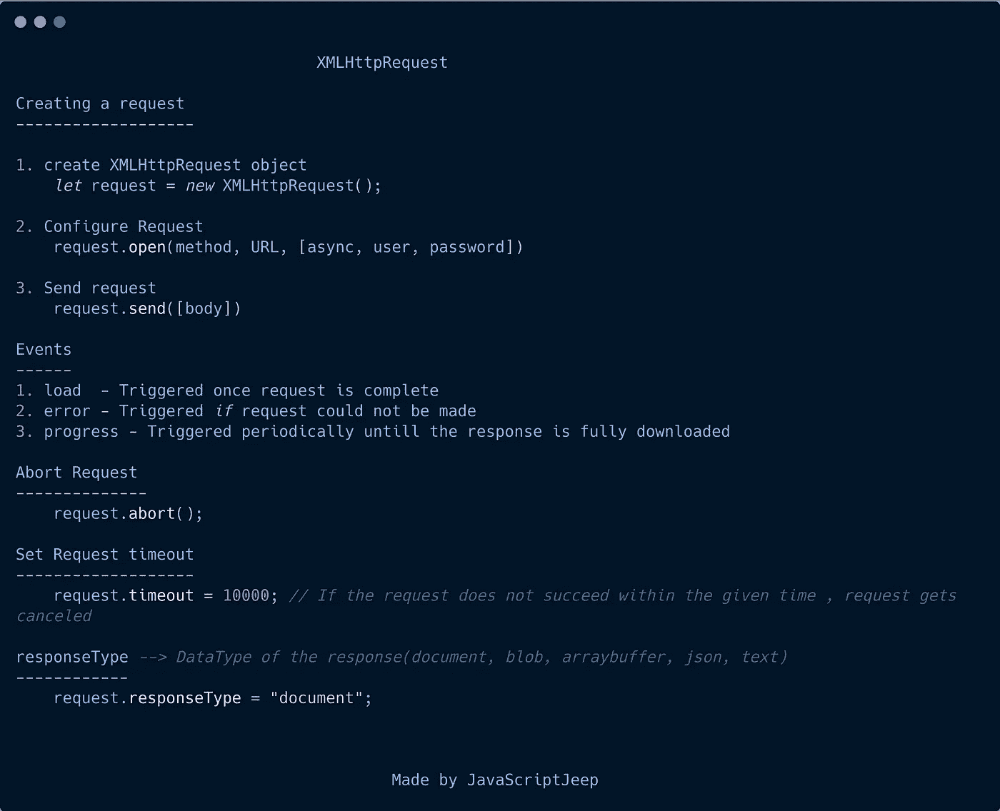
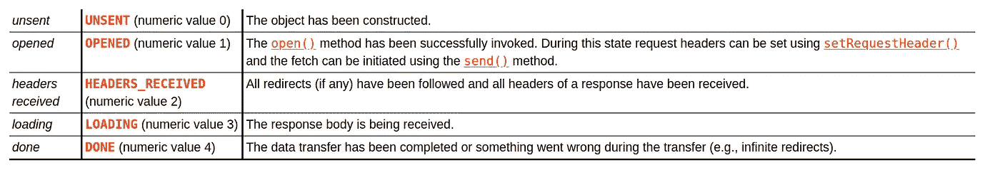

# JavaScript 中关于 XMLHttpRequest 的一切

> 原文：<https://betterprogramming.pub/everything-about-xmlhttprequest-in-javascript-8adacc98a209>

## 了解如何使用 XMLHttpRequests 发出请求



图片来源:作者

# 什么是 XMLHttpRequest ( `XHR`)？

*   `XMLHttpRequest`是一个内置的 JavaScript 对象，用于在服务器和客户端之间传输数据，无需刷新整个页面。
*   但是使用`XHR`，我们可以根据用户的动作更新页面。
*   例如，一个无限的新闻提要。(一旦用户向下滚动到页面的末尾，我们就请求获取下一篇文章并将数据追加到页面)。
*   使用`XHR`，我们可以发出同步和异步请求。

# 使用 XMLHttpRequest 发出请求的步骤

*   创建一个`XMLHttpRequest`对象。
*   使用请求详细信息配置对象。
*   发送请求。

## 1.创建一个 XMLHttpRequest 对象

```
let request = new XMLHttpRequest();
```

## 2.使用请求详细信息配置对象

为了配置请求，我们可以使用`XMLHttpRequest`对象的`open`方法。

```
request.open(method, URL, [async, user, password])
```

*   `method` — `"GET"`或`"POST"`
*   `URL` —请求的 URL 字符串。也可以是一个 [URL](https://javascript.info/url) 对象。

**可选参数**

*   `async` —默认为`true`。如果我们将其设置为`false`，那么它将发送一个`synchronous`请求。
*   `user`、`password` —基本 HTTP 认证的登录和密码

## 3.发送请求

`send`方法可用于向服务器发送请求。

```
request.send();
```

一旦请求被发送到服务器，我们可以使用三个事件来跟踪请求。

*   `load`—`load`事件在`XMLHttpRequest`成功完成(即使 HTTP 状态为 400 或 500)且响应完全下载时触发。

`status` — [HTTP 状态码](https://en.wikipedia.org/wiki/List_of_HTTP_status_codes) `200`、`404`、`403`等等

`statusText` — [HTTP 状态消息](https://www.w3schools.com/tags/ref_httpmessages.asp) `200 → OK`、`404 → Not Found`等等

`response` —对请求的响应

*   `error` —请求无法发出时。例如网络故障、跨源访问

```
xhr.onerror = function() { console.log(`Unable to make request`); };
```

*   `progress` —定期触发，直到响应完全下载。使用这个事件，我们可以跟踪从服务器下载了多少数据。

示例:

```
let url = "[https://medium.com/search?q=javascriptjeep](https://google.com/search?q=javascriptjeep)";let request = new XMLHttpRequest();request.open("GET", url);request.onload = function(){
   console.log(request.response);
}request.send();
```

在执行上述操作时，您可以看到 Medium 将返回用户搜索网页作为响应。

我们可以在`XMLHttpRequest`对象中设置请求超时。如果请求在给定的时间内没有成功，请求将被取消，一个`timeout`事件将被触发。

```
xhr.timeout = 10000; //time in milliseconds , actually 10s 
```

在上面的例子中，我们也可以传递一个`URL`对象，而不是一个`URL`字符串。

```
let url = new URL('https://medium.com/search');url.searchParams.set('q', 'JavaScript Jeep');request.open('GET', url);request.send();request.onload = function(){
   console.log(request.response);
}
```

在执行上面的响应时，默认情况下，我们将获得字符串形式的响应，但是我们可以通过设置`request`对象的`responseType`来指定我们期望的响应类型。基于`responseType`，浏览器会自动解析数据并显示给我们。`responseType`的可用选项如下:

```
1\. text → get as string2\. arraybuffer → get as ArrayBuffer3\. blob → get as Blob4\. document → get as XML document5\. json → get as JSON
```

如果我们不指定`responseType`，默认情况下我们将得到响应`string`。

在我们的例子中，我们得到一个`HTML`文档作为响应，所以我们需要将`responseType`设置为`document`。

```
let url = "[https://medium.com/search?q=javascriptjeep](https://google.com/search?q=javascriptjeep)";let request = new XMLHttpRequest();request.open("GET", url);request.onload = function(){
   console.log(request.response);
}request.responseType = "document";request.send();
```

现在，您可以在控制台中看到，响应显示为一个 HTML 对象。

# 就绪状态

我们可以使用`readyState`属性来检测`XMLHttpRequest`对象的当前状态。另外，一旦`XMLHttpRequest`对象的状态改变，就会触发`readystatechange`事件。



图片来源: [WHATWG 社区](https://xhr.spec.whatwg.org/#states)

```
0  → Object created1  → Open method called 2  → Response header received3  → Reponse is loading 4  → Request is complete 
```

示例:

如果我们需要中止已经发送的请求，我们可以使用`abort`方法。

```
request.abort();
```

# **向请求添加标题**

我们可以使用`setRequestHeader` 方法来为请求设置自定义头。

```
// syntaxrequest.setRequestHeader( name , value);
```

示例:

```
let request = new XMLHttpRequest();request.open("GET", url);request.setRequestHeader('Content-Type', 'application/json');request.setRequestHeader('user-token', 123);
```

我们不能在调用`open`方法之前调用`setRequestHeader`方法。

此外，一旦设置了标题，我们就不能删除它。如果我们调用`setRequestHeader`，相同的`name`，那么值将被追加。

```
request.setRequestHeader('test', 123);request.setRequestHeader('test', 321);**// header is test:123, 321**
```

我们还可以使用两种方法获得响应的头:`getResponseHeader(name)`和`getAllResponseHeaders()`。

# **发送** `**POST**` **请求带数据**

如果我们需要向服务器发送一个带有一些数据的`POST`请求，比如图像或表单数据，那么我们可以将数据作为`XMLHttpRequest`的`send`方法的参数发送。

假设我们有一个表单。我们将从那里创建表单数据。

```
let data = new FormData(document.forms[0]);let request = new XMLHttpRequest(); request.open("POST", "http:myserver.com/getResult"); **request.send(data);** 
```

使用`XHR`上传图像:

为了跟踪上传进度，我们可以使用在`XMLHttpRequest`的`upload`对象中可用的多个事件:

```
**loadstart** → upload started.**progress** → triggers periodically during the upload.**abort** → upload aborted.**error** → non-HTTP error.**load** → upload finished successfully.**timeout** → upload timed out (if timeout property is set)**loadend** →  upload finished with either success or error
```

现在，我们可以将上述事件应用于我们的图像上传请求。

# 发送 CORS 请求

使用`XMLHttpRequest`，我们可以进行跨来源请求。为此，我们需要将`withCredentials`设置为`false`。

```
let xhr = new XMLHttpRequest();
xhr.withCredentials = true;let url = "[https://otherorigin.com/search?q=javascriptjeep](https://google.com/search?q=javascriptjeep)";xhr.open("GET", url);xhr.send();
```

感谢阅读。

[](https://medium.com/@jagathishsaravanan/why-should-you-donate-me-30a6f5d112b8) [## 你为什么要捐赠我

### 请求为 y 羽毛球训练捐款。

medium.com](https://medium.com/@jagathishsaravanan/why-should-you-donate-me-30a6f5d112b8) 

可以在 [PayPal](https://paypal.me/jagathishSaravanan?locale.x=en_GB) 里捐我。

关注我 [Javascript Jeep🚙💨](https://medium.com/u/f9ffc26e7e69?source=post_page-----8adacc98a209--------------------------------)。