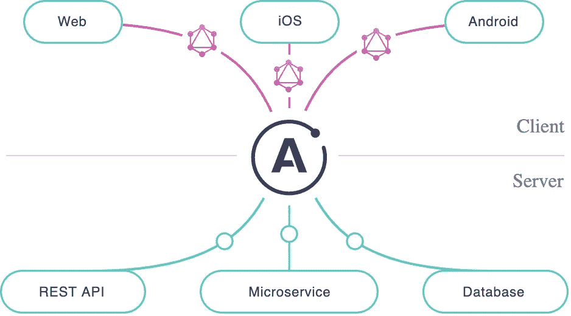
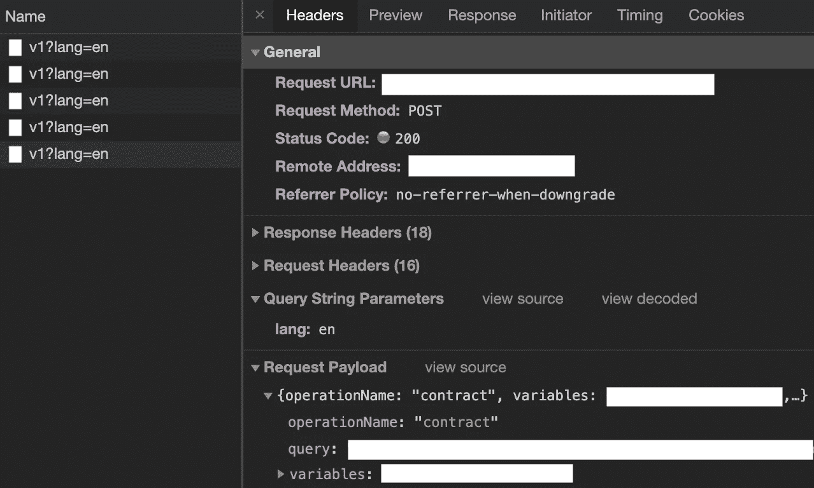
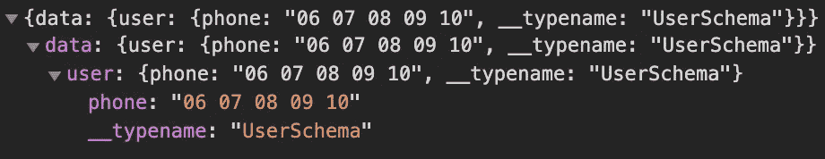

# 我发现的关于 GraphQL 和阿波罗的一切

> 原文：<https://betterprogramming.pub/everything-i-discovered-about-graphql-and-apollo-e774d1e11638>

## 开发者体验

## 一路上我学到了什么


由 [Unsplash](https://unsplash.com/s/photos/abstract?utm_source=unsplash&utm_medium=referral&utm_content=creditCopyText) 上的[图板](https://unsplash.com/@aplaceforcreation?utm_source=unsplash&utm_medium=referral&utm_content=creditCopyText)拍照

在前端开发的早期，从 Web APIs 获取数据是一个非常无聊的过程。事实上，数据模型被冻结了，这意味着您面临以下情况之一:

*   数据模型对于您的用例来说太丰富了。
*   一些数据丢失了。
*   您需要链接请求以获得预期的数据结构。

为了克服这些情况(并减轻前端开发人员的任务)，GraphQL 应运而生。它提供了一种从后端获取数据的新方法。GraphQL 没有处理冻结的数据结构，而是提供了一种查询语言，允许我们只获取我们需要的东西。


照片由[费德里科·贝卡里](https://unsplash.com/@federize?utm_source=medium&utm_medium=referral)在 [Unsplash](https://unsplash.com?utm_source=medium&utm_medium=referral) 拍摄

在本文中，我不会解释 GraphQL 如何工作或如何设置它——Medium 上有许多关于 GraphQL 及其 web 和移动应用程序客户端 Apollo 的有意义的文章，您可以在这里找到文档:

[](https://graphql.org/) [## GraphQL:一种 API 查询语言。

### 学习准则社区规范行为准则基金会景观学习准则社区规范行为准则基金会…

graphql.org](https://graphql.org/) 

还有这里:

[](https://www.apollographql.com/docs/) [## 文档主页

### 欢迎光临！👋Apollo 是一个构建数据图的平台，一个无缝连接您的…

www.apollographql.com](https://www.apollographql.com/docs/) 

在本文中，我将分享我在使用 GraphQL 和 Apollo 来简化开发并使 Apollo 相关代码可重用时发现的一些技巧。

***免责声明:*** *大部分代码片段关注 Vue.js 和 Vue Apollo。无论如何，在我介绍概念和提示时，我猜想它们可以应用于 GraphQL 和 Apollo 支持的任何其他 JavaScript 框架。*

# 首先要做的是…

## GraphQL

正如我前面所说，GraphQL 是一种新技术，它改变了后端和前端开发人员之间的关系。

以前，两个团队都必须定义一个契约接口来确保正确的实现。有时，由于对对象复杂性或类型的误解，可能会出现延迟。

多亏了 GraphQL，后端可以提供前端可能需要的所有数据。然后，由他们来“挑选”构建界面所需的属性。

此外，GraphQL 提供了一个 web 接口(名为 graph QL)来测试查询和突变(如果你不明白我写的是什么，请参考[文档](https://graphql.org/))。这是一个聪明的工具，可以让前端写请求，浏览文档和打字。

[](https://github.com/graphql/graphiql) [## 图表 ql/图表 QL

### 寻找图形文档？:这是 monorepo 的根源！完整的图形文档位于…

github.com](https://github.com/graphql/graphiql) 

## 一种查询语言

使用 GraphQL 意味着理解和掌握工具包中包含的查询语言。这不是一个小问题，它基于一个*对象嵌套*语法。

```
query GetProductInfo {
  product {
    id
    name
    price
  }
}
```

当查询对象看似简单时，对于突变来说就不是这样了。变异更新/插入新数据，可能带有一些参数。

```
mutation ($label: String!) {
  addTag(label: $label) {
    id
    label
  }
}
```

在这里，一个参数用它在 L1 上的类型来指定。然后，用在第二行。方括号`id`和`label`之间的结束内容定义了返回对象的结构，即插入的结果。

## 阿波罗

Apollo 是用于与 GraphQL 通信的客户端。无论你开发的是 web 还是手机 app，Apollo 都能支持。



[https://www.apollographql.com/docs/intro/platform/](https://www.apollographql.com/docs/intro/platform/)

Apollo 支持多种平台:

*   JavaScript: [角度](https://www.apollographql.com/docs/angular/)，[反应](https://www.apollographql.com/docs/react/)， [Vue](https://github.com/Akryum/vue-apollo) ，[流星](https://www.apollographql.com/docs/angular/recipes/meteor/)，[余烬](https://github.com/bgentry/ember-apollo-client)，[聚合物](https://github.com/aruntk/polymer-apollo)
*   原生手机:[原生 iOS 带 Swift](https://www.apollographql.com/docs/ios/) ，[原生安卓带 Java](https://github.com/apollographql/apollo-android)

其配置允许定义具体的方面，如:[缓存-网络策略](https://www.apollographql.com/docs/react/api/core/ApolloClient/#apolloclient-functions)、[管道](https://www.apollographql.com/docs/react/networking/advanced-http-networking/)(此处涉及)、[服务器端渲染](https://www.apollographql.com/docs/react/performance/server-side-rendering/) ( [Vue.js 版本](https://apollo.vuejs.org/guide/ssr.html))、[本地状态](https://www.apollographql.com/docs/react/local-state/local-state-management/) ( [Vue.js 版本](https://apollo.vuejs.org/guide/local-state.html))、[性能](https://www.apollographql.com/docs/react/performance/performance/)、[错误处理](https://www.apollographql.com/docs/react/data/error-handling/)(此处涉及)或国际化(此处涉及)。

# 使查询可重用

## ES6 来救援了！

它们是创建 Apollo 查询(也称为 GraphQL 文档)的许多方法。最常见的是使用`graphql-tag` 解析器。

[](https://github.com/apollographql/graphql-tag) [## apollographql/graphql-tag

### 解析 GraphQL 查询的 JavaScript 模板文字标记- apollographql/graphql-tag

github.com](https://github.com/apollographql/graphql-tag) 

然后，查询将如下所示:

```
import gql from 'graphql-tag'const hello query = gql`query sayHello {
  hello
}`
```

*将此类查询存储在一个专门的文件夹中是一个好习惯，例如* `*~/api/apollo-queries*` *并在一个特定的文件中按特征将它们分开:您将收集关于* `*user*` *、* `*product*` *或* `*contract*` *关注点的查询。*

您可能知道 GraphQL 文档有几个[属性](https://apollo.vuejs.org/api/smart-query.html#options):

*   `query`:带有`gql`解析器的查询本身。
*   `variables`:如果需要传递一些参数。
*   `update`:用于格式化查询响应或计算额外操作的回调函数。

后一个属性是我们创建可重用查询的切入点。实际上，对于一个简单的查询，您可能想要执行不同的操作。

ES6 的析构赋值和扩展操作符特性是在多个地方重用单个查询的强大工具。这里有一些例子。

## ***变量不同***

## `**Update**` ***回调不同于***

## ***重用查询商店更新***

## 条件和参数化查询

正如 Vue Apollo 文档的[部分](https://apollo.vuejs.org/guide/apollo/queries.html#reactive-query-definition)所描述的，我们可以创建条件查询——也就是反应式查询定义——这样我们就可以对变量进行查询。

Apollo 查询中的反应式查询模板

Apollo 查询中的反应变量

此外，您可以在查询模板中插入任何您想要的代码，因为`gql`解析器只是一个字符串插值。所以，你可以很容易地写出这个突变:

```
gql`
  mutation UpdateBirthdate ($bd: String!) {
    updateBirthdate(input: {
      birthDate: ${'"' + moment($bd).format('YYYY-MM-DD') + '"'}
    }){
      ok
    }
  }
`
```

不是*干净*的做法，但是有时候省时省力。在将输入发送到变异之前，最好对输入进行*净化。*

[Moment.js](https://momentjs.com/docs/) 是一个处理日期时间的 js 库。

# 上下文化 GraphQL 查询

## 命名您的查询

如果检查查询 GraphQL 服务器时发送的 HTTP 请求，可以看到一个`operationName`属性:



来源:作者

给 Apollo 查询添加一个名字似乎毫无意义，但是在调试时或者如果你想跟踪 REST APIs 调用时，它会非常有用。事实上，在我的公司中，我们希望跟踪这些对性能和服务器效率的请求。

命名查询非常简单方便:

```
query **GetProductInfo** { 
  product { 
    id
    name
    price
  }
}
```

## 国际化

国际化(或 i18n)是关于适应你的应用程序中的语言和文化。然而，为每种语言提供翻译可能会很烦人——这会加重软件包的负担，并且需要更新。

您知道 GraphQL 服务器能够支持国际化得益于一个查询参数吗？它只需要在服务器端做一些修改。

关于前端，必须进行额外的配置。它包括在 Apollo 客户机的`HttpLink`设置中指定一个管道——这并不难:

*你可以在管道中进行连锁操作，更多细节* [*这里*](https://www.apollographql.com/docs/react/api/link/introduction/#composing-a-link-chain) *。*

# 改善编码体验

您可能已经注意到 GraphQL 查询响应包含一个`__typename`属性:



来源:作者

当在变异中使用相同的对象时，将出现以下错误:

```
"Variable "$data" got invalid value {
  "__typename": "UserSchema",
  //...
  "phone": "06 07 08 09 11"
}.
**In field "__typename": Unknown field**."
```

事实上,`__typename`属性仍然存在，为了使变异生效，必须将其删除。深入研究`InMemoryCache` [文档](https://www.apollographql.com/docs/react/caching/cache-configuration/#configuration-options)，我们可以从查询响应中删除该属性:

## 订购查询

在代码的某些地方，必须同时启动几个查询。有时，根据查询的响应，我们想要启动一个新的查询或跳过一个请求。

幸运的是，阿波罗提供了一种减轻这些任务的方法！事实上，在`query`对象上，存在一个`skip`属性:

Vue 实现订购 Apollo 查询

另一方面，要跳过请求:

跳过请求的 Vue 实现

# 类型脚本支持

Vue Apollo 不直接支持 Typescript。但是，您可以添加一些类型，并在代码中集成一些 Typescript 功能来解决任何问题。

代码生成器用于根据 GraphQL 模式生成类型。就我个人而言，我没有使用其中的一个，所以如果你有兴趣，请参考:

[](https://github.com/dotansimha/graphql-code-generator) [## dotansimha/graphql 代码生成器

### graphql-code-generator.com graph QL Codegen 1.0 在这里！GraphQL 代码生成器是一个工具，生成代码了…

github.com](https://github.com/dotansimha/graphql-code-generator) [](https://www.leighhalliday.com/generating-types-apollo) [## 在 Apollo 中从 GraphQL 模式生成 TypeScript 类型

### GraphQL 是一种类型化语言，那么为什么要在我们的 TypeScript 代码中重新定义所有的类型呢

www.leighhalliday.com](https://www.leighhalliday.com/generating-types-apollo) 

# 改善用户体验

## 使用装载状态

由于服务器的响应时间是不确定的，我们必须警告用户有东西正在处理。目前的趋势是使用[骨架](https://uxdesign.cc/what-you-should-know-about-skeleton-screens-a820c45a571a):


骨架示例(来源:作者)

GraphQL 查询对象在处理加载状态管理时对开发人员非常友好。的确，它提供了一个布尔[属性](https://apollo.vuejs.org/guide/apollo/queries.html#loading-state)T4。因此，我们可以在模板中使用它:

使用加载属性的 Vue 模板实现

## 使用 Apollo Store 缩短响应时间

阿波罗商店就像一个缓存。它节省了 HTTP 请求，并允许我们几乎立即获得数据。如果使用`cache-and-network`策略(默认情况下)，Apollo 客户机将首先从存储中获取数据，如果数据丢失，则从 GraphQL 服务器上获取数据。

我推荐使用阿波罗客户端开发工具 Chrome 扩展来轻松操作和调试阿波罗商店。

[](https://chrome.google.com/webstore/detail/apollo-client-developer-t/jdkknkkbebbapilgoeccciglkfbmbnfm) [## Apollo 客户端开发工具

### Chrome 开发者控制台中 Apollo 客户端的 GraphQL 调试工具。

chrome.google.com](https://chrome.google.com/webstore/detail/apollo-client-developer-t/jdkknkkbebbapilgoeccciglkfbmbnfm) 

如果在后端正确实现了突变，它们将在响应中返回更新的资源。这种行为允许更新 Apollo 商店，所以当你在你的应用程序中导航到其他地方时，数据将已经可用——你不需要做其他查询。

## 错误处理

在应用程序上导航时，可能会出现各种错误。无论它们是来自内部服务器错误还是网络故障，都必须得到处理。

这是在 Apollo 提供者级别管理的。这里，我们在会话令牌(cookie)丢失的情况下处理网络错误:

# 最后的话

毫无疑问:GraphQL 超级强大。它简化了后端和前端团队之间的编码体验和交互。但是，它也有一些缺点，尤其是在处理类型脚本支持时。此外，根据您的数据模型和您希望构建页面的方式，对查询进行排序并不容易，而且可能会变得更加复杂。

# 资源

[](https://graphql.org/) [## GraphQL:一种 API 查询语言。

### 学习准则社区规范行为准则基金会景观学习准则社区规范行为准则基金会…

graphql.org](https://graphql.org/) [](https://www.apollographql.com/) [## 阿波罗图表

### Apollo 数据图平台——将 API、微服务和数据库统一到一个数据图中，您可以使用 GraphQL 进行查询

www.apollographql.com](https://www.apollographql.com/) [](https://apollo.vuejs.org/) [## 阿波罗万岁

### 🚀将 GraphQL 集成到您的 Vue.js 应用中！开始→不要考虑更新 UI 或重新提取查询…

apollo.vuejs.org](https://apollo.vuejs.org/) [](https://www.apollographql.com/docs/react/) [## 阿波罗客户端简介

### 将 Apollo GraphQL 客户端与 React 一起使用的指南

www.apollographql.com](https://www.apollographql.com/docs/react/) [](https://www.leighhalliday.com/generating-types-apollo) [## 在 Apollo 中从 GraphQL 模式生成 TypeScript 类型

### GraphQL 是一种类型化语言，那么为什么要在我们的 TypeScript 代码中重新定义所有的类型呢

www.leighhalliday.com](https://www.leighhalliday.com/generating-types-apollo)