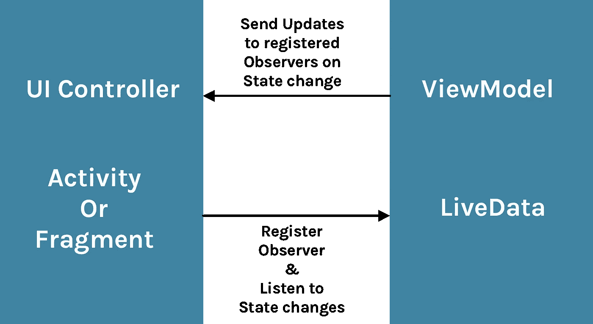
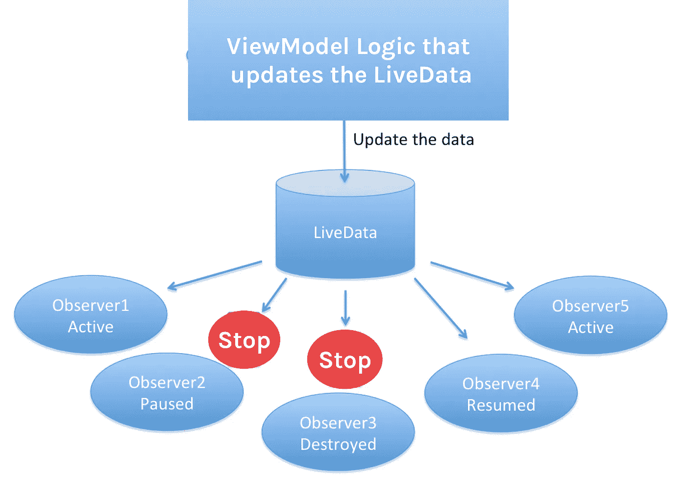
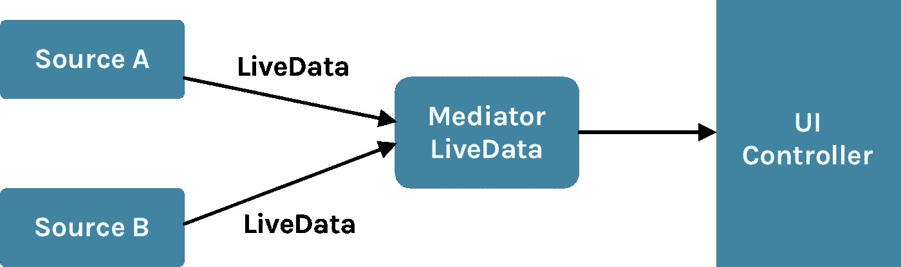

# Android:了解 LiveData

> 原文：<https://betterprogramming.pub/everything-to-should-understand-about-livedata-507dd83adea7>

## 为什么应该使用 LiveData，它是什么，它是如何工作的


照片由[阿里夫·瓦希德](https://unsplash.com/@arifrw?utm_source=unsplash&utm_medium=referral&utm_content=creditCopyText)在 [Unsplash](https://unsplash.com/s/photos/data?utm_source=unsplash&utm_medium=referral&utm_content=creditCopyText) 上拍摄

如今，架构组件对于 Android 开发人员来说很常见。长期以来，每个人都在使用这样或那样的架构组件来满足他们的需求。LiveData 是这些组件中最重要的一个。在本文中，我们将讨论 LiveData、它的使用方式及其重要性。



## 问题

《架构组件和 Rx Java》前情提要你还记得我们是如何将结果或回调传递给`UI thread`的吗？主要是通过接口。

让我们举一个用`MVP`开发的应用程序的简单例子。以前，如果要执行 API 调用，我们会从`Presenter`中的`View`层调用一个方法来执行网络请求。然后，在那个特定的方法中，我们用写`Async task`来执行操作。一旦我们收到响应，我们使用一个`View`接口将这个响应传递给`Main`线程，这样它就可以更新 UI。

这里的一切都是紧密耦合的视图和表示器，大量的接口用于层间交互。

## 解决办法

这个问题的解决方案来自于`MVVM`，但是我们不打算在这里讨论这个问题。可以说使用 T8 的主要问题已经被 T9 的概念解决了。

# 什么是 LiveData？

从文档中:

> **LiveData** 是一个**可观察的**数据持有者类。与常规的可观察对象不同，LiveData 具有生命周期意识，这意味着它尊重其他应用程序组件的生命周期，如活动、片段或服务。这种意识确保 LiveData 仅更新处于活动生命周期状态的应用程序组件观察者。

## 它是如何工作的？

为了理解 LiveData，我们首先需要理解观察者模式。`observer pattern`是一种软件设计模式，其中一个名为 subject 的对象维护一个名为 observers 的依赖者列表，并自动通知它们任何状态变化，通常是通过调用它们的一个方法。

简单来说，会有一个`Observer`订阅`Observable` 来获得最新数据的通知或者说状态改变。之前我们使用了`Rx Java`，但是这里我们需要维护一个`subscriptions`和`onDestroy()`中的`remove`的列表。

`LiveData`的主概念是一个`Observer`图案。`LiveData`是一个`observable`数据容器类——没有必要每次都请求最新的数据。使用`MVVM`时，从`[ViewModel](https://medium.com/@pavan.careers5208/everything-to-understand-about-viewmodel-400e8e637a58)`到`View`的通信仅通过`LiveData`完成。

从`View`活动或片段我们`subscribe`到`LiveData`、**、**经过`lifecycle owner`、**、`Observer`。但是没有必要维护列表或销毁订阅。正如`LiveData`是`lifecycle-aware` 它负责这些事情。**

LiveData 只有在处于`foreground`状态时才会将值提交给`Observers`(活动或片段)，这样就不会发生内存泄漏。我们不需要检查`View`是不是`alive`来更新`Observer`里面的 UI。

我们不再需要担心取消订阅它`onPause`或`onDestroy`。此外，一旦`Observer`恢复，它将立即被通知来自`LiveData`的最新数据。



关于`LiveData`，我们需要了解的两件重要事情是

*   UI 控制器或视图(an `Activity`或`Fragment`)将在每次数据改变时得到通知，而不是每次都向`[ViewModel](https://medium.com/@pavan.careers5208/everything-to-understand-about-viewmodel-400e8e637a58)`请求数据(**总是最新数据**！)
*   LiveData 是`lifecycle-aware`，所以只有当`View` (an `Activity`或`Fragment`)处于`STARTED`或`RESUMED`状态时，视图才会被注册以观察那些变化，只有这样 LiveData 才会**发出**任何项目(这样就不会再有崩溃、生命周期处理、内存泄漏和由于视图不存在而导致的`NullPointerExceptions`！)

# 让我们开始编码吧

要使用`LiveData`，我们需要采取以下步骤:

*   在应用程序级别声明依赖关系`build.gradle`。
*   创建一个 LiveData 的`instance`来保存某种类型的数据。这通常在 [ViewModel](https://medium.com/@pavan.careers5208/everything-to-understand-about-viewmodel-400e8e637a58) 类中完成。
*   创建一个定义了`**onChanged()**`方法的`Observer`对象，该方法控制当 LiveData 对象保存的数据改变时会发生什么。您通常在 UI 控制器中创建一个`Observer`对象，比如一个活动或片段。
*   使用`observe()`方法将`Observer`物体连接到`LiveData`物体上。这个方法接受一个`LifecycleOwner`对象，并将`Observer`对象订阅给`LiveData`对象，这样它就能得到变更通知。您通常在 UI 控制器中附加`Observer`对象，比如`activity`或`fragment`。

## 声明依赖关系

```
//Java
implementation "android.arch.lifecycle:extensions:1.0.0"
annotationProcessor "android.arch.lifecycle:compiler:1.0.0"//Kotlin with AndroidX
implementation 'androidx.lifecycle:lifecycle-viewmodel-ktx:2.2.0'
```

## 正在创建 LiveData 实例

LiveData 是一个包装器，可以用来保存任何类型的数据，包括实现了`Collection`的对象，比如`List`。一个`LiveData`对象通常存储在一个`[ViewModel](https://medium.com/@pavan.careers5208/everything-to-understand-about-viewmodel-400e8e637a58)`对象中，并使用 getter 方法访问。

最初，LiveData 对象中的数据没有被设置，后来当我们调用`setFirstName()`时，LiveData 的值被更新。

## 在 UI 控制器中创建 LiveData 的观察者

创建一个`Activity`并观察 LiveData 的任何变化，如下所示

## **更新 LiveData 值**

有两种方法可以更新 LiveData 中的值。

*   `setValue`
*   `postValue`

## 设置值

我们必须使用`setValue(T)`方法从`main thread`更新`LiveData`对象。如果我们从后台线程使用`setValue` ，那么应用程序崩溃，从`WongThread`异常调用日志记录。

```
_nameLiveData.*value* = "something"
```

## **后置值**

如果代码在主线程之外的`worker`线程中执行，您可以使用`postValue(T)`方法更新`LiveData`对象。它可以在任何线程中使用，但最好不要在主线程中使用，因为它比`setValue`稍慢。

```
_nameLiveData.postValue("something")
```

*要更新 LiveData 值，请使用来自* `*Main Thread*` *的* `*setValue*` *和来自主线程之外的任何其他* `*thread*` *的****postValue****以获得更好的性能。*

## **用例**

假设有一个应用程序，当用户打开一个活动并点击一个按钮时，它必须进行 API 调用。在用`LiveData`得到响应后，我们将值发送到 UI 控制器来更新视图。在这种情况下，当 API 调用处于`progress`状态时，不知何故应用程序进入了`background`状态。你能猜到接下来会发生什么吗？UI 会更新还是应用会崩溃？

API 调用完成，`LiveData`接收值。然而，无论是崩溃还是 UI 都没有更新，因为正如我们上面讨论的，LiveData 是`lifecycle-aware` 所以当 API 调用完成时，LiveData 接收该值，但它不会将该值发送到 UI 控制器。它将等待 UI 控制器进入`foreground`状态，然后 LiveData 立即将最新的可用值发送到 UI 控制器。

# LiveData 的类型

我们可以扩展`LiveData<T>` 并创建自己的自定义类。

## **可变数据**

根据文件，`MutableLiveData`的代码:

## MediatorLiveData



我们可以使用`MediatorLiveData`将不同`LiveData`对象的结果合并成一个。它也可以被定义为 LiveData 子类，可以观察其他 LiveData 对象并对来自它们的`OnChanged`事件做出反应。

假设我们有两个发出 number 类型值的 LiveData 对象。一个 LiveData 对象从特定的源发出值，另一个从不同的源发出值。我们想听听他们两个的结果，如果结果小于 10，我们也想忽略第二个 LiveData 的结果。我们的做法如下:

```
val mediatorLiveData: MediatorLiveData<Int> = MediatorLiveData()
mediatorLiveData.addSource(stockLiveData1, *Observer*<Int> **{** it ->
    mediatorLiveData.setValue(it)
**}**)

mediatorLiveData.addSource(stockLiveData1, *Observer*<Int> **{** value **->** if (value > 10) {
        mediatorLiveData.setValue(value)
    }
**}**)
```

## 用例

假设我们只想将`liveData`发出的五个值合并到`MediatorLiveData`中。然后，在这五个值之后，我们可以停止监听`liveData`并将其作为源移除:

```
val liveDataMerger: MediatorLiveData<Int> = MediatorLiveData()
val liveData = MutableLiveData<Int>()
val liveData2 = MutableLiveData<Int>()

liveDataMerger.addSource(liveData) **{** value **->** liveDataMerger.setValue(value)
**}** liveDataMerger.addSource(liveData2) **{** value2**->** var count = 1
    count++
    liveDataMerger.setValue(value2)
    if (count > 5) {
        liveDataMerger.removeSource(liveData2)
    }

**}**
```

*如果给定的* `*LiveData*` *已经作为源添加，但带有不同的* `*Observer*` *，那么* `*IllegalArgumentException*` *将被抛出。*

# 转换

`Transformations`类为我们提供了可以改变 LiveData 对象中的值的函数。目前，我们在这个类中有两个可用的函数:`map`和`switchMap`。

`map()`允许您在`LiveData`发出更改时将更改应用到每个值。*该方法类似于* `*Rx(io.reactivex.Observable)*` *地图操作符。该转换将在* `*main*` *线程上执行。*下面是文档中的一个例子，其中一个`User`对象被映射以获得完整的名称:

```
LiveData<User> userLiveData = ...;*LiveData<String> userFullNameLiveData =
 Transformations.map(userLiveData,user ->
 user.firstName + user.lastName);
});*
```

根据文件，`map` 方法代码如下:

```
@MainThread
public static <X, Y> LiveData<Y> map(
        @NonNull LiveData<X> source,
        @NonNull final Function<X, Y> mapFunction) {
    final MediatorLiveData<Y> result = new MediatorLiveData<>();
    result.addSource(source, new Observer<X>() {
        @Override
        public void onChanged(@Nullable X x) {
            result.setValue(mapFunction.apply(x));
        }
    });
    return result;
}
```

`switchMap`返回一个新的`LiveData`对象而不是一个值，即它将实际的`LiveData`切换为一个新的。*该方法类似于* `*Rx(io.reactivex.Observable)*` *开关映射操作符。* `*switchMapFunction*` *将在* `*main*` *线程上执行。*

下面是一个示例类，它保存了键入的用户名，该用户名是来自`MutableLiveData`中的`EditTex`的字符串，并返回一个包含同名用户的用户对象列表的`LiveData`。每次输入的名称改变时，它通过重新查询一个存储库模式对象来填充这个`LiveData`。

```
 *class UserViewModel extends AndroidViewModel {
     MutableLiveData<String> nameQueryLiveData = ...

     LiveData<List<String>> getUsersWithNameLiveData() {
         return Transformations.switchMap(
             nameQueryLiveData,
                 name -> myDataSource.getUsersWithNameLiveData(name));
     }

     void setNameQuery(String name) {
         this.nameQueryLiveData.setValue(name);
     }
 }*
```

根据文档，`switchMap` 方法代码如下:

请给我你的建议和意见。

感谢阅读！