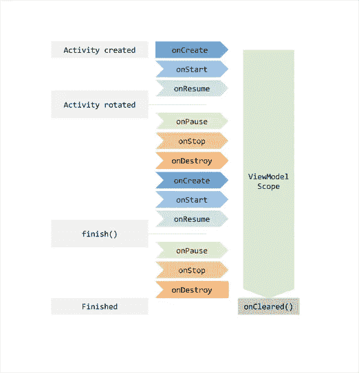
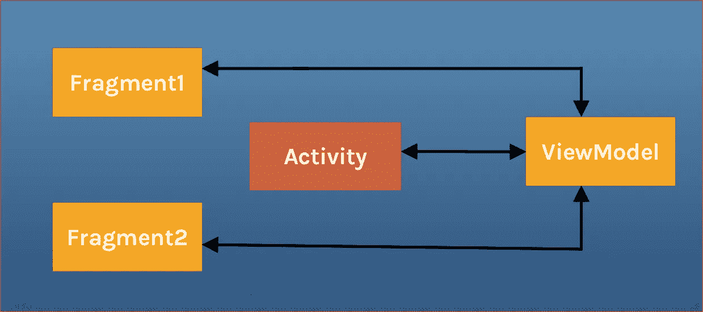

# 视图模型如何在 Android 上工作

> 原文：<https://betterprogramming.pub/everything-to-understand-about-viewmodel-400e8e637a58>

## 了解如何使用视图模型及其内部工作原理


比尔·牛津在 [Unsplash](https://unsplash.com/s/photos/machinery?utm_source=unsplash&utm_medium=referral&utm_content=creditCopyText) 上拍摄的照片

根据 [Android 的文档](https://developer.android.com/topic/libraries/architecture):

> " Android 架构组件是一个库的集合，帮助你构建健壮的、可测试的和可维护的应用."

Android 架构组件有很多东西，包括文档中所说的“管理 UI 组件生命周期和处理数据持久性”的类。在这一段中，我们来学习一下`ViewModel`及其用法。

# 介绍

`ViewModel`是一个负责准备和管理 UI 组件(活动或片段)数据的类。它还为活动和片段之间或者不同片段之间的通信提供了一种简单的方式。

`ViewModel`总是与一个作用域(一个片段或者一个活动)相关联地被创建，并且只要这个作用域还存在，它就会被保留——也就是说..，如果是活动直到完成。换句话说，这意味着如果一个`ViewModel`的所有者因为配置更改(例如，轮换)而被销毁，它也不会被销毁。所有者的新实例将重新连接到现有的`ViewModel`。让我们看看这是如何发生的



[通过 Android 文档查看模型概述](https://developer.android.com/topic/libraries/architecture/viewmodel)

`ViewModel`的目的是获取并保存活动或片段所需的信息。活动或片段应该能够观察到`ViewModel`中的变化。通常通过 LiveData 或 Android 数据绑定来公开这些信息。


`ViewModel`的唯一职责是管理 UI 的数据。它不应该访问您的视图层次结构，也不应该保留对活动或片段的引用。

我们先来了解一下使用`ViewModel`的好处。

## 利益

1.  `ViewModel`经受住旋转和其他配置变化。

2.`ViewModel`当 activity 在 back stack 上时继续运行。

3.`ViewModel`具有生命周期意识。

4.`ViewModel` s 在 LiveData 的帮助下，被动地执行 UI 更改。每当数据发生变化时，UI 就会根据观察到的 LiveData 和`ViewModel`中的当前数据进行更新。

5.`ViewModel`易于理解，易于检验。

在这篇文章中，我们将深入探讨`ViewModel`的三个重要方面。

1.创建和使用一个简单的`ViewModel`。
2。使用`ViewmodelProvide.Factory`创建和使用带有参数的`ViewModel`。3。共享`ViewModel`用于活动和片段之间的通信。

# 简单视图模型

让我们通过创建一个简单的例子来更好地理解`ViewModel` s。

## 例子

创建和使用`ViewModel`有四个主要步骤:

1.  在您的应用程序级别添加依赖关系`build.gradle`。
2.  通过创建一个扩展`ViewModel`的类，将所有数据从活动中分离出来。
3.  在您的活动中创建一个`ViewModel`实例来使用它。
4.  设置`ViewModel`和`View`层之间的通信。

## 添加依赖关系

为了使用`ViewModel`，我们需要将依赖项添加到我们的`app/build.gradle`文件中。

```
implementation "android.arch.lifecycle:extensions:1.0.0"
annotationProcessor "android.arch.lifecycle:compiler:1.0.0"
```

或者，如果您将 Kotlin 与 AndroidX 配合使用，请添加:

```
implementation 'androidx.lifecycle:lifecycle-viewmodel-ktx:2.2.0'
```

## 创建视图模型类

让我们为没有任何数据的活动创建一个`SampleViewModel`类。这可以简单地通过扩展`ViewModel` 类来实现。

```
package com.example.viewmodel

import androidx.lifecycle.ViewModel

class SampleViewModel :**ViewModel**() {

    override fun **onCleared**() {
        super.onCleared()
        // Dispose All your Subscriptions to avoid memory leaks
    }
}
```

`onCleared()` : 当这个`ViewModel`不再被使用并且将被销毁时，这个方法将被调用。当`ViewModel`观察到一些数据时，这是很有用的，你需要清除这个订阅来防止这个`ViewModel`的泄露。

## 在活动中创建 ViewModel 实例

使用`ViewModelProvider`在活动中创建一个`ViewModel`实例。我们需要将上下文和`ViewModel`类名传递给`ViewModelProvider` 来获取实例。

```
package com.example.viewmodel

import androidx.appcompat.app.AppCompatActivity
import android.os.Bundle
import androidx.lifecycle.ViewModelProvider

class MainActivity : AppCompatActivity() {

   lateinit var viewModel : SampleViewModel

    override fun onCreate(savedInstanceState: Bundle?) {
        super.onCreate(savedInstanceState)
        setContentView(R.layout.*activity_main*)
        viewModel =  **ViewModelProvider**(**this**).get(**SampleViewModel**::class.*java*)

    }
}
```

`ViewModelProvider`是`ViewModelStore`的一个实用类。它在内部引用`ViewModelStore`来返回`ViewModel`的现有实例(如果它存在的话)——否则，它创建一个新的实例。`ViewModelStore`内部使用`HashMap`跟踪`ViewModel` s。

## 设置视图模型和活动之间的通信

现在让我们看看如何从`ViewModel`中获取值，并在`View`层中显示它们。让我们在`ViewModel`中创建一个`LiveData`，点击其中的一个按钮，activity 更新它的值来显示一个 toast 消息。

现在让我们处理活动内部的 UI 层代码。

每当`badgeCount` 到`LiveData`的数据在后台发生变化时，我们都会在我们注册的`Observer`内部收到一个回调。所以用户界面总是用最新的可用数据进行更新。

现在我们已经完成了`ViewModel`及其通信的基础知识，但是还有更多。我们继续。

# **视图模型提供者。工厂**

由于上面的`ViewModel`在构造函数中没有任何参数，这样做很容易。

但是如果你有一个参数需要传递给`ViewModel`的构造函数，那么你需要`ViewModelFactory`。如果您在没有工厂的情况下尝试上述方法，则会导致编译时错误。

```
class SampleViewModel :**ViewModel**(name:String) {

    override fun **onCleared**() {
        super.onCleared()
        // Dispose All your Subscriptions to avoid memory leaks
    }
}
```

当您运行应用程序时，进程崩溃并出现错误:`java.lang.RuntimeException: Cannot create an instance of class com.example.viewmodel.SampleViewModel`。

`ViewModelProvider()` 方法在内部创建一个默认的`ViewModelProvider.Factory`实现，用于创建不带参数的`ViewModel`。因此，当您在构造函数中添加参数时，`ViewModelProvider.Factory`的内部实现无法初始化您的`ViewModel`，因为`ViewModelProvider.Factory`调用主构造函数来创建`ViewModel`的实例。

我们需要使用`ViewModelProvider.Factory`来创建带有自定义参数的`ViewModel` 实例。如果没有争论，那么定制工厂就没有存在的必要。

`ViewModelProvider.Factory`是负责实例化`ViewModel`的工厂接口的实现。我们需要创建自己的工厂来创建带有参数的`ViewModel`实例

最简单的方法是创建我们自己的定制工厂扩展 ViewModelProvider。工厂接口，给出一个被覆盖的方法，`create`，**，**负责创建我们的`ViewModel`的实例。

```
package com.example.viewmodel

import androidx.lifecycle.ViewModel
import androidx.lifecycle.ViewModelProvider

class SampleViewModelFactory (val arg: **String**): **ViewModelProvider.Factory** {

    override fun <T : ViewModel?> **create**(modelClass: Class<T>): T {
        return   modelClass.getConstructor(**String**::class.*java*).newInstance(arg)
    }
}
```

`modelClass.getConstructor(String::class.java)`获取类型为`String`的构造函数，并通过调用`newInstance`方法并将构造函数值传递给该方法来创建`ViewModel`的实例。

现在让我们检查活动内部的实现。

```
class MainActivity : AppCompatActivity() {

    lateinit var viewModel: SampleViewModel

    override fun onCreate(savedInstanceState: Bundle?) {
        super.onCreate(savedInstanceState)
        setContentView(R.layout.*activity_main*)
        val factory = SampleViewModelFactory("sample")
        viewModel = ViewModelProvider(this,factory).get(SampleViewModel::class.*java*)
    }
}
```

如果您的`ViewModel`有依赖项或参数，并且您想要创建您的`ViewModel`实例，那么您应该创建您的自定义`ViewModelProvider.Factory`，并通过`ViewModel`构造函数传递依赖项或参数，并给`ViewModelProvider.Factory`实例赋值。

```
val **factory** = SampleViewModelFactory("sample")
ViewModelProvider(this,**factory**).get(SampleViewModel::class.*java*)
```

否则，我们可以简单地使用`ViewModelProvider(this)` 来创建实例。

```
ViewModelProvider(this).get(SampleViewModel::class.*java*)
```

# 活动和片段之间通信的共享视图模型

为了在不同的片段之间或者一个片段和一个活动之间进行通信，我们通常使用接口或者目标片段。

但是如果它们共享一个活动范围的公共`ViewModel`，那么使用`ViewModel`进行通信会更容易。让我们来看看怎么做。



为了实现上面的流程，我们需要在片段和活动的活动范围内创建一个`ViewModel`实例，这样只有一个公共实例被创建并在不同的片段间共享。

## 问题

一个活动中的两个或多个片段需要相互通信是很常见的。

想象一下两个片段的常见情况:您有一个片段 1，其中用户从列表中选择一个项目，还有一个片段 2，显示所选项目的内容。这种情况绝不是微不足道的，因为两个片段都需要定义一些接口描述，并且所有者活动必须将两者绑定在一起。此外，两个片段都必须处理另一个片段尚未创建或不可见的情况。

## 解决办法

这个常见的痛点可以通过使用`ViewModel`对象来解决。这些片段可以共享一个`ViewModel`,使用它们的活动范围来处理这种通信。

现在让我们创建`SharedViewModel`。

```
class SharedViewModel : ViewModel() {
      val selected = MutableLiveData<String>() fun selectedItem(item: String) {
       selected.value = item
      }
}
```

用例:让我们假设有两个片段——`Fragment1`和`Fragment2`——以及这两个片段所连接的主活动。我们需要在点击按钮时从`Fragment1`向`Fragment2`发送一些东西。

`Fragment1`看起来像:

`Fragment2`看起来像:

请注意，这两个片段都检索包含它们的活动。这样，当每个片段都获得了`ViewModelProvider`时，它们会收到同一个`SharedViewModel`实例，该实例的作用范围是活动。

这种方法具有以下优点:

*   该活动不需要做任何事情，也不需要知道任何关于该通信的信息
*   除了`SharedViewModel`契约之外，片段之间不需要相互了解。如果其中一个碎片消失了，另一个会照常工作。
*   每个片段都有自己的生命周期，不受另一个的影响。如果一个片段替换了另一个片段，UI 将继续工作，不会出现任何问题。

所以`ViewModel`可以用来简化 UI 组件之间的通信。