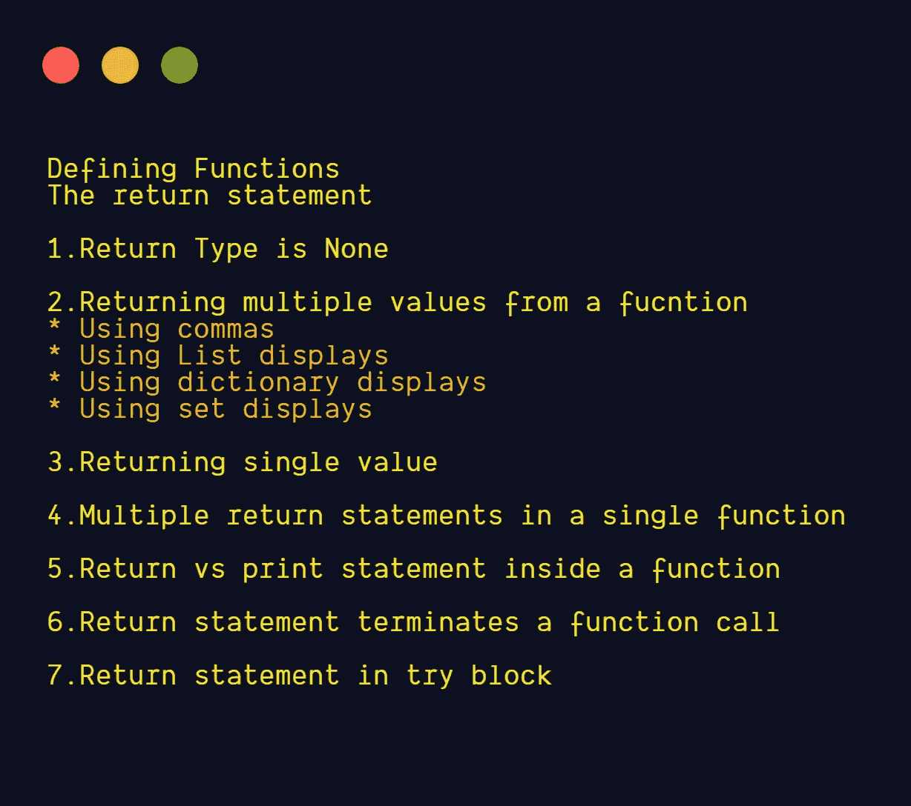
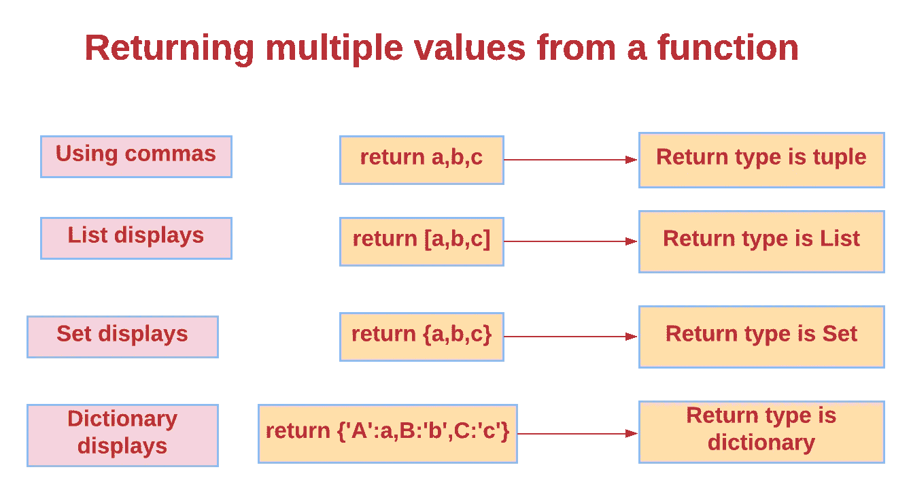

# 关于 Python Return 语句，您想知道的一切

> 原文：<https://betterprogramming.pub/everything-you-ever-wanted-to-know-about-python-return-statements-c14f6c749ff2>

## 何时归还什么，如何归还


照片由[电脑](https://www.pexels.com/@pcees?utm_content=attributionCopyText&utm_medium=referral&utm_source=pexels)从[像素](https://www.pexels.com/photo/when-will-you-return-signage-1749057/?utm_content=attributionCopyText&utm_medium=referral&utm_source=pexels)拍摄

# **本文涵盖的主题**



作者图片

# **定义功能**

> 函数定义以关键字`def`开始，后面是函数名和带括号的形参列表。构成函数体的语句从下一行开始，必须缩进。- [python 文档](https://docs.python.org/3/tutorial/controlflow.html#defining-functions)

```
**def** fname(parameters):
    statement(s)
```

该函数可能包含`return`或`yield` 语句。
如果一个函数有一个`yield`语句，则称为*生成器函数*。

# **“退货”声明**

`return`语句终止函数调用，并向调用者返回值。

没有表达式参数的`return`语句返回`None`，没有`return`语句的函数也返回`None`。

**语法:**

```
"return" [expresion_list]
```

## 1.返回类型为无

**例 1:**

如果函数内部没有`return`语句，则返回`None`。

```
**def** add():
    **pass** print(add())
*#Output:None*
```

**例 2:**

如果函数中没有到达`return`语句，则返回`None`。
这里，在这个例子中，条件 `c>10`不满足，所以返回`None`。

```
**def** add(a,b):
    c=a+b
    **if** c>10:
        **return** c
print(add(1,2))
*#Output:None*
```

**例 3:**

```
**def** add(a,b):
   c=a+b
print(add(1,2))
*#Output:None*
```

## 2.从函数中返回多个值



图片来源:作者

**使用逗号返回多个值**

如果`return`语句中的表达式列表至少包含一个逗号，除了当列表或集合的一部分显示时，它返回一个元组。元组的长度是列表中表达式的数量。表达式从左到右计算。

返回类型是元组。

```
**def** add(a,b):
   result=a+b
   **return** a,b,result
print(add(1,2))
*#Output:(1,2,3)*
```

具有带尾随逗号的单个表达式的`return`语句返回一个元组。

```
**def** add(a,b):
   result=a+b
   **return** result,
print(add(1,2))
*#Output:(3,)*
```

**使用列表显示返回多个值**

列表显示产生新的列表对象，内容由表达式列表指定。当提供逗号分隔的表达式列表时，其元素从左到右进行计算，并按此顺序放入 list 对象中。返回类型是列表。

```
**def** calc(a,b):
    sum=a+b
    dif=a-b
    mul=a*b
    div=a/b
    **return** [sum,dif,mul,div]

print(calc(5,4))
*#Output:[9, 1, 20, 1.25]*
```

**使用字典显示返回多个值**

> 字典显示产生一个新的字典对象。当在键/值对中提供了逗号分隔的表达式序列时，每个键对象都被用作字典中的键来存储相应的值。-[python docs](https://docs.python.org/3/reference/expressions.html#dictionary-displays)返回的类型是字典。

```
**def** calc(a,b):
    sum=a+b
    dif=a-b
    mul=a*b
    div=a/b
    **return** {**"Addition"**:sum,**"Subtraction"**:dif,**"Multiplication"**:mul,**"Division"**:div}

print(calc(5,4))
*#Output:{'Addition': 9, 'Subtraction': 1, 'Multiplication': 20, 'Division': 1.25}*
```

**使用集合显示返回多个值**

> 集合显示产生一个新的可变集合对象，其内容由一系列表达式或一个理解指定。当提供逗号分隔的表达式列表时，其元素从左到右进行计算，并添加到 set 对象中。返回类型是集合。- [python 文档](https://docs.python.org/3/reference/expressions.html#set-displays)

```
**def** calc(a,b):
    sum=a+b
    dif=a-b
    mul=a*b
    div=a/b
    **return** {sum,dif,mul,div}

print(calc(5,4))
*#Output:{9, 20, 1, 1.25}*
```

## **3。从函数中返回单个值**

具有不带尾随逗号的单个表达式的 return 语句不会创建元组；它返回该表达式的值。

```
**def** add(a,b):
   result=a+b
   **return** result

print(add(1,2))
*#Output:3* print(add(**"Hello "**,**"Python"**))
*#Output:Hello Python* print(add([1,2],[3,4]))
*#Output:[1, 2, 3, 4]* print(add((1,2),(3,4)))
*#Output:(1, 2, 3, 4)*
```

## **4。单个函数中的多个“返回”语句**

当到达其中一个 return 语句时，函数调用终止。

```
**def** num(a):
    **if** a%2==0:
        **return "Even Number"
    else**:
        **return "Odd Number"** print(num(5))*#Output:Odd Number* print(num(30))*#Output:Even Number*
```

## **5。函数内的“返回”与“打印”语句**

`return` 语句将终止函数调用，并将值返回给调用者。

`print` 语句将只打印数值。我们不能将结果赋给另一个变量或将结果传递给另一个函数。

**示例:将返回值赋给变量，并作为参数传递给另一个函数**

```
**def** add(a,b):
    r1=a+b
    **return** r1

**def** sub(c,d):
    r2=c-d
    **return** r2*#We can assign the return value to a variable* r3=add(3,4)
print(r3)*#Output:7**#We can pass the return value to another function also.* print(sub(r3,5))*#Output:2*
```

**举例:带有** `**print**` **语句的函数**

```
**def** add(a,b):
    r1=a+b
    print (r1)

*add(3,4) #Output:7

#We can't assign the return value to a variable* r3=add(3,4)
print(r3)*#Output:None*
```

## **6。' return '语句终止函数调用**

`return`语句以表达式列表(或`None`)作为`return`值终止当前函数调用。不执行函数内`return`语句之后的语句。

```
**def** add(a,b):
    result=a+b
    **return** result
    print(**"After return statement"**)

print(add(3,4) )*#Output:7*
```

在上面的例子中，`return`语句将终止函数调用，所以`print`语句没有被执行。

```
**def** add(a,b):
    result=a+b
    print(result)
    print(**"Addition is done"**)

add(3,4)
**'''
Output:
 7
Addition is done
'''**
```

在上面的例子中，两个`print`语句都被执行。

## **7。“try”块中的“return”语句**

> 当`return`用一个`finally`子句将控制从`try`语句中传递出来时，那个`finally`子句在真正离开函数之前被执行— [Python 文档](https://docs.python.org/3/reference/simple_stmts.html#the-return-statement)

**示例:在下面的示例中，函数调用将在执行** `**finally**` **子句后返回。**

```
**def** add(a,b):
    **try**:
        result=a+b
        **return** result

    **except** Exception **as** e:
        **return** e
    **finally**:
        print(**"Finally done"**)

print(add(3,4))
**'''
Output:
Finally done
7
'''**
```

如果出现异常，函数调用将在执行`finally`子句后返回。

```
**def** add(a,b):
    **try**:
        result=a+b
        **return** result
    **except** Exception **as** e:
        **return** e
    **finally**:
        print(**"Finally done"**)

print(add({**'a'**:1},{**'b'**:2}))

**'''
Output:
Finally done
unsupported operand type(s) for +: 'dict' and 'dict'
'''**
```

# 结论

*   `return`语句只出现在函数定义中。
*   `return`语句将终止函数调用并返回值。
*   `return`语句也可以返回多个值。`return`值也可以用作另一个函数的参数。
*   如果`return`语句不在函数中或者没有到达，将返回`None`。
*   该函数也可以有多个`return`语句。当到达`return`语句之一时，函数调用终止。

# 我的其他博客链接

[Python 函数定义中的 5 种参数类型](https://levelup.gitconnected.com/5-types-of-arguments-in-python-function-definition-e0e2a2cafd29)

# 资源(Python 文档):

[退货单](https://docs.python.org/3/reference/simple_stmts.html#the-return-statement)

[定义功能](https://docs.python.org/3/tutorial/controlflow.html#defining-functions)

[列表显示](https://docs.python.org/3/reference/expressions.html#list-displays)

[字典显示](https://docs.python.org/3/reference/expressions.html#dictionary-displays)

[设置显示](https://docs.python.org/3/reference/expressions.html#set-displays)

*关注此空间，获取更多关于 Python 和数据科学的文章。如果你喜欢看我的更多教程，就关注我的* [***中***](https://medium.com/@IndhumathyChelliah)[***LinkedIn***](https://www.linkedin.com/in/indhumathy-chelliah/)*[***推特******。***](https://twitter.com/IndhuChelliah)*

*感谢阅读！*