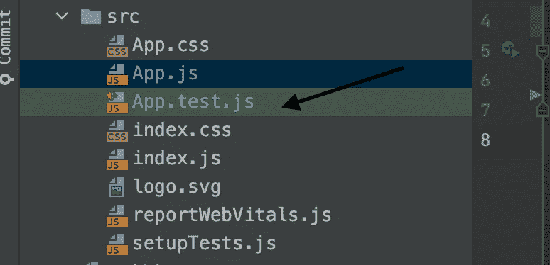
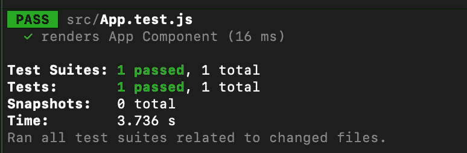

# 在 React 中开始测试所需的一切

> 原文：<https://betterprogramming.pub/everything-you-need-to-get-started-with-testing-in-react-e16819b0eba7>

## 给初学者的简明介绍


照片由 [Aaron Burden](https://unsplash.com/@aaronburden?utm_source=medium&utm_medium=referral) 在 [Unsplash](https://unsplash.com?utm_source=medium&utm_medium=referral) 上拍摄

很长一段时间，像所有其他自称摇滚明星的程序员一样，我忽略了测试。可能那是因为刚开始看起来毫无意义。也许我害怕它。我知道你们很多人和我一样！

不要担心——React 有一个名为`react-testing-library`的很棒的库，它使得测试 React 组件变得非常容易和直观。这也是 React 中推荐的测试方式。

今天我们将探索这一点。我们开始吧！

# 1.创建新项目

首先，用`create-react-app`搭建一个新的 React 应用程序。

```
npx create-react-app learn-testing
```

当你用`create-react-app`创建一个项目时，测试设置会自动为你准备好。否则，请参考[。](https://testing-library.com/docs/react-testing-library/intro/)



新项目

# 2.我们的第一个测试

打开您的`App.test.js`文件，只需添加以下代码来呈现`App`组件。

## **解释**

这个简单的测试试图呈现`App`组件。如果您的代码有任何问题，那么这个测试将会失败。

**提示:**即使你没有时间为你的项目实现完整的测试，试着为每个组件添加这个基本测试。这可以捕捉到代码中许多无意的问题，并为您节省大量时间。

## 运行测试

您可以运行以下命令来查看测试结果:

```
yarn test
```



试验

你会收到这个令人满意的绿色信息。厉害！

# 3.抓取屏幕上的任何元素

测试过程的第一步是找出屏幕上的特定元素，这样我们就可以对其进行操作。

让我们更新我们的组件，为它添加一个按钮，并找到这个元素。

暂时不要担心额外的属性`data-testid`。我们以后再谈。

## **第一种方法:通过文本获取元素**

你可以通过文本在屏幕上找到一个元素。

通过文本获取元素

如果你想避免输入精确的单词，你可以使用`regular-expressions`。

通过正则表达式获取元素

## **第二种方法:通过数据测试 ID 获取元素**

也许组件中的文本经常改变——在这种情况下，您必须更新测试，这可能会令人沮丧。

还记得我们如何在按钮组件中添加一个`data-testid`属性吗？如果你想的话，你可以用 ID 得到按钮。

通过数据测试 ID 获取元素

## 第三种方法:通过角色获取元素

你也可以使用元素的角色(按钮、文本框等)来获取元素。).

按角色获取元素

[这里](https://testing-library.com/docs/react-testing-library/cheatsheet/)是一些你可以得到一个元素的其他方法。

# 4.异步查找元素

现在你在想，“好吧，这很酷。但是如果我想检查某个动作之后进入屏幕的元素是否成功呢？”

到目前为止，我们只讨论了`getBy`函数。我们可以再用两个类似的函数。

`queryBy`:不返回一个元素，所以如果我们想检查一个元素是否不存在，我们可以使用这个

`findBy`:如果你想得到一个还没有的元素，使用这个

## findBy 的用法

假设我们有一个从远程数据源获取数据的组件。如果成功了，我们就展示一个特殊的组件。这是该组件的伪代码。它使用`setTimeout`来模仿一个远程 API 调用。

现在，如果我们使用`getBy`来测试组件，它会失败，因为`<div>`在开始时不存在。因此下面的测试将会失败:

我们能做的是使用`findBy`等待元素在两秒钟后出现。

现在它过去了！所以我希望你明白哪个是哪个。总结一下:对于任何还没有出现但最终会出现的元素，使用`findBy`而不是`getBy`或`queryBy`。如果你断言一个丢失的元素，使用`queryBy`。否则，默认为`getBy`。

# 5.模拟用户操作

我们不能孤立地测试组件。在现实生活中，我们的用户会做很多事情，我们需要为此做好准备。

## 点击某物

用户通常做的最常见的任务之一是点击某物。我们可以测试:

这里我们找到按钮，然后模拟点击事件。

## 写点什么

用户的另一个常见动作是在输入中键入一些内容。我们也可以测试一下。

这里，我们通过标签文本获取输入字段，然后在字段中键入`Hello World`。

你可以在这里了解更多关于用户事件[的信息。](https://testing-library.com/docs/ecosystem-user-event/)

给你。我想你现在对从哪里开始有了更好的理解。希望有所帮助。祝您愉快！

**通过** [**LinkedIn**](https://www.linkedin.com/in/56faisal/) **或我的** [**个人网站**](https://www.mohammadfaisal.dev/) **与我取得联系。**

[](https://javascript.plainenglish.io/20-essential-parts-of-any-large-scale-react-app-ee4bd35436a0) [## 任何大型 React 应用程序的 20 个基本部分

### 如果您正在编写企业级代码，您需要了解这一点

javascript.plainenglish.io](https://javascript.plainenglish.io/20-essential-parts-of-any-large-scale-react-app-ee4bd35436a0) [](/the-7-traits-of-a-rock-star-react-developer-747fbb001c05) [## 摇滚明星 React 开发者的 7 个特质

### 造成差异的习惯

better 编程. pub](/the-7-traits-of-a-rock-star-react-developer-747fbb001c05) 

# 资源

*   [React 测试库](https://testing-library.com/docs/react-testing-library/intro/)
*   [关键字“测试](https://kentcdodds.com/blog/?q=testing)”通过 kentcdodds.com