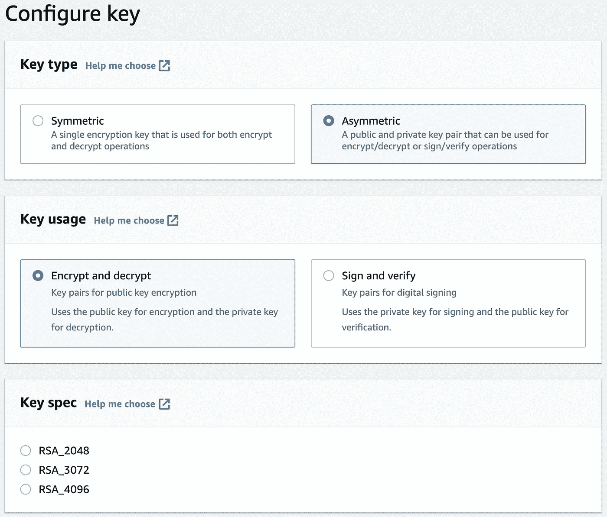

# 关于 AWS 加密您需要知道的一切

> 原文：<https://betterprogramming.pub/everything-you-need-to-know-about-aws-encryption-d84a1dbae6f7>

## 构建完全安全的应用程序的机会

照片由[拍摄来自](https://www.pexels.com/@life-of-pix?utm_content=attributionCopyText&utm_medium=referral&utm_source=pexels)[像素](https://www.pexels.com/photo/brass-colored-metal-padlock-with-chain-4291/?utm_content=attributionCopyText&utm_medium=referral&utm_source=pexels)的像素的生命

加密目前仍然是一个热门话题。每年都在各种算法中发现安全漏洞。那么更强甚至更安全的算法正在被开发。直到下一次入侵。

亚马逊网络服务(AWS)在安全方面投入了大量资金。您希望确保您在云系统中的数据得到可靠的保护。实现它的方法之一是加密你的数据。我们可以在将数据分配给 AWS 之前对其进行编码。

同时，AWS 提供了一些选项来在接收数据时对数据进行加密。反之亦然，当我们试图访问这些数据时，它们就会被解码。这称为服务器端加密或静态加密。让我们更深入地探讨一下可用的加密机制以及它们之间的区别。

# 亚马逊 S3 管理的密钥

我想到的第一个选择是在 S3 加密对象。此选项在存储桶级别可用。启用后，bucket 中的所有对象将在上传时被加密，并在有人访问时被解密。

它应用最强的对称密钥算法之一，AES-256。用户不需要担心客户主密钥(CMK)。云提供商负责处理；它为每个对象生成一个唯一的密钥，并安全地存储它。

为 bucket 启用加密后，通过 REST API 或 CLI 上传对象也会发生变化。我们必须提供一个带有值`AES256`的自定义标题`x-amz-server-side-encryption`。

所有这些使得 AWS 上的这种类型的加密使用起来并不复杂。无需深入技术细节，我们就能获得数据受到保护的保证。

# 密钥管理服务

AWS 密钥管理服务(KMS)比 S3 管理的密钥具有更多功能。可以创建和管理客户主密钥。还有各种配置可供选择。

创建客户密钥和配置控制台

从上面的截图中，我们看到我们能够在对称和非对称加密之间进行选择。与 S3 管理的密钥不同，我们不仅受到 AES256 的限制。配置包括权限、密钥策略、自动密钥轮换等等。

KMS 与大多数其他 AWS 服务集成得很好。这是一个存储加密密钥的可靠、安全、完全托管的地方。有了 CloudTrail，我们甚至能够审计与密钥相关的所有活动。

当使用 REST API 时，我们必须提供相同的头`x-amz-server-side-encryption`，但是带有值`aws:kms`。除此之外，我们还可以在额外的头中提供密钥 ID。如果未定义，系统将选择 AWS 管理的客户主密钥。

# 客户提供的加密密钥

在某些情况下，您的产品可能有特定的安全性要求，您必须使用外部加密密钥。这个选项有它自己的优点和缺点，但是我们不会深入探讨。好消息是 AWS 支持这个选项。

简言之，它是这样工作的:每当向 AWS 上传一个对象时，我们必须提供一个加密密钥。我们在一个自定义的头`x-amz-server-side-encryption-customer-key`中传递它。随之而来的是一些与额外安全性相关的限制。

首先，我们必须使用 HTTPS，因为 HTTP 呼叫将被拒绝。其次，我们必须在单独的头中提供加密密钥的编码 MD5 摘要。第三，我们不能使用 AWS 控制台，因为没有办法提供加密密钥。我们必须使用 REST API 或 SDK 来代替。最后一个，我们必须管理密钥。如果密钥丢失，数据将永远保持加密状态。

访问数据也是如此。我们必须提供密钥，以便 AWS 可以在响应之前验证它。这听起来像是一种开销，但它是安全合规性的一部分。

# 编后记

加密和安全并不是最激动人心的话题。但是 AWS 尽了最大努力让它尽可能简单。为了理解这些要求，您需要对密码学的工作原理有一些基本的了解。其余的，云提供商会处理。最后，你会惊喜地发现事情进展得如此顺利。