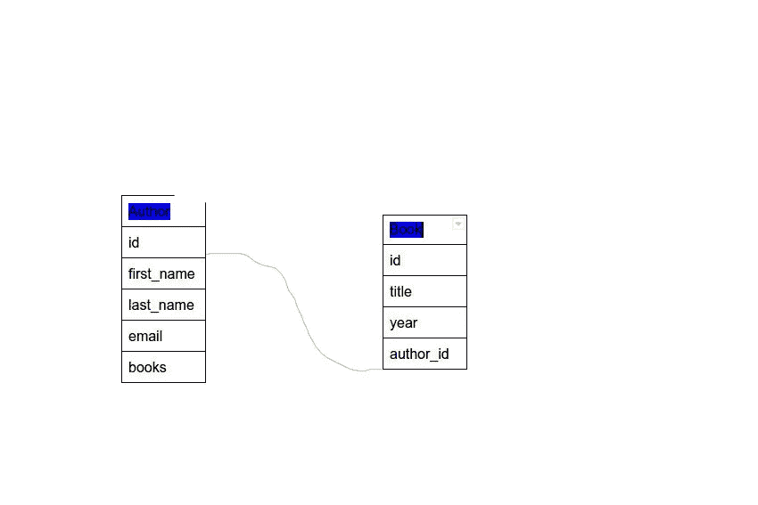
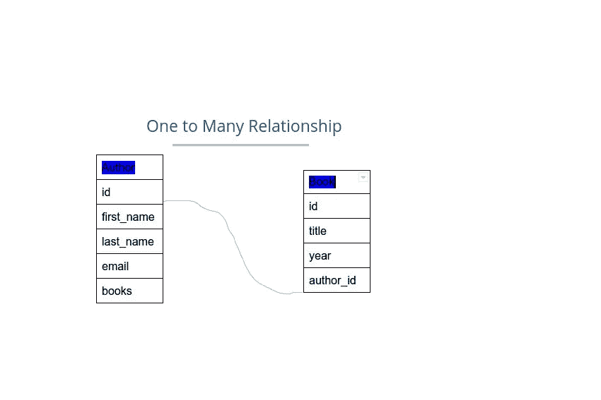

# 关于 Flask 中的数据库，您需要了解的一切

> 原文：<https://betterprogramming.pub/everything-you-need-to-know-about-databases-in-flask-3c7cf44ad6fe>

## 通过数据库为您的 Flask 应用程序添加功能


由 [Boitumelo Phetla](https://unsplash.com/@writecodenow?utm_source=unsplash&utm_medium=referral&utm_content=creditCopyText) 在 [Unsplash](https://unsplash.com/s/photos/database?utm_source=unsplash&utm_medium=referral&utm_content=creditCopyText) 上拍摄的照片

为了使应用程序中的数据有意义，它需要以某种方式相关联，考虑你最喜欢的社交媒体，作为一个用户，你有一个专用空间来发布照片和视频等内容，你甚至可以通过赞、直接消息等与其他用户互动。

# 关系数据库

关系数据库用于数据管理。关系数据库由表示实体的表组成。它们还表示实体之间的关系。比如一个艺人可以有不同的专辑，一个人可以有很多爱好等等。

# 数据库模式

数据库模式描述了对象的表示方式。考虑下面描述两个表之间关系的图像



数据库模式

# 烧瓶化学

根据[文档](https://flask-sqlalchemy.palletsprojects.com/en/2.x/):

> Flask-SQLAlchemy 是对 [Flask](http://flask.pocoo.org/) 的扩展，为您的应用程序增加了对 [SQLAlchemy](https://www.sqlalchemy.org/) 的支持。它旨在通过提供有用的缺省值和额外的帮助器来简化 SQLAlchemy 与 Flask 的使用，从而更容易完成常见任务。

# 使用 Flask-SQLAlchemy 创建 Flask 应用程序

为您的应用程序创建一个目录，并创建一个虚拟环境。

```
mkdir flaskdb
python3.8 -m venv env
```

激活虚拟环境并创建文件 `app.py`

```
source env/bin/activate
touch app.py
```

通过 pip 安装 Flask 和 flask_sqlachemy

```
pip3 install Flask-SQLAlchemy
pip3 install Flask
```

打开`app.py`，导入`Flask`和`SQLAlchemy`。

```
from flask import Flaskfrom flask_sqlalchemy import SQLAlchemy
```

然后创建 Flask 应用程序实例。

```
app = Flask(__name__)
```

## 数据库配置

有几个数据库可以用，比如 SQLite，MYSQl 或者 Postgres。在我们的例子中，我们将使用 SQLite，因为它轻量级且易于使用。
我们首先指定数据库文件的路径名，并使用`SQLAchemy`类创建一个数据库实例。

```
app.config['SQLALCHEMY_DATABASE_URI'] = 'sqlite:///mydb.db'
db = SQLAlchemy(app)
```

## 按指定路线发送

让我们添加一个显示“Hello World”的简单路由。

```
@app.route('/home')def home(): return "Hellow World."
```

当您运行应用程序时，您应该会看到以下内容。

要抑制该警告，将`SQLALCHEMY_TRACK_MODIFICATIONS`设置为假

```
app.config['SQLALCHEMY_TRACK_MODIFICATIONS'] = False
```

再次运行服务器并导航到 [http://127.0.0.1:5000/home，](http://127.0.0.1:5000/home)


# 创建模型

我们在上面创建的 db 实例存储了基类(db。模型)用于所有模型。它还包含来自`sqlalchemy`和`sqlalchemy.orm`的所有函数和助手。

基类(`db.Models`)用于声明模型。我们将为我们的应用程序创建两个模型，即`Book`和`Author`模型。这两者之间的关系如下图所示。



数据库模式

创建模型:

从上面的代码中，在模型类名中，我们声明属性等于`db.Column()`。`db.Column()`采用以下属性

*   数据类型
*   主关键字
*   限制
*   系统默认值

`__repr__`函数为我们的模型提供了人类可读的表示

## 模型之间的关系

我们知道一个作者可以有很多本书；我们如何在数据库中声明关系？。幸运的是，SQLAlchemy 提供了用于声明关系的`db.relationship()`方法。
为了声明`Author`和`Book`模型之间的一对多关系，在`Author`模型中添加一个 field books

我们先注明与图书型号的关系，并添加一个`backref`作者。一个`backref`在 Author 类上声明了一个新属性，这样我们就可以使用`author.books`来获取特定作者的书籍。惰性属性定义了如何从数据库
中加载数据。到目前为止，我们在`Author`和`Book`之间有一对多的关系；我们还需要在关系的多端指定外键(即`Book`模型)。

此时，您的`app.py` 文件应该如下所示:

# 创建数据库

在模型类之后，用`db.create_all()`命令初始化数据库。

```
db.create_all()
```

您也可以通过交互式 shell 提示符来完成，首先发出命令。

```
python3
```

你的终端应该是这样的: `Python 3.8.9 (default, Apr 3 2021, 01:02:10)
[GCC 5.4.0 20160609] on linux
Type “help”, “copyright”, “credits” or “license” for more information.
>>>`

接下来，导入`db`并从声明的模型中创建表格。

```
>>> from app import db
>>> db.create_all()
```

命令`db.create_all()`在数据库中创建实际的表格。另外，文件`mydb.db`应该出现在您的项目目录中。现在可以开始用图书和作者条目填充数据库了。

# 创建数据库条目

要用终端创建一本书或作者实例，首先导入`db`，以及模型类。

```
>>> from app import app Book, Author
```

用`id = 1`创建一个名为 author1 的作者对象，他的名字是 John Doe，电子邮件地址是 johndoe@gmail.com。

```
>>> a1 = Author(id = 1, first_name = "john" , last_name = "doe", email = "johndo@gmail.com")>>> db.session.add(a1)>>> db.commit()
```

您可以使用 python 点符号查询作者的详细信息。

```
>>> a1
<Author 1>
>>> a1
<Author 1>
>>> a1.first_name
'john'
>>>
```

# 创建具有关系的数据库条目

假设我们上面创建的作者(John Doe)是书名为 Alembic 的书的作者。让我们在数据库中创建关系。
用`id = 1`创作一本`object`叫做`book1`的书，书名是 Alembic，发行年份是 1990 年。

```
>>> b1 = Book(id = 1, title = "ALEMBIC", year = "1990", author_id = a1.id)>>> db.session.add(b1)>>> db.session.commit()
```

现在，如果您查询 Author 1 已经创建的书籍，您应该得到下面的查询对象。

```
>>> a1 = Author(id =1)
>>> a1
>>> a1_books = a1.books
>>> a1_books
<sqlalchemy.orm.dynamic.AppenderBaseQuery object at 0x7f1eab5e7280>
```

如您所见，数据库已经在`Author`和`Book`模型之间创建了一个关系。

# 数据库查询

SQLAlchemy 模型类提供了`query`属性，用于查询数据库表。

在 Flask 中有两种方法执行查询。

*   `query.get()` — `query.get()`只会从数据库中提取 1 个对象，否则会导致错误。
*   `query.all()` — `query.all()`将获取多个对象。

创建一个新文件`query.py`，我们将在其中执行查询。导入顶部的`db`、`Author`和`Book`型号。

```
#query.pyfrom app import db, Author, Book
```

假设您想从数据库中获取特定的信息；你会怎么做？。比如用`id = 1`获取作者的姓氏。

```
author1 = Author.query.get(1)

print(author1.last_name)# Result 'doe' 
```

要获取数据库中的所有书籍:

app.py

上述查询的结果是:

```
The book ALEMBIC was published in 1990
The book Comedy of Errors was published in 1591
The book Titus Andronicus was published in 1593
The book Two Gentlemen of Verona was published in 1591
The book Romeo and JUliet was published in 1594
The book Love's Labour's Lost was published in 1594
```

# 查询相关对象

到目前为止，我们一次只对一个模型进行查询。我们知道一个作者可以有很多本书，因为这种关系是用`db. relationship`方法在数据库中声明的。假设你想用`id =2`获取某个作者的所有书籍。

app.py

上述查询的结果是:

```
The tempest
Comedy of Errors
Titus Andronicus
Two Gentlemen of Verona
Love's Labour's Lost
```

现在，让我们从关系的多面(`Book`模型)开始，得到一本书的`author_id`。

```
 book2 = Book.query.get(2)book2_author_id = book2.author_idprint(book2_author_id)# Result is 2
```

因为一本书只有一个作者，我们使用`.get()`。

## 过滤

过滤允许您检索满足特定条件的条目。例如，要获取 1594 年出版的所有书籍，我们执行以下查询。

```
books_in_1594 = Book.query.filter(Book.year == 1594).all()
```

## 高级过滤

您可能还需要以特定的顺序获取数据，例如，按日期、升序或降序获取数据。例如，根据发行年份过滤所有书籍的方法是:

```
books_by_year = Book.query.order_by(Book.year).all()
```

## 更新条目

更新数据库条目的详细信息是每天都会发生的事情。假设您想用`id =1`更新作者的电子邮件详细信息；首先从数据库中获取作者`object`，将`email`赋值给一个新值，然后将更改提交给数据库。

```
>>> author_id1  = Author.query.get(1)
>>> author_id1.email = "johndoe2022@gmailcom"
>>> db.session.commit()
```

如果您进行查询，电子邮件地址将会发生变化。

```
>>> author_id1.email
'johndoe2022@gmailcom'
```

## 删除条目

删除数据库中的条目对于任何应用程序都是至关重要的。如果我们想删除应用程序中的某些信息，我们可以使用`db. session.delete`命令。

例如，要删除一本带有`id =6`的书，我们需要执行以下查询。

```
db.session.delete(Book.query.get(6))
```

# 结论

简单回顾一下，本教程已经介绍了如何创建 flask 应用程序、初始化数据库、如何执行查询以及操作数据库中的记录。感谢阅读。

> 嘿，朋友，如果你想阅读更多的教程，可以考虑注册成为一名灵媒来支持我的工作。每月只需 5 美元，你就可以无限制地使用 Medium。