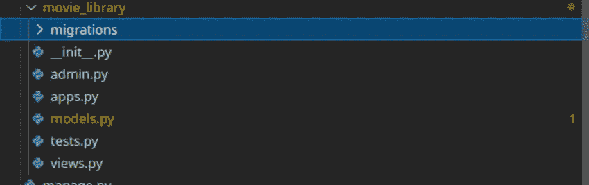
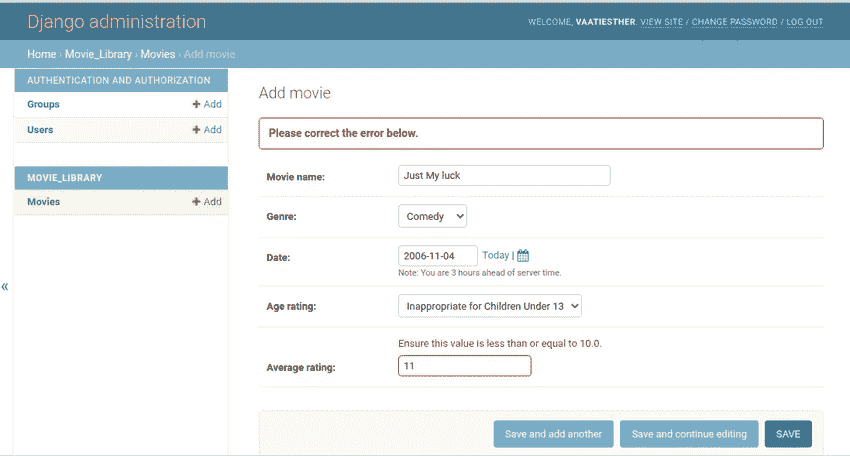
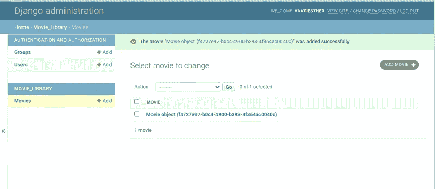
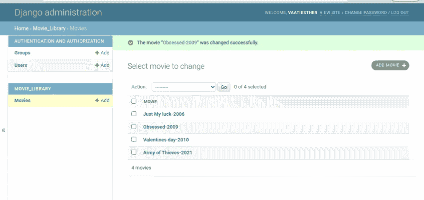
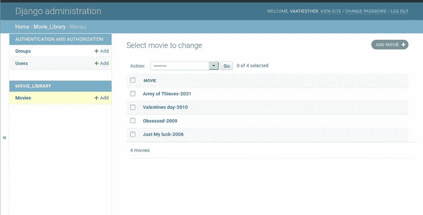

# 关于 Python 中的 Django 模型，您需要知道的一切

> 原文：<https://betterprogramming.pub/everything-you-need-to-know-about-django-models-in-python-2a44ed4293dd>

## **Django 模型综合指南**


达伦·博克曼在 [Unsplash](https://unsplash.com?utm_source=medium&utm_medium=referral) 上拍摄的照片

Django 是一个用 python 编写的高级 web 框架。它用于构建复杂的数据库驱动的应用程序。Django 使用 MVT 框架。MVT 框架由以下部分组成:

*   模型
*   视角
*   模板

在本教程中，我们将介绍关于 Django 模型的所有知识，在本教程结束时，您将能够

*   创建 Django 项目
*   使用模型表示 Django 中的对象。

# **设置 Django 项目**

我们将从创建一个新的 Django 项目开始。我们的项目将是一个电影数据库系统。

创建一个目录并放入 cd。

```
$ mkdir movie_db$ cd movie_db
```

创建虚拟环境:

```
$ python3.8 -m venv env
```

激活虚拟环境:

```
$ source env/bin/activate
```

在虚拟环境中安装 Django:

```
(env)$ pip install Django
```

创建一个名为`django_movie`的新 Django 项目

```
(env)$ django-admin startproject django_movie .
```

创建 Django 应用程序:

```
(myenv)$ django-admin startapp movie_library
```

上述命令将创建以下文件。



电影 _ 图书馆

将该应用添加到`settings.py`中的`INSTALLED_APPS`列表中。

# **车型**

模型代表 django 应用程序中的对象。对于我们的应用，我们需要问自己；

*   创建电影数据库系统需要什么信息
*   应该存储什么样的信息？
*   信息应该如何存储？

这些问题将让我们了解我们的数据会是什么样子。从上面的问题中，我们现在知道了一部电影应该有一个电影名称、类型、发行年份、年龄等级、平均等级等等。

根据上面的信息，我们可以开始编写我们的模型。当我们创建应用程序 movie_library 时，django 已经为我们提供了一个名为`models.py`的文件，其起始代码如下:

```
#movie_library/models.pyfrom django.db import models# Create your models here.
```

为了创建一个模型，我们编写一个继承自模型父类`django.db.models`的类。模型模块。

```
class Movie(models.Model): pass
```

# **模型字段类型**

在我们的例子中，模型的每个属性(`movie_name`、`genre`、`year_of_release`、`age_rating`、`average_rating`)代表一个数据库字段。例如，属性 movie_name 将有一个`CharField`:

```
class Movie(models.Model): movie_name = models.CharField()
```

字段标题的类型是`models.CharField`——这意味着该字段将包含字母数字字符串。

# **模型字段选项**

模型字段也接受一组特定的字段参数。例如，我们上面定义的`CharField`带有一个参数`max_length`，它决定了输入到数据库中的值的长度。

```
class Movie(models.Model): movie_name = models.CharField(max_length= 100)
```

## 油田

UUID 字段是用于存储通用唯一标识符的字段。它使用 Python 的`[UUID](https://docs.python.org/3/library/uuid.html#uuid.UUID)` 类。对于`primary_key`，通用唯一标识符是`AutoField`的绝佳替代物。

在这种情况下，我们将使用`UUID`来定义一个唯一的主键，并将其设置为不可编辑。

打开`models.py`文件，在电影类的主体中添加`id`字段。

`editable`是另一个字段选项，这意味着该字段将不会在管理中显示。

电影的名字将是第二个字符串字段。

```
class Movie(models.Model): id = models.UUIDField(primary_key=True, default=uuid.uuid4, editable=False) movie_name = models.CharField(max_length= 100)
```

*   max _ length = 100 表示该字段中值的最大长度为 100 个字符。

`CharField`的其他自变量是`null`和`blank`。`Null`表示一个字段可以没有信息；默认值为 false。`Blank`表示一个字段不取任何值，甚至不取 null，默认为 False。

例如，对于`movie_name`字段，我们可以将其更新如下:

```
movie_name = models.CharField(max_length= 100, blank=False)
```

## **型号选择**

Django 中的选择限制了字段可以接受的输入。例如，我们知道电影有许多类型，所以我们必须选择一个包含这些电影类型的框，而不是标准的文本字段。

元组使用键、值对创建选择，其中键是模型上的实际值集，值是人类可读的名称。添加流派字段，这将是一个`CharField`，并接受选择作为流派选择。

添加`year_of _release`字段，它是一个`DateField`。不要忘记导入顶部的`datetime`模块。

接下来，添加`rating`。美国电影协会电影分级系统有以下分级:

*   G —普通观众
*   PG-13:父母强烈警告，一些内容可能不适合 13 岁以下的儿童。
*   r-受限
*   NC-17 —仅限成人
*   PG —建议家长指导

评级字段也将接受选择。创建一个包含不同电影分级的元组，如下所示。

然后添加将元组作为参数的`age_rating`字段。

```
age_rating = models.CharField(max_length= 5, choices = AGE_RATING, default = "GENERAL AUDIENCE")
```

最后，添加一个`average_rating`，这是一个`FloatField`

```
average_rating = models.FloatField()
```

由于我们希望评级范围从 1.0 到 10.0，我们将在字段中放置验证器，这将确保该值小于或等于 10.0。第一个进口`MaxValueValidator`和`MinValueValidator`在最上面。

```
from django.core.validators import MaxValueValidator, MinValueValidator
```

然后更新`average_rating`字段，以包含所需的值范围。

```
average_rating = models.FloatField(validators=[MinValueValidator(0.0), MaxValueValidator(10.0)],)
```

其他常用字段有:

*   `TextField`用于存储冗长的字符串
*   `IntegerField`用于存储整数值
*   `DateTimeField`用于存储日期/时间信息
*   `EmailField`用于存储电子邮件地址。
*   `FileField`用于上传文件
*   `ImageField`用于上传图片
*   `ForeignKey`指定与另一个模型的一对多关系。
*   `ManyToManyField`用于建立模型之间的多对多关系。

我们现在已经完成了模型字段。

## **迁徙**

我们刚刚对我们的模型进行了更改，但是数据库还不知道这些更改。因此，我们需要执行迁移。

第一步是运行`makemigrations`命令，该命令创建一个文件，其中包含数据库创建所需模式所需的必要指令。

```
$ python3.8 manage.py makemigrations
Migrations for 'movie_library':
  movie_library/migrations/0001_initial.py
    - Create model Movie
```

下一步是`migrate`命令，它为我们的模型创建数据库表。

```
Operations to perform:
  Apply all migrations: admin, auth, contenttypes, movie_library, sessions
Running migrations:
  Applying contenttypes.0001_initial... OK
  Applying auth.0001_initial... OK
  Applying admin.0001_initial... OK
  Applying admin.0002_logentry_remove_auto_add... OK
  Applying admin.0003_logentry_add_action_flag_choices... OK
  Applying contenttypes.0002_remove_content_type_name... OK
  Applying auth.0002_alter_permission_name_max_length... OK
  Applying auth.0003_alter_user_email_max_length... OK
  Applying auth.0004_alter_user_username_opts... OK
  Applying auth.0005_alter_user_last_login_null... OK
  Applying auth.0006_require_contenttypes_0002... OK
  Applying auth.0007_alter_validators_add_error_messages... OK
  Applying auth.0008_alter_user_username_max_length... OK
  Applying auth.0009_alter_user_last_name_max_length... OK
  Applying auth.0010_alter_group_name_max_length... OK
  Applying auth.0011_update_proxy_permissions... OK
  Applying auth.0012_alter_user_first_name_max_length... OK
  Applying movie_library.0001_initial... OK
  Applying sessions.0001_initial... OK
```

## **在管理中注册模型**

为了与字段交互，我们在`admin.py` 中创建并注册了`Movie`模型，如下所示。

```
from django.contrib import admin# Register your models here.from .models import Movieadmin.site.register(Movie)
```

创建超级用户:

```
$ python3.8 manage.py createsuperuser
```

运行服务器

```
$ python3.8 manage.py runserver
```

导航到[http://127 . 0 . 0 . 1:8000//admin](http://127.0.0.1:8000//admin)，使用超级用户凭证登录。我们来补充一些数据。



添加新的电影实例

正如你在上面所看到的，字段按照我们的预期显示,`genre`和`age_rating`有多种选择，并且`average_rating`验证按预期工作。

## **冗长的名称**

详细名称是字段标签中使用的字段的可读名称。如果没有指定详细名称，Django 将使用字段的属性名称自动创建它。它会将下划线转换成空格。

例如，由于我们没有在字段中包含任何冗长的名称，因此在管理中看到的`movie_name`将是`Movie name`。

# **方法**

模型也可以有方法。

## `**Str**`法**法**

当您进入管理页面查看电影实例时，它们看起来像这样:



电影对象

每个 Django 模型都应该定义一个标准的 python 类方法`__str__()`，为每个对象返回一个人类可读的字符串。每当引用模型实例时，它将使用人类可读的字符串。

电影通常用片名和电影上映年份来表示；因此，我们的`__str__`方法将以下面的格式返回电影实例。

`title — year_of_release`

在电影模型中，创建一个`__str__` 方法，返回用连字符连接的`instance’s .title` 和`.year` ，如下所示:

```
def __str__(self): return self.movie_name + "-" + self.year_of_release.strftime('%Y')
```

现在，当您在管理站点上查看电影条目时，您应该会看到它们以人类可读的方式进行了格式化。



__str__ 方法

## **get_absolute_url()**

方法`get_absolute_url()`用于指引用户到特定路径的方法；这降低了用户重新提交数据的机会。

```
from django.urls import reverse
def get_absolute_url(self): return reverse('movie_detail' , args= [str(Self.id)])
```

上面的方法在创建新的电影实例后返回详细视图 url。

## **模型元数据**

元数据是应用于模型的非字段属性，它用于执行以下功能:

*   为数据库提供一个表名。
*   订购实例
*   创建人类可读的名称

要向模型添加元数据，我们需要在模型的类定义中添加另一个名为`Meta`的类。

元数据中的排序功能将按字母顺序对字符字段进行排序，而日期字段将按时间顺序进行排序。

让我们根据上映年份为`ordering`电影的电影模型添加元数据。

```
class Meta: ordering = ["-year_of_release"]
```

也可以放个前缀(-)颠倒排序顺序，如上图；这将显示基于最近发行日期的所有电影。



排序

`models.py` 的完整代码如下所示。

models.py

# **结论**

在本教程中，我们学习了如何开发构建模型所需的数据。

我们还学习了如何在电影数据库系统中定义和实现模型。

> 嘿，朋友，如果你想阅读更多的教程，可以考虑注册成为一名灵媒来支持我的工作。每月只需 5 美元，你就可以无限制地使用 Medium。