# FullStack Web3 —您需要知道的一切

> 原文：<https://betterprogramming.pub/everything-you-need-to-know-about-fullstack-web3-94c0f1b18019>

## 我们确切地了解了 web3 /区块链/智能合约应用程序如何在前端使用 HTML 和 Javascript 工作。然后，我们将通过 6 种不同的方式将您的元掩码、幻象或其他区块链钱包地址连接到您的前端。我们将看看流行的 Nextjs / React 包，让您的开发生命周期轻松 100 倍。

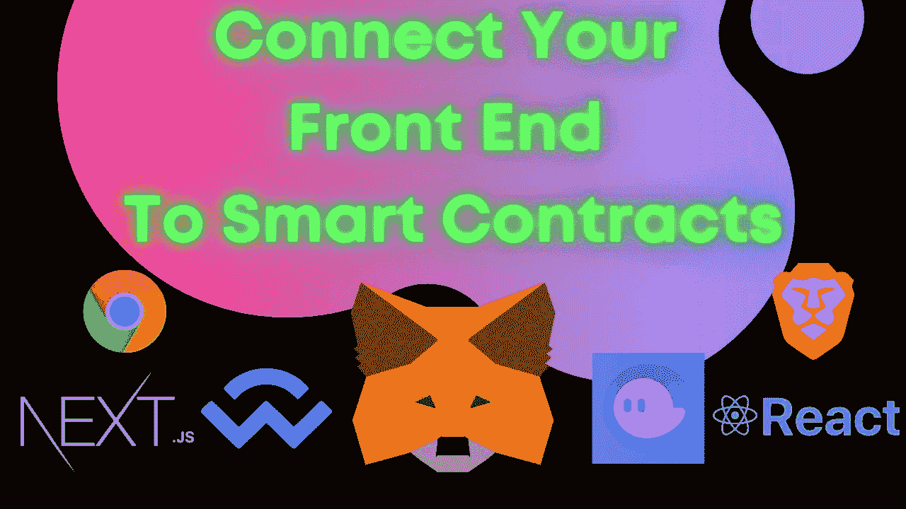

将您的前端连接到您的智能合同/web3 应用程序/区块链。

你刚刚用 [solidity](https://www.youtube.com/watch?v=M576WGiDBdQ) 、 [rust](https://www.youtube.com/watch?v=7l1P3xzr7Jo) 或者 [vyper](https://vyper.readthedocs.io/en/stable/) 构建了一个令人惊叹的 web3 应用程序，你告诉你的非开发者朋友“要与它交互，你只需要调用我用你的后端脚本编写的这些函数。”

令你惊讶的是，他们都不知道你在说什么。


[图像来源](https://knowyourmeme.com/memes/visible-confusion)

在这篇文章中，我们将学习 web3 /区块链/智能合同应用程序如何使用 HTML 和 JavaScript 在前端工作。

接下来，我们将通过六种不同的方式将您的元掩码、幻影或其他区块链钱包地址连接到您的前端。

最后，我们将看看流行的 Nextjs / React 包，让您的开发生命周期轻松 100 倍。

那么，我们开始吧。

# 介绍

为了让 web3 贴近大众，我们需要有用户友好的前端和网站。在区块链领域解决这个问题时，全栈软件工程师会遇到一些挑战。

1.  如何将[元掩码](https://metamask.io/)连接到我的 UI？(或 [Walletconnect](https://walletconnect.com/) 、 [Phantom](https://phantom.app/) 等。)
2.  如何在网站上使用智能合约执行交易？
3.  精英中的精英在做什么工具？

因此，在问自己这个问题并试图找出向开发人员推荐什么的时候，我看了几乎所有最流行的解决方案。因此，在本文中，我们将:

1.  当我们想要与区块链交互或向其发送交易时，理解浏览器中正在发生的事情。
2.  我们来看看六种最流行的连接 web3 应用程序的方法
3.  给出代码示例并展示这个领域中所有最大的玩家都使用什么，这样您就可以使用相同的工具了！

如果你想看看一些专业前端现在是什么样子，你可以看看 [Aave](https://app.aave.com/#/dashboard) 或 [Uniswap](https://app.uniswap.org/#/swap?chain=mainnet) 网站。

激动吗？我也是。我们走吧。

# 如何将我的智能合同连接到 Metamask

或者浏览器中的另一个钱包，像 Phantom，Walletconnect 等。

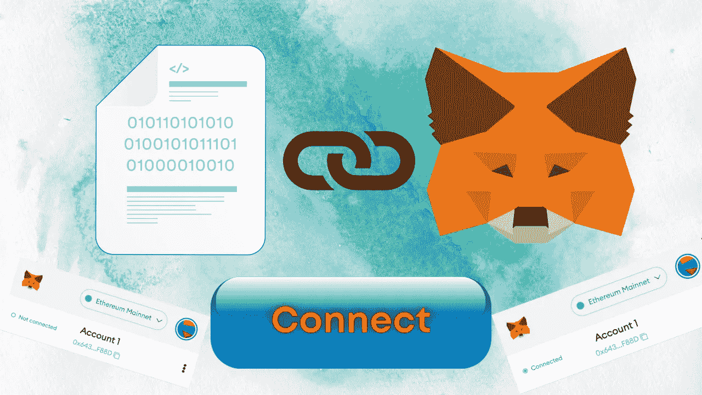

如何将我的智能合同连接到 Metamask

你的 web 3/区块链应用程序的大多数“后端”都将使用类似于 [Hardhat](https://hardhat.org/) 、 [Brownie](https://eth-brownie.readthedocs.io/en/stable/) 、 [DappTools](https://medium.com/@patrick.collins_58673/how-to-use-dapptools-code-like-makerdao-fed9909d055b) 、 [Anchor](https://project-serum.github.io/anchor/getting-started/introduction.html) 或 [Foundry](https://github.com/gakonst/foundry) 的框架来构建(或者如果你相信[纸牌之心](https://www.youtube.com/watch?v=Qp-7Bp3W9f0)、 [Remix](https://remix.ethereum.org/) 工具)。我们的前端将使用你在传统 web2 空间学到的任何东西。HTML、JavaScript、CSS，还有像 [NextJS](https://nextjs.org/docs/api-reference/create-next-app) 、 [React](https://reactjs.org/) 、 [Angular](https://angular.io/) 这样的框架。

因此，如果你熟悉传统的 web 开发，你将会领先于这个游戏！

## 使用元掩码在浏览器中会发生什么

现在，如果你想跟着做，请安装[元掩码](https://metamask.io/)。你可以[观看这个视频](https://www.youtube.com/watch?v=Af_lQ1zUnoM)进行更深入的跟进。

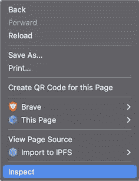

右键单击，然后点击“检查”

现在，在您的浏览器中，右键单击屏幕并点击“inspect”或“inspect element”，您会看到类似这样的内容:

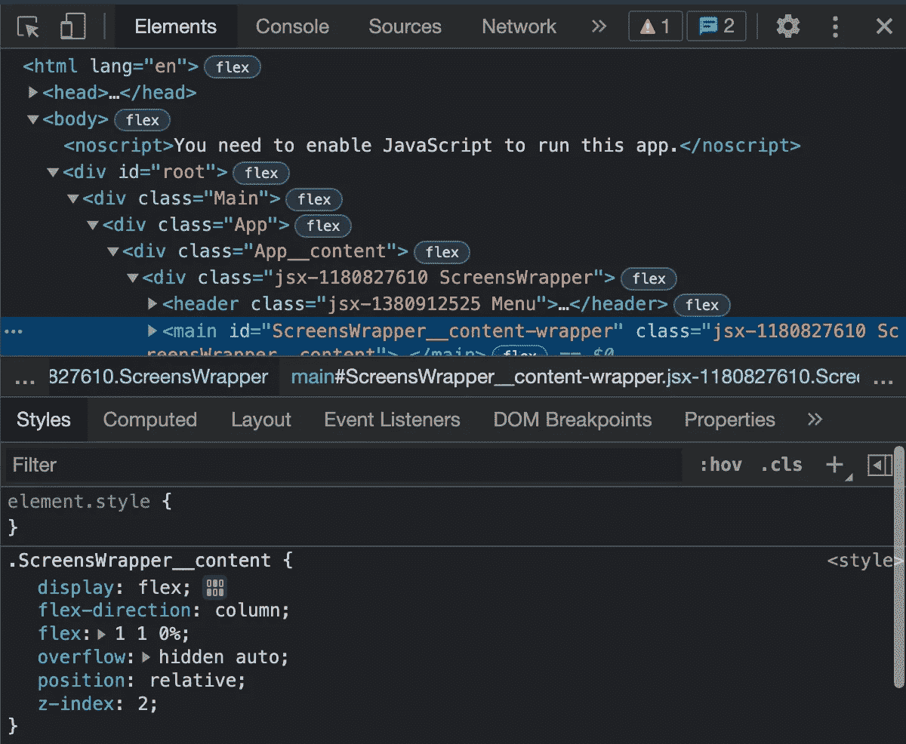

点击“检查”来查看所有的浏览器调试工具。

这将显示网站用来呈现你在屏幕上看到的所有代码。然后，如果你点击顶栏中的`sources`，你会看到类似这样的内容。(如果看不到`sources`，可以点击`>>`按钮显示更多选项。)

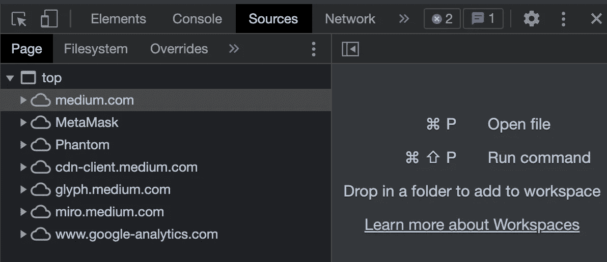

点击“源”来查看组成网页的所有文件。

如果您的浏览器中安装了元掩码，您会在左侧看到一个“元掩码”文件。如果你安装了幻影，你会看到一个“幻影”

这些浏览器插件会做一些有趣的事情，它们会自动“注入”到你的浏览器中，并作为你所在网站的一部分出现。这给了网站与他们互动的机会。

每个浏览器中都有一个对象叫做`window`对象。我们可以通过点击`console`标签看到这个对象，(类似于我们点击`sources`的方式)我们进入一个 [JavaScript 控制台](https://javascript.info/debugging-chrome#console)，在这里我们可以编写 JavaScript 并与 JavaScript 对象交互。

让我们输入`window`,看看会得到什么。

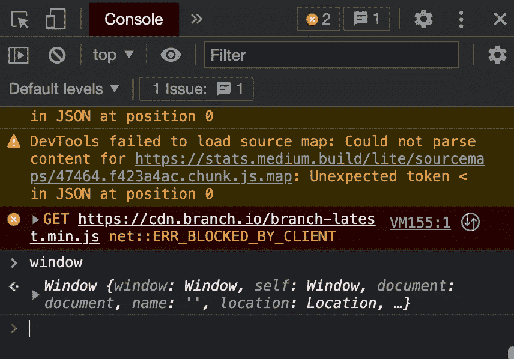

在“控制台”标签中键入“窗口”并按回车键

厉害！我们在浏览器中看到 JavaScript `window`对象。现在，既然我们有了一个`Metamask`源，这应该意味着我们有一个`ethereum`属性附加到我们的`window`对象上。键入`window.ethereum`看看你会得到什么(或者`window.solana`如果你有幻影)。

你会看到一个对象响应！如果你没有元掩码，你会得到一个`undefined`。每个浏览器钱包都将自己的属性添加到窗口对象中，您通常可以在它们的文档中找到它。这里是[元掩码文档](https://docs.metamask.io/guide/mobile-best-practices.html#the-provider-window-ethereum)确切地谈论了`window.ethereum`。

> 注意:在以前的版本中，这是`window.web3`，现在已经改为`window.ethereum`

这就是我们的区块链提供商，或者我们的区块链连接`window.ethereum`将成为我们的提供商。那么我们为什么需要它呢？

## 区块链连接/提供商

每当我们想从区块链读取数据、调用函数或进行交易时，我们都需要连接到区块链网络。如果我们发送一个事务，我们需要将签名的事务发送到一个区块链节点，这样它就可以将它发送到网络中的所有其他区块链节点。在这个免费代码营视频的第 0 课中，你可以了解更多关于[区块链 101 的信息。](https://www.youtube.com/watch?v=Qe-3FUxThso)

您以前可能在您的区块链应用程序中使用过来自 [Alchemy](https://alchemy.com/?a=673c802981) 、 [Infura](https://infura.io/) 或 [Moralis Speedy Nodes](https://moralis.io/speedy-nodes/) 的 [RPC URL](https://eth.wiki/json-rpc/API) 。这些都是“节点即服务”提供者，并为我们提供了一个 HTTP 端点来发送请求到区块链节点。加密货币钱包也是如此，我们的元掩码与内置的区块链节点相连。事实上，如果你去你的[元掩码“网络”标签](https://metamask.zendesk.com/hc/en-us/articles/360056196151-Using-custom-networks-with-MetaMask)，你可以看到你的元掩码正在使用的确切的 RPC URL！

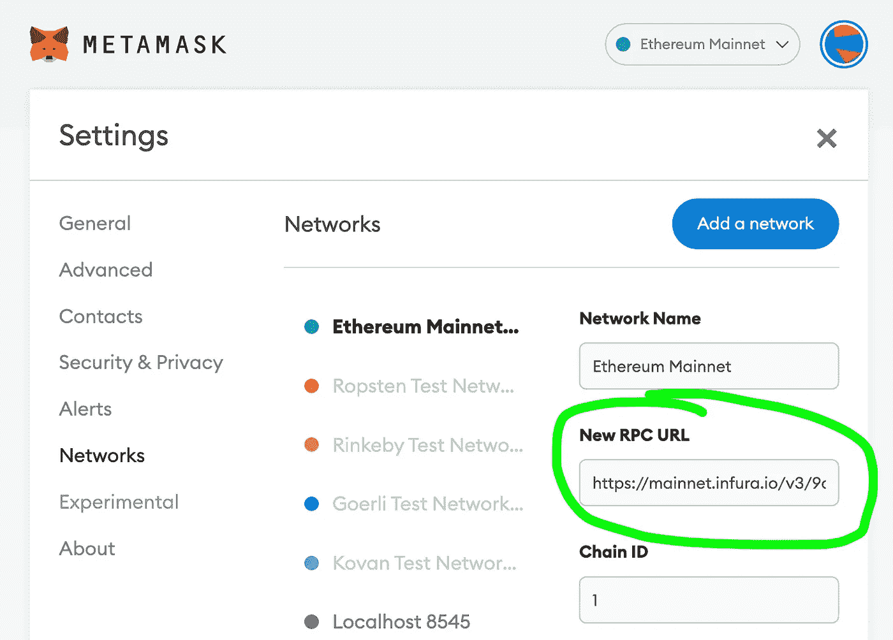

元掩码中的“网络”选项卡—查看区块链 RPC URL

嘣！因此，每当我们使用元掩码做一些事情时，我们都会对这个 RPC URL 进行 API 调用。

## 使用 HTML 和 JavaScript 连接到加密货币钱包

现在，我们将首先展示这是如何在 HTML 和 JavaScript 中完成的，然后我们将继续我们的 Nextjs/React 示例。我的 GitHub 中有一个使用 HTML/JavaScript 连接到加密货币钱包的完整示例，我的 Github 中也有一个所有示例的列表。

首先，让我们创建一个标准的 HTML 文档，我们将得到一个`Connect` 按钮。

```
<!DOCTYPE html>
<html>
  <head>
    <title>Javascript Test</title>
  </head><body>
    <button id="connectButton">Connect</button>
  </body>
</html>
```

我们可以通过添加一个`script`标签并创建一个寻找`window.ethereum`的 JavaScript 函数来为我们的按钮添加一些功能，如果找到了，它就发出一个连接请求。

这就是你所需要的！`eth_requestAccounts`直接来自[元掩码文档](https://docs.metamask.io/guide/rpc-api.html#table-of-contents)。如果您将它命名为`index.html`并在浏览器中运行，您的元掩码会弹出来要求连接。

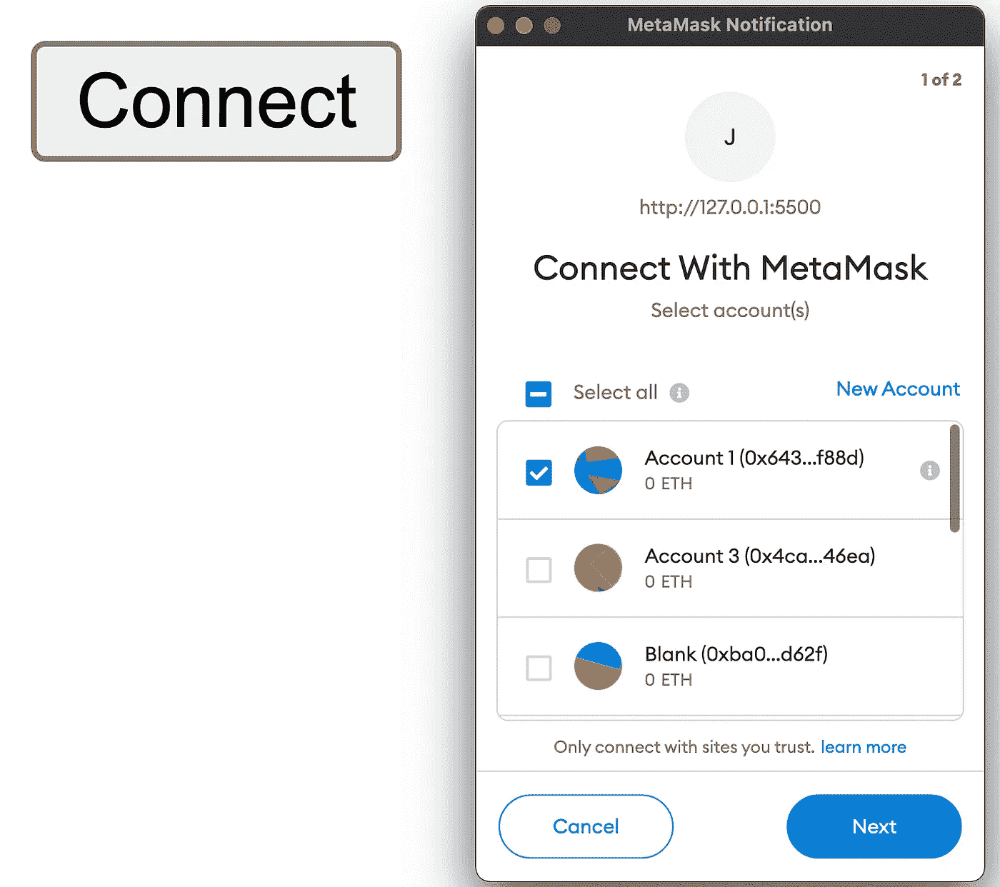

元掩码请求连接

## 发送交易

现在我们已经连接了元掩码，是时候发送事务了。在这里，我们可以使用像 [ethersjs](https://docs.ethers.io/v5/) 和 [web3js](https://web3js.readthedocs.io/en/v1.7.0/) 这样的包来连接我们的提供者，然后发送一个事务。通常，在 JavaScript 中执行函数/发送事务的一些示例 JavaScript 如下所示:

```
const etheres = require("ethers")contractAddress = "0x5FbDB2315678afecb367f032d93F642f64180aa3";
const abi = // some big javascript ABI here...const provider = new ethers.providers.JsonRpcProvider(/* alchemy or infura */)
const wallet = new ethers.Wallet(/* Private key */, provider)const contract = new ethers.Contract(contractAddress, abi, wallet)
const contractWithSigner = contract.connect(wallet)
const transactionResponse = contract.someFunction()
```

在浏览器中发送交易的唯一区别是，我们将提供者改为我们的`window.ethereum`，我们的`wallet`现在将直接来自我们的`provider`。因为我们的元掩码是**我们的提供者和钱包(或签名者),所以我们的代码看起来像这样。**

```
const etheres = require("ethers")contractAddress = "0x5FbDB2315678afecb367f032d93F642f64180aa3";
const abi = // some big javascript ABI here...const provider = new ethers.providers.Web3Provider(window.ethereum)
const signer = provider.getSigner();const contract = new ethers.Contract(contractAddress, abi, signer)
const contractWithSigner = contract.connect(wallet)
const transactionResponse = contract.someFunction()
```

您会注意到，只有中间的两行发生了变化，取而代之的是从`window.ethereum`获取我们的钱包，我们的签名者来自我们的提供者(也就是 metamask)。

现在这里有一个问题。我们的浏览器不能理解`require`(有时`import`有问题)，所以我们可以添加一些包来帮助我们。

因为我不希望这篇文章变成一个关注前端的博客，所以我不会只让你看我的 [html-js-ethers-connect](https://github.com/PatrickAlphaC/html-js-ethers-connect/tree/7fd43da59ff0c6ba4cf2c3dae0395bc6b8df03ad) 例子，它向我们展示了如何自己运行这个例子的其余部分。您只需要安装以下软件:

*   [Git](https://git-scm.com/book/en/v2/Getting-Started-Installing-Git)

*   [纱线](https://classic.yarnpkg.com/lang/en/docs/install/)
*   和[元掩码](https://metamask.io/)

然后，您可以按照 [README.md](https://github.com/PatrickAlphaC/html-js-ethers-connect) 中的说明进行设置，并使用纯 HTML 和 JavaScript 在浏览器中发送事务的完整示例！

**然后嘣！你将有一个工作的极简前端与你的智能合同！**

# 前 5 名最佳前端 Web3 设置

排名不分先后。这可能是它自己的博客…

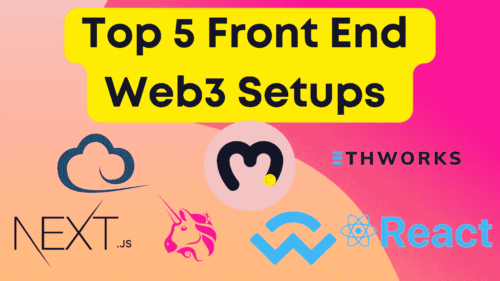

前 5 名前端 Web3 设置

现在，让我们开始为您提供全栈应用所需的工具。对于这些设置，我将包括:

1.  如何设置它们
2.  简约的演示
3.  真实世界的例子

所以你可以挑一个最适合你的！我们正在与 [NextJS](https://nextjs.org/) 一起工作，因为 [ReactJS](https://reactjs.org/) 是目前地球上最流行的前端框架，NextJS 是在它的基础上构建的，在我看来，它比原始 ReactJS 更加用户友好。然而，你可以 100%与棱角分明，苗条，或其他。

你可以找到我所有的极简代码示例[full-stack-web 3-meta mask-connectors](https://github.com/PatrickAlphaC/full-stack-web3-metamask-connectors)库，它链接到所有的演示。

## 设置基本的 NextJS 项目

首先，所有这些项目都将从一个基本的 nextJS 项目开始。您需要安装[节点](https://nodejs.org/en/download/)、 [Git](https://git-scm.com/downloads) 和 [Yarn](https://classic.yarnpkg.com/en/docs/cli/install/) 才能向前移动。您还可以遵循 [nextjs 入门文档](https://nextjs.org/docs/getting-started)。

运行以下命令:

```
yarn create next-app full-stack-web3
cd full-stack-web3
```

你完了！现在您已经有了一个基本的设置。你现在可以运行`yarn dev`来看看你当前的网站会是什么样子。最后，删除所有的“东西”,进入你的`index.js`文件，删除所有的东西，这样它就是:

```
export default function Home() {
  return <div>Hi</div>;
}
```

现在你的前台只会说“嗨”

## 建立当地的安全帽区块链和合同

现在，由于我们将测试执行功能，我们将需要一个区块链来发送事务，以及一个智能契约来使用。我已经在我的[hard hat-simple-storage GitHub](https://github.com/PatrickAlphaC/hardhat-simple-storage)中为你设置了一个。要设置这个，你可以跟随`README.md`或者在一个不同于运行你的前端的终端中运行下面的:

```
git clone [https://github.com/PatrickAlphaC/hardhat-simple-storage](https://github.com/PatrickAlphaC/hardhat-simple-storage)
cd hardhat-simple-storage
yarn
yarn hardhat node
```

这将给你一个启动本地区块链的输出，给你一些临时的假私钥，并部署我们的`SimpleStorage`契约，它有一个我们将要使用的`store`函数。它接受一个`uint256 _favoriteNumber`作为输入，并将这个数字存储到一个公共变量中。您可以在`SimpleStorage.sol`文件中查看合同。

## 使用我们当地的区块链设置元蒙版

现在，我们要将元掩码连接到本地的假区块链。为什么？以便我们可以快速发送事务和测试。这就像一个真实的区块链，但这是我们可以控制的。如果你愿意，你可以使用 testnet 并跳过这一步，但是你将不得不等待很长时间来处理事务，这是没有人想要的。

在区块链节点运行的地方，您将看到类似于`Started HTTP and WebSocket JSON-RPC server at [http://127.0.0.1:8545/](http://127.0.0.1:8545/)`的输出。这将是我们的 RPC 网址类似炼金术。

现在，在一个**元掩码中，没有任何实际资金与之相关联**(请不要使用有实际资金的元掩码进行开发。创建一个新的浏览器配置文件或下载另一个带有元掩码的浏览器)点击顶部的网络按钮，然后“添加网络”

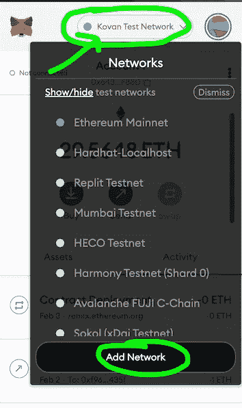

如下图所示进行设置，然后点击保存。然后确保您切换到该网络(在网络下拉列表中选择它)。

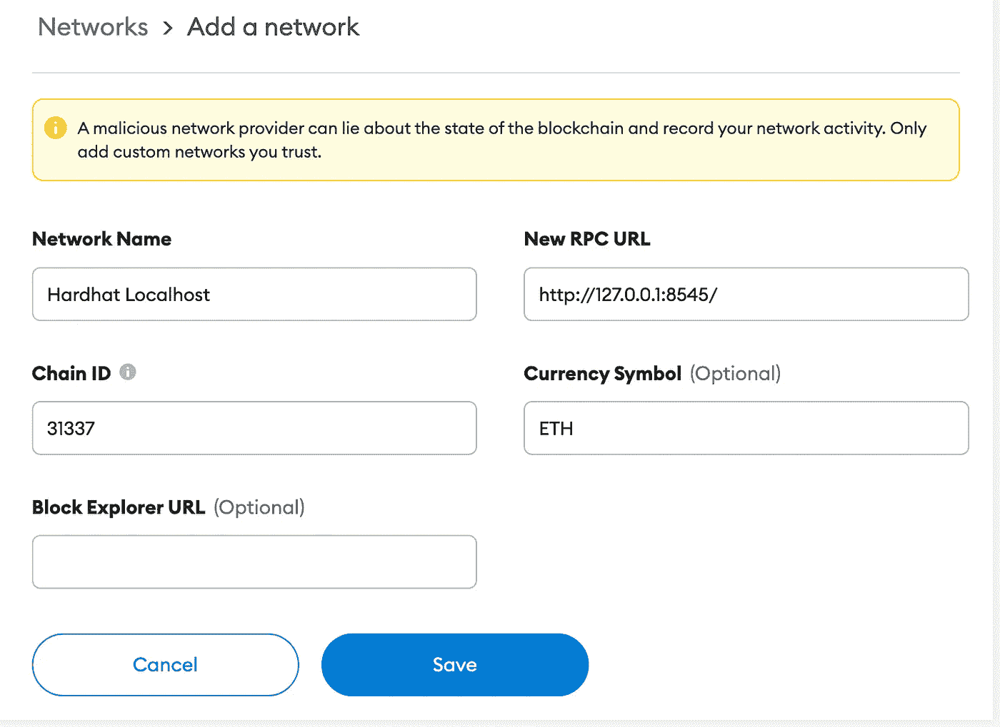

现在，点击右上角的大圆圈，然后点击“导入帐户”

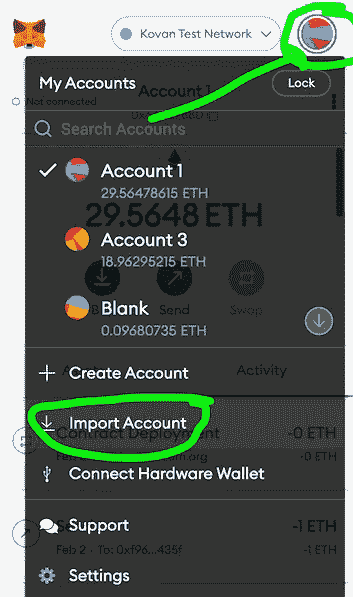

并从`yarn hardhat node`命令的输出中添加一个私钥。你现在应该有一个帐户，在本地网络上，并有一些假的测试 ETH。您的元掩码应该如下所示:

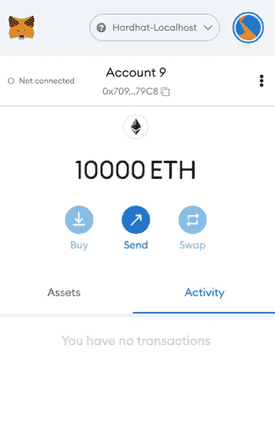

我们已经准备好了:)

> 重要提示:如果您遇到了`nonce`关闭的问题，或者交易发送不正确。在您的 metamask 中，当您从 hardhat 导入的帐户被选中时，进入右上角的圆圈- >设置- >高级- >重置帐户。这将消除随机数问题。

# 粗醚设置

[🧑‍💻链接到我的完整代码在这里](https://github.com/PatrickAlphaC/nextjs-ethers-metamask-connect)


Ethers.js 设置

最简单的开始方法是使用一些你已经熟悉的工具，比如乙醚。我们可以将 HTML 设置中的内容复制粘贴到我们的`index.js`文件中。

为此，我们添加了一些额外的功能，以便在连接或用户没有元掩码时显示“请安装元掩码”或“已连接”。你还会看到像`useState`和`useEffect.`这样的命令，它们被称为 React 钩子，你可以从这个 [Fireship 视频](https://www.youtube.com/watch?v=TNhaISOUy6Q)或 [react 文档中了解它们。虽然这个应用程序没有它们也能正常工作，但是我们不能在渲染之间保存应用程序的状态。](https://reactjs.org/docs/hooks-overview.html)

## 优点:

*   使用以太网对用户界面进行最精细的控制

**缺点:**

*   我们必须写很多自己的代码，包括[上下文](https://reactjs.org/docs/context.html)。
*   除了元掩码连接之外，很难支持其他连接方式(是的，还有其他连接钱包的方式！)

## 真实世界的例子

[纳德·达比特解说者](https://dev.to/dabit3/the-complete-guide-to-full-stack-ethereum-development-3j13)

此外，在未来的例子中，我将从另一个文件导入`abi`，这样就不会阻塞文章。

# Setup 模式设置

[🧑‍💻链接到我的完整代码在这里](https://github.com/PatrickAlphaC/nextjs-ethers-metamask-connect)

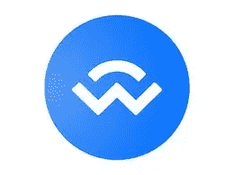

[WalletConnect](https://walletconnect.com/) 标志

将 EVM 的区块链应用程序与钱包连接起来的另一种最流行的方式是使用 Walletconnect。我将要展示的所有例子(包括原始的 Ethers)都可以连接到 Walletconnect(并且应该！)，所以我们的 Web3Modal 设置并不是唯一可以做到这一点的*。钱包连接团队的成员创造的一个奇妙的工具是这个[web 3 mode](https://github.com/Web3Modal/web3modal)工具，它允许我们有一个框架来连接到任何提供商，包括 [Ledger](https://www.ledger.com/) 、wallet connect、 [Torus](https://app.tor.us/) 、[比特币基地钱包](https://www.coinbase.com/wallet)等等！*

*我们只需要导入包，我们的`index.js`可能看起来像这样:*

*你会看到，我们设置了一些`providerOptions`来告诉我们的前端我们想要支持哪些钱包，以及我们想要支持哪些连锁店。我们需要设置一个指向另一个 RPC_URL 的`NEXT_PUBLIC_RPC_URL`来连接一个区块链。如果我们使用 walletconnect，我们实际上*不会*使用用户元掩码的内置区块链节点。*

## *赞成的意见*

*   *易于集成多个钱包*
*   *乙醚很好*

## *骗局*

*   *仍然没有内置的上下文*

## *真实世界的例子*

*   *[web 3 mode-示例](https://github.com/ChangoMan/web3modal-example)*
*   *[脚手架-ETH](https://github.com/scaffold-eth/scaffold-eth)*
*   *[create-eth-app](https://github.com/paulrberg/create-eth-app)*

*如果你想看看 Web3Modal、区块链等的前沿前端应用，一定要去看看 Scaffold-ETH。这是奥斯汀·格里菲斯[的一个神奇的学习工具，你可以用它来解构一些最佳实践。](https://austingriffith.com/)*

# *道德*

*[🧑‍💻链接到我的完整代码在这里](https://github.com/PatrickAlphaC/nextjs-moralis-metamask-connect)*

**

*[道德家](https://moralis.io/)标志*

*现在，Moralis(或者更具体地说， [react-moralis](https://github.com/MoralisWeb3/react-moralis) )是第一个包含上下文管理器的包，这非常有用。它们允许我们的整个应用程序在组件之间轻松共享状态，这是必要的，因为我们需要传递元掩码授权。*

*Moralis 是由 Ivan on Tech 和团队创建的，不仅可以帮助开发人员连接到 Metamask，还可以帮助全栈应用程序可能需要的任何其他后端系统。以太扫描和 [Opensea](https://opensea.io/) 都是仍然需要后端和数据库的 web3 应用程序的例子。为什么？因为你经常想增加大量的功能，这将花费太多的汽油来做链上的事情！*

*因此，你仍然希望让你的智能合同做所有的主要工作，但道德可以做围绕它的所有工作。以下是我们的道德准则代码:*

*你将会看到 Moralis 提供了像`useWeb3Contract`这样强大的钩子，使得获得状态和与我们的契约交互更加容易，并且不需要以太！代替我们编写自己的`connect`函数，Moralis 附带了一个函数来为我们和`enableWeb3`做同样的事情。*

*此外，在我们的`_app.js`中，我们需要用上下文提供者包装整个应用，我们可以这样做:*

```
*import "../styles/globals.css";
import { MoralisProvider } from "react-moralis";function MyApp({ Component, pageProps }) {
  return (
    <MoralisProvider initializeOnMount={false}>
      <Component {...pageProps} />
    </MoralisProvider>
  );
}export default MyApp;*
```

*Morlais 有内置的选项来设置你的前端数据库，但是，如果你只是想使用钩子和函数，你可以设置`initializeOnMount`为假，只设置一个服务器，如果你想在未来！*

## *赞成的意见*

*   *上下文提供者*
*   *用于与智能合约交互的极简内置功能*
*   *包含后端的可选性，以实现功能更加丰富的前端*

## *骗局*

*   *必须手动添加您自己的钱包*

## *真实世界的例子*

*   *[以太坊样板](https://github.com/ethereum-boilerplate/ethereum-boilerplate)*

# *web 3-反应*

*[🧑‍💻链接到我的完整代码在这里](https://github.com/PatrickAlphaC/nextjs-web3-react-metamask-connect/tree/e9fd7e1c1f78441bc25347c37f581170aab14c40)*

**

*[Uniswap](https://uniswap.org/) 标志*

*Uniswap 工程负责人 Noah Zinsmeister 和他的朋友们已经开发了一个惊人的包，叫做 web3-react。这是像 [Uniswap](https://uniswap.org/) 、 [Aave](https://aave.com/) 和 [Compound](https://compound.finance/) 这样的顶级项目使用最广泛的软件包之一。它还包含一个上下文管理器和一些非常强大的挂钩，让您可以开始使用，以及一些 web3 wallet 内置连接。*

*下面是你的`index.js`可能的样子:*

*还有我们的`_app.js`:*

*正如你所看到的，我们仍然使用 ethers 来与我们的智能合约交互，但是我们使用 hooks 来启用我们的元掩码和任何其他我们想要的钱包提供者！*

## *赞成的意见*

*   *上下文提供者*
*   *用于与智能合约交互的极简内置功能*
*   *内置钱包连接*

## *骗局*

*   *不像 web3modal 那样简单的钱包设置*
*   *需要编写或使用您自己的钩子来与您的智能合约交互。*

## *真实世界的例子*

*   *[Web3 React 示例](https://github.com/NoahZinsmeister/web3-react/tree/main/packages/example)*
*   *[Aave](https://github.com/aave/aave-ui)*
*   *[Uniswap](https://github.com/Uniswap/interface)*

# *useDapp*

*[🧑‍💻链接到我的完整代码在这里](https://github.com/PatrickAlphaC/nextjs-usedapp-metamask-connect)*

*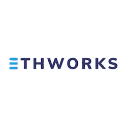*

*[Ethworks](https://ethworks.io/) 标志*

*Ethworks 是像 [waffle](https://github.com/EthWorks/Waffle) 这样的流行工具背后的团队，waffle 是最流行的测试框架之一，甚至被 [hardhat](https://hardhat.org/) 使用。他们又做了一次，做了一个类似于 moralis 的框架，带有所有用于构建前端的钩子和工具，还包括一个上下文提供者。*

*下面是我们的`index.js`可能的样子:*

*还有我们的`_app.js`*

*我们向我们的应用程序传递一个配置，该配置可以包括支持的区块链和其他连接特性。类似于 Moralis，`useDapp`带有激活元掩码/浏览器钱包的功能`activateBrowserWallet`和类似`useContractFunction`的挂钩来与我们的智能合约交互(你不必使用 ethers！).*

## *赞成的意见*

*   *上下文提供者*
*   *用于与智能合约交互的极简内置功能*

## *骗局*

*   *不像 web3modal 那样简单的钱包设置*
*   *内置数据库没有可选性*

## *真实世界的例子*

*   *[defi-stake-yield-brownie](https://github.com/PatrickAlphaC/defi-stake-yield-brownie)*

# *摘要*

*我知道这是一个漫长的过程，但这就是我所做的，我确保浏览所有内容，并确保我知道发生了什么，以便为您提供该领域最好的指南。*

*编码快乐！*