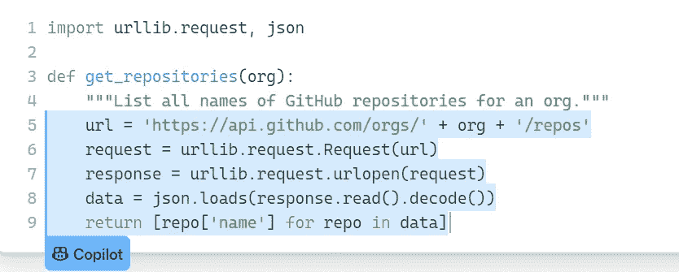
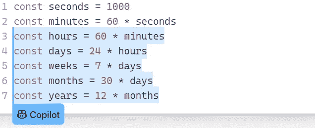
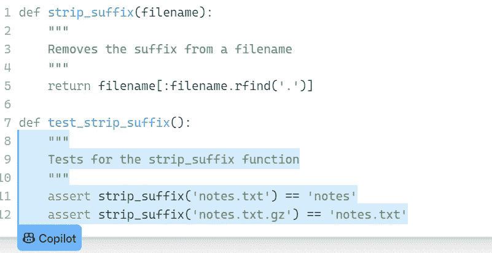
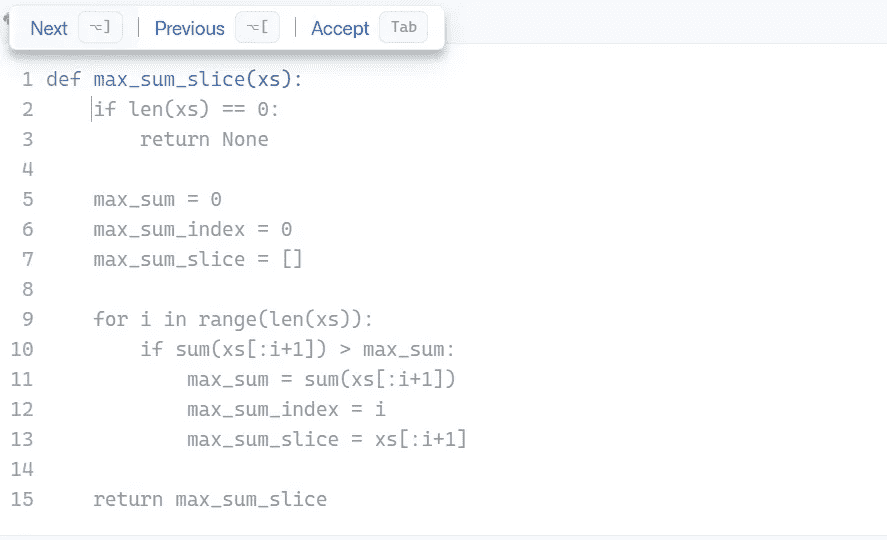
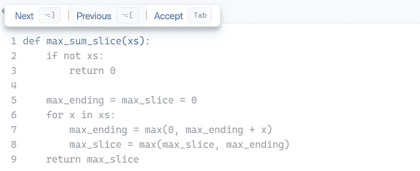

# 关于 GitHub Copilot 你需要知道的一切

> 原文：<https://betterprogramming.pub/everything-you-need-to-know-about-github-copilot-d458b0c4d91e>

## 发现这个人工智能对程序员

Avel Chuklanov 在 [Unsplash](https://unsplash.com?utm_source=medium&utm_medium=referral) 上拍摄的照片。

当谈到编码和编程时，有一个常用术语叫做*自动完成*。我们通常在代码编辑器和 ide 中使用一些智能扩展来享受这种自动完成功能，它非常有用。

但是什么是 [GitHub 副驾驶](https://copilot.github.com/)？和使用自动完成代码建议一样吗？不，不仅仅是这样。

GitHub Copilot 建议整行代码或整个功能。你所需要的就是在代码编辑器中输入你的需求，它会给出相应的代码建议。

听起来很酷，对吧？

在本文中，我们将了解 GitHub Copilot 程序的所有内容，以及它如何提供代码建议。我们开始吧！

# 什么是 GitHub Copilot？

GitHub 最近宣布，Copilot 是一种 AI pair 程序员工具，旨在帮助程序员更快、更省力地编写代码。

GitHub Copilot 基于 Codex，这是一个由 OpenAI 创建的 AI 系统，并在主要在 GitHub 本身上可用的公共源代码上进行训练。

GitHub 首席执行官 Nat Friedman 表示，Copilot 可以更好地与 Python、Ruby、TypeScript、JavaScript 和 Go 等各种语言和框架配合使用。但并不局限于这些语言。它也是为了理解他人而设计的。

GitHub Copilot 项目的宣布在开发人员社区引起了轩然大波，但许多开发人员对此反应不一。

# 它是如何工作的？

目前，它在 Visual Studio 代码中作为测试版用户的扩展提供。只要您的系统上安装了 VS 代码，您就可以在任何地方使用它。

GitHub Copilot 从您正在处理的代码中提取上下文，然后建议一整行代码或整个功能。

当开发人员在代码编辑器中键入注释或函数名时，VS Code 会将数据发送到 GitHub Copilot 服务，综合并建议代码实现。

为了获得更好的结果，函数名和注释必须有意义。

# 特性和功能

GitHub Copilot 接受了 GitHub 上数十亿行公共代码的培训。因此，您可以利用该特性的功能来节省时间，并专注于编写代码的业务逻辑。

Copilot 可以通过许多高级方法将其知识应用到代码编辑器中。

## **将注释转换为代码**

这个功能很酷。你需要做的就是写一个注释，描述你的需求和你想要的函数的逻辑。GitHub Copilot 将为您生成代码。

这里有一个例子:

来源: [GitHub 副驾驶](https://copilot.github.com/)

我们可以看到，开发人员添加了一个注释行来描述代码的逻辑，Copilot 为我们生成了代码。

## 重复代码的自动填充

当您需要编写样板文件和重复的代码模式时，Copilot 非常有用。你需要给它一个例子，它就会为你生成代码。

来源: [GitHub 副驾驶](https://copilot.github.com/)

这里有一个自动填充功能的完美例子。这里，我们提供了一个由两行代码组成的例子，它从中提取了模式，并为我们自动填充了剩余的代码。

## **不劳而获的测试**

测试用例是软件工程项目的主干和必备部分。无论是基于 Java 还是 Python 的项目，到处都需要测试。

这些测试使您的应用程序更加健壮。但是您知道 GitHub Copilot 可以为您编写测试吗？

您需要导入一个单元测试包，Copilot 会为您的实现代码建议合适的测试。

让我们来看看:

来源: [GitHub 副驾驶](https://copilot.github.com/)

这里，我们有一个名为`strip_suffix`的函数，它删除了文件名的后缀，并且 Copilot 为我们生成了测试。就这么简单！

## **显示替代代码**

如果你想用不同的方法解决一个问题，副驾驶会给你看不同的选项。

您可以比较这些方法，并使用最适合您的应用程序的代码。

这里有一个例子:

来源: [GitHub 副驾驶](https://copilot.github.com/)

当您点击“下一步”或“上一步”按钮时，它会向您显示解决该特定问题的替代方法。

来源: [GitHub 副驾驶](https://copilot.github.com/)

# 我的想法

令人惊讶的是，GitHub 和 OpenAI 已经使用机器学习的能力来构建 GitHub Copilot，并在数十亿行代码中进行训练。

这是您在 Visual Studio 代码中使用 Copilot 时将体验到的最令人兴奋的 ML 应用程序之一。

如何在开发过程中利用 GitHub Copilot 的功能取决于您。您可以在处理 React 组件时使用它，并检查它将为您预测的代码，或者处理任何 ML 项目。

通过这样做，你会知道解决一个问题的不同方法。您还可以通过避免编写样板代码来节省宝贵的时间，因为 Copilot 可以为您做到这一点。

# 结论

在本文中，我介绍了 GitHub Copilot，它的用途和工作原理。此外，我还分享了我对如何在开发过程中使用 Copilot 的想法。

感谢阅读！

你可以在这里免费订阅我的时事通讯: [Pralabh 的时事通讯](https://pralabhsaxena.medium.com/subscribe)