# 关于 iOS 14 Widgets 你需要知道的一切

> 原文：<https://betterprogramming.pub/everything-you-need-to-know-about-ios-14-widgets-10856eb76d2a>

## 静态与动态部件、智能部件、意向捐赠等等

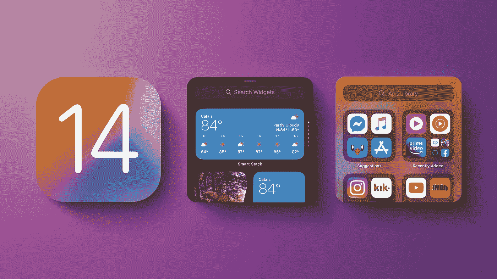

图片来自 [MacRumors](https://www.macrumors.com/guide/home-screen/) 。

# 介绍

在用户年复一年地要求它，多次越狱提供这一功能，以及 Android 从一开始就支持它们之后，苹果终于跳上了 widget 列车。在 WWDC20 上宣布之后，用户松了一口气，开发人员很高兴下载 Xcode 12 测试版并开始编码。

本教程将涵盖:

*   简单介绍一下 Today 扩展及其在 iOS 14 中的作用。
*   静态小部件:快照、时间轴、占位符等等。
*   微件捆绑包或如何在应用中支持多个微件。
*   深层链接:从你的小工具打开一个特定的应用程序屏幕。
*   动态部件:让你的用户通过意图定制你的部件。
*   智能部件:捐赠和相关性。让您的 widget 符合智能堆栈的条件。

对于本文，我将使用 TripsCalendar，这是我开发的一个用于测试小部件的示例应用程序。您可以在我的存储库中找到代码:

[](https://github.com/fermoya/TripsCalendar) [## 费尔莫亚/特里斯卡伦达

### 此时您不能执行该操作。您已使用另一个标签页或窗口登录。您已在另一个选项卡中注销，或者…

github.com](https://github.com/fermoya/TripsCalendar) 

**注:**本教程是用 Xcode 12 beta 3 编写的。官方 Xcode 12 中的实现保持不变，只需要做一些改动。请参阅本文末尾的“更新”部分。

# 今日扩展及其在 iOS 14 中的作用

在 widgets 之前，苹果提供了开发者所谓的“今日扩展”或“今日 widgets”基本上，很少有人使用它们，甚至不知道它们的存在。他们就是这么受欢迎的。

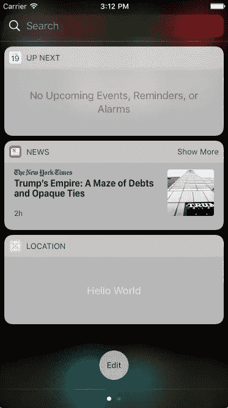

旧的部件或今天的扩展

他们会从 iOS 14 中消失吗？根据 Xcode 12b3，如果您已经用旧版本的 Xcode 添加了 Today 扩展，那么它可以与 widgets 共存。这使得停留在 iOS 13 或更低版本的用户仍然可以使用你的“旧”widget。但是，请注意 Xcode 12b3 不会让您从头开始创建新的 Today widget。老实说，你为什么要这么做？

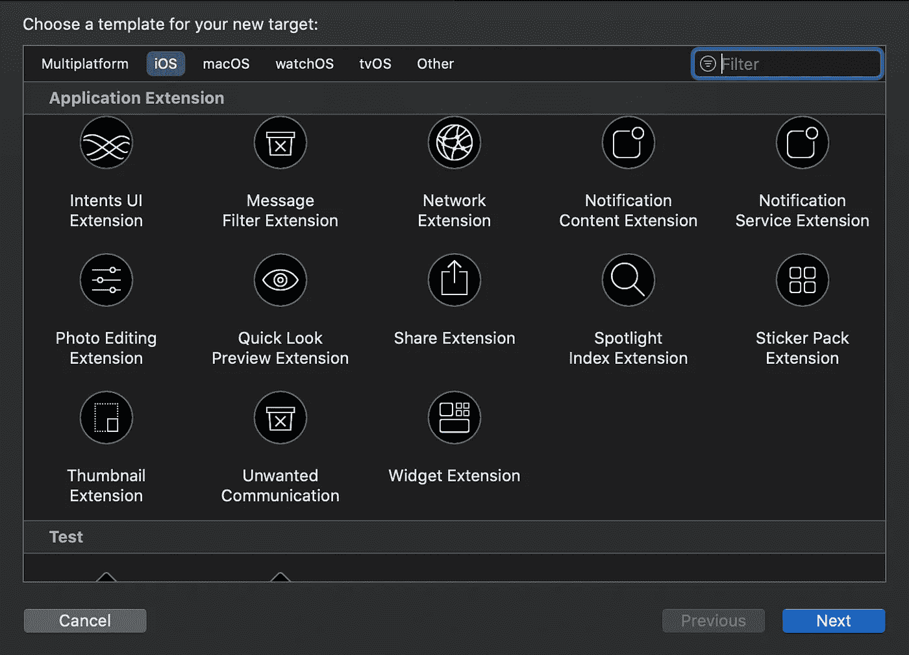

Xcode 12b3 中可用的应用程序扩展

今日扩展将显示在所谓的今日视图中的小部件下。很明显，苹果偏爱 widgets，希望你放弃你的 Today 扩展。

# 静态小部件

让我们创建一个新的小部件。前往 Xcode，“新目标”，然后“Widget 扩展”我们将创建一个静态小部件，所以不要选中“包含配置意图”。

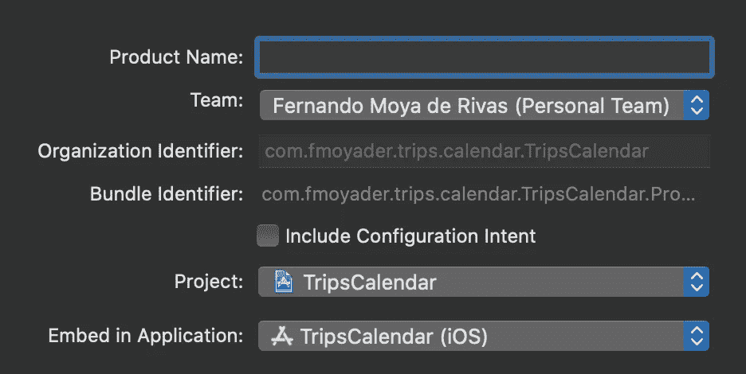

这将创建一堆样板文件。让我们来看看:

*   小部件——您将看到它标有新的`@main`包装器，表明这是扩展的起点。在这里，您可以定制小部件的显示名称和描述，并使用`supportedFamilies`修饰符指定您支持的大小。
*   条目视图—小部件的 UI 内容。这是纯粹的 SwiftUI，我们不会覆盖它，但[有](https://medium.com/better-programming/how-to-create-fun-animations-in-swiftui-1c08adcb93ce)好的教程[在那里](https://medium.com/better-programming/swipe-the-page-with-swiftuipager-981e379e3bbd)。
*   入口—入口视图的模型。必须符合`TimelineEntry`。在这里包装成功显示小部件所需的所有数据。例如，TripsCalendar 将包装行程。
*   提供者—将为系统提供小部件时间线的实体，即在特定时间显示的一组条目。请注意，不要让系统每分钟都显示不同的条目。这很可能行不通。

请注意，您的小部件默认使用`StaticConfiguration`。这很好。这只是意味着它不可由用户配置或定制。

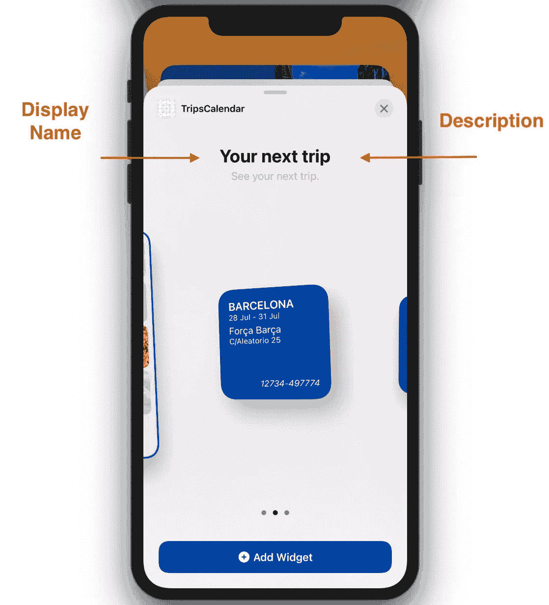

## 支持家庭

小部件支持三种不同的大小:

*   小(主屏幕中四个应用程序图标的空间)
*   中等(主屏幕中八个应用程序图标的空间，水平延伸)
*   大(主屏幕中 16 个应用程序图标的空间或半个屏幕)

对于我们的第一个小部件`[CalendarWidget](https://github.com/fermoya/TripsCalendar/tree/master/TripsCalendarWidget/Calendar)`，我想列出我的下一次旅行，我需要空间，所以我选择`systemLarge`作为我支持的家庭:

```
StaticConfiguration {
    ...
}
.supportedFamilies([.systemLarge])
```

## 快照

这是在尝试将您的小部件添加到设备的主屏幕时显示的一个条目。在这里使用你的默认配置，甚至一些虚拟数据，这样用户就可以看到你的小部件看起来有多漂亮。

```
let entry = CalendarEntry(date: Date(), trips: nextTrips)
```

这是我的快照的样子:

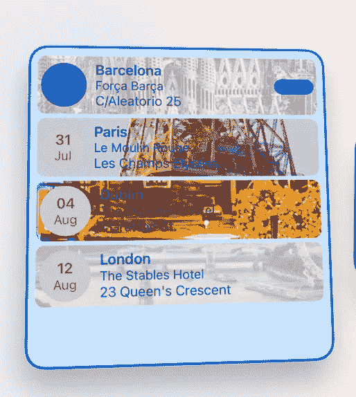

添加小部件模式的快照

## 时间表

与今天的扩展类似，小部件受到系统的高度限制，并且资源非常少。他们的工作方式是通过时间线。这意味着我们将向系统传递将在特定时间填充小部件 UI 的条目/模型。这在提供程序中完成。请注意时间轴通过完成块返回的方式。这允许我们执行异步任务(例如，API 调用或从您的应用程序沙箱加载文件)。

注意:不要试图从你的小部件的 UI(某个`View`主体)加载远程图像。没用的。我发现[是一个关于创建`AsyncImage`并从远程 URL 加载图像的很好的教程](https://www.vadimbulavin.com/asynchronous-swiftui-image-loading-from-url-with-combine-and-swift/)。虽然这对于应用程序代码中的`View`来说很好，但在小部件代码中却不行，实际上可能会使它崩溃。从小部件执行异步任务的唯一方法是:

*   在构建时间轴条目时。
*   通过使用后台任务。然而，这并不是一个真正的选择。后台任务不会立即执行，而是在系统决定时执行，您很可能希望尽快下载并显示该图像。

创建时间线的最后一步是指定重新加载策略(即，当您希望系统请求新条目时)。您可以选择:

*   `.atEnd` —一旦系统条目用完。
*   `.never` —应用程序将“手动”请求更新。
*   `.after(_ date: Date)` —一定时间后更新。

正如我提到的，`[CalendarWidget](https://github.com/fermoya/TripsCalendar/tree/master/TripsCalendarWidget/Calendar)`将显示一个旅行列表。这些不会改变，除非用户删除/添加一个行程，所以在我们的例子中，我们可以选择`.never`:

```
let store = TripsStore()
let entry = CalendarEntry(date: Date(), trips: store.trips)
let timeline = Timeline(entries: [entry], policy: .never)
completion(timeline)
```

尽管如此，我还是想展示一下未来的旅程。如果用户几天没有添加或删除旅行，我的小部件可能会过时。因此，我将选择`.after`策略:

```
let tomorrow = ...
let store = TripsStore()
let entry = CalendarEntry(date: Date(), trips: store.trips)
let timeline = Timeline(entries: [entry], policy: .after(tomorrow))
completion(timeline)
```

最后，每当用户删除或添加旅行时，我希望我的小部件得到相应的更新:

```
import WidgetKitfunc remove(trip: Trip) {
    ...
    WidgetCenter.shared.reloadAllTimelines()
}
```

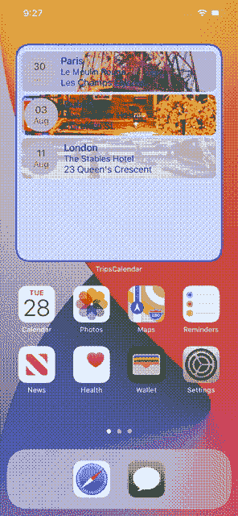

在这里，我同时重新加载所有的时间线，但是你也可以用`reloadTimelines(of:)`重新加载某种类型的时间线，或者用`getCurrentConfigurations`检查你的小部件的特定意图配置。

重要提示:如果您正在检索存储在您的应用程序沙箱或`UserDefaults`中的信息，请不要忘记将[应用程序组](https://developer.apple.com/documentation/bundleresources/entitlements/com_apple_security_application-groups)添加到您的“Widget 扩展”功能中:

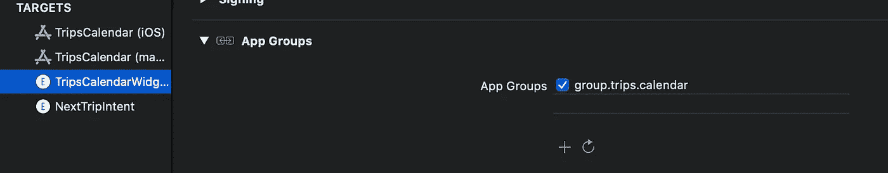

“应用程序组”功能

## 占位符

您可以在系统加载您的小部件时指定一个占位符视图。SwiftUI 提供了一个名为`.redacted(reason: .placeholder)`的新修改器，它将用褪色的矩形替换`Text`和`Image`等:

WWDC20 视频显示的是`isPlaceholder(true)`，但这已经被弃用，而支持`redacted(reason: .placeholder)`。然后在小部件的主体中:

```
StaticConfiguration(..., placeholder: CalendarPlaceholderView()) {
    ... 
}
```

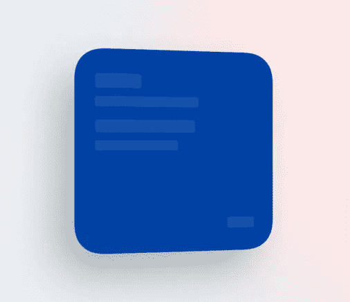

NextTripPlaceholder

注意，这个初始化器在 Xcode 12b3 中似乎已经被否决了。

# 支持多个小部件

谁说你只能有一个部件？为了在你的应用中支持多个小部件，你只需要创建一个`WidgetBundle`并在那里列出所有可用的小部件。

首先，从小部件定义的顶部删除`@main`。其次，创建一个小部件包:

现在，当您尝试将一个小部件添加到主屏幕时，您的包中列出的所有小部件都会显示出来以供选择:

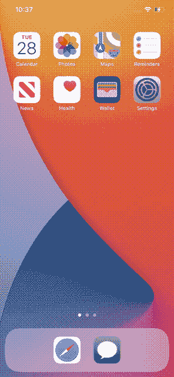

Widget 捆绑包

# 深层链接

如前所述，小部件在资源和空间上都非常有限。你不能真的把你的小部件设计成有很多交互，比如按钮、手势等等。这意味着你的部件设计得很差，因为这不是它们的本意。根据[苹果](https://developer.apple.com/design/human-interface-guidelines/ios/system-capabilities/widgets#):

> “虽然人们可以点击一个小部件来查看你的应用或在你的应用中做更多事情，但小部件的主要目的是显示少量及时的个人相关信息，人们可以在不打开你的应用的情况下查看这些信息。在设计过程中，确定一个小部件的单一想法并确定要显示的信息范围是至关重要的第一步。”

我们能做的是有有限数量的链接(不超过四个，因为他们建议)来深度链接到我们的应用程序。为此，他们提供了两种选择:

*   将使你的整个部件可点击，并将深度链接到指定的网址。默认情况下，点击一个微件将会在它所在的屏幕上打开你的应用程序。
*   `Link(destination: URL)`将一些内容包装成可点击的深度链接。

例如，`[CalendarWidgetEntryView](https://github.com/fermoya/TripsCalendar/blob/master/TripsCalendarWidget/Calendar/Views/CalendarWidgetEntryView.swift)`将在没有内容显示时链接到主屏幕(空视图)，并在点击一行时链接到特定的旅行:


小部件中的深层链接

如果你想了解更多 SwiftUI 应用周期中的深层链接，请查看本文。

# 动态(意图)部件

以前的小部件是“静态”的，因此用户无法定制。我们将构建一个新的小部件`[NextTripWidget](https://github.com/fermoya/TripsCalendar/tree/master/TripsCalendarWidget/NextTrip)`，并学习如何使小部件可配置。

第一步是创建意图扩展(Xcode，“新目标”，“意图扩展”)。确保您选择“无”作为起点，并且不选中“包括 UI 扩展”。

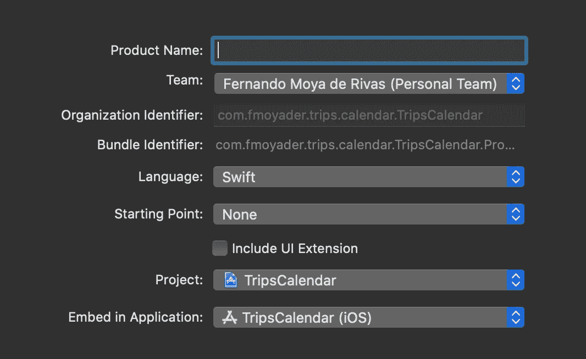

也可以使用现有的意图扩展(如果有的话)。转到您的项目文件夹检查器，创建一个新文件(`SiriKit Intent Definition File`)，并确保它在您的所有目标中都可用:

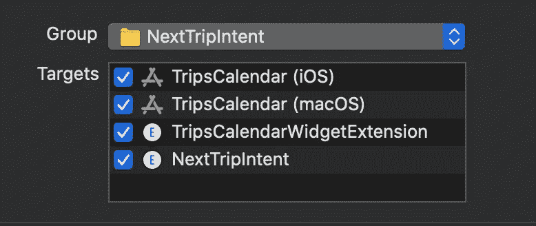

对于`NextTripWidget`、*、*我希望能够选择显示什么样的行程。为此，我将在我的意图定义文件中创建一个名为`IntentTrip`的新类型，并将它作为参数添加到我的意图中。点击+添加一个新的意图，选择一个名称，并确保“意图适用于小部件”和“选项动态提供”都被选中:

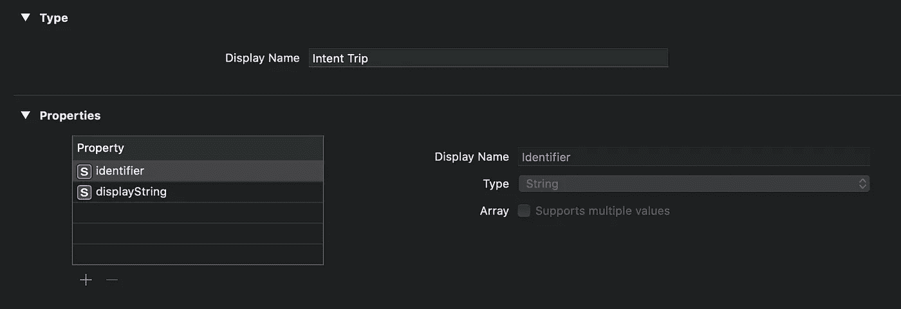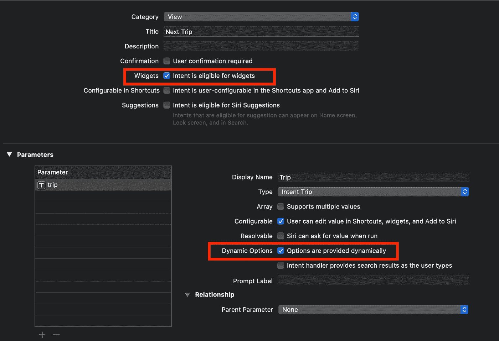

如果你现在编译，Xcode 会生成一个`IntentHandling`协议和一个`Intent`类，并带有一个属性来保存你的自定义类型参数。我在我的意图定义文件中调用了我的意图`NextTrip`，所以 Xcode 生成了一个`NextTripIntentHandling`协议。使`IntentHandler`符合该协议:

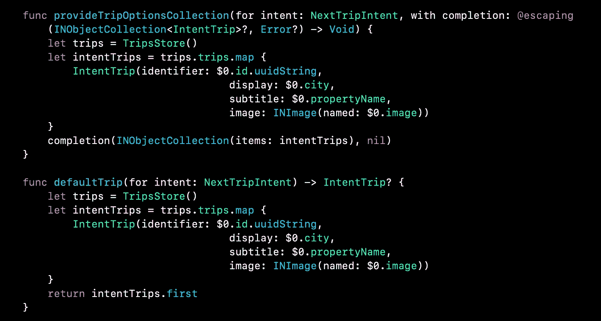

NextTripHandling 的实现

最后，您所要做的就是让您的小部件使用一个`IntentConfiguration`:

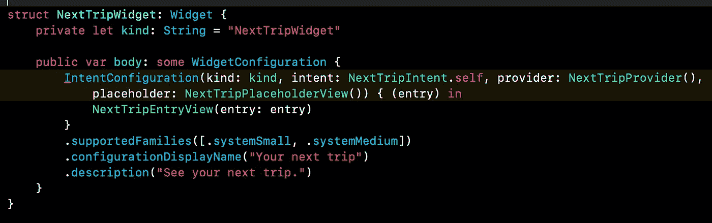

并使您的提供商符合`IntentTimelineProvider`而不是`TimelineProvider`:

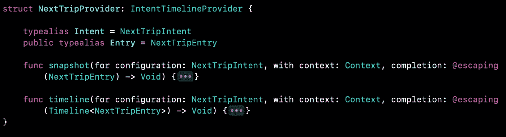

现在，您可以从您的意向中检索选定的行程:

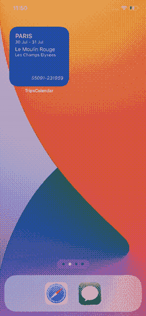

请注意 iOS 是如何为对话框使用自定义颜色的。为此，您只需在您的`Widget Extension Assets`目录中定义一个`AccentColor`和一个`WidgetBackgroundColor`。如果您想要使用不同的名称，您可以在 widget 的目标构件设置中更改它:

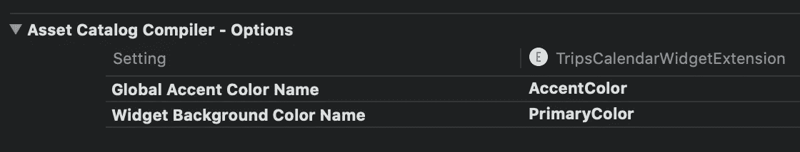

# 智能部件:捐赠和相关性

iOS 14 附带了一个智能堆栈，可以根据用户的兴趣和他们在任何时候最有可能做的事情来旋转用户的小工具。我们怎样才能使我们的小部件适合这样的旋转，并告诉系统一些时间轴条目是重要的？有两种方法可以做到。

## 关联

`TimelineEntry`协议带有一个变量`var relevance` : `TimelineEntryRelevance?`。默认情况下，这个值是`nil`，所以您需要在条目中声明它。

例如，`[NextTripWidget](https://github.com/fermoya/TripsCalendar/tree/master/TripsCalendarWidget/NextTrip)`显示了任何未来的旅行，但是一个正在进行的旅行比另一个两周后的旅行更有意义。在`[NextTripProvider](https://github.com/fermoya/TripsCalendar/blob/master/TripsCalendarWidget/NextTrip/Provider/NextTripProvider.swift)`中创建时间线时，我们可以为正在进行的旅行指定一个高于非当前旅行的分数:

```
let score: Float = (trip?.isOngoing ?? false) ? 1 : 0
let relevance = TimelineEntryRelevance(score: score)let entry = NextTripEntry(date: now, trip: trip, relevance: relevance)
```

在这种情况下，我使用从 0 到 1 的范围。正在进行的旅行将获得比其他旅行(0)更高的相关性(1)。

## 意向捐赠

Siri 意图是在 iOS 12 中引入的，并且已经用于建议、快捷方式等。在这种情况下，可以使用相同的实现。

例如，当用户访问一些旅行详细信息时，我们可以通过捐赠在前面部分中创建的类型的意图来让系统知道:

这将向系统“捐赠”一个交互。如果系统检测到用户在某个时间在他们的设备中执行了一些操作，变成了这些交互之一，那么智能堆栈将显示一个与该交互的标识符匹配的小部件。

# 更新

Xcode 12 中的实现略有变化。这些是主要的变化:

*   占位符:您不需要在小部件配置`StaticConfiguration`或`IntentConfiguration`中提供占位符。相反，在你的`TimelineProvider`中覆盖`placeholder(in:)`。
*   `snapshot(for:in:completion:)`已更名为`getSnapshot(for:in:completion:)`
*   `timeline(for:in:completion:)`已更名为`getTimeline(for:in:completion:)`

# 结论

苹果押注于 widgets，这些 widgets 似乎比旧的 Today widgets 有用得多。根据您的需求使用静态或动态配置，不要一次给用户提供过多的信息。保持你的小工具简单，交互少。不要执行任何耗时的操作。请改用应用程序。