# 关于卡夫卡你需要知道的一切

> 原文：<https://betterprogramming.pub/everything-you-need-to-know-about-kafka-a83e2456d14c>

## 初学者的简单指南

照片由 [Mathyas Kurmann](https://unsplash.com/@mathyaskurmann) 在 [Unsplash](https://unsplash.com/photos/fb7yNPbT0l8) 上拍摄

Kafka，这个从 LinkedIn 简单起步的技术，现在已经是大多数科技公司不可或缺的工具包。

每一项技术都是为了解决一个问题而产生的。卡夫卡也不例外。

话虽如此，让我们回到绘图板，告诉你一切你需要知道的关于这项惊人的技术。

我们开始吧！

# 我们为什么需要卡夫卡？

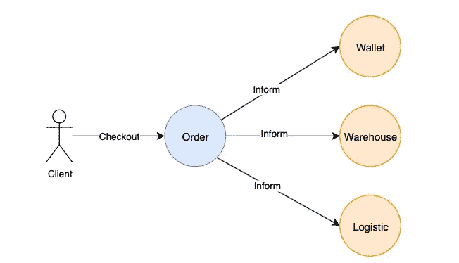

当订单发生时，订单通知其他服务

在我们深入探讨之前，有必要回顾一下为什么卡夫卡首先被发明出来。

想象一下，为一家电商公司维护一组微服务。

当发出订单时，`Order`服务器通知其他人如下:

*   钱包服务器从用户账户中扣除金额
*   仓库服务器扣除项目的库存数量
*   物流服务器将物品运出

当订单发生时，如果要通知更多的服务，复杂性就会增加。

订单服务器需要执行以下操作:

*   跟踪要通知的人
*   确保所有收件人确实收到并处理了邮件
*   管理收件人的连接和路由策略

正如你可能知道的，这是**不可扩展的**。

因此，卡夫卡出现了。

# 消息队列与发布-订阅

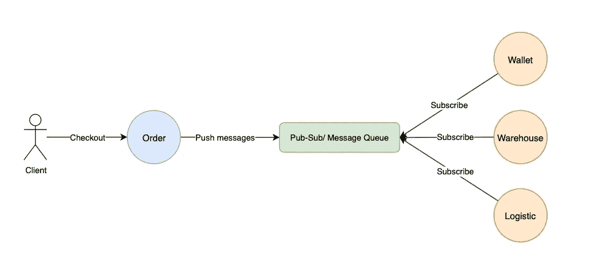

订单服务器只是将消息发布到发布-订阅/消息队列

消息队列和发布-订阅系统都是解决上述问题的关键。

不是让`Order` 服务器维护事件通知，`Order`服务器将事件发布给一个行为像队列的中间人。

对队列感兴趣的服务器，通常称为消费者，订阅队列并相应地消费事件。

消息队列和发布-订阅系统之间的区别在于一种微妙的方式。

# 信息排队

消息队列是一种类似队列的结构，其中消息被发布并被使用一次且仅使用一次。

这对于不是幂等的流程来说非常方便，并且事件应该只由一个使用者处理。

RabbitMQ 最初被设计成一个消息队列。

# 发布-订阅系统

另一方面，发布-订阅系统允许多个使用者多次使用一条消息。

我们之前的电子商务示例采用了发布-订阅解决方案。订单事件被许多消费者消费。

Kafka 被设计成消息队列和发布-订阅系统。我们将在后面的部分更深入地研究这是如何实现的。

# Kafka 组件

Senne Hoekman 在[像素](https://www.pexels.com/photo/white-diagram-paper-under-pliers-1178498/)上拍摄的照片

为了全面理解卡夫卡是如何工作的，我们来解剖一下卡夫卡的各个组成部分，逐个讨论。我们要讨论的是:

*   卡夫卡经纪人与集群
*   出版者
*   消费者
*   主题
*   划分
*   消费者群体
*   复制品
*   动物园管理员
*   长轮询

# 卡夫卡经纪人与集群

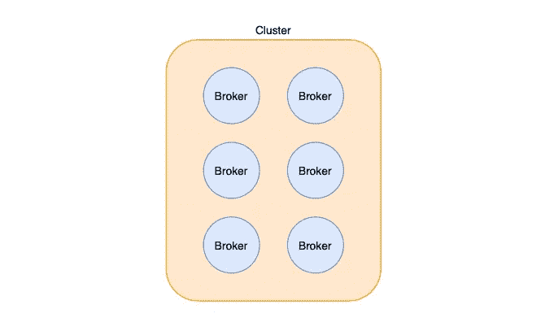

卡夫卡经纪人和集群

Kafka 只不过是一个管理数据发布和消费的服务器。

Kafka 服务器被称为代理。

维护同一组主题的代理的集合被称为 Kafka 集群。

# 出版者

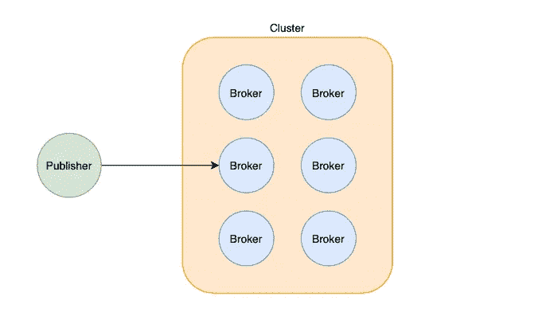

出版商出版给卡夫卡经纪人

向 Kafka 代理发布数据的服务器称为发布者。

我们之前提到的`Order`服务器就是发布者的一个例子。

# 消费者

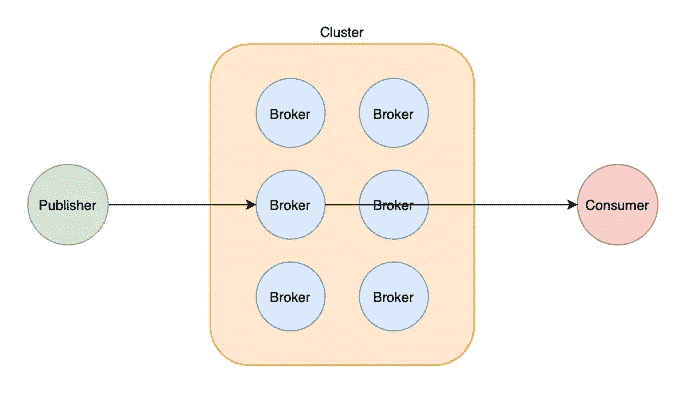

消费者从卡夫卡经纪人那里消费

另一方面，消费者是从 Kafka 主题订阅和消费数据的服务器。

在我们前面的例子中，`Wallet`服务器、`Warehouse`服务器和`Logistic`服务器充当了`Order`主题的消费者。

# 主题

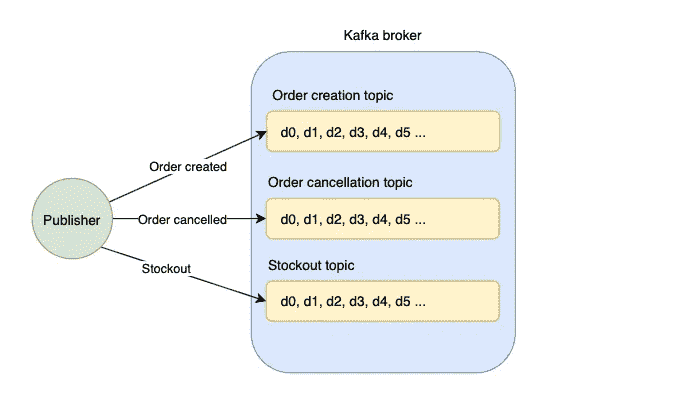

《卡夫卡经纪人》中的不同主题

Kafka 代理维护不同类型的事件，如下所示:

*   订单创建事件
*   订单取消事件
*   缺货事件

这些事件中的每一个都是巨大的数据流。主题只是一种事件或数据流。

当发布到 Kafka 时，发布者指定应该发布消息的主题。

主题是只附加的日志。向主题添加消息类似于向队列添加数据，需要 O(1)常量时间，因此速度极快。

# 划分

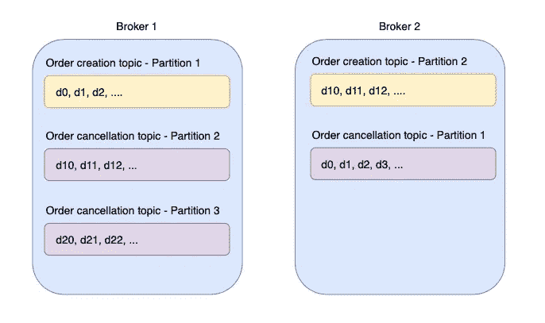

主题被分割成多个分区

主题是存储在 Kafka 代理上的仅附加日志。

随着消息数量的增加，代理在特定主题上可以存储的数据量是有限制的。

可以将一个主题分成多个分区，而不是将所有数据存储在一个只附加的日志中。每个分区存储特定主题的一部分数据。

这类似于数据库分片。

主题基于分区进行分片。相同主题的分区可以存储在相同或不同的 Kafka 代理上。这使得 Kafka 具有高度的可扩展性。

发布者在发布前指定消息的主题和分区。因此，发布者有责任确保分区逻辑不会导致热分区。

# 抵消

分区中的偏移量

偏移量是分区中消息的唯一索引。

随着 Kafka 向消费者推送数据，它会增加并跟踪当前偏移量。

有两种类型的偏移值得强调:

*   电流偏移
*   承诺偏移量

通过指定消息的主题、分区和偏移量，可以具体地检索到一个`data`。

谈到补偿，有很多细节。我们将在另一篇文章中详细讨论它们。

# 消费者群体

如前所述，Kafka 既是一个消息队列，也是一个发布-订阅系统。这是通过消费者群体精心设计的。

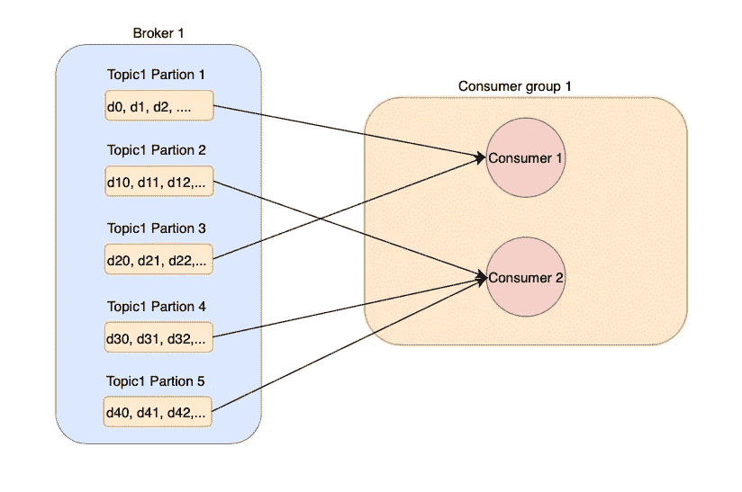

消费者可以消费多个分区，但是每个分区只能由同一组中的一个消费者消费

消费者组由消费相同主题的一组消费者组成。

一个使用者可以一次使用多个分区。但是，每个分区只能由同一组中的一个且仅一个使用者使用。

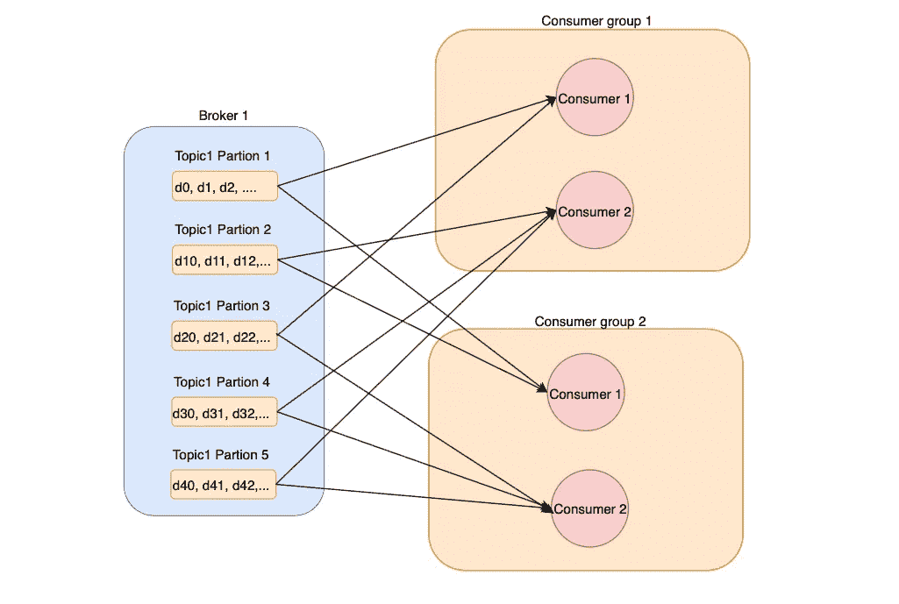

一个分区可以由来自不同使用者组的多个使用者使用

消费群体是相互独立的。不同的组可以使用不同的偏移量同时消费相同的主题。

通过将所有消费者放在同一个组中来实现排队。同一分区中的消息不会被来自相似组的不同使用者同时使用。

队列是在分区级别实现的。因此，如果要按顺序处理数据流，发布者必须确保数据总是被推送到同一个分区。

另一方面，发布-订阅系统是通过多个消费者群体实现的。消费者群体相互之间一无所知，并且使用单独的偏移量来消费数据。

在前面的例子中，`Wallet`服务器和`Logistic`服务器都属于不同的消费者组，并且分别消费数据。

# 重新平衡和分区分配

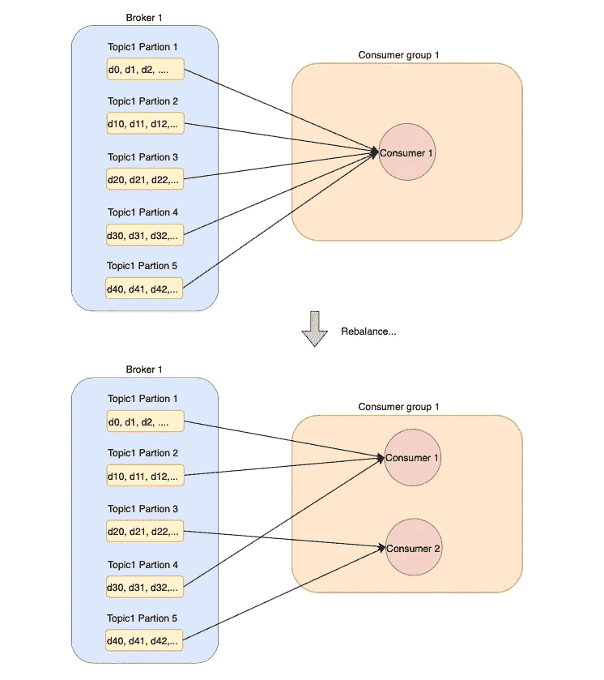

当新的消费者加入时，卡夫卡重新平衡

如果一个组中只有一个消费者，消费者将负责所有可用分区的消费。

当一个新的消费者加入该组时，例如，添加了一个新的服务器实例，Kafka 将执行重新平衡，并将一部分分区分配给新的消费者。

这确保了每个消费者分享相同数量的工作，从而使 Kafka 具有可伸缩性。

Kafka 使用它自己的重新平衡策略来重新分配分区，这值得另写一篇文章。

# 复制品

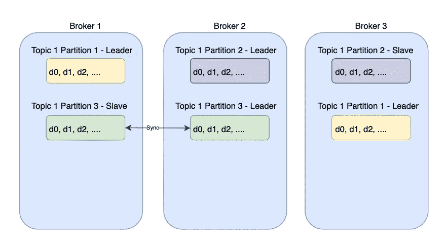

副本是在分区级别上创建的，可以存储在相同/不同的代理中

单点故障是每个分布式系统的噩梦。卡夫卡也不例外。

如果代理关闭，存储在代理上的分区可能会变得不可用。

因此，副本是在分区级别创建的。

为每个分区创建副本，并存储在不同的 Kafka 代理上。为每个分区选举一个领导者来为发布者和消费者服务。

副本不断同步来自领导者的数据。当首领倒下时，动物园管理员加入进来帮助首领的选举。

# 动物园管理员

Gustovo Fring 在 [Pexels](https://www.pexels.com/photo/friendly-man-hand-feeding-kangaroos-in-paddock-4172914/) 拍摄的照片

正如你可能在思考的那样，我们的谜题中有一些缺失的部分。

*   我们如何知道每个分区的领导者？
*   如何知道每个主题的分区数？
*   如何知道每个消费群体的最新偏移量？
*   如何知道每个消费群体中的消费者数量？

这就是动物园管理员发挥作用的地方。这是一个服务同步系统，它存储元数据并协调 Kafka 中的分布式系统。

主要涉及以下内容:

*   领导者选举—确保每个分区都有一个领导者
*   集群成员资格—跟踪集群中的所有功能代理
*   主题配置—跟踪所有可用的主题、分区及其副本
*   访问控制列表—跟踪每个组中的用户数量及其访问权限
*   配额—跟踪每个客户端可以读写的数据量

# 长轮询

由[安德里亚·皮亚卡迪奥](https://www.pexels.com/@olly/)在[像素](https://www.pexels.com/photo/cheerful-young-woman-screaming-into-megaphone-3761509/)上拍摄

这个百万美元的问题来了，卡夫卡是如何把信息推送给它的消费者的？

RabbitMQ 采用推送模式。代理维护与消费者的持久 TCP 连接，并在有可用数据时将数据推送给消费者。

然而，推送模式可能会淹没消费者。如果代理推送数据的速度快于消费者处理数据的速度，消费者可能会落后。RabbitMQ 确实有解决方案，但这超出了我们的范围。

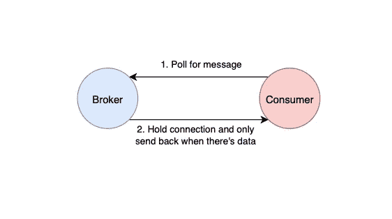

长轮询等待模式方法

相反，Kafka 利用了拉模型，也就是长轮询。消费者定期从代理那里获取数据。因此，消费者只有在准备好的时候才能提取数据。但是，如果分区上没有数据，消费者的定期轮询可能会导致资源浪费。

Kafka 通过使用“长轮询”等待模式方法解决了这个问题。简而言之，如果分区上没有数据，Kafka 不会返回空响应。相反，代理持有连接，并在将数据返回给消费者之前等待数据进入。

这减轻了当分区上没有数据时消费者的频繁轮询，并防止了资源的浪费。

# 结论

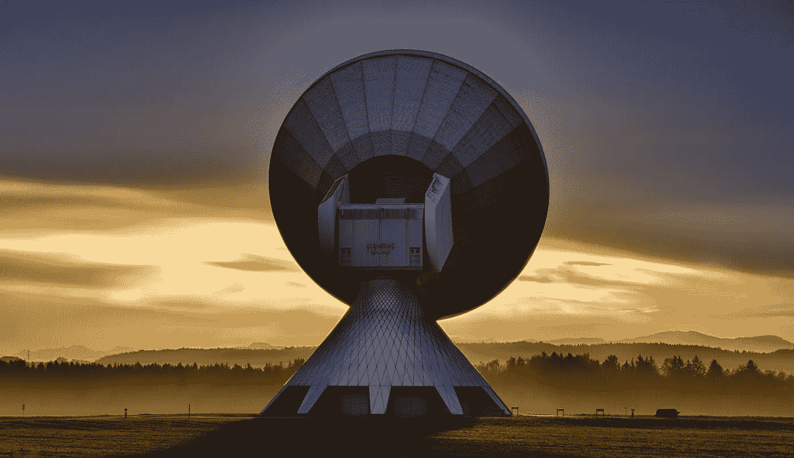

照片由 [Pixabay](https://www.pexels.com/@pixabay/) 在[像素](https://www.pexels.com/photo/antenna-contact-dawn-dusk-33153/)上拍摄

这篇长篇大论的文章到此结束。

管理 Kafka 有很多细节，但是，这些是基本的组成部分，可以让你用这种神奇的技术启动你的旅程。

我希望这能对你有所帮助，我会在以后更多文章中看到你！

再见！