# 你需要知道的关于 PWAs 的一切

> 原文：<https://betterprogramming.pub/everything-you-need-to-know-about-pwas-8e41a7e745aa>

## 渐进式网络应用——它们是什么以及如何开始

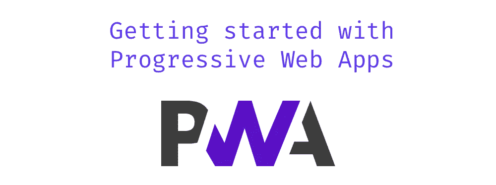

进入移动开发环境是很棘手的。移动开发者在发布他们的应用程序之前必须做出很多决定。

这些关键决策包括:我使用什么语言？我在哪些平台上发布？我必须支持哪些设备？我使用哪些框架？

与 web 开发相比，移动开发可能会感觉复杂，在 web 开发中，您可以通过将单个 HTML 文件放在服务器上来启动您的网站。

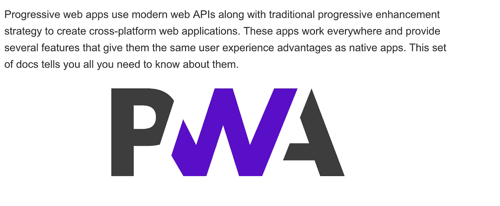

[https://developer . Mozilla . org/en-US/docs/Web/Progressive _ Web _ apps](https://developer.mozilla.org/en-US/docs/Web/Progressive_web_apps)

渐进式 web 应用程序是一种新技术，它使我们能够使用标准 web 技术(如 JavaScript、HTML 和 CSS)来构建感觉像本地的应用程序。PWAs 在浏览器中运行，允许访问关键的本机功能，例如:

*   在移动主屏幕上安装应用程序
*   离线访问应用程序
*   推送通知

Maximiliano Firtman 的现代 PWA 备忘单[https://caniuse.com/#search=service%20workers](https://medium.com/u/a07cb79e083a#search=service%20workers)

# 入门指南

每个 PWA 都需要一个`manifest.json`文件。 [web 应用程序清单](https://developer.mozilla.org/en-US/docs/Web/Manifest)是一个简单的 JSON 文件，它告诉浏览器关于您的 web 应用程序，以及当它安装在用户的移动设备或桌面上时应该如何运行。

将这个清单放在项目的`public`或`build`文件夹中。

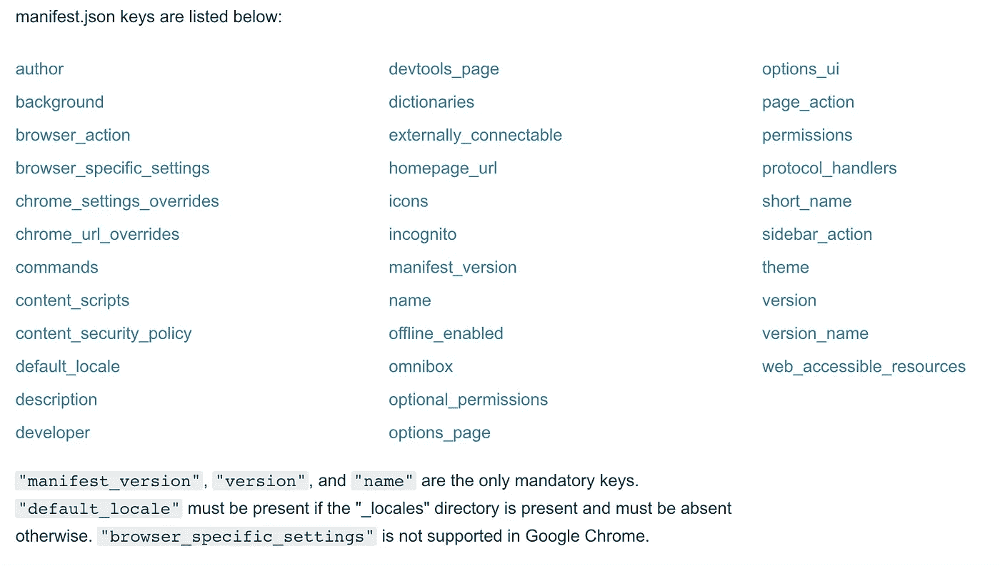

[https://developer . Mozilla . org/en-US/docs/Mozilla/Add-ons/web extensions/manifest . JSON](https://developer.mozilla.org/en-US/docs/Mozilla/Add-ons/WebExtensions/manifest.json)

## 告诉浏览器你的清单

创建清单后，向 web 应用程序中的所有页面添加一个`link`标签:

```
<link rel="manifest" href="/manifest.json">
```

使用 web 服务器启动项目，并打开“应用程序”选项卡。

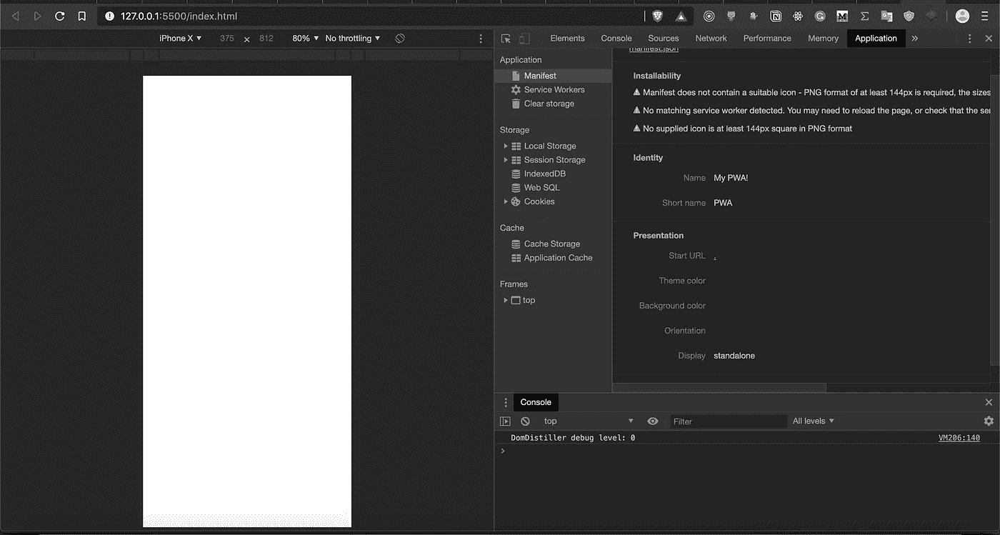

检查 **manifest.json** 文件

您应该会看到所有的 manifest.json 属性都出现在一个*应用程序* - > *清单*选项卡上。

# 创建服务人员

服务工作者的有趣之处在于它们运行在一个单独的线程上。这意味着服务人员无法访问 DOM。

如果服务工作者不能访问 DOM，那它还有什么意义？原因很简单——服务人员在后台运行。想象一下，上传一个 30 分钟的大型视频，而视频上传时浏览器完全冻结。这会是一个好的用户体验吗？

当然不是。这就是为什么我们有后台服务，用于图像视频处理、实时监听数据请求、推送消息等。

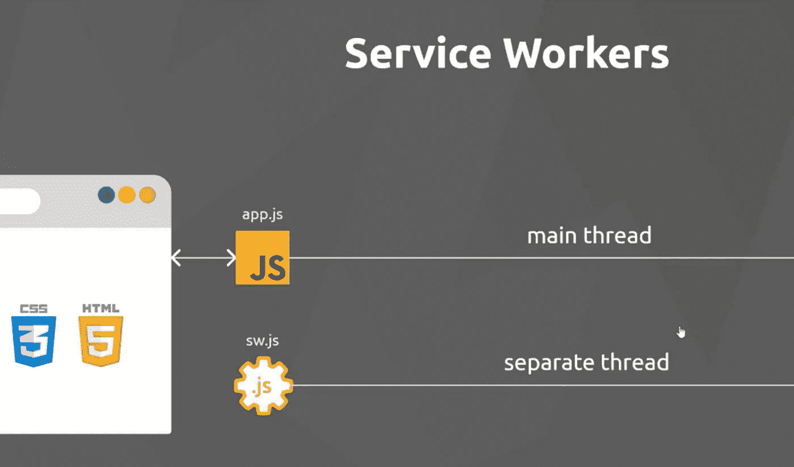

图来自《网络忍者教程》[新手 PWA](https://youtube.com/watch?v=4XT23X0Fjfk)

## 要为您的站点安装服务人员，您需要注册它

我们检查`[serviceWorker](https://developer.mozilla.org/en-US/docs/Web/API/ServiceWorker)`对象是否存在于`[navigator](https://developer.mozilla.org/en-US/docs/Web/API/Navigator)`对象上。如果是的话，在页面 load 上注册我们的`service-worker.js`文件。

如果您运行应用程序，请打开*应用程序- >服务人员*选项卡，您应该会看到服务人员正在运行。

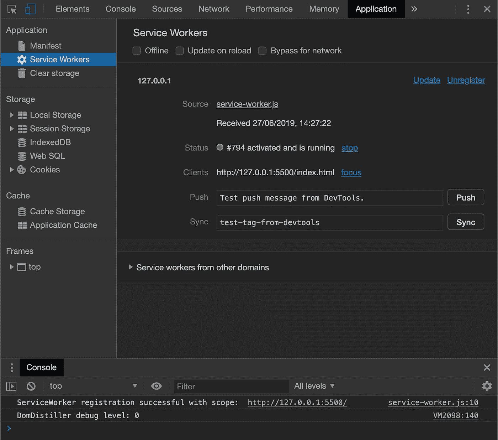

为了确保它是当前的服务工作者而不是缓存的，点击*源*。

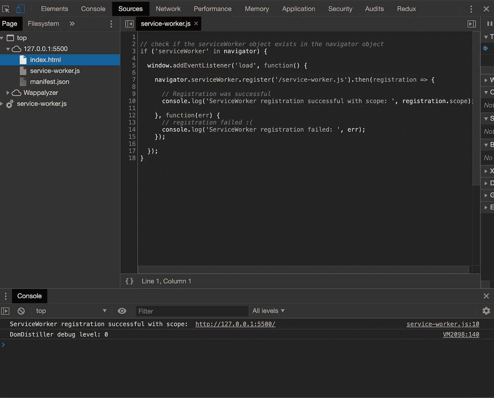

是的，就是它。

# 服务工作者生命周期


强烈推荐阅读:[https://developers . Google . com/web/fundamentals/primers/service-workers/life cycle](https://developers.google.com/web/fundamentals/primers/service-workers/lifecycle)

服务工作者基于 promise 语法，这意味着它们在默认情况下是异步的。如果承诺对你来说是陌生的，看看这篇文章。

[](https://medium.com/better-programming/improve-your-asynchronous-javascript-code-with-async-and-await-c02fc3813eda) [## 如何用 Async 和 Await 改进异步 JavaScript 代码

### 如果您有机会观察现代 JavaScript 代码，那么您很有可能已经看到了 async 和 wait…

medium.com](https://medium.com/better-programming/improve-your-asynchronous-javascript-code-with-async-and-await-c02fc3813eda) 

简而言之，服务人员的生命周期是使离线支持成为可能，允许新的服务人员注册而不中断当前注册的服务人员，并确保一次只有一个版本的站点在运行。

# 离线支持

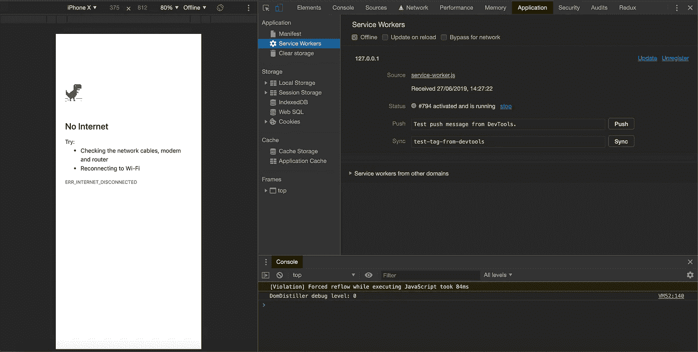

选中“离线”框

如果您在浏览器缓存对象中缓存所有资产和文件，并且在安装服务工作器之前，从缓存中加载资产，则离线支持有效。

注意关键字`self`。记住，我们不能访问 DOM `window`对象，所以我们使用`self`键来引用当前安装的服务工作者。

我们将缓存内容的名称与资产路径列表一起传递。

注销并注册新的服务人员。现在应该可以安全地缓存内容了。

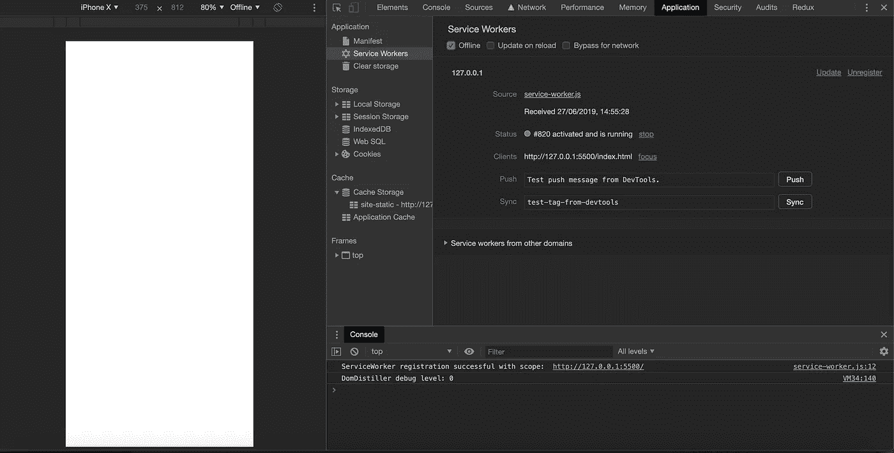

呜哇！离线支持！

不要担心屏幕是白色空白的，那是因为我们没有向 HTML 添加任何内容。

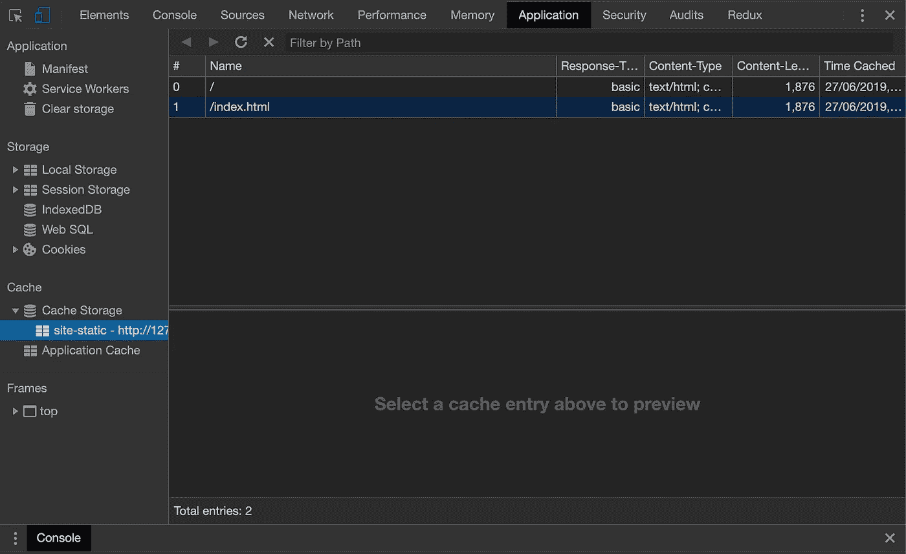

检查浏览器缓存

请注意，我们在数组中列出的所有资源都出现在缓存中。相当酷！

# 获取缓存资产

[获取事件](https://developer.mozilla.org/en-US/docs/Web/API/FetchEvent)使用浏览器默认的非获取请求。对于`GET`请求，它试图在缓存中返回一个匹配，并退回到网络。

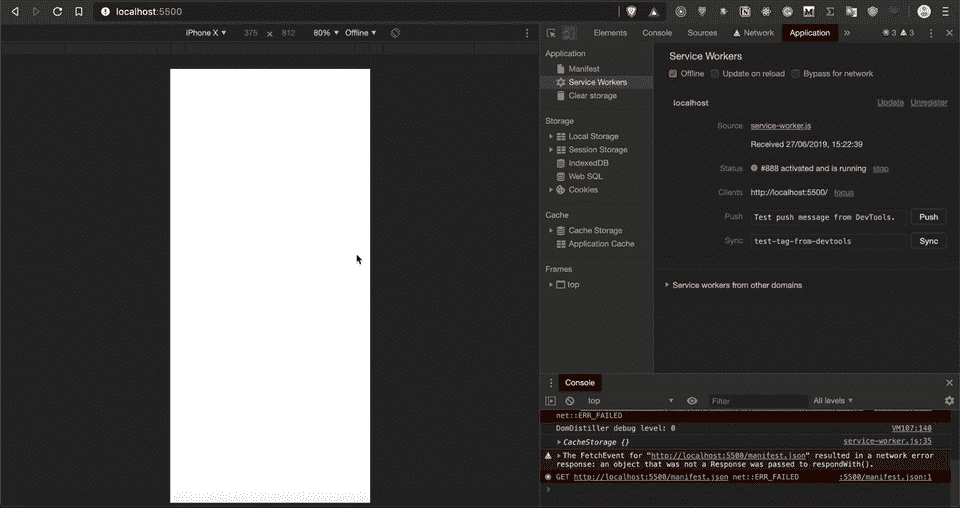

如果我们刷新浏览器，我们应该看到缓存的结果，而不是离线警告消息。

# 从这里去哪里？

查看下一章，我将在那里讨论 web 上的推送通知。

[](https://medium.com/@indreklasn/everything-you-need-to-know-about-pwas-push-notifications-e870bb54e14f) [## 您需要了解的关于 PWAs 的一切—推送通知

### 这是一个关于渐进式网络应用的系列。如果你还不知道，请先看第一章，然后再往下读。

medium.com](https://medium.com/@indreklasn/everything-you-need-to-know-about-pwas-push-notifications-e870bb54e14f) 

我强烈推荐阅读关于渐进式网络应用的 Mozilla 和 Google 文档，它们充满了有用的信息。

如果你对源代码感兴趣，你可以在这里找到它[。](https://github.com/indreklasn/pwa-example)

[](https://github.com/indreklasn/pwa-example) [## indreklasn/pwa-示例

### 通过在 GitHub 上创建帐户，为 indreklasn/pwa-example 开发做出贡献。

github.com](https://github.com/indreklasn/pwa-example)