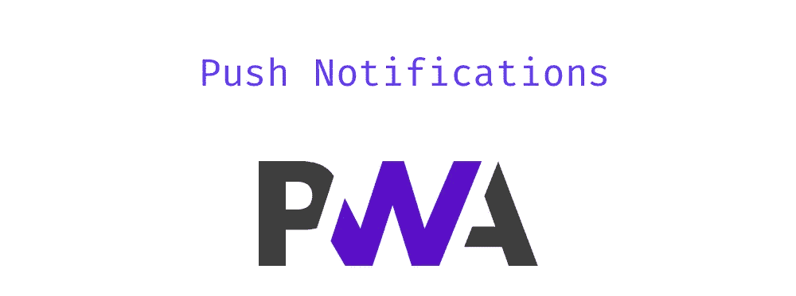
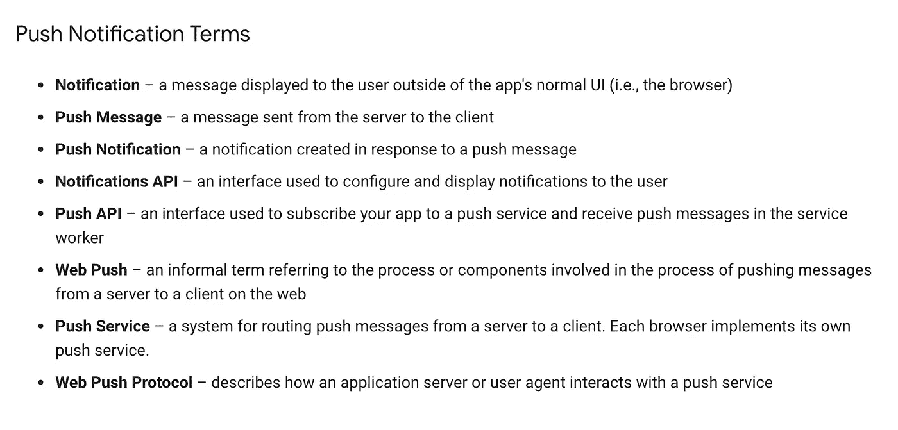
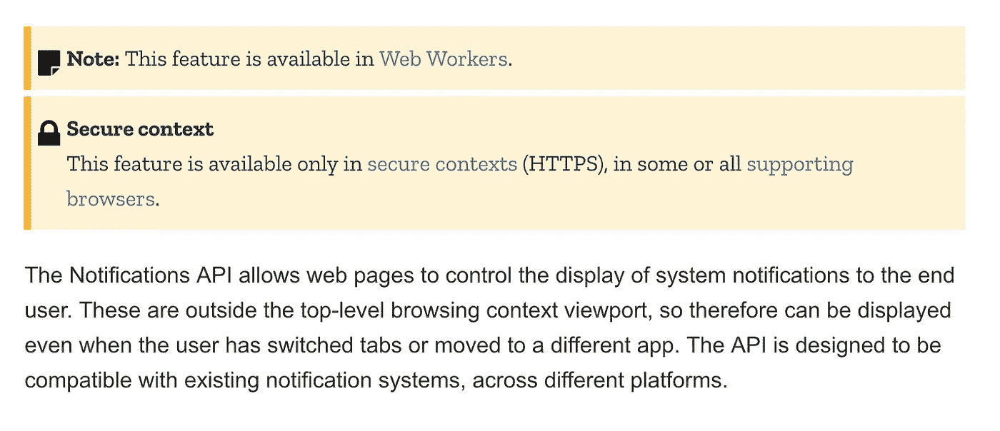
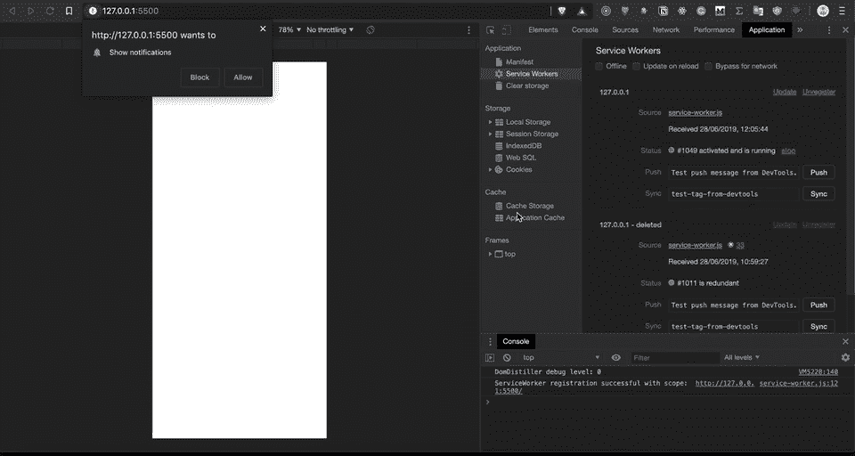
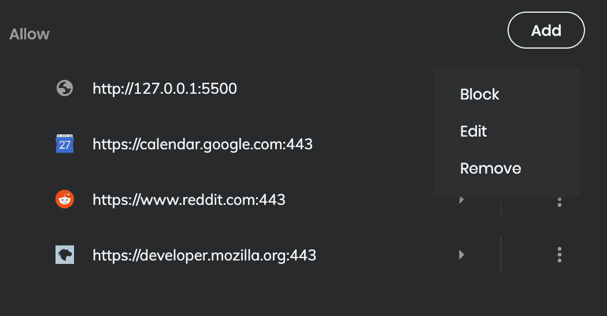
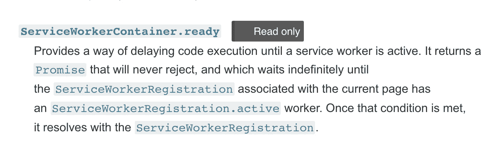
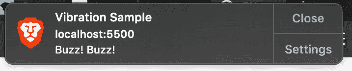
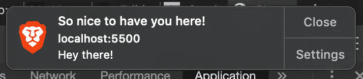
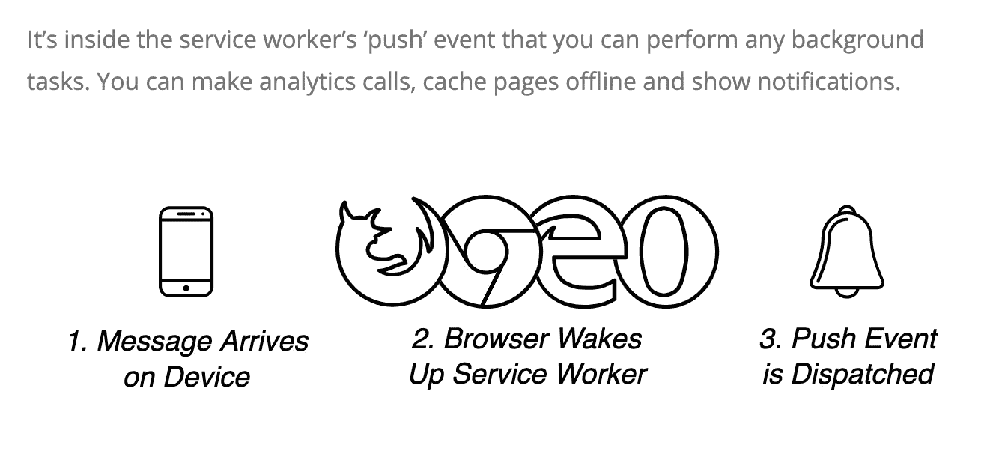
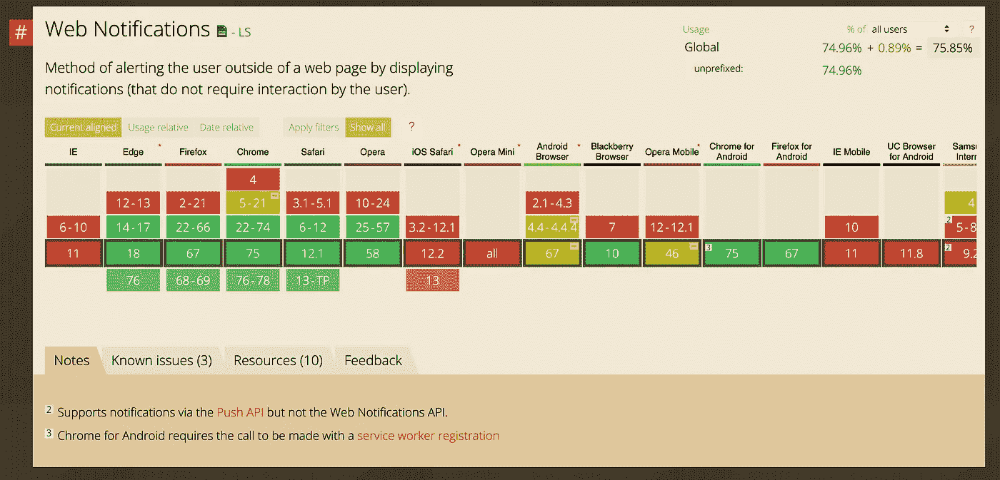

# 您需要了解的关于 PWAs 的一切—推送通知

> 原文：<https://betterprogramming.pub/everything-you-need-to-know-about-pwas-push-notifications-e870bb54e14f>

## 向您的应用添加推送通知，以提高用户参与度

这是一个关于[渐进式网络应用](https://en.wikipedia.org/wiki/Progressive_web_applications)的系列。如果你还不知道，请在阅读前先看看第一部分。

 [## 你需要知道的关于 PWAs 的一切

### 移动开发环境很难上手。移动开发人员之前有很多决策…

medium.com](https://medium.com/@indreklasn/everything-you-need-to-know-about-pwas-8e41a7e745aa) 

# 什么是推送通知？

通知是在用户设备上弹出的消息。通知可以由打开的应用程序在本地触发，也可以实时从服务器“推”给用户，即使应用程序没有运行。

推送通知背后的主要思想是吸引用户，让每个人都了解最新的内容或功能。例如，您可能会从中型移动应用程序获得每日通知，这些是推送通知！

[https://developers . Google . com/web/ILT/pwa/简介-推送通知](https://developers.google.com/web/ilt/pwa/introduction-to-push-notifications)

# 了解 Web 上的推送通知

大多数现代浏览器允许我们向用户推送实时通知。我们通过[通知 API](https://developer.mozilla.org/en-US/docs/Web/API/Notifications_API) 来实现这一点。

通知 API—[https://developer . Mozilla . org/en-US/docs/Web/API/Notifications _ API](https://developer.mozilla.org/en-US/docs/Web/API/Notifications_API)

# 检查许可

一旦您注册了服务人员，您将可以全局访问通知 API。首先，我们需要请求用户允许显示通知:

`[requestPermission](https://developer.mozilla.org/en-US/docs/Web/API/Notification/requestPermission)`承诺返回三个值之一:`granted`、`denied`或`default`。

注:`Safari Version 12.0.3 still uses callback to get the permission.`

注销，然后注册新的服务人员。将弹出通知提示。授予服务人员所需的访问权限。

处理通知权限

按下“允许”后，浏览器将在您的设置下保存选择。在任何给定的时间，我们可以通过设置撤销通知。请确保不要滥用通知，否则，用户将撤销权限，并且永远不会再授予它。

勇敢://设置/内容/通知？搜索=网站+设置

如果你想知道，我用的是[勇敢浏览器。](https://brave.com/)它和 Chrome 差不多，但默认情况下会屏蔽广告，而且没有追踪器。如果你没有使用基于 Chromium 的浏览器，快速搜索会告诉你如何访问通知设置。

# 我们可以如何处理通知？

我们想要的任何东西…嗯，差不多。我们发送推送通知的频率没有限制。我们试试看，发一个:

`[ServiceWorkerContainer](https://developer.mozilla.org/en-US/docs/Web/API/ServiceWorkerContainer)`接口的`.ready`只读属性提供了一种延迟代码执行的方法，直到服务工作器处于活动状态。

[https://developer . Mozilla . org/en-US/docs/Web/API/service worker container # Properties](https://developer.mozilla.org/en-US/docs/Web/API/ServiceWorkerContainer#Properties)

当我们注册新的服务人员时，我们应该会在屏幕上看到一个推送通知。

巴斯。巴斯。

这里要把用户体验放在心上。一定不要滥用这个新的超级大国！

# 检查浏览器支持

检查通知 API 支持

并非所有的浏览器都支持新的通知 API，因此我们必须确保浏览器中存在通知 API。

如果我们希望推送通知可重用并且具有更高的代码质量，只需将其提取出来即可:

现在，如果我们重新加载服务人员:

瞧啊。可重复使用的推送通知。

推送的工作原理—[https://we b-Push-book . gaunt face . com/chapter-01/02-how-Push-Works/](https://web-push-book.gauntface.com/chapter-01/02-how-push-works/)

# 浏览器支持

Web 通知 API 是一项高度实验性的技术，将来很可能会改变。尽管 API 很脆弱，但在实时交易、在线约会(新的匹配)或突发新闻等应用程序中，让用户保持最新状态是非常有用的。

[https://caniuse.com/#search=notifications](https://caniuse.com/#search=notifications)

浏览器支持大部分都有，但可能会更好*(看看你的 iOS Safari、三星浏览器和 Opera Mini)。*这个时候(2019)应该没人关心 IE。

如果你想更深入地学习推送通知，我发现 Web Push Book 是一个非常有用的地方。

[https://web-push-book.gauntface.com/](https://web-push-book.gauntface.com/)

查看关于 workbox 的[下一章](https://medium.com/@indreklasn/everything-you-need-to-know-about-pwas-workbox-de5755672fb3)以及它如何简化您的生活。

 [## 关于 PWAs，您需要了解的一切—工具箱

### 为你的渐进式网络应用添加预缓存、缓存策略、路由、后台同步将变得非常复杂…

medium.com](https://medium.com/@indreklasn/everything-you-need-to-know-about-pwas-workbox-de5755672fb3) 

## [在这里玩代码。](https://github.com/indreklasn/pwa-example/tree/part-2)

 [## indreklasn/pwa-示例

### 通过在 GitHub 上创建帐户，为 indreklasn/pwa-example 开发做出贡献。

github.com](https://github.com/indreklasn/pwa-example/tree/part-2) 

感谢阅读！❤