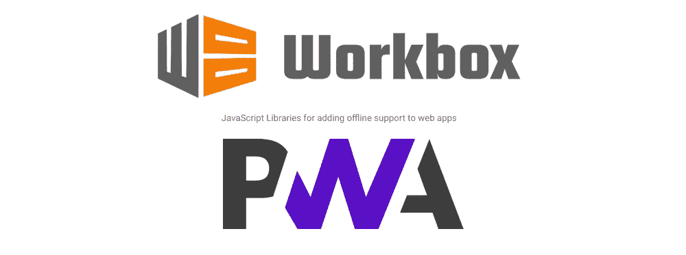
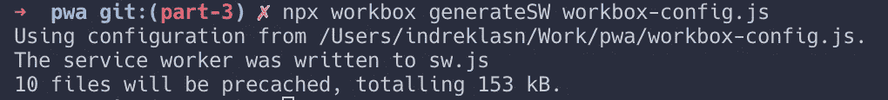
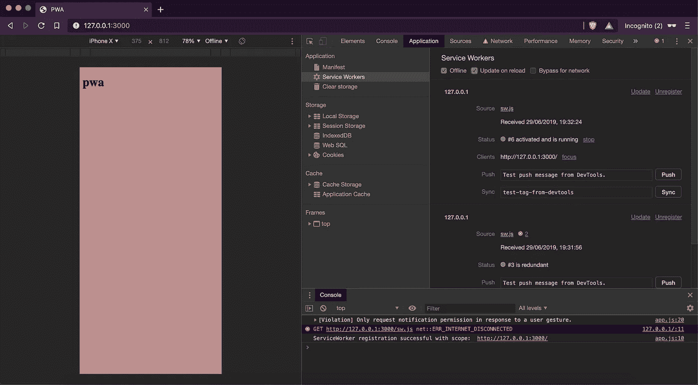
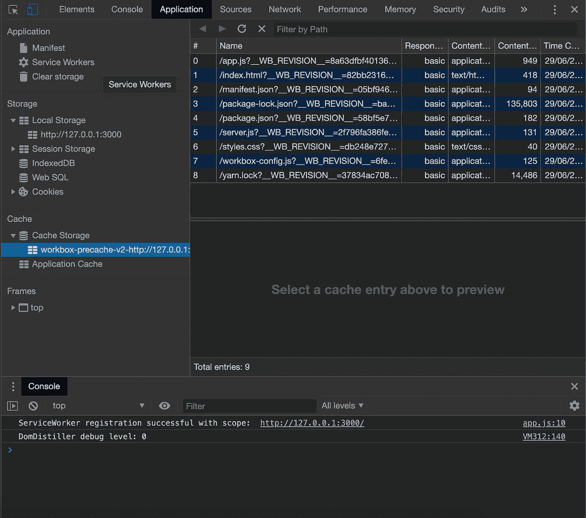
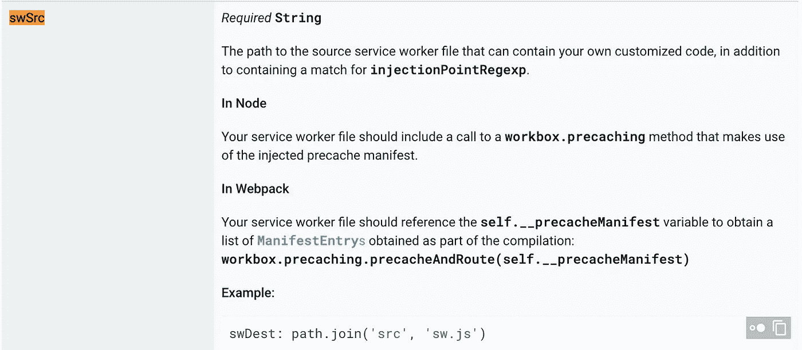
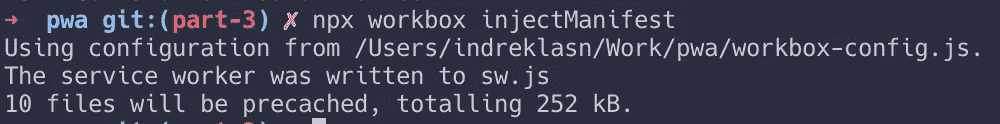
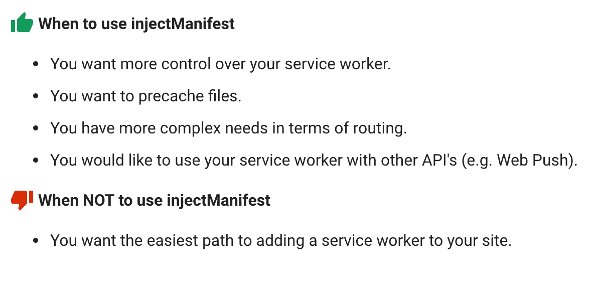
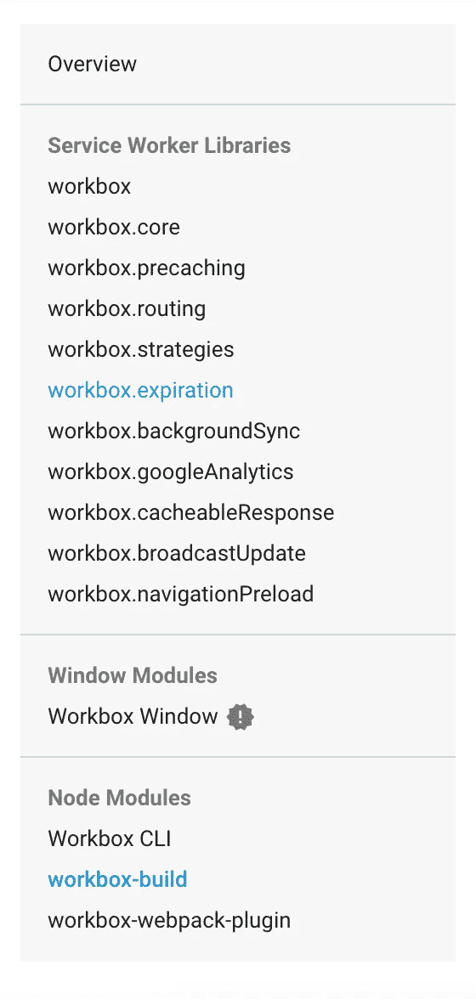

# 关于 PWAs，您需要了解的一切—工具箱

> 原文：<https://betterprogramming.pub/everything-you-need-to-know-about-pwas-workbox-de5755672fb3>

## Workbox 是一个灵活的抽象集合，让我们可以更简单地完成困难的事情



PWA 工具箱—[https://developers.google.com/web/tools/workbox/](https://developers.google.com/web/tools/workbox/)

为渐进式 web 应用程序添加预缓存、缓存策略、路由和后台同步非常复杂。

Workbox 是一个灵活的抽象集合，让我们可以更简单地完成困难的事情。

工具箱:灵活的 PWA 库(Chrome Dev Summit 2017)

简而言之， [Workbox](https://developers.google.com/web/tools/workbox/) 让我们可以轻松完成以下任务:

*   提供缓存优先的图像、HTML 和 CSS 样式来提高 web 应用程序的性能。
*   自动缓存清理和更新。
*   运行时缓存。
*   策略。
*   请求路由。
*   后台同步。

# 工具箱入门

Workbox 为我们提供了一个现成的方便的命令行工具。

```
yarn add workbox-cli
```

有了 CLI 后，运行向导。输入应用程序的相对路径。

```
npx workbox wizard
```


运行工具箱向导

您应该会看到一个新文件`workbox-config.js` 出现在项目的根目录下。

配置文件定义了我们的根目录、要缓存的文件以及我们的`sw.js`的位置。

# 生成服务人员文件



正在生成服务工作者文件

```
npx workbox generateSW workbox-config.js
```

您应该会看到`sw.js`文件出现，看起来可能像这样:

这是一个很长的文件，但基本上，它会安装`workbox`并告诉浏览器要缓存哪些文件。

您可以删除`service-worker.js`文件，并注册我们的新服务人员— `sw.js`。

如果我们重新启动并打开我们的浏览器，我们应该有离线支持，缓存和获取缓存资产现在启用。



工具箱 PWA

点击离线框，尝试刷新。如果您检查`Cache Storage`选项卡，您应该会看到存储在缓存中的所有内容。魔法*！*



工具箱预车

到目前为止，我们不能修改生成的文件，因为一旦我们重新生成服务工作者文件，我们所做的任何更改都将被覆盖。

如果你想修改`sw.js`，你可以这样做:

用以下内容创建一个名为`src-sw.js`的新文件。`src-sw.js`文件的内容将被注入到`sw.js`文件中。

告诉原`sw.js`文件`src-sw.js`所在的位置。



**国投国投**地产

最后，运行命令:

```
npx workbox injectManifest
```



现在我们应该看到`console.log`出现在`sw.js`文件中。


将选项注入 sw.js 文件



**何时使用** [**注射清单**](https://developers.google.com/web/tools/workbox/modules/workbox-build)

Workbox 可以做更多的事情。请阅读文档以尝试不同的功能。



工具箱完整文档—[https://developers . Google . com/web/tools/work box/modules/work box-SW](https://developers.google.com/web/tools/workbox/modules/workbox-sw)

# 从这里去哪里？

我强烈推荐建筑材料。构建东西是迄今为止擅长做事情的最好方式，[这里有一个需要构建的有趣应用的列表](https://medium.com/better-programming/the-secret-to-being-a-top-developer-is-building-things-heres-a-list-of-fun-apps-to-build-aac61ac0736c?source=---------2------------------)。

如果你想深入了解渐进式 web 应用程序，我建议你通读一下“ [*构建渐进式 Web 应用程序:将本机的力量带入浏览器*](https://amzn.to/2Yz7NuX) ”这本书。

# 源代码

这是本章的[源代码](https://github.com/indreklasn/pwa-example/tree/part-3)。

[](https://github.com/indreklasn/pwa-example/tree/part-3) [## indreklasn/pwa-示例

### 通过在 GitHub 上创建帐户，为 indreklasn/pwa-example 开发做出贡献。

github.com](https://github.com/indreklasn/pwa-example/tree/part-3) 

感谢阅读！