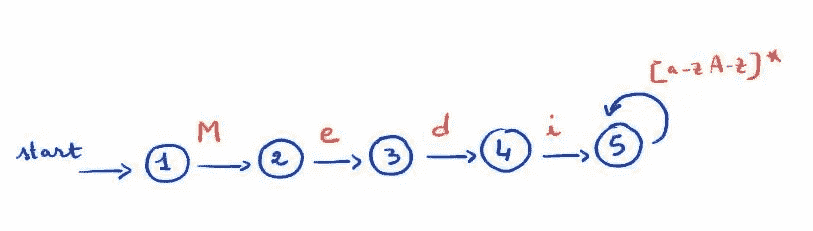
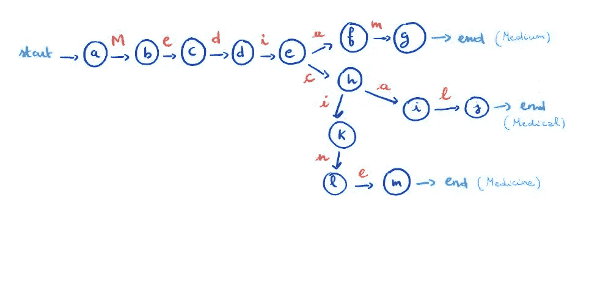

# 关于 JavaScript 中的正则表达式，你需要知道的一切

> 原文：<https://betterprogramming.pub/everything-you-need-to-know-about-regular-expressions-in-javascript-59807f758cbd>

## 这个详细的指南应该可以回答你所有的正则表达式问题

照片由[工作拯救者](https://unsplash.com/@jobsavelsberg?utm_source=medium&utm_medium=referral)在 [Unsplash](https://unsplash.com?utm_source=medium&utm_medium=referral) 上拍摄

正则表达式是软件开发的必需品。作为一名前端开发人员，你可以愉快地忽略它们的存在很长一段时间，但迟早你将不得不处理它们。

在本指南中，您将找到关于 JavaScript 中正则表达式的所有信息。这篇文章的结构如下:

*   你能用正则表达式做什么？
*   正则表达式是什么样子的？
*   如何在 javascript 中定义正则表达式？
*   正则表达式是如何工作的？
*   Javascript 中的 regex 语法是什么？
*   如何使用捕获和反向引用？
*   正则表达式是如何匹配的？
*   如何优化正则表达式？
*   什么时候不使用正则表达式？

# 你能用正则表达式做什么？

可以把正则表达式看作是高速的、高性能的工具，它允许您在文本中查找和替换模式。使用正则表达式:

*   您可以检查文本是否包含特定的子字符串或模式。
*   您可以找到并返回那些模式匹配。
*   您可以从文本中捕获这些子字符串。
*   您可以修改捕获的子字符串。

下面的文章列出了正则表达式在前端开发中的一些用例。

 [## 每个前端开发人员都应该知道的 6 个方便的正则表达式

### 利用正则表达式的强大功能来执行各种文本处理任务。

blog.bitsrc.io](https://blog.bitsrc.io/6-handy-regular-expressions-every-front-end-developer-should-know-ac9e0c514b71) 

大多数高级语言都使用正则表达式。JavaScript 的正则表达式引擎基于 Perl5 正则表达式语法。

# 正则表达式是什么样子的？

下面是一个正则表达式的例子:`/Medi[a-zA-Z]*/`

让我们试着理解它是做什么的。

这个正则表达式描述了一种以子字符串`Medi`开头的单词模式。在本例中，`Medium`、`Media`、`Medical`和`Medi`将匹配。

自己试试[这里](https://regex101.com/r/kjpTjX/1)。

*注意:如果你还没有注意到，正则表达式是区分大小写的，例如* `*medium*` *就不会匹配。*

# 如何在 JavaScript 中定义正则表达式？

正则表达式是描述字符模式的对象。在 JavaScript 中，可以用两种不同的方式定义正则表达式:

*   使用正则表达式文字，在一对斜杠`/.../`内:

`const myPattern = /Medi[a-zA-Z]*/;`

*   或者，通过构造一个`RegExp`对象的实例:

`const myPattern = new RegExp (“Medi[a-zA-Z]*”);`

两种格式都会导致在变量`myPattern`中创建相同的正则表达式。

## **选项**

除了表达式本身，正则表达式中还可以包含五个选项:

*   `i`:使正则表达式不区分大小写。例如，`/Medi[a-zA-Z]*/i`将匹配所有情况。
*   `g`:匹配模式的所有出现。当没有指定`g`时，正则表达式将只匹配第一个匹配项。
*   `m`:允许多行文本匹配。
*   `y`:启用粘性匹配；正则表达式通过尝试从最后一个匹配位置开始匹配来尝试字符串中的粘性匹配。
*   `u`:允许使用 Unicode 点转义`\u…`。

当使用`RexExp`对象时，这些选项可以作为参数传递。例如:

`const myPattern = new RegExp (“Medi[a-zA-Z]*”, "ig");`

这相当于:

`const myPattern = /Medi[a-zA-Z]*/ig;`

# 正则表达式是如何工作的？

下面是简短的回答。可以把正则表达式想象成一个迷你程序，它描述一个模式并告诉机器要寻找什么。考虑到这一点，您应该不会感到惊讶:

*   正则表达式定义了一组指令。在我们的例子中:“首先找到大写字母`M`，然后找到小写字母`i`，…等等”
*   正则表达式有一个输入(您试图搜索或替换的文本)，并可以输出您试图匹配的子集；
*   正则表达式有一个语法，它们可以被编译、执行，甚至被优化以运行得更快！

向下滚动查看更长、更详细的答案！

# JavaScript 中的 Regex 语法是什么？

## **精确匹配**

任何非特殊元字符或运算符的字母数字字符都将在`regex`中匹配自身。

在我们前面的例子中，`/Medi[a-zA-Z]*/` : `M`是匹配自身的字符，与`e`、`d`、`i`相同。

将一个字符放在另一个字符之后，表明我们要寻找的是`M`，接着是`e`，接着是`d`，然后是`i`。在这样一个例子中，`Medo`将不匹配。

## **交替**

如果我们想要表达我们想要匹配`a`或`b`，我们可以使用管道操作符`|`，正则表达式将看起来像这样`/a|b/`。

## **匹配一类字符**

在许多情况下，您不会想要匹配一个精确的字符，而是一个有限字符集中的一个字符。`set`操作符允许我们这样做。

一个`[abc]`字符集将匹配该集中的任何字符`a`或`b`或`c`。如果我们在括号后面添加一个`^`，集合`[^abc]`将匹配除`a`、`b`和`c`之外的任何字符。

在我们前面的例子中，`/Medi[a-zA-Z]*/` : `[a-zA-Z]`是一个字符类，它匹配从`a`到`z`小写或大写的任何字符。

我们可以写`[abcdefghijklmnopqrstuvwxyzABCDEFGHIJKLMNOPQRSTUVWXYZ]`，但是使用破折号操作符`-`，来自`a through z`或`A through Z`的任何字符，包括包含性和字典顺序，都将被匹配。

## **逃逸**

并非正则表达式中的所有字符都代表它们自己。在我们前面的例子中，`/Medi[a-zA-Z]*/` : `*`是一个量词，它匹配集合`[a-zA-Z]`中的一个字符，匹配次数在零到无限之间——尽可能多。

我们如何指定我们想要匹配文字`*`？

在 regex 中，当您想要指定一个文字字符时，可以使用反斜杠字符`\`对其进行转义。如果要匹配`*`，需要将`\*`指定给正则表达式。如果要匹配文字反斜杠，需要指定`\\`。

## **开始和结束**

在某些情况下，您可能希望确保模式匹配字符串的开头。如果我们回到前面的例子，`/Medi[a-zA-Z]*/`，`zdMedium`也是匹配的。如果我们想确保匹配以`Medi`开始，我们所要做的就是在正则表达式的开头添加一个`^`，就像这样:`/^Medi[a-zA-Z]*/`

类似地，美元符号`$`表示模式必须出现在字符串的末尾。

## **量词**

如果我们想匹配两个`m`字符的序列，我们可以写`/mm/`。正则表达式允许我们指定匹配特定模式的次数。

例如，`/m{2}/`表示两个连续字符的匹配。

如上所述，在我们的例子中`/Medi[a-zA-Z]*/` : `*`表示我们将尽可能多地匹配集合`[a-zA-Z]`中的任何字符。

## **预定义的字符类**

一些字符类已经被预定义。例如，我们可能需要匹配数字。因此，预定义的`\d`类将匹配任何十进制数字——这相当于`[0-9].`

其他例子包括用于水平制表符的`\t`和用于匹配换行符的`\n`。

你可以在 Mozilla 的本指南中找到预定义字符类的备忘单。

# 如何使用捕获和反向引用

当括号将正则表达式的一部分括起来时，它会创建一个捕获。

假设我们想要匹配一个 HTML 标签，我们可以使用如下所示的正则表达式:`/<([a-z]\w*)\b[^>]*>/`

我们来分解一下。

*   HTML 标签以字符`<`开始，以`>`结束。
*   `[a-z]`将匹配任何小写字母字符。
*   `\w*`将匹配任何字母数字字符，包括下划线。
*   `\b`在单词边界断言位置。
*   `[^>]*`匹配除`>`以外的任何字符。

这个正则表达式将匹配:`
, , <something>, etc`

在这个例子中，我们捕获标记的名称`([a-z]\w*)`，正则表达式的这个部分将匹配它。比如`div`、`span`、`something`。

自己试试[这里](https://regex101.com/r/Bkfkjk/2)。

例如，假设我们希望正则表达式匹配一个正确的 HTML 元素，它以一个标签开始，以同一个标签结束:`
something
`。

在这种情况下，我们希望能够引用我们之前捕获的标签。反向引用的符号是反斜杠，后跟要引用的捕获的编号:`\1`。

在我们的例子中，我们只有一个捕获。为了匹配一个完整的 HTML 元素，正则表达式应该是这样的:`/<([a-z]\w*)\b[^>]*>.*?<\/\1>/`。

乍一看，这似乎令人困惑，但让我们来分解一下:

*   `.*?`将匹配任何字符，除了行终止符。
*   `<\/\1>`将匹配一个结束 HTML 标签:`<`匹配其文字本身，`\/`匹配一个`/`字符。`\1`指回我们的捕获，`>`再次匹配它的字面自我。

这个正则表达式将匹配以下字符串:`
 <i>something</i> 
`、`my span`等。

像`
 something</other>`这样的字符串不会匹配。

没有反向引用，我们将无法匹配一个简单的 HTML 元素。

# 正则表达式是如何匹配的？

JavaScript 正则表达式引擎使用名为*非确定有限自动机*的模式匹配引擎。有限自动机(FA)是一种用于接受或拒绝符号串的计算模型。

简而言之，FA 由一组有限的状态组成，状态之间可能存在转换。在评估输入字符串时，引擎将通过评估和转换每个阶段来尝试匹配引擎的每个字符，直到到达结尾。

让我们回到第一个例子:`/Medi[a-zA-Z]*/`。如果我们将其表示为 FA 图，它看起来会像这样:

`/Medi[a-zA-Z]*/`的 FA

让我们看另一个例子。假设我们有下面的正则表达式:`/Medi(um|cal|cine)/`。FA 将会是这样的:

`/Medi(um|cal|cine)/`的 FA

如果你用`Medium`或`Medical`或`Medicine`测试这个正则表达式，它将遵循其中一个路径。然而，例如，如果正则表达式正在检查输入`Medicinal`，它将首先将`M`、`e`、`d`、`i`与状态`e`进行匹配，然后它将匹配`c`并转换到状态`k`，然后是`l`。

我们现在在`Medicin`，下一个字母是`a`并且自动机不匹配，所以我们不能转换到状态`m`。自动机将返回到状态`h`并尝试匹配另一条路径。那里不可能有匹配的。它将返回到状态`e`，在那里不可能匹配。那么它就会失败。

FA 被称为非确定性，因为当试图匹配给定输入(例如`Medicinal`)上的正则表达式时，输入字符串中的每个字符可能会被自动机的不同阶段检查几次。

# 如何优化正则表达式？

即使在上面的简单示例中，您也看到了引擎在声明输入不匹配之前必须回溯几次。

优化正则表达式的一个重要部分是最小化引擎的回溯量。正如我们所见，引擎确定输入不匹配比确定成功匹配花费的时间更长。我们越早抛弃不匹配的输入越好。

这里有一个著名的坏正则表达式的例子:`/^(\w+\s?)*$/`。在这个例子中，我们试图用可选的空格字符`\s?`来匹配单词`\w+`。如果您尝试将它与这个字符串:`this will not cause catastrophic back tracking`进行匹配，引擎将需要 26 个步骤来声明它是匹配的。然而，如果您试图评估下面的输入:`this will cause catastrophic back tracking`，它将导致太多的回溯，可能需要使用 100%的 CPU。如果在浏览器中完成，用户界面将冻结，浏览器可能会重新加载页面。都是因为搞清楚`.`不见了太多步骤。

为了优化正则表达式，请记住以下几点。

## 明智地使用交替

像`/(A|B|C)/`这样的正则表达式以慢著称，当然，考虑到`A`、`B`和`C`是正则表达式中需要回溯的复杂部分。

在某些情况下，交替可以简化。不用写`/(abc|abba)/`，在这种情况下`abc`和`abba`并不互斥，正则表达式可以简化成这样:`/ab(c|ba)/`。这个正则表达式更快，因为引擎会尝试匹配`ab`，如果不匹配就不会回溯。

## **如果您打算使用**中的文本，请仅捕获组

捕获是 regex 的一个强大特性，但是如果您不打算使用提取的文本，就没有必要使用它们。

在前面的例子中，我们不需要捕获`c`或`ba`。我们可以把它变成一个非捕获组，如下:`/ab(?:c|ba)/`

## **优化贪婪量词**

像`*`或`+`这样的贪婪量词会首先尝试匹配输入字符串中尽可能多的字符，即使这意味着输入字符串中没有足够的字符来匹配正则表达式的其余部分。如果发生这种情况，贪婪量词将回溯，返回字符，直到找到一个整体匹配或直到没有更多的字符。

另一方面，惰性量词会首先尝试匹配输入字符串中尽可能少的字符。

在很多情况下，贪婪量词很容易被懒惰量词取代。假设你想优化像`Med.*m`这样的正则表达式的一部分。

如果字符`m`位于输入字符串末尾附近，最好使用贪婪量词`*`。如果字符位于输入字符串的开头附近，最好使用惰性量词`*?`并将子表达式改为`Med.*?m`。

## **具体一点**

写正则表达式的时候，越具体越好。尽量少用像`.*`这样的子表达式，因为它们会导致引擎大量回溯——特别是当表达式的其余部分与输入字符串不匹配时。

作为替代，您应该使用更具体的字符类。这让您可以更好地控制`*`将导致正则表达式引擎消耗多少字符，让您能够停止过多的回溯。

# 何时不使用正则表达式

正则表达式通常用于验证用户的输入，但它们经常会导致糟糕的用户体验——尤其是当程序员对用户输入做出假设时。

作为用户，我经常面临的一个问题是严格的电子邮件验证。一些表单希望电子邮件不包含`+`符号。一些表单希望用户的姓名或电话号码限于某些字符。这种验证是没有用的，最终会让你的用户感到沮丧。

在某些情况下，正则表达式可能会很昂贵并且难以维护。当我使用`[fluentld](https://www.fluentd.org/)`解析一些数据库日志时，我已经亲身体验过了。当日志不如预期并且正则表达式无法匹配时，那个`fluentld`容器定期达到 100% CPU。每当容器停止工作时，我都需要尝试理解我几个月前编写的复杂正则表达式。

如果你发现自己花了很多时间解析大文本，[你可能想考虑写一个解析器](https://wiki.haskell.org/Parsing_expressions_and_statements)

# 进一步阅读

*   [https://javascript.info/regular-expressions](https://javascript.info/regular-expressions)
*   [https://www.regular-expressions.info/catastrophic.html](https://www.regular-expressions.info/catastrophic.html)
*   [https://swtch.com/~rsc/regexp/regexp1.html](https://swtch.com/~rsc/regexp/regexp1.html)
*   [https://www.rexegg.com/regex-explosive-quantifiers.html](https://www.rexegg.com/regex-explosive-quantifiers.html)
*   [https://developer . Mozilla . org/en-US/docs/Web/JavaScript/Guide/Regular _ Expressions/cheat sheet](https://developer.mozilla.org/en-US/docs/Web/JavaScript/Guide/Regular_Expressions/Cheatsheet)