# 关于 Python 中正则表达式你需要知道的一切

> 原文：<https://betterprogramming.pub/everything-you-need-to-know-about-regular-expressions-in-python-bbf96939b15>

## 如何成为 Regex 的巫师


作者创造的形象。来自[像素](https://pixabay.com/pt/users/pexels-2286921/?utm_source=link-attribution&utm_medium=referral&utm_campaign=image&utm_content=1841550)在[像素](https://pixabay.com/pt/?utm_source=link-attribution&utm_medium=referral&utm_campaign=image&utm_content=1841550)的背景图片

亲爱的程序员和软件开发爱好者们。让我们面对一个事实:正则表达式是可怕的。太可怕了。为什么？我听到你问了。

因为它是一系列的字符和符号(对于未经训练的人来说)看起来就像试图在外语街上阅读招牌一样令人生畏。简而言之，这使得术语“正则表达式”或 *Regex* 变得有点讽刺。

我不惜一切代价避免使用 regex，而且用了比我愿意承认的时间长得多的时间。但是有一天，我决定是时候学会使用它了。

正则表达式是程序员旅程中极其重要的一部分。它是一个你需要放在你的实用腰带上的工具，它可以把你从痛苦的长时间编写不必要的代码中解救出来。

所以，我一头扎进了神秘的 regex 世界。我已经预料到这很难，但是一旦我理解了基本概念，前进的道路就相当简单了。

我意识到这就像学习任何其他语言一样:一旦你理解了单词和语法，把句子串起来就成了第二天性。

从最基本的意义上来说，正则表达式是一系列搜索模式的字符。这些字符序列是 [*正则语言*](https://en.wikipedia.org/wiki/Regular_language) 的实例，最常用于文本解析或任何类型的字符串输入验证。

想象一张由特定形状切割而成的纸板。只有与切口完全匹配的形状才能通过。纸板薄板相当于一个正则表达式字符串。

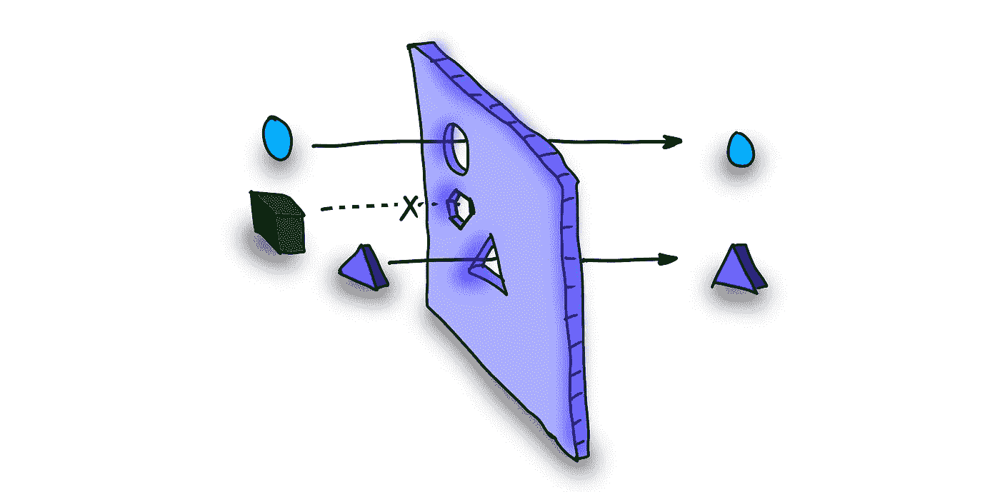

作者图片

这样的正则表达式搜索模式会是什么样子呢？

```
**Regex:** circle|triangle|hexagon
```

**输入语句:**三个进来的形状是圆形、三角形和矩形。

正则表达式引擎将只匹配单词`circle`和`triangle`。你也可以试试[这里](https://regex101.com/r/20qASm/1)。

简单不是吗！

重要的是要知道正则表达式模式本身是正则语言的一部分。然而，我们今天使用的大多数编程语言都支持正则表达式，并有内置的(或可下载的)模块。

这允许我们在我们选择的语言中使用它们。除了这篇文章中到处散布的 [regex101](https://regex101.com/) 链接，我将在这篇文章的所有代码中使用 Python regex 模块`[re](https://docs.python.org/3/library/re.html)`。

那么，在代码的世界里，你如何创造这种隐喻性的纸板呢？让我们来看一个例子。

你有一串“西尔维 20 岁了。”而你想从这句话里只提取年龄。这里你需要的只是数字。这里的正则表达式模式是`\d`，这是一个特殊的字符，它匹配只有数字的模式(我们将在后面讨论模式的细节)。

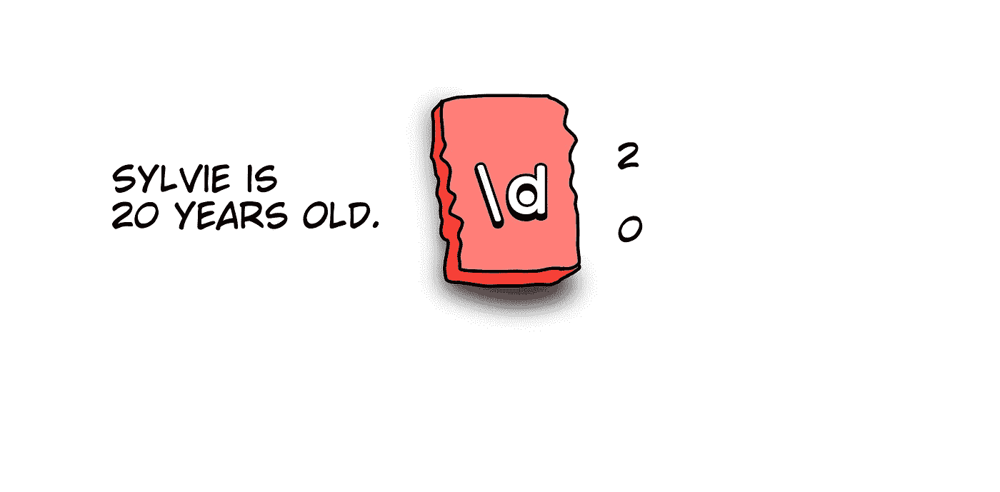

作者图片

输出是:

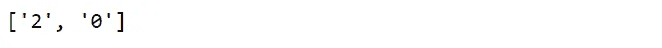

不完全是我们想要的，但我们更近了一步。至少我们识别出了数字！我们的红色纸板切割块作为一个数字标识符。

根据需求，它可以从实际的字母字符(例如，regex `a`是一个有效的表达式，它将在字符串输入中搜索`a`)到一组特殊字符。我们稍后会看到很多这样的例子。

但是我们需要的不是单个的数字，而是整个数字。让我们用另一个块以某种方式修改标识符。

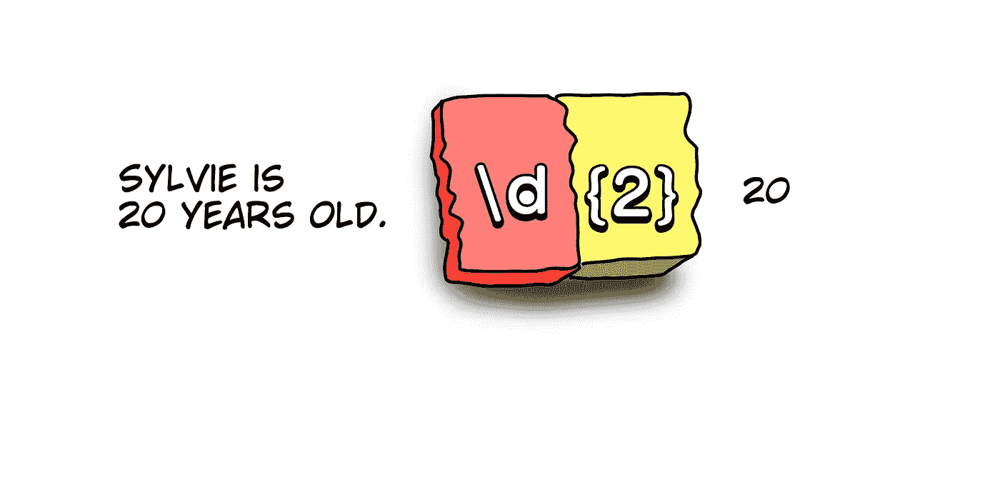

作者图片

这给出了:

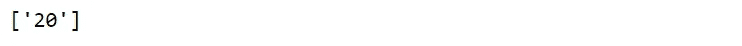

耶！我们从绳子上知道了西尔维的年龄！但是等等，如果出生年份也在字符串中呢？如果我们使用上面的表达式，它将给出句子中所有的 2 位数集合。

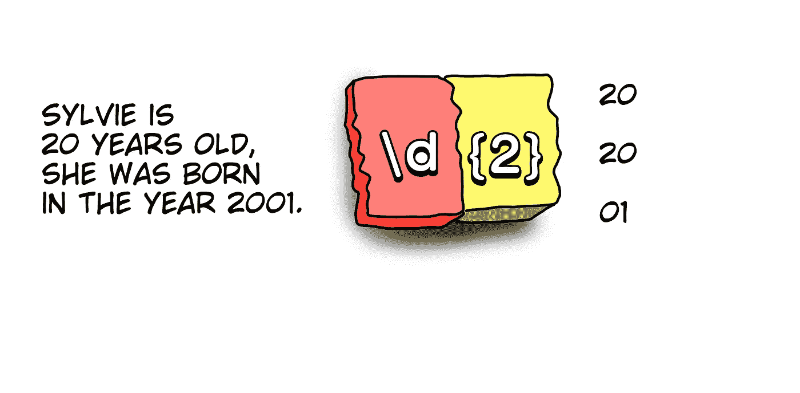

作者图片

我们不希望这样，因此让我们修改它多一点。我们能做什么？

添加一个边界表达式，因为我们想要的两位数两边都有空格。

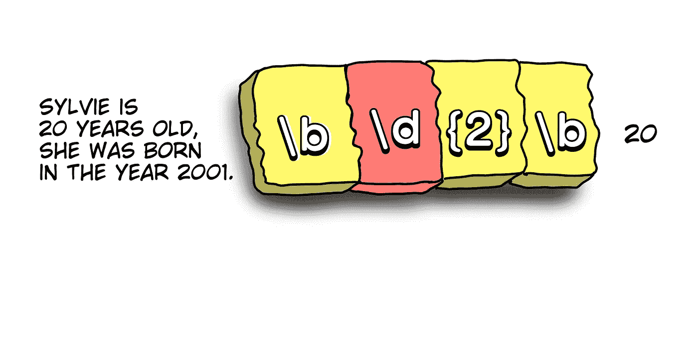

作者图片

Tada！：


我们现在得到了我们所需要的，即使字符串中还有另外一个 4 位数。只是为了好玩，您可以在这里查看上面的正则表达式字符串:

没有边界→ [试试](https://regex101.com/r/6NQrVh/1)

有边界→ [此处](https://regex101.com/r/f2JlO3/1)

很漂亮吧？通过一行代码，我们可以从字符串中提取数字。

现在，我们已经讨论过，在我们的*代码纸板*中，我们需要使用一堆字符来创建这些*虚拟剪裁*。让我们看看它们是什么。

# 特性

*   **\ d**:0 到 9 之间的任意数字
*   **\D** :数字以外的任何东西
*   **\s** :空格
*   除了空格以外的任何东西
*   **\w** :任意字符
*   除了字符以外的任何东西
*   **\b** :墙壁周围的边界空白
*   **。**:匹配任意字符( [**试试**](https://regex101.com/r/8MHf23/1) )
*   **\。:**匹配一个句点

# 修饰语

*   **{}:** 分组数量，像`\d{3}`给出 3 位数对， `\d{3,5}`给出 3 到 5 位数对。总的来说，就是`{min, max}`
*   **[]:** 字符分组。它将匹配括号内容中的单个字符。Like `[a-z]`将匹配小写字母中的每个字符。
*   **+:** 匹配它之前的元素一次或多次，像`[a-z]+a` 会给出分组后的匹配结果，如下图[**此处**](https://regex101.com/r/mWajBz/1)
*   **？:**匹配它之前的元素零次或一次，看`[a-z]?a` [**如何工作**](https://regex101.com/r/crYTcV/1)
*   ***:** 匹配它之前的元素零次或多次。参见`[a-z]*a` [**这里的**](https://regex101.com/r/FuBwxr/1)
*   **$:** 表示行尾
*   **^:** 表示生产线的开始
*   **|:** Or 运算符。例如 **col(o|u)r** 将匹配单词 color 的美式和英式拼写。

这些是最常见的，在本文和大多数用例中会派上用场。然而，可以在[这里](https://www.rexegg.com/regex-quickstart.html)找到一个包含更多角色类别的备忘单。

除了了解这些字符之外，理解正则表达式引擎如何工作的一些基础知识也是有意义的。如果复杂的正则表达式出现意外结果，这将节省您大量的猜测时间。

# 正则表达式是如何工作的

有两种类型的正则表达式引擎:文本导向引擎和正则表达式导向引擎，后者是最流行的一种。很有可能你用的是同一个。我们可以用 python 做一个简单的测试来检查我们使用的是哪种类型:

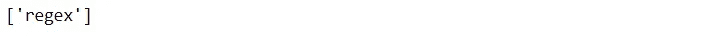

输出是`regex`，这意味着我们正在使用 regex 导向的引擎。为什么这很重要？因为在这个引擎中实现了某些重要的特性，比如懒惰量词和反向引用。

此外，重要的是要知道，这个引擎从左到右*(这也是上述例子的工作方式)。这个例子将会更加清楚。*

*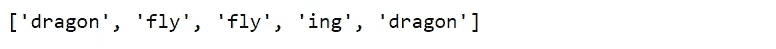*

*很明显匹配是从左到右的。从长远来看，了解这些基本知识肯定会对你有所帮助。*

*有了这些知识，我们现在可以尝试使用一些新技能。那么 regex 有哪些用途呢？一些用途包括:*

*   *解析文本、日志、web 数据等输入。*
*   *输入验证*
*   *测试输出结果*
*   *搜索文本*
*   *数据重组*

*但是，一如既往，用例子学起来更容易。既然我们已经知道了如何使用 regex，并且其中的所有字符都已经不再神秘，那么让我们看三个具体的例子，看看如何用几行代码自己使用它。*

# *例 1。验证电子邮件条目*

*在任何 regex 教程中，您都会发现这个例子是默认的。它就像正则表达式的“Hello World ”,因此我将把它包含在这里。它帮助我们验证输入的电子邮件地址格式。你可以自己试试这个简单的例子。*

*让我们一步一步地解决这个问题。首先，我们知道有效的电子邮件地址应该是什么样的(大多数情况下):*

```
*someone@mailservice.domain*
```

*用户或`someone` 通常由字母或数字的组合组成。有时也可能有特殊字符，但是对于 regex 的初学者，我们可以考虑一个简单的例子。*

*所以我们有从 A 到 Z 的字符，允许大写，这意味着 A 到 Z，还有数字 0 到 9。该组的正则表达式将如下所示:*

```
*[a-zA-Z0–9]*
```

*类似的，邮件服务一般都是字母的像 Gmail，gmx，Hotmail 等。，后跟一个@符号。因此:*

```
*@[a-zA-Z]*
```

*最后，让我们考虑一下最受欢迎的域名——com、net、edu 和 org，它们跟在邮件服务提供商后面的句点字符后面。*

```
*\.(com|net|edu|org)*
```

*如果我们把这些放在一起，我们就有了正则表达式:*

```
*[a-zA-Z0–9]+@[a-zA-Z]+\.(com|net|org|edu)*
```

*现在让我们在一个 python 脚本中使用它，该脚本接受一个输入电子邮件 id 并验证它是否符合格式要求。*

*输出如下所示:*

*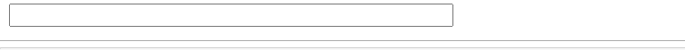*

*作者截屏*

*这就是你自己的电子邮件 id 验证器！*

# *例 2。从文本中获取姓名和年龄*

*我们已经在本文开头的简化示例中看到了如何从字符串中获取年龄。让我们看一个例子，在这个例子中，我们可以提取姓名和文本，并将它们放入字典中。*

*我们现在已经明白，如何使用正则表达式`\b\d{2}\b`从字符串中提取一个 2 位数。在这个例子中的文本的情况下，我们考虑 2 或 3 个数字(因为也有一个百岁老人)。*

*至于在这篇文章中得到的名字，我们看到每个人都有一个超过 3 个字母的名字。因此，长度为 3 或更长的大写字符串组应该可以工作:*

```
*\b[A-z][a-z]{3,}\b*
```

*对于在字典中找到与年龄相匹配的名字的最后一部分，简单的英语语法规则应该可以做到——在句子结构中，我们总是在名字后面说年龄。*

*输出:*

*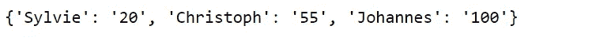*

*当然，随着输入文本变得更加复杂，我们需要智能地提取更多的信息，我们将不得不使用更多的正则表达式。然而，我可以肯定地说，即使在复杂的情况下，你肯定会在某种程度上使用正则表达式来简化。*

# ***例 3。密码模式匹配***

*当您准备创建新密码时，大多数人一定对这句话很熟悉:*

**“您的密码必须包含至少 8 个字符，至少一个大写字母、一个小写字母、一个数字和一个符号，以确保高度安全”**

*想过如何做到这一点吗？又是 Regex。这个例子比我们到目前为止看到的要复杂一点，涉及到 regex 中的一些概念，我会在后面解释。有了这些，你也可以构建一个简单的版本！*

*根据我们目前所了解的情况，至少有一部分是简单明了的。我们需要字符(大写和小写)— `**A-Z**`和`**a-z**`，数字— `**\d**`和特殊符号— `**_@$!%*?&**` ，所有这些加起来超过 8:*

```
*[A-Za-z\d_@$!%*?&]{8,}*
```

*这将为您提供包含上述*任何*字符的所有内容的匹配。*

*例如，`asdf@1234`即使没有大写字母也是有效的密码— [**试试**](https://regex101.com/r/TiW8wh/1) **。***

*我们需要一些方法来预测未来，并从每个组中匹配至少一个结果。进入*正则表达式环视。环视匹配字符，但不给出实际的匹配。相反，它们返回一个二元结果:要么匹配，要么不匹配。因此，它们实际上是*的断言*。**

*正则表达式环视有两种类型:*

## ***向前看***

*   *积极前瞻:这是通过使用字符**实现的？=** 在字符串中。例如，`xyz(?=abc)`会在每一个`xyz`的*前面*查找是否有`abc`，遇到一个才匹配( [**试试这里**](https://regex101.com/r/e0PFEM/1) )。*
*   *消极前瞻:与上面类似，这个断言**？！**在上面的否定中。在这种情况下，`xyz(?!abc)`将*提前查看每个`xyz`的*以检查是否没有`abc`并相应地给出匹配( [**尝试此处**](https://regex101.com/r/dqPnnk/1) )。*

## ***看后面***

*   *正面向后看:在这种情况下，正则表达式引擎将暂时向后工作。正则表达式`(?<=abc)xyz`将搜索以`abc`开头的每个`xyz`，即从右到左( [**尝试此处**](https://regex101.com/r/M1MUcs/1) )*
*   *后面的否定看起来与上面类似，在这种情况下，`(?<!abc)xyz`将搜索每一个`xyz`*`abc`**前面没有的，即从右到左([](https://regex101.com/r/5KV5F2/1)**)******

******有了这些概念，我们可以为密码问题的下一部分构建正则表达式。在这种情况下，积极的前瞻对我们最有用。******

******让我们来分解一下。我们需要大写字母来匹配未来。******

******`(?=[A-Z])`将匹配大写字母并给出多个匹配，只要它遇到它们。由于我们需要在字符串的任何位置都有一个匹配，我们将其修改为:`(?=.*[A-Z])`******

******同样，对于******

*   ******小写字母:`(?=.*[a-z])`******
*   ******数字:`(?=.*\d)`******
*   ******特殊字符:`(?=.*_@$!%*?&)`******

******让我们将所有这些放在开始和结束行标识符之间(分别为^和美元):******

```
******^(?=.*[a-z])(?=.*[A-Z])(?=.*\d)(?=.*[@$!%*?&])[A-Za-z\d@$!%*?&]{8,}$******
```

******比看起来更容易理解，对吗？现在让我们使用这个正则表达式实现一个简单的密码强度检查工具。******

******输出如下所示(密码为 *abcABC@1234* 和 *abcABC1234* ):******

******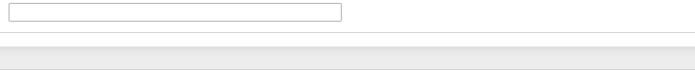******

******作者截屏******

******你自己的密码强度检查器！******

******我希望您喜欢从这篇文章中学习。和往常一样，正则表达式的世界比本文解释的要复杂得多。不过，这应该会让你有一个很好的开始，很快你就会成为一名巫师！学习正则表达式的更多参考是[这里](https://docs.python.org/3/library/re.html):******

******如果你喜欢这篇文章，你可能也会喜欢我的其他编程帖子，如下所示:******

*   ******[你绝对应该知道的完美 Pythonic Python 素材](https://towardsdatascience.com/perfectly-pythonic-python-stuff-that-you-should-definitely-know-daa559528d58)******
*   ******[每个数据分析师都应该知道的出色 AWS-Quicksight 视觉效果](https://towardsdatascience.com/awesome-aws-quicksight-visuals-every-data-analyst-should-know-e4e9302b2711)******

******感谢阅读！******