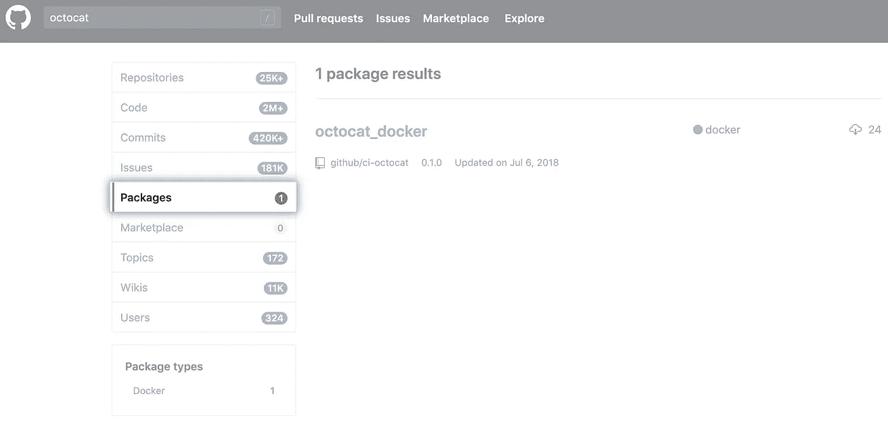
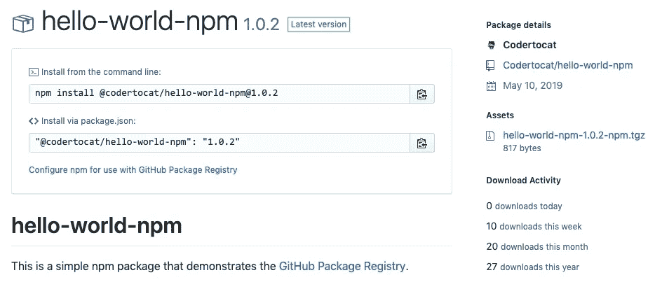
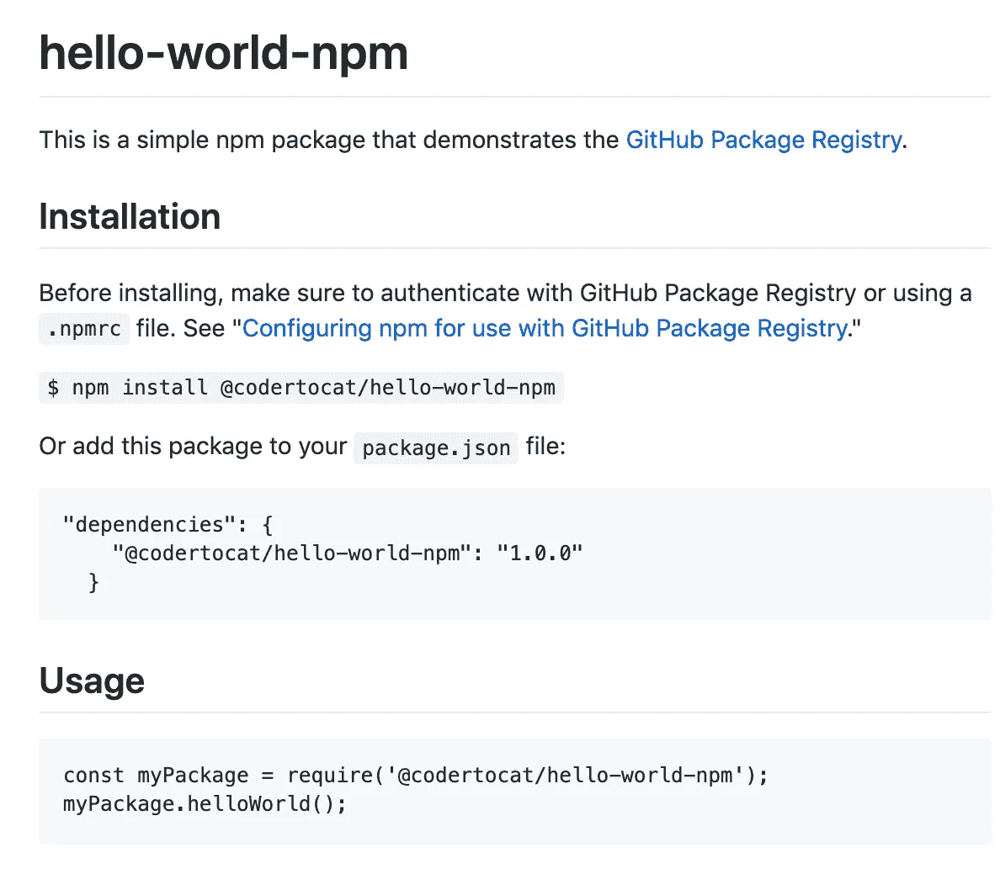
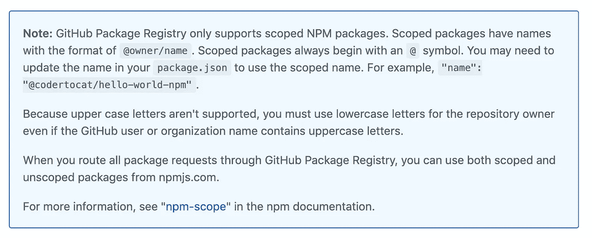
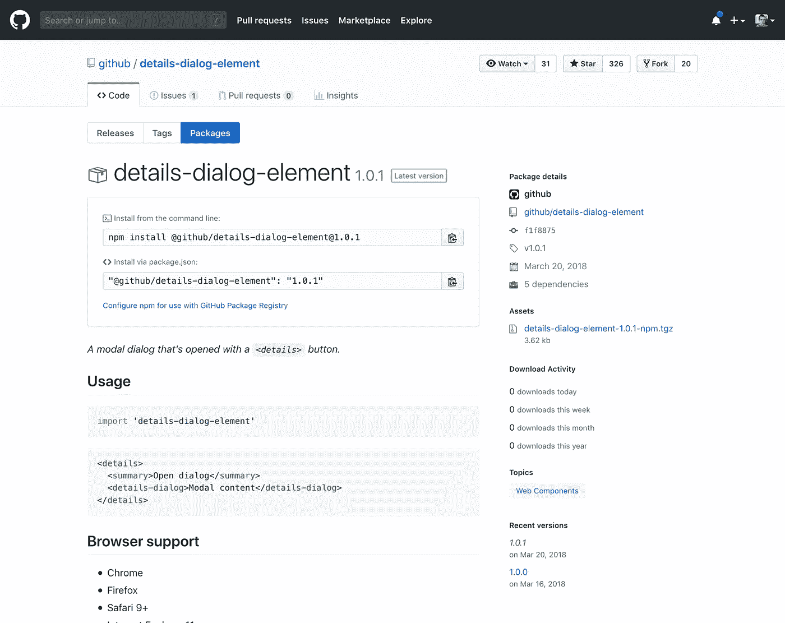

# 关于 GitHub 包注册表你需要知道的一切

> 原文：<https://betterprogramming.pub/everything-you-need-to-know-about-the-github-package-registry-b6e91c321bfd>

## GitHub 正在推出他们自己的软件包注册表

GitHub 正在接受软件包注册的早期用户

GitHub 为一群用户打开了测试他们的包注册表的大门。但是 GitHub 包注册中心到底是什么，它和其他包注册中心有什么区别，比如 npm？

GitHub Package Registry 是一个软件包托管服务，类似于 npmjs.org、rubygems.org 或 hub.docker.com，它允许你在一个地方托管你的软件包和代码。您可以私下或公开托管软件包，并在您的项目中将它们用作依赖项。

Github 包选项卡

GitHub 包注册表允许你在一个地方开发你的代码和托管你的包。您可以使用 GitHub 包注册表中的包作为 GitHub 上源代码的依赖项。

GitHub 使用存储库中的 README 来生成软件包的描述，您可以编辑它来反映软件包或安装过程的细节。GitHub 为每个包版本添加元数据，包括到作者、存储库、提交 SHA、版本标签和日期的链接。要查看示例注册表包页面，请参见[@ coder tocat/hello-world-NPM](https://github.com/Codertocat/hello-world-npm/packages/10696?version=1.0.1)包。

[hello-world-npm 包](https://github.com/Codertocat/hello-world-npm/packages/10696?version=1.0.1)

要安装该软件包，请遵循以下说明。

如果你是 beta 计划的一部分，你可以看到软件包出现在你的 GitHub 个人资料中。你也可以在 GitHub 上发布包。

Github 上的新包标签

# 发布包

您可以使用项目中的本地`.npmrc` 文件或者使用`package.json`中的`publishConfig`选项为您的项目设置范围映射。您也可以将多个包发布到同一个 GitHub 存储库中。

通过 [GitHub 帮助](https://help.github.com/en/articles/configuring-npm-for-use-with-github-package-registry#publishing-a-package)截图

您必须使用带有`read:packages`和`write:packages`作用域的个人访问令牌，通过 npm 在 GitHub 包注册表中发布和删除公共包。

当存储库是私有的时，您的个人访问令牌也必须具有`repo`范围。有关更多信息，请参见“[为命令行](https://help.github.com/en/articles/creating-a-personal-access-token-for-the-command-line/)创建个人访问令牌。”

# 包装见解

GitHub 上托管的包包括详细信息和下载统计数据，以及它们的整个历史，因此您可以确切地知道包中包含了什么。

这使得很容易找到并使用正确的包作为项目的依赖项，并增加您的信心，它只包含广告中的内容。随着对您发布的包有了更多的了解，您可以准确地理解其他人和存储库是如何使用它们的。

拥有额外的安全层对所有开发团队来说都是非常好的。当我们通过 npm 安装一个包时，我们能有多确定其中没有恶意代码？

# 加入测试版

GitHub 包注册表目前处于[有限公开测试版](https://github.com/features/package-registry/signup)。如果您试用了它，您可以让 GitHub 团队知道您是否发现了任何错误或漏洞。

更多信息请参见下面的官方软件包注册公告博客。

 [## GitHub 包注册表简介

### 今天，我们很高兴向大家介绍 GitHub 包注册，这是一个包管理服务，它使发布变得很容易…

github.blog](https://github.blog/2019-05-10-introducing-github-package-registry/)