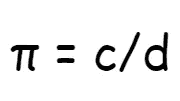
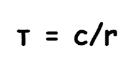

# 关于 Python 中的数学模块，您需要了解的一切

> 原文：<https://betterprogramming.pub/everything-you-need-to-know-about-the-math-module-in-python-a77a14d2d815>

## Python 数学模块的一些重要用例


照片由[乔治·贝克尔](https://www.pexels.com/@eye4dtail?utm_content=attributionCopyText&utm_medium=referral&utm_source=pexels)从[派克斯](https://www.pexels.com/photo/1-1-3-text-on-black-chalkboard-374918/?utm_content=attributionCopyText&utm_medium=referral&utm_source=pexels)拍摄

Python 中的 [math](https://docs.python.org/3/library/math.html) 模块处理数学计算。它处理许多高级数学运算，如指数、对数和三角函数。因此，对于金融、科学或数学相关的项目来说,`math`模块将会派上用场。

在引擎盖下，Python `math`模块使用由 [C 标准](https://www.iso-9899.info/wiki/The_Standard)定义的数学函数，使其高效快速。它附带了标准的 Python 版本。所以，不需要安装。

在本文中，我们将深入研究 Python `math`模块，看看它的一些最重要的用例。

```
**Table of Contents:**· [Getting Started](#671c)
· [Constants in the math Module](#0ef2)
· [Pi (π)](#3c53)
· [Euler’s Number (e)](#f0d3)
· [Tau (τ)](#9f6f)
· [Infinity](#d61d)
· [Not a Number (NaN)](#4917)
· [Arithmetic Functions in the math Module](#1521)
· [Factorial](#8032)
· [Greatest Common Divisor (GCD)](#f768)
· [Ceiling and Floor Value](#025f)
· [Absolute Value](#5152)
· [Square Root](#ba38)
· [Power Functions](#1c17)
· [Natural Exponent](#0dc7)
· [Logarithmic Functions](#a162)
· [Natural Logarithm](#04a7)
· [math.log() With a Second Argument](#cf87)
· [log2() and log10()](#01e5)
· [Trigonometric Functions](#2e25)
· [math vs cmath](#3d34)
· [Conclusion](#7f23)
· [References](#2ffe)
```

# 入门指南

正如我前面提到的，`math`模块打包在标准 Python 安装中。所以，它是一个内置的 Python 模块，要使用它，你只需要导入它。

```
>>> import math
```

打印`math`的`[type()](https://docs.python.org/3/library/functions.html)`会告诉你是一个模块。

```
>>> type(math)
<class ‘module’>
```

`[dir()](https://docs.python.org/3/library/functions.html)`将给出`math`中所有可用的属性和方法。

```
>>> dir(math)
[‘__doc__’, ‘__loader__’, ‘__name__’, ‘__package__’, ‘__spec__’, ‘acos’, ‘acosh’, ‘asin’, ‘
asinh’, ‘atan’, ‘atan2’, ‘atanh’, ‘ceil’, ‘comb’, ‘copysign’, ‘cos’, ‘cosh’, ‘degrees’, ‘di
st’, ‘e’, ‘erf’, ‘erfc’, ‘exp’, ‘expm1’, ‘fabs’, ‘factorial’, ‘floor’, ‘fmod’, ‘frexp’, ‘fs
um’, ‘gamma’, ‘gcd’, ‘hypot’, ‘inf’, ‘isclose’, ‘isfinite’, ‘isinf’, ‘isnan’, ‘isqrt’, ‘lcm
‘, ‘ldexp’, ‘lgamma’, ‘log’, ‘log10’, ‘log1p’, ‘log2’, ‘modf’, ‘nan’, ‘nextafter’, ‘perm’, 
‘pi’, ‘pow’, ‘prod’, ‘radians’, ‘remainder’, ‘sin’, ‘sinh’, ‘sqrt’, ‘tan’, ‘tanh’, ‘tau’, ‘
trunc’, ‘ulp’]
```


作者图片

# 数学模块中的常数

Python `math`模块有一组预定义的数学常数。所以每次在代码中使用这些常用的常量时，不需要硬编码它们。它确保了代码的一致性，同时也节省了时间。`math`模块中可用的常量有:

*   圆周率
*   欧拉数
*   希腊语的第十九个字母
*   无穷
*   不是数字(NaN)

# 圆周率

圆周率是圆周和直径的比值。假设一个圆的周长为 *c* ，直径为 *d* ，则:



作者的 Pi |图像公式

该值对于所有圆都是常数，并且有无限多的小数位数。圆周率的近似值是 22/7 或 3.141。

您可以使用`math`模块访问 Pi，如下所示:

```
>>> import math
>>> math.pi
3.141592653589793
```

`math.pi`总是返回一个浮点值。

```
>>> type(math.pi)
<class ‘float’>
```

# 欧拉数(e)

[欧拉数](https://en.wikipedia.org/wiki/E_(mathematical_constant))是以[自然对数](https://en.wikipedia.org/wiki/Natural_logarithm)为底的常数值。欧拉数的值也有无限个小数位，但往往近似为 2.718。

您可以按如下方式访问欧拉数:

```
>>> math.e
2.718281828459045
```

和`math.pi`一样，`math.e`也返回一个浮点值。

```
>>> type(math.e)
<class ‘float’>
```

# τ(τ)

τ是圆的周长和半径的比值。如果一个圆的周长为 *c* ，半径为 *r* ，则:



作者 Tau |图像的公式

τ和圆周率和 *e 一样，*也有无限多的小数位数。τ的值等于 2π，可以近似为 6.28。

您可以从 Python `math`模块访问 *Tau* ，如下所示:

```
>>> import math
>>> math.tau
6.283185307179586
>>> type(math.tau)
<class ‘float’>
```

如你所见`math.tau`也返回一个浮点值。

# 无穷

无穷大没有实际的数值。它在数学中用来表示无限或永无止境的事物。无限可以是双向的。`+infinity`代表正向永无止境的东西。另一方面，`-infinity`代表的是负向永无止境的东西。

您可以使用`math`模块访问 infinity，如下所示:

```
>>> import math
>>> math.inf
inf
```

要表示负无穷大，你可以在`math.inf`前加一个减号(-)。

```
>>> -math.inf
-inf
```

`inf`大于任何正数值，`-inf`小于任何负数值。

`math.inf`是在 Python 3.5 中引入的，相当于`float(“inf”)`。

```
>>> math.inf == float(“inf”)
True
```

# 不是数字(NaN)

NaN 在计算机科学中用于表示不是合法的数值。NaN 可能导致无效或损坏的值。

NaN 的值从`math`模块中获取，如下所示:

```
>>> import math
>>> math.nan
nan
```

和`math.inf`一样，`math.nan`也在 Python 3.5 中作为`float(“nan”)`的等价物被引入。它们代表相同的东西，但是下面的语句将返回`False`:

```
>>> math.nan == float(“nan”)
False
```

甚至`math.nan == math.nan`返回`False`！


作者图片

# 数学模块中的算术函数

Python `math`模块有相当一部分内置的算术函数，广泛用于数学计算和数论。这些函数允许我们生成重要的值，例如:

*   求一个数的阶乘
*   求两个数的[最大公约数](https://en.wikipedia.org/wiki/Greatest_common_divisor)
*   寻找[上限值和下限值](https://en.wikipedia.org/wiki/Floor_and_ceiling_functions)一个数字
*   求一个数的绝对值
*   求一个数的平方根

# 阶乘

一个数的阶乘是从该数开始一直到 1 的所有数的乘积。阶乘用符号表示！。所以 5 的阶乘是:

5! = 5 * 4 * 3 * 2 * 1 = 120

要使用`math`模块找到一个数的阶乘，您需要执行以下操作:

```
>>> import math
>>> math.factorial(5)
120
```

`math.factorial()`总是返回一个整数值。只能求正整数的阶乘。因此将`math.factorial()`应用于浮点或负值将得到`ValueError`:

```
>>> math.factorial(5.5)
<stdin>:1: DeprecationWarning: Using factorial() with floats is depreca
ted
Traceback (most recent call last):
 File “<stdin>”, line 1, in <module>
ValueError: factorial() only accepts integral values >>> math.factorial(-5)
Traceback (most recent call last):
 File “<stdin>”, line 1, in <module>
ValueError: factorial() not defined for negative values
```

您可以编写自己的算法来寻找一个数字的阶乘，但是很可能您的代码会比`math.factorial()`更慢，效率更低。

# 最大公约数

两个数字的最大公约数是两个数字之间的最大公约数，它可以将两个数字完全相除，不会留下任何余数。

可以用`math.gcd()`求两个数的 GCD。`math.gcd()`有两个参数，这两个数字是你要寻找的 GCD。

```
>>> import math
>>> math.gcd(5, 15)
5
```

同样，`math.gcd()`与`math.factorial()`一样返回一个整数值。

# 最高和最低值

一个数的上限值是指大于或等于该数的最小整数值。另一方面，一个数的底值意味着小于或等于该数的最大整数值。

分别用`math.ceil()`和`math.floor()`可以找到一个数的上限值和下限值。

```
>>> import math
>>> math.ceil(7.31)
8
>>> math.floor(7.31)
7
```

请注意，整数上限值和下限值就是该数字本身。

```
>>> math.ceil(7)
7
>>> math.floor(7)
7
>>> math.ceil(-13)
-13
>>> math.floor(-13)
-13
```

# 绝对值

一个数的绝对值是该数的非负值，不考虑它的符号。在数学中，一个数 *x* 的绝对值用| *x* |来表示。

`math.fabs()`将返回一个数的绝对值。

```
>>> import math
>>> math.fabs(17)
17.0
>>> math.fabs(-99.7)
99.7
```

是的，`math.fabs()`总是返回一个浮点值。

# 平方根

使用`math.sqrt()`你可以找到一个数的平方根。函数`sqrt()`接受一个参数，一个非负数值。该函数总是返回一个浮点值。

```
>>> math.sqrt(144)
12.0
>>> math.sqrt(36)
6.0
>>> math.sqrt(113)
10.63014581273465
>>> math.sqrt(0)
0.0
>>> math.sqrt(14.52)
3.81051177665153
```

试图找到一个负数的平方根会给出`ValueError`。

```
>>> math.sqrt(-144)
Traceback (most recent call last):
 File “<stdin>”, line 1, in <module>
ValueError: math domain error
```


作者图片

# 幂函数

power 函数接受一个值并返回一个自乘的值。表达式为 *x* ^ *n* ，其中 *x* 的幂 *n* 。

你可以用`math.pow()`计算一个数的幂。语法如下:

```
>>> import math
>>> math.pow(2, 4)
16.0
>>> math.pow(4, 3.45)
119.42822291671138
```

表达式`math.pow(2, 4)`等同于数学表达式 2⁴.有效的`math.pow()`表达式总是返回浮点值。

表达式`a ** x`和`pow(a, x)`函数也将计算功率:

```
>>> 2 ** 4
16
>>> pow(2, 4)
16
```

但是它们比`math.pow()`慢。

# 自然指数

自然指数可以被视为一个特殊的幂函数。数学中的幂函数是这样的:


通用幂函数|作者图片

但是一个自然的指数函数是这样的:


自然指数函数|作者图片

在[常数](#0ef2)部分，我们讨论了欧拉数 *e* 。一个数的自然指数是该数的幂。自然指数函数通常用于表示许多实际案例的指数增长。

Python 数学模块提供了一个函数`math.exp()`来计算一个数的自然指数。你可以找到一个数的自然指数如下:

```
>>> math.exp(5)
148.4131591025766
>>> math.exp(-5)
0.006737946999085467
```

像以前一样`*e* ** x`和`pow(*e*, x)`也会起作用。但是`math.exp()`更高效更准确。

# 对数函数

[对数函数](https://en.wikipedia.org/wiki/Logarithm)是数学中幂函数的反义词。对数函数的数学表达式为:


对数函数|作者图片

其中 *a* 是对数的底数。

# 自然对数

自然对数以欧拉数 *e* 为底数。在数学中，自然对数用 *ln()* 表示，而不是用 *log()* 表示。但是 Python `math`模块对一般对数和自然对数使用相同的`math.log()`。让我们看看怎么做。

`math.log()`函数有两个参数。第一个参数是强制性的。它是输入的数字。第二个参数是可选的。您需要将第二个参数留空，以计算一个数的自然对数。

`math.log()`没有第二个自变量将计算一个给定数的自然对数:

```
>>> math.log(5)
1.6094379124341003
>>> math.log(13.6)
2.6100697927420065
```

试图找到一个非正数的自然对数会给出`ValueError`:

```
>>> math.log(0)
Traceback (most recent call last):
 File “<stdin>”, line 1, in <module>
ValueError: math domain error >>> math.log(-13)
Traceback (most recent call last):
 File “<stdin>”, line 1, in <module>
ValueError: math domain error
```

# **math.log()带第二个参数**

`math.log()`的第二个参数将作为基础。`math.log(2, 10)`将给出以 10 为底的 2 的对数值。

```
>>> math.log(2, 10)
0.30102999566398114
>>> math.log(3.2, 16)
0.41951797627815945
```

# 日志 2()和日志 10()

以 2 为底的对数和以 10 为底的对数是您会遇到的常见对数计算类型。所以 Python `math`模块为它们提供了独立的函数。

```
>>> math.log2(4)
2.0
>>> math.log10(4)
0.6020599913279624
```

# 三角函数

数学中，[三角学](https://en.wikipedia.org/wiki/Trigonometry)是研究三角形的学问。它处理天使之间的关系。

您可以使用`math`模块计算角度的正弦()，余弦()，正切()。

```
>>> import math
>>> angle = math.pi / 2
>>> math.sin(angle)
1.0
>>> math.cos(angle)
6.123233995736766e-17
>>> math.tan(angle)
1.633123935319537e+16
```

您也可以将角度值从度转换为弧度，反之亦然。

```
>>> angle1 = math.pi / 2
>>> angle2 = 45
>>> math.degrees(angle1)
90.0
>>> math.radians(angle2)
0.7853981633974483
```

# 数学与 cmath

`math`模块处理**浮点数**。另一方面，`cmath`处理的是 [**复数**](https://en.wikipedia.org/wiki/Complex_number) 。复数是实数和虚数的组合。

实数就是你能想到的任何数字。如果你平方一个实数，你将总是得到一个正值。但是虚数的平方会是负值。

复数的一个例子可以是 4+7 *i* 。其中 4 是实部，7 *i* 是虚部。这里的 *i* 代表虚数。有时 *j* 也用来表示虚数。

和`math`一样，`cmath`也是 Python 的标配。所以不需要安装。只需导入`cmath`即可使用:

```
>>> import cmath
```

用 Python 写复数有两种方法:

```
>>> c = 4 + 7j
>>> type(c)
<class ‘complex’>
```

并且还带有`complex()`功能。

```
>>> c = complex(4, 7)
>>> c
(4+7j)
>>> type(c)
<class ‘complex’>
```

创建一个复数后，可以使用`cmath`计算一个复数的数学函数。下面是一些例子:

```
>>> import cmath
>>> c = complex(4, 7)
>>> c
(4+7j)
>>> cmath.sqrt(c)
(2.455835677350843+1.4251767869809258j)
>>> cmath.log(c)
(2.0871936349478184+1.0516502125483738j)
>>> cmath.exp(c)
(41.16166839296141+35.87025288661357j)
```

在`cmath`模块中有许多特定于复数的功能。`dir(cmath)`将显示`cmath`中可用的功能和属性。

```
>>> import cmath
>>> dir(cmath)
[‘__doc__’, ‘__loader__’, ‘__name__’, ‘__package__’, ‘__spec__’, ‘acos’, ‘acosh’, ‘asin’, ‘asinh’, ‘atan’, ‘atanh’, ‘cos’, ‘cosh’, ‘e’, ‘exp’, ‘inf’, ‘infj’, ‘isclose’, ‘isfini
te’, ‘isinf’, ‘isnan’, ‘log’, ‘log10’, ‘nan’, ‘nanj’, ‘phase’, ‘pi’, ‘polar’, ‘rect’, ‘sin’, ‘sinh’, ‘sqrt’, ‘tan’, ‘tanh’, ‘tau’]
```

# 结论

Python `math`模块提供了许多函数来执行有用的数学运算。本文深入概述了 Python 中这个强大的模块。希望对你有帮助。感谢阅读。

# 参考

*   [https://docs.python.org/3/library/math.html](https://docs.python.org/3/library/math.html)
*   [https://realpython.com/python-math-module/](https://realpython.com/python-math-module/)
*   [https://www.geeksforgeeks.org/python-math-module/](https://www.geeksforgeeks.org/python-math-module/)