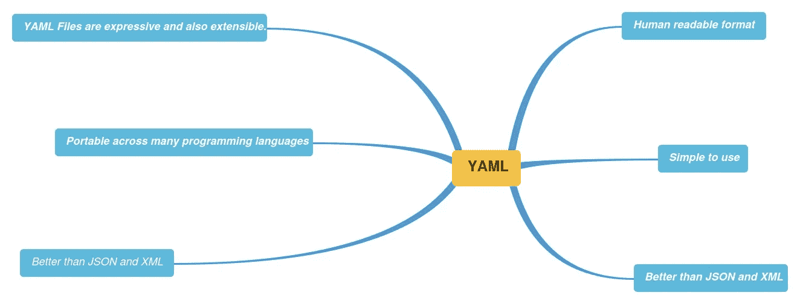
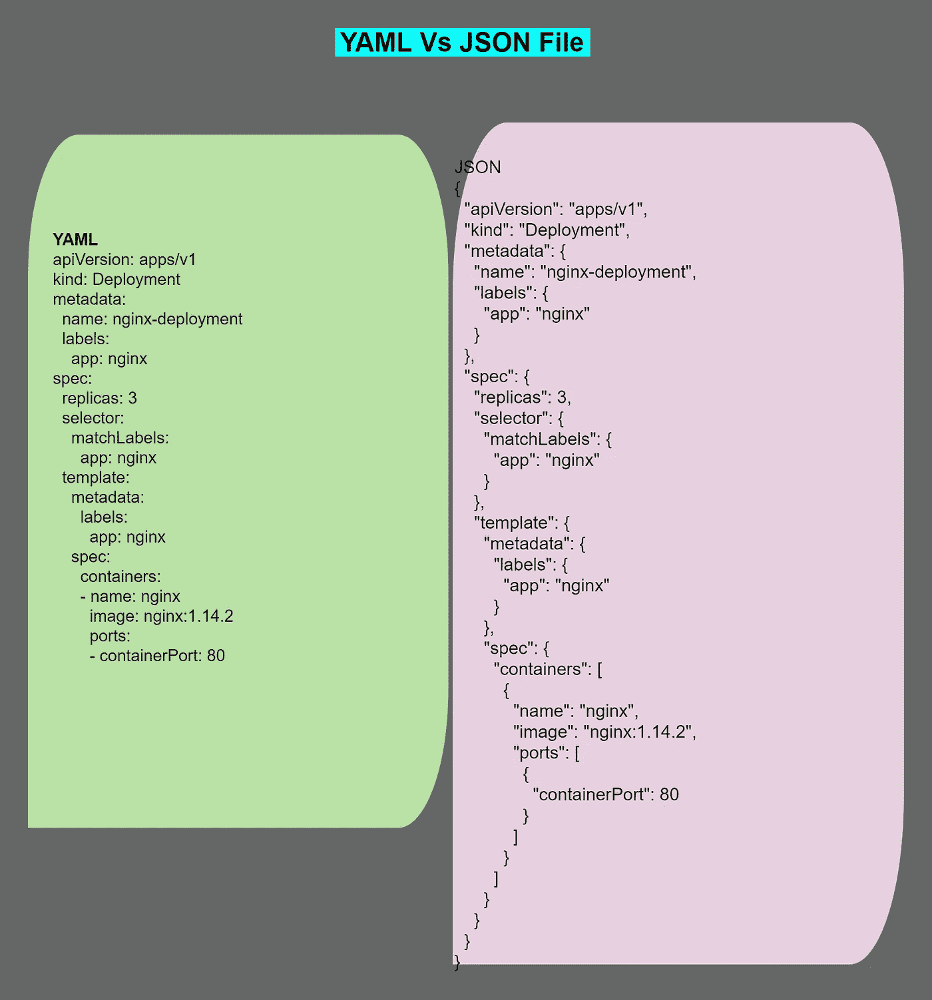
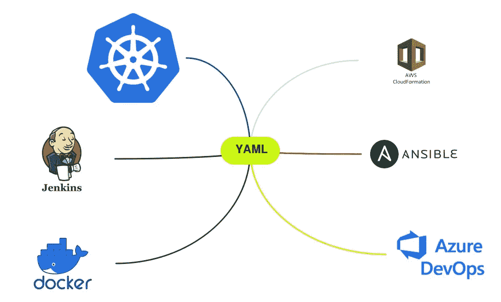
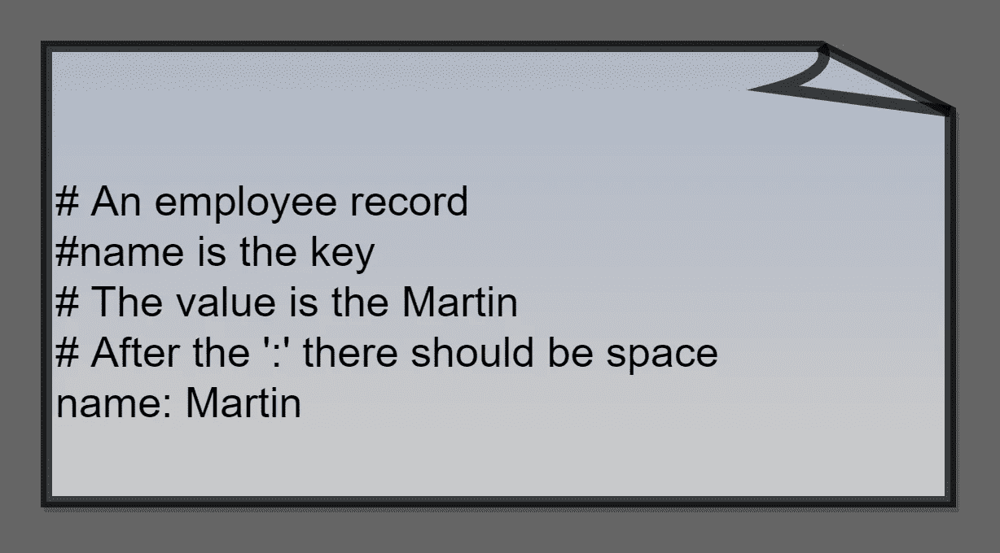
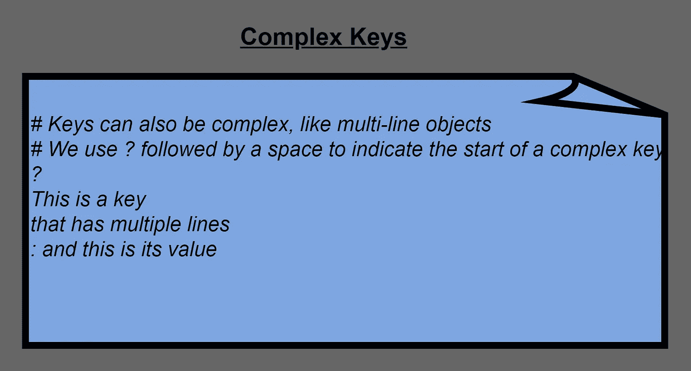

# 关于 YAML 你需要知道的一切

> 原文：<https://betterprogramming.pub/everything-you-need-to-know-about-yaml-fdbb7acf6db6>

## 语法、数据类型、样式、实用工具等等


由[Gert RDA valasevi it](https://unsplash.com/@skraidantisdrambliukas?utm_source=medium&utm_medium=referral)在 [Unsplash](https://unsplash.com?utm_source=medium&utm_medium=referral) 上拍摄的照片

根据维基百科 **YAML** (/ˈjæməl/和 [*YAH-ml*](https://en.wikipedia.org/wiki/Help:Pronunciation_respelling_key) )是一种[人类可读的](https://en.wikipedia.org/wiki/Human-readable) [数据序列化语言](https://en.wikipedia.org/wiki/Serialization)。它通常用于[配置文件](https://en.wikipedia.org/wiki/Configuration_file)和存储或传输数据的应用中。

YAML 的目标是许多与可扩展标记语言(XML)相同的通信应用，但有一个最小的语法，有意不同于 SGML(T21)。它既使用了 [Python](https://en.wikipedia.org/wiki/Python_(programming_language)) 风格的缩进来表示嵌套，又使用了一种更紧凑的格式，将`[...]`用于列表，将`{...}`用于地图，因此 [JSON](https://en.wikipedia.org/wiki/JSON) 文件是有效的 YAML。

学习 YAML 很重要，因为它被用于许多配置和编排工具中。

```
**Table of Contents**What is YAML?
JSON Vs YAML
Tools Using YAML
YAML Syntax
Data Types
Strings
Timestamp
Comments
Sequences/Lists
Dictionary
Anchors and Alias
Complex Keys
Folded Style
Literal Style
Kubernetes YAML
Docker Compose YAML
Ansible YAML
AWS Cloud Formation YAML
Ansible YAML
YAML Utilities
Conclusion
References
```

## 什么是 YAML？

*   最初，YAML 代表另一种标记语言。
*   后来改成了 *YAML 不是标记语言。*
*   YAML 是一种人类可读的数据序列化标准，可以与所有编程语言结合使用，通常用于编写配置文件。
*   YAML 是由其他语言的片断组成的。它具有源自 Perl、C、HTML 和其他语言的特性。
*   YAML 是 JSON 的超集。
*   YAML 类似于 JSON 或 XML。
*   YAML 不包含任何命令或指令。
*   YAML 可以转换成 JSON，反之亦然。
*   YAML 最常见的用途之一是创建配置文件。自动化工具 Ansible 也使用 YAML 来创建自动化流程，并用于 Kubernetes 资源和部署。



作者图片

## JSON vs YAML

YAML 是容易和可读的格式。在[链接中查看 JSON 和 YAML 的区别。](https://stackoverflow.com/questions/1726802/what-is-the-difference-between-yaml-and-json)

例如，检查 YAML 和 JSON 文件之间的差异。YAML 是一种更加用户友好和可读的格式。



作者图片

*   YAML 是 JSON 的超集。
*   YAML 能够使用“锚”引用 YAML 文件中的其他项目因此，它可以像在 MySQL 数据库中一样处理关系信息。
*   YAML 对于在 YAML 文件中嵌入 JSON 或 XML 等其他序列化格式更加稳健。

## 使用 YAML 的工具:

使用 YAML 的一些流行工具有

*   码头工人
*   Ansible
*   库伯内特斯
*   詹金斯
*   自动气象站云的形成
*   Azure Devops



作者图片

## YAML 语法

*   所有 YAML 文件都可以选择以`---`开头，以`**...**` **结尾。**这是 YAML 格式的一部分，表示文件的开始和结束。
*   一个文件可以包含多个文档。文档之间用——以`---`开始，以`...`结束
*   YAML 像 python 编程一样使用缩进。允许空格，不允许制表符。
*   YAML 的文件扩展名是**。yaml 或者。yml** 。
*   YAML 区分大小写。姓名:马丁<>姓名:马丁<>姓名:马丁
*   YAML 使用**键:值对**



作者图片

作者图片

在上面的代码片段中:

*   名称:Martin 是键-值对。
*   “:”后面应该有空格，像`name: Martin`。
*   标量是分配给键的单个值。
*   马丁是标量。

## 数据类型

YAML 数据类型有

*   数量
*   目录
*   词典

标量类型有

*   用线串
*   整数
*   浮动的
*   布尔运算

## 用线串

*   在 YAML，你不需要给字符串加引号或双引号。
*   “是”和“否”应该用字符串括起来。否则，它们将被解释为布尔值。
*   如果使用特殊字符，请使用单引号或双引号。比如邮箱:`yaml@gmail.com` →邮箱:“`yaml@gmail.com`”。

作者图片

## `**!!timestamp**`

根据 YAML 文档，时间戳值代表一个时间点。这可以使用 ISO8601 格式的子集和 W3C 在`DateTime`上提出的格式进行序列化。

如果省略时区，则假定时间戳以 UTC 格式指定。可以完全省略时间部分，从而得到日期格式。在这种情况下，时间部分假定为`00:00:00Z`(一天的开始，UTC)。

作者图片

*   此外，YAML 允许显式声明数据类型，如下所示，使用！！`[DataTypeName]`

作者图片

## 评论

*   在 YAML，可以用“#”号来表示意见。这和 python 类似。
*   注释可以在行的任何地方开始。
*   可以在每行中使用#号对多行进行注释。
*   JSON 不允许评论。

作者图片

## 序列/列表

*   序列就像 python 中的列表。
*   该序列以一个“-”和一个空格开始。
*   可以使用块样式或流样式来定义序列。
*   块样式是

作者图片

*   流样式就像用 Python 列表样式写的一样，用方括号括起来。

作者图片

## 词典

*   字典是键值对的集合。
*   字典以简单的`**key: value**`形式表示(冒号后面必须跟一个空格)。
*   列表成员由前导连字符(`**-**`)表示。请参考示例词典。

作者图片

JSON 中的同一个字典如下:

作者图片

XML 中的同一个字典:

作者图片

现在您可以看到，与 JSON 和 XML 相比，YAML 的格式是多么简单和易读。

## 锚点和别名:

*   锚由一个`&`字符标识，别名由一个`*`字符标识。
*   锚就像*在 YAML 文档中用锚标识一个项目*，然后*在同一文档中用别名引用那个项目*。让我们看一个例子来理解。
*   `&` / `*`字符和下面的别名之间没有空格。
*   例如，查看下面的示例

作者图片

这个例子看起来很简单。

让我们以下面的 docker-compose 文件为例:

作者图片

*   在上面的例子中，我们声明了一个名为`&web`的锚。这里的`&web`指的是整个服务:

作者图片

现在我们用 alias *web 引用 anchor&web，然后只需更改端口映射 81:80 和 82:80。覆盖特定于<< with the characters before the Alias to add more values or existing values.

If you don’t use the anchor and alias then your code looks long and repetitive like below:

Image by author

## Complex Keys



Image by author

A complex key is created by first inserting a question mark followed by a space, followed by the *语言的*标签和键的最终值。

```
? - Tesla
  - Honda
: [Electric, Economy]
```

## **折叠样式:**

使用>来保留换行符，如下所示

作者图片

## 文字样式:

如果您想要换行，请使用|。

作者图片

## 库伯内特 YAML

Kubernetes 资源是以声明的方式创建的，因此利用了 YAML 文件。Kubernetes 资源，如 pod、服务和部署都是通过使用 YAML 文件创建的。

让我们看看部署 YAML 文件:

作者图片

*   部署名称`nginx-deployment`被创建，由`.metadata.name`字段指示。部署创建了三个复制的 pod，由`.spec.replicas`字段指示。有关 Kubernetes [的更多信息，请参考此链接。](https://kubernetes.io/docs/concepts/workloads/controllers/deployment/)

## 码头工人作曲 YAML

根据 docker 文档，docker-compose 是一个定义和运行多容器 docker 应用程序的工具。使用 Compose，您可以使用 YAML 文件来配置应用程序的服务。然后，只需一个命令，您就可以从您的配置中创建并启动所有服务。

让我们来看一个 docker-compose YAML 文件:

作者图片

请参考更多关于 [docker-compose YAML](https://docs.docker.com/compose/#:~:text=Compose%20is%20a%20tool%20for,the%20services%20from%20your%20configuration.) 的信息。

## 自动气象站云形成

根据 AWS 文档，AWS CloudFormation 是一项服务，**为开发人员和企业**提供了一种简单的方法来创建相关 AWS 和第三方资源的集合，并以有序和可预测的方式提供和管理它们。

AWS 云形成使用 YAML 或 JSON。

让我们来看一个 AWS 云信息 YAML 文件的例子:

作者图片

## Ansible YAML

翻译剧本是在 YAML 写的。一个可行的剧本是一个 YAML **序列**，它本身由**映射**和**序列**组成。更多信息请参考[相关文档](https://docs.ansible.com/ansible/latest/reference_appendices/YAMLSyntax.html)。

作者图片

## YAML 公用事业公司

1.  YAML·林特:检查你的 YAML 语法。
2.  y[AML Lint-Python package](https://pypi.org/project/yamllint/):YAML Lint 不仅检查语法有效性，还检查奇怪的地方，比如键重复和外观问题，比如行长度、尾随空格、缩进等等。
3.  [YAML 验证器:](https://codebeautify.org/yaml-validator)另一个验证你的语法的工具。
4.  [JSON 到 YAML](https://www.json2yaml.com/convert-yaml-to-json) :将 JSON 转换成 YAML，反之亦然。
5.  [YAML 解析器:](http://yaml-online-parser.appspot.com/)另一个将 JSON 转换成 YAML 的工具。
6.  全 YAML :都在一个地方。

# 结论

同样，YAML 简单易用。此外，它还被用于 docker-compose、Kubernetes、Ansible、Jenkins 和 cloud formation 的所有云技术中。所以了解 YAML 是件好事。

请随时在 [LinkedIn](http://linkedin.com/in/esenthil) 上与我联系

## 参考

1.  [https://docs . ansi ble . com/ansi ble/latest/reference _ appendencies/yamlsyntax . html](https://docs.ansible.com/ansible/latest/reference_appendices/YAMLSyntax.html)
2.  [https://kubernetes . io/docs/concepts/workloads/controllers/deployment/](https://kubernetes.io/docs/concepts/workloads/controllers/deployment/)
3.  [https://www.redhat.com/en/topics/automation/what-is-yam](https://www.redhat.com/en/topics/automation/what-is-yaml#:~:text=YAML%20is%20a%20data%20serialization,used%20for%20writing%20configuration%20files.&text=YAML%20is%20a%20popular%20programming,conjunction%20with%20other%20programming%20languages)l
4.  [https://en.wikipedia.org/wiki/YAML](https://en.wikipedia.org/wiki/YAML)
5.  [https://yaml.org/spec/1.2.2/](https://yaml.org/spec/1.2.2/)